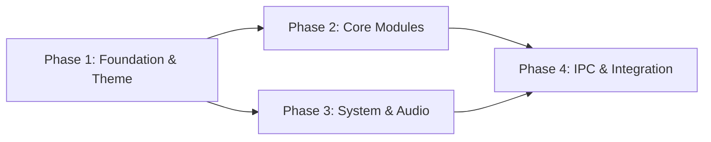

# Roadmap: Quickshell Desktop Shell

**Milestone:** v0.1 Core Framework & Basic Bar
**Created:** 2026-07-20
**Phases:** 4
**Requirements:** 18

## Overview

| # | Phase | Goal | Requirements | Success Criteria |
|---|-------|------|--------------|------------------|
| 1 | Shell Foundation & Theme | Bootstrap Quickshell shell with Material theming, service pattern, and directory structure | FWK-01, FWK-03, FWK-04, FWK-05, THM-01, THM-02 | 5 |
| 2 | Core Bar Modules | 10/10 | Complete   | 2026-07-23 |
| 3 | System & Audio Modules | Add system metrics and audio control modules | BAR-05, BAR-06, BAR-07, BAR-08 | 4 |
| 4 | IPC, Keybinds & Integration | Wire up IPC socket, Hyprland keybinds, graceful reload, and auto-start | FWK-02, IPC-01, IPC-02, IPC-03 | 5 |

### Phase checklist

- [x] **Phase 1: Shell Foundation & Theme** — Complete 2026-07-21
- [x] **Phase 2: Core Bar Modules** (completed 2026-07-23)
- [ ] **Phase 3: System & Audio Modules**
- [ ] **Phase 4: IPC, Keybinds & Integration**

## Phase Details

### Phase 1: Shell Foundation & Theme

**Goal:** Create the Quickshell directory structure, entry point, service-singleton pattern, PanelLoader architecture, and Material theme system — resulting in a visible (but mostly empty) bar on each monitor.

**Requirements:** FWK-01, FWK-03, FWK-04, FWK-05, THM-01, THM-02

**Success Criteria:**

1. Running `quickshell` renders a top bar on every connected monitor (DP-1, HDMI-A-2)
2. Directory structure matches dots-hyprland conventions with modules/, services/, scripts/, defaults/, assets/ and qmldir manifests
3. shell.qml loads a panel family via PanelLoader (at least one family defined)
4. Material color scheme is applied on startup and theme tokens (primary, secondary, surface, onSurface, etc.) are accessible as QML properties in any widget
5. At least one service singleton is implemented and consumable by a widget (proving the pattern works)

**Plans:**
4/4 plans complete

- [x] 01-01 Directory Bootstrap and Wholesale Copy
- [x] 01-02 Provisioning and Material Theme Setup
- [x] 01-03 Integration and Service Singleton Verification
- [x] 01-04 Gap closure — bar visual fonts and QML defects (G-01-1)

**Status:** Complete (2026-07-21) — UAT 2/2 pass, verification passed, security threats_open: 0

### Phase 2: Core Bar Modules

**Goal:** Implement the four most essential bar modules — workspaces, clock, system tray, and network — giving the bar its core day-to-day functionality.

**Requirements:** BAR-01, BAR-02, BAR-03, BAR-04

**Success Criteria:**

1. User can see Hyprland workspace indicators and click them to switch workspaces
2. Current date and time display in the bar, updating in real-time
3. System tray icons from running applications (e.g., Discord, Steam, nm-applet) are visible and interactive
4. Network module shows wifi SSID/signal or ethernet status, and correctly reflects disconnected state

**Plans:** 10/10 plans complete

- [x] 02-09-PLAN.md
- [x] 02-10-PLAN.md

- [x] 02-01-PLAN.md — Wave 0 live config assert harness
- [x] 02-02-PLAN.md — Dual-write Config.qml + live config.json (clock/tray/workspaces)
- [x] 02-03-PLAN.md — Left/center bar rewire (D-15, showDate false)
- [x] 02-04-PLAN.md — Right LTR + D-19 indicators + Network.materialSymbol
- [x] 02-05-PLAN.md — Static gates + smoke + VALIDATION nyquist sign-off
- [x] 02-06-PLAN.md — Gap G-02-4: clock click pin via forceActive
- [x] 02-07-PLAN.md — Gap G-02-7a: remove ActiveWindow from left
- [x] 02-08-PLAN.md — Gaps G-02-7b/G-02-8: always-visible indicator strip

**Status:** All plans + gap-closure executed (2026-07-22) — automated verification green; human re-UAT for gap fixes (`/gsd-verify-work 2`)

### Phase 3: System & Audio Modules

**Goal:** Add system resource monitoring (CPU, memory, disk) and audio volume control to the bar, approaching Waybar feature parity for hardware/system indicators.

**Requirements:** BAR-05, BAR-06, BAR-07, BAR-08

**Success Criteria:**

1. CPU utilization percentage updates in real-time in the bar
2. RAM usage (used/total or percentage) updates in real-time in the bar
3. Disk space information for the root partition is visible in the bar
4. Volume level is displayed, scrolling on the module adjusts volume, and clicking toggles mute

### Phase 4: IPC, Keybinds & Integration

**Goal:** Wire up external control (IPC socket, Hyprland keybinds), graceful reload, and Hyprland exec-once auto-start — making the shell a fully integrated, controllable desktop component.

**Requirements:** FWK-02, IPC-01, IPC-02, IPC-03

**Success Criteria:**

1. Shell listens on an IPC socket and responds to commands (at minimum: show, hide, reload)
2. A Hyprland keybind (e.g., SUPER+B) toggles bar visibility via the IPC socket
3. Shell reloads gracefully without losing tray connections or requiring a full restart
4. Quickshell is added to Hyprland exec-once and starts automatically at login
5. After all phases, no Waybar-parity module is missing from the bar (workspaces, clock, tray, network, CPU, memory, disk, volume all functional)

## Dependencies

- **Phase 2 depends on Phase 1:** Modules need the service pattern, theme tokens, and bar to render into.
- **Phase 3 depends on Phase 1:** Same foundation dependency.
- **Phase 4 depends on Phases 2 & 3:** Integration/cutover needs all modules working first.

## Progress

| Phase | Name | Status | Date |
|-------|------|--------|------|
| 1 | Shell Foundation & Theme | Complete | 2026-07-21 |
| 2 | Core Bar Modules | Awaiting re-UAT | 2026-07-22 |
| 3 | System & Audio Modules | Not started | — |
| 4 | IPC, Keybinds & Integration | Not started | — |

---
*Roadmap created: 2026-07-20*
*Last updated: 2026-07-22 after Phase 2 gap-closure (02-06..02-08); re-UAT pending*
