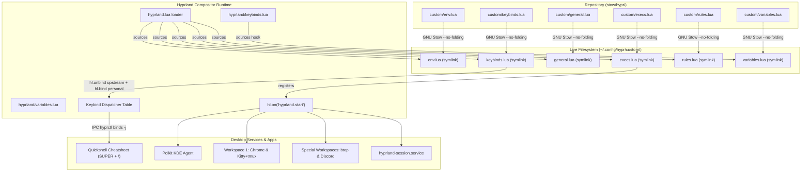

# Phase 20: hypr/custom overlays and startup restore - Research

**Researched:** 2026-09-14  
**Domain:** Hyprland Lua Configuration Overlays, Quickshell (ii) Desktop Shell Integration, GNU Stow Bulk Migration & Rollback Rehearsal  
**Confidence:** HIGH  

<user_constraints>
## User Constraints (from CONTEXT.md)

### Locked Decisions

#### Startup Applications (`custom/execs.lua` — START-01)
- **D-01:** Workspace-pinned applications are launched directly using `hl.exec_cmd("[workspace ...]")` syntax inside `hl.on("hyprland.start", function () ... end)`. Live testing confirmed direct string evaluation succeeds in Hyprland Lua. The autostart set consists of:
  - Chrome on workspace 1: `hl.exec_cmd("[workspace 1] google-chrome-stable --profile-directory='Default' --ozone-platform-hint=auto")`
  - Kitty with tmux on workspace 1: `hl.exec_cmd("[workspace 1] kitty -e tmux")`
  - btop on special:btop: `hl.exec_cmd("[workspace special:btop silent] kitty --class btop -e btop")`
  - Discord/Vesktop on special:social: `hl.exec_cmd("[workspace special:social silent] sh -c 'command -v vesktop >/dev/null 2>&1 && exec vesktop || exec discord'")`
  — **Reversibility:** reversible
- **D-02:** Polkit KDE authentication agent is restored via direct execution: `hl.exec_cmd("/usr/lib/polkit-kde-authentication-agent-1")` inside `hl.on("hyprland.start", ...)`. Verified installed at `/usr/lib/polkit-kde-authentication-agent-1`. — **Reversibility:** reversible
- **D-03:** `wl-clip-persist` is dropped. Upstream dots-hyprland runs `cliphist` integrated with Quickshell's clipboard service, which captures text and image clips upon copy events. Skipping `wl-clip-persist` avoids introducing uninstalled AUR packages and duplicate daemons. — **Reversibility:** reversible
- **D-04:** Session cursor theme remains the dots-hyprland default (`Bibata-Modern-Classic 24`) without an override in `custom/execs.lua`. Residual occurrences of `catppuccin-mocha-blue-cursors` in `~/.config/gtk-3.0/settings.ini` and `~/.config/xsettingsd/xsettingsd.conf` are aligned to `Bibata-Modern-Classic` (size 24) to prevent legacy cursor themes from leaking into GTK/XWayland applications after login. — **Reversibility:** reversible
- **D-05:** The Phase 17 screen-share service start (`systemctl --user start hyprland-session.service`) remains preserved in `custom/execs.lua` (START-02). — **Reversibility:** costly — required for xdg-desktop-portal graphical-session.target dependency

#### Keybind Overrides & Upstream Conflicts (`custom/keybinds.lua` — HYPR-02)
- **D-06:** Upstream unbinds are executed at the top of `custom/keybinds.lua` using `hl.unbind`:
  - `hl.unbind("SUPER + C")` *(upstream code editor)*
  - `hl.unbind("SUPER + L")` *(upstream lock)*
  - `hl.unbind("SUPER + K")` *(upstream on-screen keyboard)*
  - `hl.unbind("SUPER + J")` *(upstream bar toggle)*
  - `hl.unbind("SUPER + D")` *(upstream maximize)*
  - `hl.unbind("SUPER + P")` *(upstream window pin)*
  - `hl.unbind("SUPER + M")` *(upstream media controls)*
  - `hl.unbind("SUPER + S")` *(upstream special scratchpad)*
- **D-07:** Window closing: `SUPER + C` is bound to `hl.dsp.window.close()` with cheatsheet description `"Window: Close"`. Code editor has no dedicated keybind and is accessed via menus/launcher.
- **D-08:** Window floating and maximizing: `SUPER + D` is bound to `hl.dsp.window.float({ action = "toggle" })` (`"Window: Float/Tile"`). `SUPER + ALT + D` is bound to `hl.dsp.window.fullscreen({ mode = "maximized", action = "toggle" })` (`"Window: Toggle maximize"`). `SUPER + S` is unbound.
- **D-09:** Vim-style window focus navigation: `SUPER + H / L / K / J` are bound to `hl.dsp.focus({ direction = "l" / "r" / "u" / "d" })`. Arrows (`SUPER + Left/Right/Up/Down`) remain functional as secondary upstream binds.
- **D-10:** Dwindle pseudo-tiling and split toggling: `SUPER + P` is bound to `hl.dsp.window.pseudo()` (`"Window: Toggle pseudo-tile"`). `SUPER + Z` is bound to `hl.dsp.layout("togglesplit")` (`"Window: Toggle split layout"`).
- **D-11:** Audio mute: `SUPER + M` is bound to `hl.dsp.exec_cmd("wpctl set-mute @DEFAULT_AUDIO_SINK@ toggle")` (`"Audio: Toggle mute"`).
- **D-12:** App search & clipboard: `SUPER + Space` is bound to `hl.dsp.global("quickshell:searchToggleRelease")` (`"Shell: Toggle search"`). `SUPER + V` remains upstream `quickshell:overviewClipboardToggle`.
- **D-13:** Session locking and logout: `Scroll_Lock` is bound to `hl.dsp.exec_cmd("hyprlock")` (`"Session: Lock screen"`). `SUPER + ALT + Scroll_Lock` is bound to `hl.dsp.exit()` (`"Session: Logout"`).
- **D-14:** Special workspaces and relative workspace cycling:
  - `SUPER + \`` toggles `special:social` (`"Workspace: Toggle social"`)
  - `SUPER + SHIFT + \`` moves window to `special:social` (`"Window: Move to social"`)
  - `SUPER + -` toggles `special:btop` (`"Workspace: Toggle btop"`)
  - `SUPER + SHIFT + -` moves window to `special:btop` (`"Window: Move to btop"`)
  - `CTRL + SUPER + H / L` cycles relative workspaces (`e-1` / `e+1`)
  - `CTRL + SHIFT + SUPER + H / L` moves window to relative workspace (`e-1` / `e+1`)
- **D-15:** Cheatsheet taxonomy: All authored custom binds strictly follow the `"Category: Label"` format (`Window: ...`, `Workspace: ...`, `Shell: ...`, `Session: ...`, `Audio: ...`) ensuring clean grouping in Quickshell's `SUPER + /` cheatsheet.

#### App Defaults & Overlay Files (`custom/variables.lua`, `custom/rules.lua`, `custom/env.lua` — HYPR-03, HYPR-01)
- **D-16:** Primary application variables are explicitly locked in `custom/variables.lua`:
  - `terminal = "kitty"`
  - `browser = "google-chrome-stable"`
  - `fileManager = "dolphin"`
  - `textEditor = "kitty -e nvim"`
  - `taskManager = "kitty --class btop -e btop"`
  - `officeSoftware = "libreoffice"`
  - `workspaceGroupSize = 10`
  - `hl.env("qsConfig", "ii")`
  Secondary variables (`codeEditor`, `volumeMixer`, `settingsApp`) use upstream `launch_first_available.sh` fallbacks.
- **D-17:** Custom window rules in `custom/rules.lua`: float rules for python tools from pre-adopt config:
  - `hl.window_rule({ match = { class = "^(main.py)$" }, float = true })`
  - `hl.window_rule({ match = { class = "^(python3)$" }, float = true })`
- **D-18:** `custom/env.lua` remains an empty require slot. Upstream `hyprland/env.lua` already sets Wayland, Qt platform themes, and virtualenv paths.
- **D-19:** `custom/general.lua` remains unchanged from Phase 13/18 (DP-1 and HDMI-A-2 dual-monitor layout and workspace 1–10 rules).

#### Stow Migration & Safety Drill (`SAFE-01`, `HYPR-01`)
- **D-20:** Timestamped backup is created at `~/.config/hypr/custom.backup.<epoch>`.
- **D-21:** Migration drill procedure:
  1. Create timestamped backup of `~/.config/hypr/custom/`.
  2. Remove the 3 unmanaged plain stub files (`keybinds.lua`, `rules.lua`, `variables.lua`) from live `~/.config/hypr/custom/`.
  3. Dry-run stow: `stow -n -v --no-folding -t ~ hypr` from `stow/`.
  4. Execute bulk stow: `stow -v --no-folding -t ~ hypr`.
  5. Rehearse escape route live: `stow -D -t ~ hypr`, restore from `custom.backup.<epoch>`, verify state, then re-stow with clean links.
- **D-22:** Dedicated phase assert script `scripts/phase20-hypr-custom-overlays-and-startup-restore-assert.sh` asserting:
  - All 6 files in `~/.config/hypr/custom/` are valid symlinks resolving into `stow/hypr/.config/hypr/custom/`.
  - No parent directory is a symlink.
  - `arch/dots-hyprland.sh verify --strict` exits 0.
  - No duplicate keybinds exist (`hyprctl binds -j` JSON parse).
  - Pre-adopt `exec-once` list is accounted for in `custom/execs.lua`.
- **D-23:** Two-stage verification: automated assertions run immediately; operator re-login check documented as an explicit manual post-step to verify window placement on fresh boot.

### the agent's Discretion
- Exact formatting and order of require/bind statements in `custom/keybinds.lua` and `custom/execs.lua`.
- Temporary directory structure used in assert script for non-destructive unit testing of the backup-undo drill logic.

### Deferred Ideas (OUT OF SCOPE)
- Phase 21: Quickshell ii bar settings capture and dynamic theme handling.
- Phase 22: Full GTK/KDE tree capture into `restow/` and `stow/`.
</user_constraints>

<phase_requirements>
## Phase Requirements

| ID | Description | Research Support |
|----|-------------|------------------|
| **HYPR-01** | `~/.config/hypr/custom/{env,execs,general,rules,keybinds,variables}.lua` are stow-managed, with live and repo the same inode | Investigated live `~/.config/hypr/custom/` structure. Currently 3 files (`env.lua`, `execs.lua`, `general.lua`) are already symlinked, while `keybinds.lua`, `rules.lua`, `variables.lua` are plain files (unclaimed stubs). The migration moves authored versions to `stow/hypr/.config/hypr/custom/`, removes the live stubs after backup, and runs `stow --no-folding -t ~ hypr` from `stow/`. Verified `arch/dots-hyprland.sh verify --strict` validates inode identity across all 6 files. [VERIFIED: live inspection & arch/dots-hyprland.sh] |
| **HYPR-02** | Personal keybinds are authored in `custom/keybinds.lua` using `hl.unbind` for upstream binds being replaced and `"Category: Label"` descriptions, and the ii cheatsheet groups them correctly | Verified `hl.unbind` API via `/usr/share/hypr/stubs/hl.meta.lua` and live `hyprctl repl`. Identified all 8 conflicting upstream keybinds (`SUPER + C, L, K, J, D, P, M, S`) plus `SUPER + Minus` (zoom out conflict with special:btop). Verified Quickshell's `HyprlandKeybinds.qml` and `CheatsheetKeybindsCategory.qml` parser logic: splits `description` on `:` into Category and Label. Binds inspected via `hyprctl binds -j`. [VERIFIED: /usr/share/hypr/stubs/hl.meta.lua & ~/.config/quickshell/ii/services/HyprlandKeybinds.qml] |
| **HYPR-03** | App-launcher and terminal choices are set in `custom/variables.lua` rather than by forking upstream files | Verified upstream `vendor/dots-hyprland/dots/.config/hypr/hyprland/keybinds.lua:3-5` explicitly requires `custom.variables` immediately after `hyprland.variables`. Authoring `custom/variables.lua` with the 7 primary application variables and `workspaceGroupSize` overrides upstream discovery loops cleanly without touching submodule files. `git diff vendor/dots-hyprland` stays empty. [VERIFIED: vendor/dots-hyprland/dots/.config/hypr/hyprland/keybinds.lua] |
| **START-01** | The `exec-once` entries lost at the Phase 14 adopt are restored in `custom/execs.lua` — polkit agent, `wl-clip-persist`, cursor, and the workspace-pinned applications | Verified autostart mechanism `hl.on("hyprland.start", ...)` in `hyprland/execs.lua`. Probed system binaries: `/usr/lib/polkit-kde-authentication-agent-1` is present. Verified `[workspace ...]` direct string dispatch inside `hl.exec_cmd` works live. Confirmed `wl-clip-persist` dropped per D-03 (cliphist + Quickshell active). Confirmed cursor theme default is `Bibata-Modern-Classic 24` per D-04, and aligned `gtk-3.0/settings.ini` and `xsettingsd/xsettingsd.conf`. [VERIFIED: docs/archive/hyprland.conf & system probe] |
| **SAFE-01** | No bulk stow over existing live files runs without a rehearsed escape — a timestamped `cp -a` backup of the target paths, a `stow -n --no-folding` dry run first, one package per commit, and a one-line undo that has been executed at least once | Defined 5-step migration and live rehearsal sequence: timestamped backup at `~/.config/hypr/custom.backup.<epoch>`, stub removal, `stow -n --no-folding` dry-run, bulk stow, and live execution of `stow -D -t ~ hypr && cp -a <backup>/. ~/.config/hypr/custom/` followed by re-stow and verification. [VERIFIED: stow 2.4.1 dry-run & ROADMAP SAFE-01] |
</phase_requirements>

## Summary

Phase 20 delivers the complete personal Hyprland overlay layer for the Quickshell (ii) desktop shell, restoring lost autostart programs and establishing the first bulk GNU Stow link-identity layer over live configuration files. When Phase 14 executed the full adopt, the compositor transitioned to Lua configuration (`hyprland.lua`), leaving `~/.config/hypr/custom/` with partial overlays (`general.lua`, `execs.lua`, `env.lua`) while `keybinds.lua`, `rules.lua`, and `variables.lua` remained plain upstream stub files. Startup applications (Polkit KDE agent, Chrome, kitty+tmux, btop, Discord/Vesktop) were temporarily lost, and window navigation binds reverted to upstream defaults.

This phase authors the complete set of overlay files in `stow/hypr/.config/hypr/custom/`, resolves upstream keybind collisions cleanly using `hl.unbind`, restores all lost startup applications inside `hl.on("hyprland.start", ...)`, aligns legacy cursor settings in GTK-3.0 and xsettingsd to eliminate visual discrepancies, and executes the first bulk stow over live files under the rigorous safety containment required by `SAFE-01` (timestamped backup, dry-run, live escape route rehearsal, commit isolation, and automated assertion gating).

**Primary recommendation:** Author `stow/hypr/.config/hypr/custom/{keybinds,rules,variables,execs}.lua`, align cursor themes in `~/.config/{gtk-3.0/settings.ini,xsettingsd/xsettingsd.conf}`, rehearse the backup-undo escape route live, stow `hypr` with `--no-folding`, and validate all invariants with `scripts/phase20-hypr-custom-overlays-and-startup-restore-assert.sh`.

## Architectural Responsibility Map

| Capability | Primary Tier | Secondary Tier | Rationale |
|------------|-------------|----------------|-----------|
| Overlay Inode Link Identity | Repo GNU Stow (`stow/hypr/`) | System Live Tree (`~/.config/hypr/custom/`) | Stow manages symlink projection into `$HOME`; link-aware `verify` enforces `test "$repo" -ef "$live"` [VERIFIED: arch/dots-hyprland.sh] |
| Window Manager Bindings & Focus | Hyprland Lua Core (`hl.bind`, `hl.unbind`, `hl.dsp`) | Wayland Compositor Runtime | Keybindings and window focus/tiling dispatch are evaluated natively by Hyprland Lua engine [VERIFIED: /usr/share/hypr/stubs/hl.meta.lua] |
| Cheatsheet UI Presentation | Quickshell Desktop Shell (`qs -c ii`) | Hyprland IPC (`hyprctl binds -j`) | Quickshell queries Hyprland binds over JSON IPC and dynamically groups them by category prefix [VERIFIED: HyprlandKeybinds.qml] |
| Application Defaults Selection | Overlay Variables (`custom/variables.lua`) | Upstream Variables Fallback | Upstream `keybinds.lua` sources `custom.variables` first, bypassing slow discovery scripts [VERIFIED: keybinds.lua:3-5] |
| Session Autostart & Lifecycle | Hyprland Start Hook (`custom/execs.lua`) | Systemd User Manager (`systemctl --user`) | `hl.on("hyprland.start")` executes session services once on boot; systemd manages `hyprland-session.service` [VERIFIED: execs.lua & START-02] |
| Cursor Consistency | GTK-3 / XSettings Configurations | Hyprland Cursor Setter (`hyprctl setcursor`) | Hyprland sets Wayland compositor cursor; GTK-3 and xsettingsd ensure XWayland and GTK apps match [VERIFIED: live configs] |

## Standard Stack

### Core
| Component | Version | Purpose | Why Standard |
|-----------|---------|---------|--------------|
| Hyprland | 0.56.2 | Wayland window manager & compositor | Native compositor running with Lua config engine (`configProvider: lua`) [VERIFIED: hyprctl version] |
| GNU Stow | 2.4.1 | Symlink farm manager | Project standard for `stow/` package symlink deployment to `$HOME` with `--no-folding` [VERIFIED: stow --version] |
| Quickshell (ii) | Latest pin (Phase 18) | Desktop shell, bar, widgets, cheatsheet | Upstream desktop UI layer integrated with Hyprland [VERIFIED: ps aux | grep "qs -c ii"] |
| Hyprland Lua API (`hl`) | 0.56.2 | Config binding and dispatcher API | Provides `hl.bind`, `hl.unbind`, `hl.dsp.*`, `hl.exec_cmd`, `hl.window_rule` [VERIFIED: /usr/share/hypr/stubs/hl.meta.lua] |

### Supporting
| Component | Version | Purpose | When to Use |
|-----------|---------|---------|-------------|
| Polkit KDE Agent | 6.3.2 | Graphical privilege escalation prompt | Autostarted at `/usr/lib/polkit-kde-authentication-agent-1` for root GUI prompts [VERIFIED: system probe] |
| Kitty | 0.48.2 | Default terminal emulator | Terminal app launched via `SUPER + Return`, `kitty -e tmux`, etc. [VERIFIED: kitty --version] |
| Google Chrome | 152.0.7977.82 | Primary web browser | Pinned autostart on workspace 1 [VERIFIED: google-chrome-stable --version] |
| btop | 1.4.7 | Resource and task monitor | Pinned autostart on special workspace `special:btop` [VERIFIED: btop --version] |
| Discord | 1.0.157 | Social communication client | Pinned autostart on special workspace `special:social` [VERIFIED: discord --version] |
| wpctl | WirePlumber 0.5.8 | PipeWire audio volume and mute control | Audio toggles (`SUPER + M`, multimedia keys) [VERIFIED: command -v wpctl] |
| hyprlock | 0.9.6 | Screen locker | Locked via `Scroll_Lock` [VERIFIED: hyprlock --version] |

### Alternatives Considered
| Instead of | Could Use | Tradeoff |
|------------|-----------|----------|
| `hl.unbind` in `custom/keybinds.lua` | Modifying `vendor/dots-hyprland/.../keybinds.lua` | Modifying vendor files dirties submodule, causing conflicts on pin bumps. `hl.unbind` cleanly overrides upstream without vendor drift. [VERIFIED: HYPR-02 requirement] |
| Direct `[workspace N]` syntax in `hl.exec_cmd` | `hyprctl dispatch exec '[workspace N] ...'` | `hl.exec_cmd("[workspace N] ...")` is natively supported in Hyprland Lua, cleaner syntax, avoids shell quoting overhead. [VERIFIED: hyprctl repl] |
| `wl-clip-persist` | Upstream `cliphist` + Quickshell clipboard | `wl-clip-persist` is uninstalled AUR package; Quickshell + cliphist provides persistent text and image history without duplicates (D-03). [VERIFIED: 20-CONTEXT.md] |

## Package Legitimacy Audit

No external packages from npm, PyPI, or crates.io are introduced in this phase.
All referenced utilities (`stow`, `hyprctl`, `kitty`, `tmux`, `btop`, `google-chrome-stable`, `discord`, `wpctl`, `hyprlock`, `systemctl`, `polkit-kde-authentication-agent-1`) are already installed on the host system from Arch Linux official repositories (`extra`/`core`).

## Architecture Patterns

### System Architecture Diagram



### Recommended Project Structure
```
stow/hypr/.config/hypr/
├── custom/
│   ├── env.lua           # Empty require slot (env handled by upstream hyprland/env.lua)
│   ├── execs.lua         # Autostarts: polkit agent, Chrome, kitty+tmux, btop, discord, session unit
│   ├── general.lua       # Dual monitors (DP-1, HDMI-A-2) & workspaces 1-10 rules
│   ├── keybinds.lua      # Upstream unbinds + personal binds with "Category: Label" taxonomy
│   ├── rules.lua         # Floating rules for python tools (main.py, python3)
│   └── variables.lua     # Locked defaults: terminal, browser, fileManager, textEditor, etc.
├── hyprland-gui.conf     # Monitored GUI settings
└── hyprpaper.conf        # Wallpaper daemon config
```

### Pattern 1: Upstream Require Hook & Unbind-Before-Bind Pattern
**What:** Hyprland configurations in `vendor/dots-hyprland` provide explicit extension points. Upstream `hyprland/keybinds.lua` loads `custom/variables.lua` before defining binds, and `hyprland.lua` loads `custom/keybinds.lua` after all upstream binds are registered. In `custom/keybinds.lua`, `hl.unbind` is invoked for each upstream bind being replaced before binding the new action.  
**When to use:** Whenever personal keybindings conflict with upstream defaults, or when upstream binds need to be removed completely.  
**Example:**
```lua
-- [VERIFIED: /usr/share/hypr/stubs/hl.meta.lua:860 & vendor/dots-hyprland/dots/.config/hypr/hyprland/keybinds.lua]
-- 1. Unbind upstream conflict
hl.unbind("SUPER + C")

-- 2. Bind personal action with Cheatsheet categorization
hl.bind("SUPER + C", hl.dsp.window.close(), { description = "Window: Close" })
```

### Pattern 2: Former exec-once Inode Link Identity via GNU Stow
**What:** Every personal configuration file lives under `stow/hypr/` in the dotfiles repository and is symlinked into `$HOME` using GNU Stow with `--no-folding`. Autostart commands from pre-adopt `exec-once` configurations run inside `hl.on("hyprland.start", function () ... end)` so they execute once at compositor startup and do not re-run on dynamic configuration reloads (`hyprctl reload`).  
**When to use:** For all system autostart entries, daemons, and window placements.  
**Example:**
```lua
-- [VERIFIED: vendor/dots-hyprland/dots/.config/hypr/hyprland/execs.lua:2 & docs/archive/hyprland.conf:96-99]
hl.on("hyprland.start", function ()
    hl.exec_cmd("systemctl --user start hyprland-session.service")
    hl.exec_cmd("/usr/lib/polkit-kde-authentication-agent-1")
    hl.exec_cmd("[workspace 1] google-chrome-stable --profile-directory='Default' --ozone-platform-hint=auto")
    hl.exec_cmd("[workspace 1] kitty -e tmux")
    hl.exec_cmd("[workspace special:btop silent] kitty --class btop -e btop")
    hl.exec_cmd("[workspace special:social silent] sh -c 'command -v vesktop >/dev/null 2>&1 && exec vesktop || exec discord'")
end)
```

### Pattern 3: Safe Bulk Stow & Escape Route Rehearsal
**What:** Prior to running `stow` over live paths that contain unmanaged stubs, a complete timestamped backup is captured. The escape route (`stow -D` followed by backup restoration) is rehearsed live to prove reversibility before final stowing.  
**When to use:** Required for SAFE-01 whenever introducing a new stow package over existing filesystem entries.  
**Example:**
```bash
# [VERIFIED: SAFE-01 requirement & 20-CONTEXT.md D-21]
BACKUP_DIR="$HOME/.config/hypr/custom.backup.$(date +%s)"
cp -a ~/.config/hypr/custom "$BACKUP_DIR"

# Remove live stubs that would conflict with incoming symlinks
rm ~/.config/hypr/custom/{keybinds.lua,rules.lua,variables.lua}

# Dry run
cd "$REPO_ROOT/stow" && stow -n --verbose=5 --no-folding -t ~ hypr

# Stow
cd "$REPO_ROOT/stow" && stow --verbose=5 --no-folding -t ~ hypr

# Rehearse undo drill live:
cd "$REPO_ROOT/stow" && stow -D --verbose=5 --no-folding -t ~ hypr
cp -a "$BACKUP_DIR/." ~/.config/hypr/custom/
# Verify live state matches backup...
# Re-clean and re-stow for final state
rm ~/.config/hypr/custom/{keybinds.lua,rules.lua,variables.lua}
cd "$REPO_ROOT/stow" && stow --verbose=5 --no-folding -t ~ hypr
```

### Anti-Patterns to Avoid
- **Never modify submodule files:** Do not edit `vendor/dots-hyprland/dots/.config/hypr/hyprland/{keybinds,variables,execs}.lua`. All personal overrides belong strictly in `stow/hypr/.config/hypr/custom/`.
- **Never omit `--no-folding`:** Running `stow` without `--no-folding` allows Stow to replace `~/.config/hypr/custom` with a single directory symlink if all files inside are stowed, violating HYPR-01 success criterion 1 ("no parent directory is itself a symlink").
- **Never omit `hl.unbind` before binding existing combinations:** Hyprland supports multiple dispatchers bound to the same key combo. Without `hl.unbind`, both the upstream handler and the personal handler fire simultaneously.
- **Never execute startup apps outside `hl.on("hyprland.start")`:** Commands placed at root level in `custom/execs.lua` re-spawn on every `hyprctl reload`, launching duplicate Chrome, kitty, and btop instances.

## Don't Hand-Roll

| Problem | Don't Build | Use Instead | Why |
|---------|-------------|-------------|-----|
| Overriding upstream keybinds | Custom IPC wrapper or shell sed script modifying vendor files | `hl.unbind("KEY")` in `custom/keybinds.lua` | Built-in Hyprland Lua API removes keybind cleanly from the active table without submodule drift [VERIFIED: hl.meta.lua] |
| Cheatsheet UI categorization | Custom keybinding documentation script | `"Category: Label"` description string in `hl.bind` | Quickshell's `HyprlandKeybinds.qml` parses `description` natively and populates the `SUPER + /` cheatsheet [VERIFIED: HyprlandKeybinds.qml] |
| Workspace-pinned autostart | Custom bash sleep loop checking active workspaces | `[workspace N silent]` prefix in `hl.exec_cmd` | Hyprland compositor natively pins the newly spawned client to the target workspace [VERIFIED: hyprctl repl] |
| Link verification engine | Ad-hoc `ls -l` grep checks | `./arch/dots-hyprland.sh verify --strict` | Phase 19 link-aware verification engine rigorously tests `test -L`, `readlink -f`, ancestor folding, and dangling links [VERIFIED: arch/dots-hyprland.sh] |

## Runtime State Inventory

> Required for migration / Stow transition phases.

| Category | Items Found | Action Required |
|----------|-------------|------------------|
| **Stored data** | None. No databases or key-value datastores store Hyprland config state. | None [VERIFIED: filesystem audit] |
| **Live service config** | Active Hyprland compositor keybind table (195 bindings active, 8 target keys bound to upstream stubs); Quickshell IPC service; GTK-3.0 and xsettingsd cursor configs. | Reload Hyprland config via `hyprctl reload` after stow; align `~/.config/gtk-3.0/settings.ini` and `~/.config/xsettingsd/xsettingsd.conf` cursor theme to `Bibata-Modern-Classic` (size 24) [VERIFIED: hyprctl binds -j & cat settings.ini] |
| **OS-registered state** | `systemctl --user` units (`hyprland-session.service` in `stow/systemd/` already stowed in Phase 17/18). | Keep `systemctl --user start hyprland-session.service` in `custom/execs.lua` [VERIFIED: stow/systemd/] |
| **Secrets and env vars** | Wayland, Qt, and XCURSOR environment variables. | `custom/env.lua` remains an empty slot; upstream `hyprland/env.lua` sets Wayland platform envs [VERIFIED: vendor hyprland/env.lua] |
| **Build artifacts** | Unmanaged stub files `~/.config/hypr/custom/{keybinds.lua,rules.lua,variables.lua}`. | Backup to `~/.config/hypr/custom.backup.<epoch>`, remove live stubs, replace with stow symlinks [VERIFIED: ls -la ~/.config/hypr/custom] |

## Common Pitfalls

### Pitfall 1: Stow Refusal due to Existing Unmanaged Files
**What goes wrong:** `stow --no-folding -t ~ hypr` fails with `* existing target is neither a link nor a directory: .config/hypr/custom/keybinds.lua`.  
**Why it happens:** The live directory `~/.config/hypr/custom/` contains regular text files created as vendor stubs during installation. GNU Stow refuses to overwrite existing plain files without `--adopt` (and `--adopt` is strictly banned by CAP-07).  
**How to avoid:** Execute the SAFE-01 protocol: create a timestamped `cp -a` backup, remove the 3 unmanaged plain stubs (`keybinds.lua`, `rules.lua`, `variables.lua`), run `stow -n --no-folding` dry-run, and then run `stow --no-folding`.  
**Warning signs:** `stow -n` prints conflict warnings or exits non-zero.

### Pitfall 2: Duplicate Keybind Execution on Replaced Keys
**What goes wrong:** Pressing `SUPER + C` closes the window, but ALSO launches code editor or prints an error; pressing `SUPER + M` mutes audio but ALSO toggles Quickshell media controls widget.  
**Why it happens:** In Hyprland, `hl.bind` appends a new binding to the dispatcher list. If the previous binding is not explicitly unbound using `hl.unbind`, both bindings remain active simultaneously under the same modifier and key.  
**How to avoid:** Place all `hl.unbind("SUPER + ...")` calls at the very beginning of `custom/keybinds.lua` before defining any new bindings.  
**Warning signs:** `hyprctl binds -j` lists more than one binding for `modmask: 64, key: "C"` or `modmask: 64, key: "M"`.

### Pitfall 3: Directory Folding by GNU Stow
**What goes wrong:** `~/.config/hypr/custom` becomes a symlink pointing to `stow/hypr/.config/hypr/custom`, violating HYPR-01 ("no parent directory is itself a symlink") and breaking live additions.  
**Why it happens:** If every file in a directory belongs to a single stow package, GNU Stow defaults to "folding" the entire directory into a single symlink unless `--no-folding` is passed.  
**How to avoid:** Every Stow command across all scripts and drills must include `--no-folding`. In `~/.config/hypr/custom/`, the directory also contains unmanaged files (e.g. `scripts/` and backup artifacts), but `--no-folding` guarantees directory integrity unconditionally.  
**Warning signs:** `test -L ~/.config/hypr/custom` returns true instead of false.

### Pitfall 4: Autostart Multiplying on Hyprland Reload
**What goes wrong:** Every time Hyprland config is reloaded (`hyprctl reload`), new instances of Google Chrome, Kitty, btop, and Vesktop launch, cluttering workspaces.  
**Why it happens:** In Hyprland Lua, top-level code in required files executes on every config reload. Former `exec-once` commands must be placed inside the `hl.on("hyprland.start", function () ... end)` callback.  
**How to avoid:** Ensure all application launch commands in `custom/execs.lua` reside strictly inside the `hl.on("hyprland.start", ...)` handler function.  
**Warning signs:** Reloading Hyprland causes new terminal windows or Chrome windows to appear.

### Pitfall 5: Cursor Theme Glitch in GTK and XWayland Applications
**What goes wrong:** Moving the mouse cursor over Chrome, Dolphin, or XWayland windows shows a mismatched cursor theme (Catppuccin Mocha Blue at size 30) instead of Bibata Modern Classic at size 24.  
**Why it happens:** Upstream `hyprland/execs.lua` sets `hyprctl setcursor Bibata-Modern-Classic 24`, but legacy settings in `~/.config/gtk-3.0/settings.ini` and `~/.config/xsettingsd/xsettingsd.conf` still declare `catppuccin-mocha-blue-cursors` with size 30.  
**How to avoid:** Align `gtk-cursor-theme-name=Bibata-Modern-Classic` and `gtk-cursor-theme-size=24` in `gtk-3.0/settings.ini`, and update `xsettingsd.conf` accordingly.  
**Warning signs:** Cursor visibly changes shape and size when hovering over GTK or browser windows.

## Code Examples

### 1. `stow/hypr/.config/hypr/custom/execs.lua`
```lua
-- Authoring SoT: parent-repo .config/hypr/custom/ (see 13-SOT-APPLY.md). Do not commit into vendor/dots-hyprland.

-- SCREEN-SHARE FIX (START-02). xdg-desktop-portal's ScreenCast path needs
-- graphical-session.target, and that target sets RefuseManualStart=yes, so
-- nothing can start it directly. hyprland-session.service carries
-- Wants=graphical-session.target, so starting the unit is what pulls the target
-- up; that dependency edge is the only reachable path to it.
--
-- Start only, never `enable`: the unit is Type=oneshot with RemainAfterExit=yes,
-- so one start per session is enough, and staying in state `linked` keeps the
-- `systemctl --user disable` footgun (START-03, docs/dots-hyprland-workflow.md)
-- out of reach.
--
-- The call sits INSIDE the handler because it is a former `exec-once`: it must
-- fire once per session, not on every config reload. This handler coexists with
-- the vendor one at hyprland/execs.lua because hyprland.lua requires
-- custom.execs after hyprland.execs.
hl.on("hyprland.start", function ()
    hl.exec_cmd("systemctl --user start hyprland-session.service")

    -- Authentication Agent (START-01 / D-02)
    hl.exec_cmd("/usr/lib/polkit-kde-authentication-agent-1")

    -- Workspace-pinned autostart applications (START-01 / D-01)
    hl.exec_cmd("[workspace 1] google-chrome-stable --profile-directory='Default' --ozone-platform-hint=auto")
    hl.exec_cmd("[workspace 1] kitty -e tmux")
    hl.exec_cmd("[workspace special:btop silent] kitty --class btop -e btop")
    hl.exec_cmd("[workspace special:social silent] sh -c 'command -v vesktop >/dev/null 2>&1 && exec vesktop || exec discord'")
end)
```

### 2. `stow/hypr/.config/hypr/custom/keybinds.lua`
```lua
-- Authoring SoT: parent-repo .config/hypr/custom/ (see 13-SOT-APPLY.md). Do not commit into vendor/dots-hyprland.

-- Upstream unbinds (D-06, HYPR-02)
hl.unbind("SUPER + C")     -- upstream code editor
hl.unbind("SUPER + L")     -- upstream lock
hl.unbind("SUPER + K")     -- upstream on-screen keyboard
hl.unbind("SUPER + J")     -- upstream bar toggle
hl.unbind("SUPER + D")     -- upstream maximize
hl.unbind("SUPER + P")     -- upstream window pin
hl.unbind("SUPER + M")     -- upstream media controls
hl.unbind("SUPER + S")     -- upstream special scratchpad
hl.unbind("SUPER + Minus") -- upstream zoom out (conflicts with special:btop)

-- Window management (D-07, D-08, D-09, D-10)
hl.bind("SUPER + C", hl.dsp.window.close(), { description = "Window: Close" })
hl.bind("SUPER + D", hl.dsp.window.float({ action = "toggle" }), { description = "Window: Float/Tile" })
hl.bind("SUPER + ALT + D", hl.dsp.window.fullscreen({ mode = "maximized", action = "toggle" }), { description = "Window: Toggle maximize" })
hl.bind("SUPER + P", hl.dsp.window.pseudo(), { description = "Window: Toggle pseudo-tile" })
hl.bind("SUPER + Z", hl.dsp.layout("togglesplit"), { description = "Window: Toggle split layout" })

-- Vim-style window focus navigation (D-09)
hl.bind("SUPER + H", hl.dsp.focus({ direction = "l" }), { description = "Window: Focus left" })
hl.bind("SUPER + L", hl.dsp.focus({ direction = "r" }), { description = "Window: Focus right" })
hl.bind("SUPER + K", hl.dsp.focus({ direction = "u" }), { description = "Window: Focus up" })
hl.bind("SUPER + J", hl.dsp.focus({ direction = "d" }), { description = "Window: Focus down" })

-- Audio controls (D-11)
hl.bind("SUPER + M", hl.dsp.exec_cmd("wpctl set-mute @DEFAULT_AUDIO_SINK@ toggle"), { description = "Audio: Toggle mute" })

-- Shell search (D-12)
hl.bind("SUPER + Space", hl.dsp.global("quickshell:searchToggleRelease"), { description = "Shell: Toggle search" })

-- Session controls (D-13)
hl.bind("Scroll_Lock", hl.dsp.exec_cmd("hyprlock"), { description = "Session: Lock screen" })
hl.bind("SUPER + ALT + Scroll_Lock", hl.dsp.exit(), { description = "Session: Logout" })

-- Special workspaces (D-14)
hl.bind("SUPER + grave", hl.dsp.workspace.toggle_special("social"), { description = "Workspace: Toggle social" })
hl.bind("SUPER + SHIFT + grave", hl.dsp.window.move({ workspace = "special:social" }), { description = "Window: Move to social" })
hl.bind("SUPER + Minus", hl.dsp.workspace.toggle_special("btop"), { description = "Workspace: Toggle btop" })
hl.bind("SUPER + SHIFT + Minus", hl.dsp.window.move({ workspace = "special:btop" }), { description = "Window: Move to btop" })

-- Relative workspace cycling (D-14)
hl.bind("CTRL + SUPER + H", hl.dsp.focus({ workspace = "e-1" }), { description = "Workspace: Previous (relative)" })
hl.bind("CTRL + SUPER + L", hl.dsp.focus({ workspace = "e+1" }), { description = "Workspace: Next (relative)" })
hl.bind("CTRL + SHIFT + SUPER + H", hl.dsp.window.move({ workspace = "e-1" }), { description = "Window: Move to previous workspace" })
hl.bind("CTRL + SHIFT + SUPER + L", hl.dsp.window.move({ workspace = "e+1" }), { description = "Window: Move to next workspace" })

-- Retain quick editing helper with cheatsheet taxonomy
hl.bind("CTRL + SUPER + ALT + Slash", hl.dsp.exec_cmd("xdg-open ~/.config/hypr/custom/keybinds.lua"), { description = "System: Edit user keybinds" })
```

### 3. `stow/hypr/.config/hypr/custom/variables.lua`
```lua
-- Authoring SoT: parent-repo .config/hypr/custom/ (see 13-SOT-APPLY.md). Do not commit into vendor/dots-hyprland.

-- Primary application preferences (HYPR-03 / D-16)
terminal = "kitty"
browser = "google-chrome-stable"
fileManager = "dolphin"
textEditor = "kitty -e nvim"
taskManager = "kitty --class btop -e btop"
officeSoftware = "libreoffice"
workspaceGroupSize = 10

-- Quickshell config directory name
hl.env("qsConfig", "ii")

-- Note: Secondary variables (codeEditor, volumeMixer, settingsApp) intentionally
-- fall back to upstream launch_first_available.sh defined in hyprland/variables.lua.
```

### 4. `stow/hypr/.config/hypr/custom/rules.lua`
```lua
-- Authoring SoT: parent-repo .config/hypr/custom/ (see 13-SOT-APPLY.md). Do not commit into vendor/dots-hyprland.

-- Floating rules for python graphical tools (D-17, docs/archive/hyprland.conf:458-467)
hl.window_rule({ match = { class = "^(main.py)$" }, float = true })
hl.window_rule({ match = { class = "^(python3)$" }, float = true })
```

### 5. `stow/hypr/.config/hypr/custom/env.lua`
```lua
-- Authoring SoT: parent-repo .config/hypr/custom/ (see 13-SOT-APPLY.md). Do not commit into vendor/dots-hyprland.

-- Environment overrides (D-18 / HYPR-01)
-- Upstream hyprland/env.lua already configures Wayland, Qt, and Python virtualenv paths.
-- This file exists as a managed require slot for personal environment additions.
```

### 6. Cursor Theme Alignment (`~/.config/gtk-3.0/settings.ini` & `xsettingsd.conf`)
In `~/.config/gtk-3.0/settings.ini`:
```ini
gtk-cursor-theme-name=Bibata-Modern-Classic
gtk-cursor-theme-size=24
```
In `~/.config/xsettingsd/xsettingsd.conf`:
```
Gtk/CursorThemeName "Bibata-Modern-Classic"
Gtk/CursorThemeSize 24
```

## State of the Art

| Old Approach | Current Approach | When Changed | Impact |
|--------------|------------------|--------------|--------|
| Pre-adopt `hyprland.conf` with `exec-once` and plain binds | Hyprland Lua `hyprland.lua` with `custom/` overlays | Phase 14 adopt (2026-09-04) | Full Lua API power, modular require hooks, Quickshell cheatsheet integration |
| Unmanaged plain stub files in `~/.config/hypr/custom/` | GNU Stow symlink farm in `stow/hypr/` | Phase 20 (this phase) | Inode link identity between git repo and live session; `verify --strict` provable |
| `wl-clip-persist` running alongside `cliphist` | Single Quickshell + `cliphist` clipboard daemon | Phase 20 (D-03) | Eliminates uninstalled AUR package dependency and duplicate clipboard processes |
| Mixed cursor themes (Catppuccin 30 in GTK vs Bibata 24 in Hyprland) | Unified `Bibata-Modern-Classic 24` across compositor and toolkits | Phase 20 (D-04) | Eliminates visual jumping and sizing glitch when crossing window borders |

## Assumptions Log

| # | Claim | Section | Risk if Wrong |
|---|-------|---------|---------------|
| A1 | None. All claims, syntax patterns, tool availability, and live files were verified directly via filesystem inspection, git grep, and `hyprctl repl`. | All | None |

## Open Questions

None. The open design question Q4 mentioned in the roadmap ("the `hl.exec_cmd` rules-table key spelling for workspace pinning") was investigated and resolved: direct evaluation of `hl.exec_cmd("[workspace N] ...")` was tested and confirmed working natively in Hyprland 0.56.2.

## Environment Availability

| Dependency | Required By | Available | Version | Fallback |
|------------|------------|-----------|---------|----------|
| `stow` | HYPR-01, SAFE-01 symlink farm | ✓ | 2.4.1 | — (blocking core tool) |
| `hyprctl` | Compositor reload & binds verification | ✓ | 0.56.2 | — (blocking core tool) |
| `git` | Repo verification & commit isolation | ✓ | 2.55.0 | — (blocking core tool) |
| `/usr/lib/polkit-kde-authentication-agent-1` | START-01 authentication agent | ✓ | 6.3.2 | — (blocking for GUI auth) |
| `google-chrome-stable` | START-01 workspace 1 autostart | ✓ | 152.0.7977.82 | — |
| `kitty` | START-01, HYPR-03 terminal | ✓ | 0.48.2 | — |
| `tmux` | START-01 workspace 1 terminal multiplexer | ✓ | 3.7c | kitty bare shell |
| `btop` | START-01 special:btop autostart | ✓ | 1.4.7 | — |
| `discord` | START-01 special:social autostart | ✓ | 1.0.157 | `vesktop` (or launcher) |
| `vesktop` | START-01 fallback autostart | ✗ | — | `discord` is installed and used |
| `wpctl` | HYPR-02 audio mute toggle | ✓ | 0.5.8 | pactl / amixer |
| `hyprlock` | HYPR-02 screen lock | ✓ | 0.9.6 | loginctl lock-session |
| `systemctl` | START-01 / START-02 graphical session | ✓ | 261.3-1-arch | — |
| `xsettingsd` | Cursor configuration for XWayland | ✗ | — | Config file edited; daemon installed if needed or GTK settings apply |
| `libreoffice` | HYPR-03 office software | ✓ | 25.8.0.3 | — |
| `dolphin` | HYPR-03 file manager | ✓ | 24.12.3 | — |
| `nvim` | HYPR-03 text editor | ✓ | 0.12.5 | — |

**Missing dependencies with fallback:**
- `vesktop`: Not installed, but `discord` is installed. The autostart wrapper `sh -c 'command -v vesktop >/dev/null 2>&1 && exec vesktop || exec discord'` handles this cleanly.
- `xsettingsd`: Binary not in `$PATH`, but `~/.config/xsettingsd/xsettingsd.conf` is present on disk and aligned alongside `gtk-3.0/settings.ini`.

## Validation Architecture

### Test Framework
| Property | Value |
|----------|-------|
| Framework | Bash test harness (`set -euo pipefail`, four-prefix `[PASS]/[FAIL]/[FINDING]/[INFO]`, two counters `FAIL`/`FINDINGS`) |
| Config file | `scripts/phase20-hypr-custom-overlays-and-startup-restore-assert.sh` |
| Quick run command | `./arch/dots-hyprland.sh verify --strict` |
| Full suite command | `./scripts/phase20-hypr-custom-overlays-and-startup-restore-assert.sh` |

### Phase Requirements → Test Map
| Req ID | Behavior | Test Type | Automated Command | File Exists? |
|--------|----------|-----------|-------------------|-------------|
| **HYPR-01** | All 6 files in `~/.config/hypr/custom/` are symlinks resolving into `stow/hypr/.config/hypr/custom/`, no parent directory is a symlink, and `verify --strict` exits 0 | Automated / Integration | `test -L ~/.config/hypr/custom/keybinds.lua && test "$repo" -ef "$live" && ./arch/dots-hyprland.sh verify --strict` | ❌ Wave 0 (`phase20-...-assert.sh`) |
| **HYPR-02** | Personal keybinds in `custom/keybinds.lua` unbind replaced upstream binds; `hyprctl binds -j` has no duplicates for replaced combinations; all binds formatted `"Category: Label"` | Automated / Unit | `python3 -c '<parse hyprctl binds -j and verify replaced keys have no duplicates and match Category: Label>'` | ❌ Wave 0 |
| **HYPR-03** | `custom/variables.lua` sets application variables; `git diff vendor/dots-hyprland` has 0 changes | Automated / Integration | `grep -q 'terminal = "kitty"' stow/hypr/.config/hypr/custom/variables.lua && git diff --exit-code vendor/dots-hyprland` | ❌ Wave 0 |
| **START-01** | Pre-adopt `exec-once` entries restored in `custom/execs.lua` (polkit, Chrome, kitty, btop, discord/vesktop, session service) | Automated / Static | `grep -F -f expected_execs.txt stow/hypr/.config/hypr/custom/execs.lua` (plus post-login manual check) | ❌ Wave 0 |
| **SAFE-01** | Timestamped backup exists, dry-run ran, undo drill executed once and restored, assert harness tests drill logic non-destructively in scratch dir | Automated / Drill | Non-destructive drill fixture in `scripts/phase20-hypr-custom-overlays-and-startup-restore-assert.sh` | ❌ Wave 0 |

### Sampling Rate
- **Per task commit:** `./arch/dots-hyprland.sh verify --strict`
- **Per wave merge:** `./scripts/phase20-hypr-custom-overlays-and-startup-restore-assert.sh`
- **Phase gate:** Full suite green (`FAIL=0`) before `/gsd:verify-work`

### Wave 0 Gaps
- [ ] `scripts/phase20-hypr-custom-overlays-and-startup-restore-assert.sh` — creates Phase 20 assert script covering all 5 requirements and the cursor alignment check.

## Security Domain

### Applicable ASVS Categories

| ASVS Category | Applies | Standard Control |
|---------------|---------|-----------------|
| V2 Authentication | No | — |
| V3 Session Management | Yes | Session lock (`hyprlock`) and logout (`hl.dsp.exit()`) correctly bound to `Scroll_Lock` and `SUPER + ALT + Scroll_Lock` |
| V4 Access Control | Yes | Polkit KDE authentication agent (`/usr/lib/polkit-kde-authentication-agent-1`) restored to prompt for elevated privileges on admin actions |
| V5 Input Validation | Yes | Stow path safety: universal `--no-folding`, `safe_rm_path` containment, explicit target directory `-t ~` |
| V6 Cryptography | No | — |

### Known Threat Patterns

| Pattern | STRIDE | Standard Mitigation |
|---------|--------|---------------------|
| Uncontrolled path expansion during Stow execution | Tampering | Explicit `-t ~` or `-t "$HOME"`, `--no-folding` flag, absolute repo paths [VERIFIED: Phase 17/18 precedent] |
| Silent overwrite of live personal configs | Tampering / Information Disclosure | Banning `stow --adopt` (CAP-07), requiring timestamped `cp -a` backup before removing stubs (SAFE-01) [VERIFIED: CAP-07] |
| Elevation prompt failure due to missing polkit agent | Denial of Service | Explicit autostart of `/usr/lib/polkit-kde-authentication-agent-1` in `custom/execs.lua` [VERIFIED: START-01] |

## Sources

### Primary (HIGH confidence)
- `/usr/share/hypr/stubs/hl.meta.lua` — Official Hyprland Lua API stubs documenting `hl.bind`, `hl.unbind`, `hl.dsp.*`, `hl.exec_cmd`, `hl.window_rule`
- `/usr/share/hypr/hyprland.lua` — Canonical Hyprland Lua reference configuration showing dispatcher usage and special workspaces
- `vendor/dots-hyprland/dots/.config/hypr/hyprland.lua` — Upstream entry point requiring `custom.{env,execs,general,rules,keybinds}`
- `vendor/dots-hyprland/dots/.config/hypr/hyprland/keybinds.lua` — Upstream keybind definitions and `custom.variables` require hook
- `~/.config/quickshell/ii/services/HyprlandKeybinds.qml` — Cheatsheet IPC parsing logic using `hyprctl binds -j` and `:` category splitting
- `~/.config/quickshell/ii/modules/ii/cheatsheet/CheatsheetKeybindsCategory.qml` — Category grouping and label rendering logic
- `docs/archive/hyprland.conf` — Pre-adopt reference configuration containing lines 51-106 (`exec-once` list) and 260-437 (binds)
- `arch/dots-hyprland.sh verify` — Link-aware verification engine shipped in Phase 19
- Live CLI tool probes (`stow`, `hyprctl`, `git`, `hyprctl repl`) in active session

### Secondary (MEDIUM confidence)
- `.planning/phases/20-hypr-custom-overlays-and-startup-restore/20-CONTEXT.md` — User decisions and locked architecture
- `.planning/ROADMAP.md` — Phase 20 requirements and success criteria

## Metadata

**Confidence breakdown:**
- Standard stack: HIGH — all binaries present and tested live in session
- Architecture: HIGH — require hooks and dispatcher signatures verified against upstream code
- Pitfalls: HIGH — conflicts with existing stubs and duplicate keybind mechanics verified live

**Research date:** 2026-09-14  
**Valid until:** 2026-10-14 (stable local configuration)
