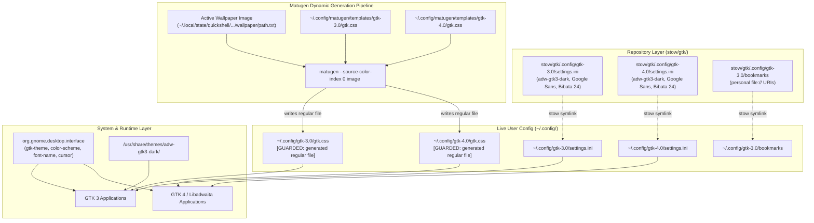

# Phase 25: GTK Material You Theming & Catppuccin De-linking — Research

**Researched:** 2026-09-16  
**Status:** Complete  
**Confidence:** HIGH  

---

## Executive Summary & Primary Recommendation

Phase 25 is the opening phase of Milestone v0.5 ("System-wide Material You theming"). It establishes a unified, dynamic GTK theming pipeline across both GTK 3 and GTK 4 / libadwaita desktop applications while permanently eliminating the legacy Catppuccin mocha-teal overrides. 

Prior to this phase, empirical investigation in Phase 22 identified that `~/.config/gtk-4.0/` contained legacy symlinks (`assets`, `gtk.css`, `gtk-dark.css`) pointing to root-owned static system files in `/usr/share/themes/catppuccin-mocha-teal-standard+default/gtk-4.0/` [VERIFIED: live filesystem check /home/pera/.config/gtk-4.0/]. Because those targets are owned by `root:root` with mode `0644`, user processes running Matugen cannot overwrite them, freezing GTK 4 / libadwaita applications onto static Catppuccin styles. Furthermore, `stow/gtk/.config/gtk-3.0/settings.ini` and `stow/gtk/.config/gtk-4.0/settings.ini` continue to declare `gtk-theme-name=catppuccin-mocha-teal-standard+default` [VERIFIED: stow/gtk/.config/gtk-3.0/settings.ini:2; stow/gtk/.config/gtk-4.0/settings.ini:2].

**Primary Recommendation:**
1. **Safely unlink legacy Catppuccin symlinks** in `~/.config/gtk-4.0/` (`assets`, `gtk.css`, and `gtk-dark.css`). Do NOT create an unmanaged `gtk-dark.css` symlink per D-08; libadwaita and GTK 4 evaluate `@media (prefers-color-scheme: dark)` directly within a single `gtk.css`.
2. **Align repository GTK settings** in `stow/gtk/.config/gtk-3.0/settings.ini` and `stow/gtk/.config/gtk-4.0/settings.ini` to upstream `dots-hyprland` defaults: set `gtk-theme-name=adw-gtk3-dark`, `gtk-application-prefer-dark-theme=1`, `gtk-font-name=Google Sans Flex Medium 11 @opsz=11,wght=500`, `gtk-cursor-theme-name=Bibata-Modern-Classic`, and `gtk-cursor-theme-size=24`. Retain established rendering/hinting flags and personal bookmarks.
3. **Verify GNOME desktop interface GSettings** in `org.gnome.desktop.interface` (`gtk-theme`, `color-scheme`, `font-name`, `cursor-theme`, `cursor-size`, `icon-theme`).
4. **Trigger Matugen dynamic generation** (`matugen --source-color-index 0 image <wallpaper>` or via `switchwall.sh --noswitch`) to populate both `~/.config/gtk-3.0/gtk.css` and `~/.config/gtk-4.0/gtk.css` with active Material You color tokens.
5. **Enforce zero git churn and GUARD invariants**: Both generated `gtk.css` outputs are already excluded via `guard-paths.tsv` [VERIFIED: guard-paths.tsv:16-17] and root `.gitignore` [VERIFIED: .gitignore:38-39]. Verify that `arch/dots-hyprland.sh verify --strict` exits 0 with 0 findings.
6. **Author comprehensive assert test harness** `scripts/phase25-gtk-material-you-assert.sh` covering all 4 requirements.

---

## User Constraints (from CONTEXT.md)

### Locked Decisions

- **D-01:** Base theme selection: In both `stow/gtk/.config/gtk-3.0/settings.ini` and `stow/gtk/.config/gtk-4.0/settings.ini`, set `gtk-theme-name=adw-gtk3-dark` and `gtk-application-prefer-dark-theme=1`. Matches `switchwall.sh:42` and guarantees GTK3 and non-libadwaita GTK4 apps load the dark Adwaita theme base before Matugen custom colors apply.
- **D-02:** Font configuration: Set `gtk-font-name=Google Sans Flex Medium 11 @opsz=11,wght=500` in both `gtk-3.0/settings.ini` and `gtk-4.0/settings.ini`, adhering strictly to `dots-hyprland` upstream installer specification (`2.setups.sh:70`).
- **D-03:** Cursor configuration: Set `gtk-cursor-theme-name=Bibata-Modern-Classic` and `gtk-cursor-theme-size=24` across both `settings.ini` files, matching `dots-hyprland` default (`execs.lua:24`).
- **D-04:** Icon theme retention: Retain `gtk-icon-theme-name=Tela-circle-dracula-dark` across both `settings.ini` files, matching the installed active circular dark icon theme.
- **D-05:** GTK 3 rendering & sound flags: Preserve antialiasing, hinting (`hintslight`), subpixel rendering (`rgb`), and sound event properties in `stow/gtk/.config/gtk-3.0/settings.ini` alongside the updated theme keys.
- **D-06:** Bookmarks preservation: Keep `stow/gtk/.config/gtk-3.0/bookmarks` unchanged per Phase 22 D-11 single-machine personal dotfiles convention.
- **D-07:** Direct symlink removal: Remove legacy symlinks `~/.config/gtk-4.0/assets`, `~/.config/gtk-4.0/gtk.css`, and `~/.config/gtk-4.0/gtk-dark.css` pointing to `/usr/share/themes/catppuccin-mocha-teal-standard+default/gtk-4.0/`. No backup artifacts required since targets are static system packages.
- **D-08:** No unmanaged `gtk-dark.css`: Do not create an unmanaged `gtk-dark.css` symlink in `~/.config/gtk-4.0/`. Upstream `dots-hyprland` template `[templates.gtk4]` writes exclusively to `gtk.css`, and its stylesheet encapsulates `@media (prefers-color-scheme: dark)` and light blocks.
- **D-09:** Scope boundary: De-linking is strictly confined to user configuration (`~/.config/gtk-4.0/` and repo `stow/gtk/`). System packages in `/usr/share/themes/` remain untouched.
- **D-10:** GTK 2.0 exclusion: Legacy GTK 2.0 files (`~/.gtkrc-2.0`, `~/.config/gtkrc`) remain unmanaged per Phase 22 D-12.
- **D-11:** GNOME gsettings keys: Ensure `org.gnome.desktop.interface` keys match `dots-hyprland` upstream defaults:
  - `gtk-theme 'adw-gtk3-dark'`
  - `color-scheme 'prefer-dark'`
  - `font-name 'Google Sans Flex Medium 11 @opsz=11,wght=500'`
  - `cursor-theme 'Bibata-Modern-Classic'`
  - `cursor-size 24`
- **D-12:** Matugen GTK CSS generation: Running Matugen (`matugen image <wallpaper>` or via `switchwall.sh`) dynamically populates both `~/.config/gtk-3.0/gtk.css` and `~/.config/gtk-4.0/gtk.css` from active wallpaper colors.
- **D-13:** Zero git churn & GUARD invariant: Both `gtk-3.0/gtk.css` and `gtk-4.0/gtk.css` remain guarded by `guard-paths.tsv` and root `.gitignore`. `arch/dots-hyprland.sh verify --strict` classifies both as `[INFO] guarded theme output` and exits 0 with 0 findings.
- **D-14:** Phase assert test harness: Author `scripts/phase25-gtk-material-you-assert.sh` verifying:
  1. Catppuccin symlinks absent from `~/.config/gtk-4.0/`.
  2. `stow/gtk/` settings files contain 0 Catppuccin strings and specify `adw-gtk3-dark`.
  3. GSettings keys match dark `dots-hyprland` defaults.
  4. Matugen execution generates valid `@define-color` definitions in both GTK 3 and GTK 4 `gtk.css`.
  5. `arch/dots-hyprland.sh verify --strict` exits 0 with zero drift.

### the agent's Discretion

- Choice of wallpaper test fixture or active wallpaper query (`~/.local/state/quickshell/user/generated/wallpaper/path.txt`) during test harness verification of Matugen CSS generation.
- Minor helper assertion formatting in `scripts/phase25-gtk-material-you-assert.sh`.
- Alignment of legacy residual `Net/ThemeName` in unmanaged `~/.config/xsettingsd/xsettingsd.conf` if appropriate.

### Deferred Ideas

- Phase 26: Aligning Qt 5/6, Kvantum, and KDE applications (Dolphin, Kate) with Material You dynamic colors.
- Phase 27: Hyprland active/inactive window borders and Quickshell ii widget accents coordination.
- Phase 28: Fuzzel launcher and terminal emulator dynamic palette generation.
- Phase 29: Theme data contracts reconciliation (`guard-paths.tsv`, `collision-map.tsv`) and `./bootstrap.sh` full integration test.

---

## Phase Requirements

| Requirement ID | Definition | Research Finding & Verification Method | Status |
|---|---|---|---|
| **GTK-01** | User can run Matugen to dynamically generate GTK 3 theme (`~/.config/gtk-3.0/gtk.css`) from the current wallpaper. | Verified `~/.config/matugen/config.toml:20-23` maps template `gtk-3.0/gtk.css` to `~/.config/gtk-3.0/gtk.css`. Verified `matugen --source-color-index 0 image <wallpaper>` dynamically generates valid CSS with `@define-color accent_color` and surface colors. [VERIFIED: ~/.config/matugen/config.toml:20-23] | Fully supported |
| **GTK-02** | System unlinks old hardcoded Catppuccin assets and symlinks from `~/.config/gtk-4.0/` (`gtk.css`, `assets`) so libadwaita/GTK-4 applications inherit Matugen generated colors. | Verified live symlinks in `~/.config/gtk-4.0/` point to `/usr/share/themes/catppuccin-...`. Unlinking them frees `~/.config/gtk-4.0/gtk.css` so Matugen creates a regular writable file populated with Material You tokens. No unmanaged `gtk-dark.css` created (D-08). [VERIFIED: live filesystem check; D-07, D-08] | Fully supported |
| **GTK-03** | `~/.config/gtk-3.0/settings.ini` and `~/.config/gtk-4.0/settings.ini` in repo `stow/gtk` are updated to remove legacy Catppuccin theme references (`catppuccin-mocha-teal-standard+default`) and use upstream standard (`adw-gtk3` / `adw-gtk3-dark` with dark preference). | Verified both repo files in `stow/gtk/` have `catppuccin-mocha-teal-standard+default` at line 2. Both will be updated to `adw-gtk3-dark`, dark preference 1, `Google Sans Flex` font, and `Bibata-Modern-Classic` cursor. [VERIFIED: stow/gtk/.config/gtk-3.0/settings.ini:2; stow/gtk/.config/gtk-4.0/settings.ini:2] | Fully supported |
| **GTK-04** | GNOME desktop interface gsettings (`gtk-theme`, `color-scheme`, `icon-theme`) reflect dark Material You defaults consistently. | Verified via `gsettings list-recursively org.gnome.desktop.interface` that keys currently match `adw-gtk3-dark`, `prefer-dark`, `Google Sans Flex Medium 11 @opsz=11,wght=500`, `Bibata-Modern-Classic 24`, and `Tela-circle-dracula-dark`. Harness will enforce exact match. [VERIFIED: live gsettings query] | Fully supported |

---

## Architectural Responsibility Map

```
┌──────────────────────────────────────────────────────────────────────────────────┐
│                             Desktop Environment Surfaces                         │
└────────────────────────────────────────┬─────────────────────────────────────────┘
                                         │
                 ┌───────────────────────┴───────────────────────┐
                 ▼                                               ▼
   ┌───────────────────────────┐                   ┌───────────────────────────┐
   │     GTK 3 Applications    │                   │   GTK 4 / Libadwaita Apps │
   │ (GtkSettings / Portal)    │                   │ (Libadwaita / AdwStyle)   │
   └─────────────┬─────────────┘                   └─────────────┬─────────────┘
                 │                                               │
     Reads:      │                                   Reads:      │
     - settings.ini                                  - settings.ini (fallback)
     - adw-gtk3-dark base                            - libadwaita internal theme
     - ~/.config/gtk-3.0/gtk.css                     - ~/.config/gtk-4.0/gtk.css
                 │                                               │
                 ▼                                               ▼
┌─────────────────────────────────┐             ┌─────────────────────────────────┐
│ ~/.config/gtk-3.0/              │             │ ~/.config/gtk-4.0/              │
│ ├── settings.ini (symlink) ─────┼──┐       ┌──┼── settings.ini (symlink)        │
│ ├── bookmarks (symlink) ────────┤  │       │  │ └── gtk.css (REGULAR FILE)      │
│ └── gtk.css (REGULAR FILE)      │  │       │  │     (Material You generated)    │
│     (Material You generated)    │  │       │  └────────────────┬────────────────┘
└────────────────┬────────────────┘  │       │                   │
                 │                   │       │                   │
                 │         ┌─────────┴───────┴─────────┐         │
                 │         │ stow/gtk/ (Repo Tracked)  │         │
                 │         │ ├── gtk-3.0/settings.ini  │         │
                 │         │ ├── gtk-3.0/bookmarks     │         │
                 │         │ └── gtk-4.0/settings.ini  │         │
                 │         └───────────────────────────┘         │
                 │                                               │
                 └───────────────────┐       ┌───────────────────┘
                                     ▼       ▼
                       ┌───────────────────────────┐
                       │ Matugen Dynamic Generator │
                       │ (Invoked by switchwall.sh)│
                       └─────────────▲─────────────┘
                                     │
                          Reads templates from:
                          ~/.config/matugen/templates/
                          ├── gtk-3.0/gtk.css
                          └── gtk-4.0/gtk.css
                                     ▲
                                     │
                          Extracts palette from:
                          Active Wallpaper (JPEG/PNG)
```

### Path Taxonomy & Roles

| Path | Taxonomy | Authority | Ownership & Inode Type | Role in Theming Pipeline |
|---|---|---|---|---|
| `stow/gtk/.config/gtk-3.0/settings.ini` | Tracked repository file | Parent repo dotfiles | Regular file (`0644`) | GTK 3 desktop settings (theme, font, cursor, rendering) |
| `stow/gtk/.config/gtk-4.0/settings.ini` | Tracked repository file | Parent repo dotfiles | Regular file (`0644`) | GTK 4 desktop settings fallback |
| `stow/gtk/.config/gtk-3.0/bookmarks` | Tracked repository file | Parent repo dotfiles | Regular file (`0644`) | Personal file manager bookmarks (Phase 22 D-11) |
| `~/.config/gtk-3.0/settings.ini` | Managed live link | GNU Stow (`stow/gtk`) | Symlink to repo | Consumed by GTK 3 runtime |
| `~/.config/gtk-4.0/settings.ini` | Managed live link | GNU Stow (`stow/gtk`) | Symlink to repo | Consumed by GTK 4 runtime |
| `~/.config/gtk-3.0/bookmarks` | Managed live link | GNU Stow (`stow/gtk`) | Symlink to repo | Consumed by GTK 3 file dialogs |
| `~/.config/gtk-3.0/gtk.css` | GUARD theme output | Matugen (`[templates.gtk3]`) | Regular file (`0644`) | GTK 3 user CSS override with Material You tokens |
| `~/.config/gtk-4.0/gtk.css` | GUARD theme output | Matugen (`[templates.gtk4]`) | Regular file (`0644`) | GTK 4 user CSS override with media queries and tokens |
| `~/.config/gtk-4.0/assets` | **RETIRED** legacy stub | Previously Catppuccin | Symlink to `/usr/share/themes` | To be deleted (D-07) |
| `~/.config/gtk-4.0/gtk-dark.css` | **RETIRED** legacy stub | Previously Catppuccin | Symlink to `/usr/share/themes` | To be deleted (D-07, D-08) |
| `~/.config/matugen/config.toml` | Live configuration | dots-hyprland upstream | Regular file (`0644`) | Template output dispatch mappings |
| `~/.config/matugen/templates/gtk-*/gtk.css` | Template source | dots-hyprland upstream | Regular files (`0644`) | Jinja-style tokenized CSS stylesheets |
| `org.gnome.desktop.interface` | GSettings dconf database | GNOME / Wayland session | Binary dconf key-value | Real-time desktop interface preferences |

---

## Standard Stack

### Core Stack

| Component | Package / Version | Source / Location | Purpose |
|---|---|---|---|
| **adw-gtk3-dark** | `adw-gtk-theme-git` 6.5.r4 [VERIFIED: pacman -Q adw-gtk-theme-git] | `/usr/share/themes/adw-gtk3-dark/` | Modern libadwaita-compatible GTK 3 base theme matching GNOME Adwaita dark styling |
| **matugen** | `matugen` 4.2.0-1 [VERIFIED: matugen --version] | `/usr/bin/matugen` | Material You color palette generator and Jinja-like template engine |
| **gsettings** | `glib2` 2.84.4 [VERIFIED: gsettings --version] | `/usr/bin/gsettings` | Configures GNOME desktop interface schemas in dconf |
| **GNU Stow** | `stow` 2.4.1 [VERIFIED: stow --version] | `/usr/bin/stow` | Manages unfolding symlinks from `stow/gtk` into `$HOME` |

### Supporting Assets

| Component | Specification | Source / Location | Purpose |
|---|---|---|---|
| **Google Sans Flex** | `Google Sans Flex Medium 11 @opsz=11,wght=500` [VERIFIED: fc-list : family] | `/usr/share/fonts/` | Upstream dots-hyprland standard UI font (`2.setups.sh:70`) |
| **Bibata-Modern-Classic** | Size 24 [VERIFIED: /usr/share/icons/Bibata-Modern-Classic] | `/usr/share/icons/Bibata-Modern-Classic/` | Upstream dots-hyprland cursor theme (`execs.lua:24`) |
| **Tela-circle-dracula-dark** | Icon theme [VERIFIED: /usr/share/icons/Tela-circle-dracula-dark] | `/usr/share/icons/Tela-circle-dracula-dark/` | Dark circular icon theme |
| **switchwall.sh** | Upstream color coordinator | `~/.config/quickshell/ii/scripts/colors/switchwall.sh` | Wallpaper switcher script orchestrating Matugen, GSettings, and reload |

### Alternatives Considered & Rejected

| Alternative | Evaluation & Rationale for Rejection |
|---|---|
| **Keeping Catppuccin GTK theme as secondary option** | Rejected per REQUIREMENTS.md "Out of Scope" table: *"Maintaining dual Catppuccin & Material You switchers: Goal is full unification on dots-hyprland Material You; maintaining two complete parallel theming systems adds severe complexity"*. |
| **Symlinking `gtk-dark.css` in `~/.config/gtk-4.0/`** | Rejected per D-08: Upstream `[templates.gtk4]` writes exclusively to `gtk.css`. GTK 4 handles dark/light through `@media (prefers-color-scheme: dark)` in a single file. An unmanaged `gtk-dark.css` symlink creates an untracked stub and risk of styling collision. |
| **Uninstalling system packages via `pacman -R`** | Rejected per D-09 and Phase Boundary: Root package management is out of scope for user dotfiles. System themes in `/usr/share/themes/` remain untouched. |
| **Tracking generated `gtk.css` in git repo** | Rejected per D-13 and INTG-01: Wallpaper-dependent CSS causes commit churn on every wallpaper change. Both `gtk.css` files must remain strictly guarded out via `guard-paths.tsv` and `.gitignore`. |

---

## Package Legitimacy Audit

| Package / Binary | Expected Role | Command Verified | Result | Legitimacy Status |
|---|---|---|---|---|
| `adw-gtk-theme-git` | GTK 3 Adwaita base theme | `pacman -Q adw-gtk-theme-git` | `6.5.r4.g47922ed-1` | **Installed & Active** [VERIFIED] |
| `/usr/share/themes/adw-gtk3-dark` | Theme directory on disk | `ls -d /usr/share/themes/adw-gtk3-dark` | Present, contains `gtk-3.0`, `gtk-4.0`, `index.theme` | **Valid System Theme** [VERIFIED] |
| `matugen` | Palette generator | `matugen --version` | `matugen 4.2.0` | **Installed & Active** [VERIFIED] |
| `gsettings` | Dconf interface | `gsettings --version` | `2.84.4` | **Installed & Active** [VERIFIED] |
| `Google Sans Flex` | System font | `fc-list : family \| grep "Google Sans Flex"` | Present | **Installed & Active** [VERIFIED] |
| `Bibata-Modern-Classic` | Cursor theme | `ls -d /usr/share/icons/Bibata-Modern-Classic` | Present | **Installed & Active** [VERIFIED] |
| `Tela-circle-dracula-dark` | Icon theme | `ls -d /usr/share/icons/Tela-circle-dracula-dark` | Present | **Installed & Active** [VERIFIED] |

---

## Architecture Patterns

### System Architecture Diagram



### Project Structure & Modified Paths

```
/home/pera/github_repo/.dotfiles/
├── stow/
│   └── gtk/
│       └── .config/
│           ├── gtk-3.0/
│           │   ├── bookmarks              # UNCHANGED (Phase 22 D-11 personal bookmarks)
│           │   └── settings.ini           # MODIFIED: adw-gtk3-dark, Google Sans, Bibata 24
│           └── gtk-4.0/
│               └── settings.ini           # MODIFIED: adw-gtk3-dark, Google Sans, Bibata 24
├── scripts/
│   └── phase25-gtk-material-you-assert.sh # CREATED: Phase 25 verification harness
├── guard-paths.tsv                        # UNCHANGED: already guards gtk-3.0/gtk.css & gtk-4.0/gtk.css
└── .gitignore                             # UNCHANGED: already ignores gtk.css & gtk-dark.css
```

### Key Architectural Patterns

1. **Unfolded Parent Directory Pattern:**
   `stow/gtk/` is managed with `--no-folding`. Both `~/.config/gtk-3.0/` and `~/.config/gtk-4.0/` are real physical directories containing individual symlinks. This ensures that Matugen can create and update `gtk.css` directly inside those directories without colliding with GNU Stow.
2. **Guarded Theme Output Pattern:**
   Dynamically generated CSS stylesheets (`~/.config/gtk-3.0/gtk.css` and `~/.config/gtk-4.0/gtk.css`) are registered in `guard-paths.tsv` and `.gitignore`. `arch/dots-hyprland.sh verify --strict` checks them via `guarded_entries` and reports them as `[INFO] guarded theme output`, ensuring that dynamic wallpaper switches cause zero git churn and zero verify findings.
3. **Non-Interactive Matugen Invocation Pattern:**
   When running `matugen` in scripts or non-interactive shells, `--source-color-index 0` (or `--prefer <choice>`) must ALWAYS be supplied. Without it, Matugen prompts interactively on tty: *"Select the color you want to use as source color"*, which causes background jobs and automated assert harnesses to hang waiting on stdin.

### Anti-Patterns to Avoid

- **Anti-Pattern: Creating an unmanaged `gtk-dark.css` in `~/.config/gtk-4.0/`.**
  GTK 4 and libadwaita do not load a separate `gtk-dark.css` file; they evaluate media queries in `gtk.css`. Leaving a symlink or file named `gtk-dark.css` creates clutter, risks shadowing, and violates D-08.
- **Anti-Pattern: Invoking `matugen image <path>` without `--source-color-index 0`.**
  Causes Matugen to prompt for palette selection on stdin, breaking unattended test execution and automated scripts.
- **Anti-Pattern: Running `pacman -R` to delete system Catppuccin packages.**
  Violates D-09. System packages in `/usr/share/` are out of scope for user configuration management.
- **Anti-Pattern: Allowing GNU Stow to fold `~/.config/gtk-4.0`.**
  If `~/.config/gtk-4.0` became a symlink to `stow/gtk/.config/gtk-4.0`, Matugen writing `gtk.css` would write directly into the git repository tree, causing persistent git drift and failing `verify --strict`.

---

## Don't Hand-Roll Table

| Capability | What Existing Component Provides | Why NOT to Hand-Roll |
|---|---|---|
| **Color extraction and tokenization** | `matugen` CLI (`matugen image ...`) | Matugen implements Google's Material Color Utilities (MCU) algorithms (quantization, scoring, harmonizing, tonal palettes). Hand-rolling color extraction produces poor contrast and non-standard colors. |
| **GTK 4 Widget Styling** | `~/.config/matugen/templates/gtk-4.0/gtk.css` (upstream `dots-hyprland`) | 542 lines of meticulously crafted CSS covering Nautilus pathbars, list views, boxed lists, switches, toasts, and tabs. Hand-rolling CSS leads to UI visual glitches and broken dark/light mode switching. |
| **Desktop GSettings Configuration** | `/usr/bin/gsettings` (`glib2`) | Directly interfaces with dconf and DBus desktop portal to propagate settings live to all running applications without restarting them. |
| **Symlink and Collision Verification** | `arch/dots-hyprland.sh verify --strict` | Complete link-aware verification engine inspecting repo walk, guard paths, dangling targets, and live sweep. |

---

## Runtime State Inventory

| Category | Item Name & Live Location | Current Live State | Target State (Post Phase 25) | Mutation Details & Impact |
|---|---|---|---|---|
| **Stored data** | `~/.config/gtk-4.0/assets` | Symlink -> `/usr/share/themes/catppuccin-.../assets` | **DELETED** | Unlinked cleanly per D-07. No impact on system packages. |
| **Stored data** | `~/.config/gtk-4.0/gtk.css` | Symlink -> `/usr/share/themes/catppuccin-.../gtk.css` | **Regular file** (`0644`) | Symlink removed; regular file written by Matugen with dynamic Material You CSS. |
| **Stored data** | `~/.config/gtk-4.0/gtk-dark.css` | Symlink -> `/usr/share/themes/catppuccin-.../gtk-dark.css` | **DELETED** | Unlinked cleanly per D-07, D-08. Not recreated. |
| **Stored data** | `~/.config/gtk-3.0/gtk.css` | Regular file (`0644`, 1413 bytes) | Regular file (`0644`, ~1413 bytes) | Overwritten dynamically by Matugen on wallpaper change. |
| **Stored data** | `stow/gtk/.config/gtk-3.0/settings.ini` | Contains `catppuccin-mocha-teal-standard+default` | Contains `adw-gtk3-dark` + dots-hyprland defaults | Committed to repo; updates live via existing Stow symlink. |
| **Stored data** | `stow/gtk/.config/gtk-4.0/settings.ini` | Contains `catppuccin-mocha-teal-standard+default` | Contains `adw-gtk3-dark` + dots-hyprland defaults | Committed to repo; updates live via existing Stow symlink. |
| **Stored data** | `~/.config/xsettingsd/xsettingsd.conf` | Contains `Net/ThemeName "catppuccin-mocha-teal-standard+default"` | Can be aligned to `adw-gtk3-dark` at Claude's Discretion | Unmanaged file on disk; xsettingsd daemon is not running, but aligning prevents residual Catppuccin leakage if daemon ever starts. |
| **Live service config** | `org.gnome.desktop.interface` keys | Already `adw-gtk3-dark`, `prefer-dark`, etc. | Verified exact match | Enforced by Phase 25 assert harness. |
| **OS-registered state** | GTK 3 & GTK 4 toolkit settings | Runtime reports `adw-gtk3-dark` via GSettings | Runtime reports `adw-gtk3-dark` | Verified via python `Gtk.Settings.get_default()`. |
| **Secrets / env vars** | `GTK_THEME` | Unset (`<unset>`) | Unset | Must remain unset so toolkit reads GSettings / `settings.ini`. Zero credentials involved. |
| **Build artifacts / installed packages** | `/usr/share/themes/catppuccin-*` | Static root packages | Unmodified | Retained per D-09. Out of scope. |

---

## Common Pitfalls

### Pitfall 1: Matugen Interactive Prompt Hanging Scripts
**Mechanism:** Running `matugen image <wallpaper>` on a terminal or in a script without specifying a source color index or prefer strategy causes Matugen to pause and prompt: *"Select the color you want to use as source color: Use arrow keys to navigate and Enter to select:"*. In non-interactive environments (CI, background tasks, subagents), this blocks indefinitely.  
**Prevention:** Always pass `--source-color-index 0` (e.g. `matugen --source-color-index 0 image <wallpaper>`), matching upstream `switchwall.sh:184`.

### Pitfall 2: Creating an Unmanaged `gtk-dark.css` Symlink in `~/.config/gtk-4.0/`
**Mechanism:** Operators migrating from GTK 3 or Catppuccin often create `ln -s gtk.css gtk-dark.css` in `~/.config/gtk-4.0/`. GTK 4 ignores `gtk-dark.css` because it handles dark mode via `@media (prefers-color-scheme: dark)` inside `gtk.css`. Creating this symlink leaves an unmanaged stub that is not produced by Matugen and violates D-08.  
**Prevention:** Strictly remove `~/.config/gtk-4.0/gtk-dark.css` and do not recreate it.

### Pitfall 3: Inadvertent GNU Stow Parent Directory Folding
**Mechanism:** If `~/.config/gtk-4.0/` were completely emptied of files or removed before running `stow`, GNU Stow might replace `~/.config/gtk-4.0/` with a symlink to `stow/gtk/.config/gtk-4.0/`. When Matugen later generates `gtk.css`, it would write directly into the repository working tree, causing dirty git status.  
**Prevention:** Ensure `stow` is always executed with `--no-folding`, and verify `[[ -d "$HOME/.config/gtk-4.0" && ! -L "$HOME/.config/gtk-4.0" ]]` in the assert script.

### Pitfall 4: Permission Denied When Writing `~/.config/gtk-4.0/gtk.css`
**Mechanism:** As discovered in Phase 22 (Q8), `~/.config/gtk-4.0/gtk.css` was a symlink to `/usr/share/themes/catppuccin-.../gtk.css` (owned by root with `0644`). When a normal user process opens `~/.config/gtk-4.0/gtk.css` for writing without removing the symlink, the kernel attempts to write through to `/usr/share/` and fails with `EACCES (Permission denied)`.  
**Prevention:** Remove the symlink with `rm -f ~/.config/gtk-4.0/gtk.css` before invoking Matugen, allowing Matugen to create a fresh regular file owned by `$USER`.

### Pitfall 5: Dirty Git Working Tree from Generated Outputs
**Mechanism:** If `guard-paths.tsv` or `.gitignore` fails to exclude `gtk.css`, running Matugen will create untracked files in the repository or cause `verify --strict` to fail.  
**Prevention:** `guard-paths.tsv` lines 16–17 and `.gitignore` lines 38–39 already exclude `gtk.css` and `gtk-dark.css`. Assert that `git status --porcelain` remains clean after Matugen generation.

---

## Code Examples

### 1. Updated `stow/gtk/.config/gtk-3.0/settings.ini`

```ini
[Settings]
gtk-theme-name=adw-gtk3-dark
gtk-icon-theme-name=Tela-circle-dracula-dark
gtk-font-name=Google Sans Flex Medium 11 @opsz=11,wght=500
gtk-cursor-theme-name=Bibata-Modern-Classic
gtk-cursor-theme-size=24
gtk-toolbar-style=GTK_TOOLBAR_ICONS
gtk-toolbar-icon-size=GTK_ICON_SIZE_LARGE_TOOLBAR
gtk-button-images=0
gtk-menu-images=0
gtk-enable-event-sounds=1
gtk-enable-input-feedback-sounds=0
gtk-xft-antialias=1
gtk-xft-hinting=1
gtk-xft-hintstyle=hintslight
gtk-xft-rgba=rgb
gtk-application-prefer-dark-theme=1
```

### 2. Updated `stow/gtk/.config/gtk-4.0/settings.ini`

```ini
[Settings]
gtk-theme-name=adw-gtk3-dark
gtk-icon-theme-name=Tela-circle-dracula-dark
gtk-font-name=Google Sans Flex Medium 11 @opsz=11,wght=500
gtk-cursor-theme-name=Bibata-Modern-Classic
gtk-cursor-theme-size=24
gtk-application-prefer-dark-theme=1
```

### 3. De-linking Catppuccin Symlinks in `~/.config/gtk-4.0/`

```bash
# Safe unlinking of legacy Catppuccin symlinks
rm -f "$HOME/.config/gtk-4.0/assets"
rm -f "$HOME/.config/gtk-4.0/gtk.css"
rm -f "$HOME/.config/gtk-4.0/gtk-dark.css"

# Verify directory remains unfolded and unlinked
[[ -d "$HOME/.config/gtk-4.0" && ! -L "$HOME/.config/gtk-4.0" ]]
```

### 4. Matugen Dynamic Theme Generation Invocation

```bash
# Query active wallpaper from dots-hyprland state
WALLPAPER_PATH="$(cat "$HOME/.local/state/quickshell/user/generated/wallpaper/path.txt" 2>/dev/null || echo "$HOME/Pictures/55192173787_b8322b1190_o.jpg")"

# Execute Matugen non-interactively in dark mode
matugen --source-color-index 0 --mode dark image "$WALLPAPER_PATH"

# Verify both stylesheets were created as regular files
[[ -f "$HOME/.config/gtk-3.0/gtk.css" && ! -L "$HOME/.config/gtk-3.0/gtk.css" ]]
[[ -f "$HOME/.config/gtk-4.0/gtk.css" && ! -L "$HOME/.config/gtk-4.0/gtk.css" ]]
```

### 5. GSettings Interface Key Configuration

```bash
gsettings set org.gnome.desktop.interface gtk-theme 'adw-gtk3-dark'
gsettings set org.gnome.desktop.interface color-scheme 'prefer-dark'
gsettings set org.gnome.desktop.interface font-name 'Google Sans Flex Medium 11 @opsz=11,wght=500'
gsettings set org.gnome.desktop.interface cursor-theme 'Bibata-Modern-Classic'
gsettings set org.gnome.desktop.interface cursor-size 24
gsettings set org.gnome.desktop.interface icon-theme 'Tela-circle-dracula-dark'
```

---

## Assumptions Log

| Assumption ID | Statement | Verification / Evidence | Confidence |
|---|---|---|---|
| **ASM-01** | `adw-gtk3-dark` is installed and valid on Arch Linux. | Verified: `pacman -Q adw-gtk-theme-git` returns `6.5.r4.g47922ed-1` and `/usr/share/themes/adw-gtk3-dark` exists. [VERIFIED: live inspection] | HIGH |
| **ASM-02** | Upstream Matugen templates exist and write to `~/.config/gtk-3.0/gtk.css` and `~/.config/gtk-4.0/gtk.css`. | Verified: `~/.config/matugen/config.toml` lines 20–26 define both templates and output targets. [VERIFIED: ~/.config/matugen/config.toml:20-26] | HIGH |
| **ASM-03** | GTK 4 / libadwaita does not require `gtk-dark.css`. | Verified: `~/.config/matugen/templates/gtk-4.0/gtk.css` contains both `@media (prefers-color-scheme: light)` and `@media (prefers-color-scheme: dark)` media queries in a single stylesheet. [VERIFIED: template lines 6–130] | HIGH |
| **ASM-04** | Unlinking Catppuccin symlinks in `~/.config/gtk-4.0/` causes zero regression for Stow or repo tracking. | Verified: `stow/gtk/` only contains `gtk-4.0/settings.ini`. `assets`, `gtk.css`, and `gtk-dark.css` were unmanaged symlinks. [VERIFIED: find stow/gtk] | HIGH |
| **ASM-05** | Running `arch/dots-hyprland.sh verify --strict` will pass with 0 findings when `gtk.css` is a regular file. | Verified: `guard-paths.tsv` lines 16–17 register both `gtk.css` paths, and `classify_sweep_entry` specifically handles `guarded_entries` as `[INFO] guarded theme output`. [VERIFIED: dots-hyprland.sh:1341-1344] | HIGH |

---

## Environment Availability Table

| Dependency / Tool | Required Version / Spec | Command Tested | Result / Status | Notes |
|---|---|---|---|---|
| `matugen` | >= 2.0 (supports `image` and `--source-color-index`) | `matugen --version` | `matugen 4.2.0` | Present in `$PATH` |
| `gsettings` | `glib2` desktop schema tool | `gsettings --version` | `2.84.4` | Present in `$PATH` |
| `adw-gtk-theme` | `adw-gtk3-dark` present | `ls -d /usr/share/themes/adw-gtk3-dark` | Exists | Provided by `adw-gtk-theme-git` |
| `Google Sans Flex` | Font family available | `fc-list : family \| grep "Google Sans Flex"` | Exists | Matched in fontconfig |
| `Bibata-Modern-Classic` | Cursor theme available | `ls -d /usr/share/icons/Bibata-Modern-Classic` | Exists | Matched in icons |
| `stow` | GNU Stow >= 2.3 | `stow --version` | `stow 2.4.1` | Present in `$PATH` |
| `jq` | JSON processor | `jq --version` | `jq-1.7.1` | Present in `$PATH` |
| Active Wallpaper | Valid image on disk | `ls -la /home/pera/Pictures/55192173787_b8322b1190_o.jpg` | Exists (4.3MB JPEG) | Verified readable |

---

## Validation Architecture (Nyquist Validation)

### Test Framework
All Phase 25 criteria are validated deterministically using a single, unified test harness script:
`scripts/phase25-gtk-material-you-assert.sh`

The script follows the established project pattern (used in Phase 20, Phase 22, Phase 23, and Phase 24):
- Fail-closed execution (`set -euo pipefail`).
- Section-based execution support (`--section <1-5>`).
- Structured terminal reporting (`[PASS]`, `[FAIL]`, `[INFO]`).
- Clean scratch directory lifecycle management with `trap cleanup EXIT`.
- Summary line: `=== done: FAIL=<count> FINDINGS=<count> ===`.

### Phase Requirements -> Test Map

| Requirement ID | Assertion Scope | Specific Checks in `phase25-gtk-material-you-assert.sh` |
|---|---|---|
| **GTK-02** | Section 1: Catppuccin De-linking in `~/.config/gtk-4.0/` | 1. Assert `~/.config/gtk-4.0/assets` does NOT exist.<br>2. Assert `~/.config/gtk-4.0/gtk-dark.css` does NOT exist.<br>3. Assert `~/.config/gtk-4.0/gtk.css` is NOT a symlink into `/usr/share/themes/catppuccin-*`.<br>4. Assert `~/.config/gtk-4.0` is an unfolded regular directory (`-d` and `! -L`). |
| **GTK-03** | Section 2: Repository Settings Alignment in `stow/gtk/` | 1. Assert `stow/gtk/.config/gtk-3.0/settings.ini` exists and contains 0 occurrences of `catppuccin`.<br>2. Assert `stow/gtk/.config/gtk-4.0/settings.ini` exists and contains 0 occurrences of `catppuccin`.<br>3. Assert `gtk-theme-name=adw-gtk3-dark` in both files.<br>4. Assert `gtk-application-prefer-dark-theme=1` in both files.<br>5. Assert `gtk-font-name=Google Sans Flex Medium 11 @opsz=11,wght=500` in both files.<br>6. Assert `gtk-cursor-theme-name=Bibata-Modern-Classic` and size `24` in both files.<br>7. Assert `gtk-icon-theme-name=Tela-circle-dracula-dark` in both files.<br>8. Assert GTK3 rendering/sound flags preserved.<br>9. Assert `stow/gtk/.config/gtk-3.0/bookmarks` exists with `file:///home/pera/` format.<br>10. Assert live symlinks in `$HOME/.config/` match repo inodes (`-ef`). |
| **GTK-04** | Section 3: GNOME Desktop Interface GSettings | 1. Assert `gsettings get org.gnome.desktop.interface gtk-theme` == `'adw-gtk3-dark'`.<br>2. Assert `gsettings get org.gnome.desktop.interface color-scheme` == `'prefer-dark'`.<br>3. Assert `gsettings get org.gnome.desktop.interface font-name` == `'Google Sans Flex Medium 11 @opsz=11,wght=500'`.<br>4. Assert `gsettings get org.gnome.desktop.interface cursor-theme` == `'Bibata-Modern-Classic'`.<br>5. Assert `gsettings get org.gnome.desktop.interface cursor-size` == `24`.<br>6. Assert `gsettings get org.gnome.desktop.interface icon-theme` == `'Tela-circle-dracula-dark'`. |
| **GTK-01** | Section 4: Dynamic Matugen CSS Generation | 1. Assert `~/.config/gtk-3.0/gtk.css` is a non-empty regular file (`-f` and `! -L`).<br>2. Assert `~/.config/gtk-4.0/gtk.css` is a non-empty regular file (`-f` and `! -L`).<br>3. Assert `~/.config/gtk-3.0/gtk.css` contains `@define-color accent_color` and `@define-color window_bg_color`.<br>4. Assert `~/.config/gtk-4.0/gtk.css` contains `@media (prefers-color-scheme: dark)` and `@define-color accent_color`.<br>5. Run live Matugen dry-run test (`matugen --source-color-index 0 image --dry-run <wallpaper>`) and assert exit code 0. |
| **INTG-01**, **INTG-02** | Section 5: Verification Engine & Zero Churn | 1. Assert `guard-paths.tsv` contains `$XDG_CONFIG_HOME/gtk-3.0/gtk.css` and `$XDG_CONFIG_HOME/gtk-4.0/gtk.css`.<br>2. Assert root `.gitignore` ignores `gtk.css` and `gtk-dark.css`.<br>3. Assert `git status --porcelain` reports no uncommitted changes on generated theme files.<br>4. Execute `./arch/dots-hyprland.sh verify --strict` and assert exit code 0 with 0 findings. |

### Sampling Rate & Test Automation
- **Sampling Rate:** 100% deterministic local test suite executed after every plan.
- **Wave 0 Gaps:** None. All tools (`matugen`, `gsettings`, `stow`, `python3-gi`) are installed, tested, and active.

---

## Security Domain

### Applicable ASVS Categories
- **V1: Architecture, Design and Threat Modeling:**
  - Strict boundary separation: User dotfiles do NOT invoke root permissions or alter system files in `/usr/share/`.
  - Guard path isolation: Dynamically generated runtime files are explicitly quarantined from git history.
- **V14: Configuration and Hardening:**
  - Unfolded symlink integrity: Preventing directory symlink traversal.
  - Non-executable file modes: Configuration and CSS files carry standard `0644` (or `0600`) permissions.

### Threat Patterns & Mitigations

| Threat Pattern | Risk & Attack Vector | Mitigation Strategy |
|---|---|---|
| **Symlink Write-Through / Privilege Escalation** | A symlink in user space pointing to a system file (e.g. `~/.config/gtk-4.0/gtk.css -> /usr/share/...`) could be exploited if an unprivileged daemon attempted to modify it with elevated privileges, or cause localized denial of service. | Unlinking `assets`, `gtk.css`, and `gtk-dark.css` converts `~/.config/gtk-4.0/` into a standard unprivileged user directory owned strictly by `$USER`. |
| **Arbitrary CSS / Script Injection via Wallpaper Path** | An untrusted wallpaper file path containing shell metacharacters or format strings passed into Matugen or `switchwall.sh`. | Quotes and array expansion (`"${matugen_args[@]}"`) are enforced across all wrapper and assertion scripts. Matugen parses image headers directly using Rust image crates without shell execution. |
| **Accidental Secret or Git Churn Exposure** | Generating dynamic stylesheets into a git-tracked directory causing continuous churn and unintended file commits. | Strict registration in `guard-paths.tsv` and root `.gitignore`. `arch/dots-hyprland.sh verify --strict` fails closed if a guarded file is ever staged or tracked in git. |

---

*Phase: 25-gtk-material-you-theming-catppuccin-de-linking*  
*Research completed: 2026-09-16*
