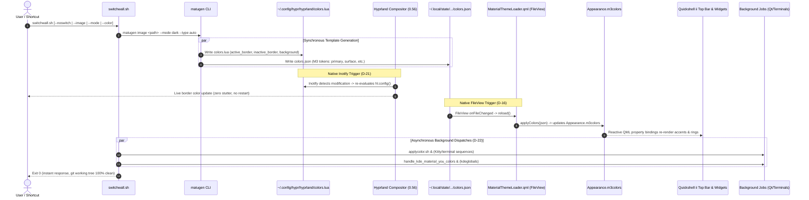

# Phase 27: Hyprland & Quickshell ii Accent Coordination - Research

**Researched:** 2026-09-17  
**Domain:** Hyprland 0.56 window decoration & Lua configuration, Quickshell ii QML M3 color tokens, Matugen dynamic template generation, live inotify reload, coordinated desktop reload pipeline  
**Confidence:** HIGH  

<user_constraints>
## User Constraints (from CONTEXT.md)

### Locked Decisions

#### Hyprland Window Decorations & Border Binding (SHELL-01)

- **D-01:** Active border token: Bind `col.active_border` to `outline_variant` with 77% alpha (`rgba({{colors.outline_variant.default.hex_stripped}}77)`), adhering strictly to upstream `dots-hyprland` default design intent.
- **D-02:** Inactive border & shadows: Inactive border bound to `surface_container_low` with 33% alpha (`rgba({{colors.surface_container_low.default.hex_stripped}}33)`); subtle black drop shadows (`rgba(00000020)` with range 20 and render power 10).
- **D-03:** Pinned & group borders: Pinned windows use primary accent gradient (`rgba({{colors.primary.default.hex_stripped}}AA) rgba({{colors.primary.default.hex_stripped}}77)`); window group borders inherit active_border and primary accent for active tab.
- **D-04:** Upstream overlay purity: Zero personal border overrides in `stow/hypr/.config/hypr/custom/general.lua`. `colors.lua` is the sole dynamic authority for window decorations in accordance with the project rule *"everything has to be default dots-hyprland. whatever that is"*.
- **D-05:** Window geometry: Retain upstream default geometry (18px rounding with 2.5 rounding power squircle and 1px border size).
- **D-06:** Dimming & blur: 5% inactive dimming (`dim_strength = 0.05`), 20% special workspace dimming (`dim_special = 0.2`), and 3-pass x-ray blur.
- **D-07:** Border animations: Smooth border transition animation via `emphasizedDecel` bezier curve at speed 10.
- **D-08:** Canvas background: Hyprland canvas background (`misc:background_color`) dynamically bound to `surface.dark` with FF alpha (`rgba({{colors.surface.dark.hex_stripped}}FF)`).
- **D-09:** Window opacity: 1.0 opaque for standard application windows; transparency delegated to terminal/app configurations.
- **D-10:** Gaps spacing: Upstream defaults — `gaps_in = 4`, `gaps_out = 5`, `gaps_workspaces = 50`.
- **D-11:** Floating windows: Floating windows inherit the same 1px border and shadow as tiled windows; pinned floating windows use primary accent gradient.
- **D-12:** Border resizing & snapping: `resize_on_border = true` with edge snapping enabled (`window_gap = 4`, `monitor_gap = 5`).

#### Quickshell ii Accent Styling (SHELL-02)

- **D-13:** Palette scheme type: Upstream default `"auto"` (dynamically analyzes wallpaper using `scheme_for_image.py`, falling back to `scheme-tonal-spot`).
- **D-14:** Top bar & metric rings: Normal resource fill and sliders use `m3primary`; active workspace pills use `m3secondary`/`tertiary`; high threshold warnings (CPU > 90%, RAM > 95%, Swap > 85%) switch to `m3error`.
- **D-15:** Background transparency: Retain baseline config (`enable: false`) — opaque `m3surfaceContainer` backgrounds for solid contrast and clean readability.
- **D-16:** In-process dynamic hot-reload: `MaterialThemeLoader.qml` reacts to `colors.json` changes via `FileView` with zero process restarts; runtime state directory remains untracked cache outside git.
- **D-17:** Dark/Light mode sync: Dynamic mode synchronization — `switchwall.sh` follows `gsettings prefer-dark/prefer-light` and updates GTK/Qt/Quickshell in lockstep; keep terminal forced to dark mode per baseline config.
- **D-18:** Top bar icon tinting: `m3onSurfaceVariant` for passive icons, `m3primary` for active toggles and focused workspace pill, spark icon highlighted with `m3primary`.
- **D-19:** Sliders & OSD: `m3primary` fill on `m3surfaceContainerHighest` track with smooth pill animations.
- **D-20:** Action Center quick-toggles: Upstream Android quick-toggle styling — `m3primary` background with `m3onPrimary` text for active toggles, `m3surfaceContainerHigh` for inactive states.

#### Coordinated Reload Pipeline (SHELL-03)

- **D-21:** Native inotify Hyprland reload: Empirically proven that Hyprland 0.56 automatically places inotify watches on all files required by `hyprland.lua` (including `colors.lua`). When Matugen updates `colors.lua`, Hyprland re-evaluates border colors live without needing explicit `hyprctl reload` or daemon watchers.
- **D-22:** Execution concurrency: Upstream non-blocking pipeline — Matugen runs synchronously for token generation, then dispatches Qt (`kde-material-you-colors`), terminals, and desktop services in parallel background jobs (`&`) for instant UI response.
- **D-23:** Error handling: Fail-soft per component — non-critical reload failures (e.g. kitty signal when not running, KDE kwin DBus warning) never abort or break the core shell and wallpaper transition.
- **D-24:** Full pipeline parity: All invocation paths (`--noswitch`, `--image`, `--mode`, `--color`) consistently trigger the complete reload pipeline across Hyprland, Quickshell, GTK, and Qt.
- **D-25:** Wallpaper rendering engine: Quickshell ii renders static wallpapers directly via `Config.options.background.wallpaperPath`, with `mpvpaper` automatically spawned for video wallpapers.
- **D-26:** Unified entry point: All wallpaper triggers (shortcuts, random selection, file picker) route exclusively through `switchwall.sh`.
- **D-27:** Session startup: Load persisted theme files on session boot with zero lag; run `switchwall.sh --noswitch` only if generated files are missing.
- **D-28:** Strict zero git churn: Running `switchwall.sh` must leave `git status --porcelain` 100% clean and strictly adhere to `guard-paths.tsv` data contracts.

#### Test Harness & Strict Verification (INTG-01, INTG-02)

- **D-29:** 5-section automated test suite: Author `scripts/phase27-accent-coordination-assert.sh` exercising 5 fail-closed sections:
  1. Template & config readiness: verify Matugen templates, `colors.lua`, and `guard-paths.tsv` protection.
  2. Hyprland border token match: query live `hyprctl getoption general:col.active_border` and assert match with `colors.lua` (with headless fallback).
  3. Quickshell token integrity: validate `colors.json` non-empty JSON, presence of primary/secondary/surface/error/outline tokens, and `#RRGGBB` format.
  4. Live coordinated reload probe: execute `switchwall.sh --noswitch`, assert mtime advancement on `colors.lua` and `colors.json`, and verify border sync.
  5. Strict verification & zero git drift: assert `arch/dots-hyprland.sh verify --strict` reports `FAIL=0 FINDINGS=0` and `git status --porcelain` is clean.
- **D-30:** Live compositor probe: Live `hyprctl` queries check runtime state when `HYPRLAND_INSTANCE_SIGNATURE` is set, with graceful fallback to static file validation in headless environments.
- **D-31:** Quickshell token schema assertion: Programmatically validate `primary`, `secondary`, `surface`, `error`, and `outline_variant` keys in `colors.json`.
- **D-32:** Live reload drill: Use recorded pre-run mtimes to ensure live generation occurred.

### Claude's Discretion

- Choice of wallpaper test fixtures for `--noswitch` drill during test harness verification.
- Internal test assertion formatting and section headers in `scripts/phase27-accent-coordination-assert.sh`.

### Deferred Ideas (OUT OF SCOPE)

- Phase 28: Fuzzel launcher and terminal emulator dynamic palette generation (`fuzzel_theme.ini`, kitty/foot/alacritty).
- Phase 29: Theme data contracts reconciliation (`guard-paths.tsv`, `collision-map.tsv`) and `./bootstrap.sh` full integration run.
- v2 Milestone: Waybar custom widget ports (ping, weather, earthquake).
</user_constraints>

<phase_requirements>
## Phase Requirements

| ID | Description | Research Support |
|----|-------------|------------------|
| **SHELL-01** | Hyprland active and inactive window borders, shadows, and group borders read color values from Matugen-generated `~/.config/hypr/hyprland/colors.lua`. | Upstream `vendor/dots-hyprland/dots/.config/hypr/hyprland.lua` [VERIFIED: in-repo `vendor/dots-hyprland/dots/.config/hypr/hyprland.lua:18`] executes `require("hyprland.colors")` after `require("hyprland.general")` [VERIFIED: lines 16-18]. Matugen generates `~/.config/hypr/hyprland/colors.lua` from `~/.config/matugen/templates/hyprland/colors.lua` [VERIFIED: in-repo `~/.config/matugen/config.toml:8-10`] binding `active_border = "rgba({{colors.outline_variant.default.hex_stripped}}77)"`, `inactive_border = "rgba({{colors.surface_container_low.default.hex_stripped}}33)"`, and `background_color = "rgba({{colors.surface.dark.hex_stripped}}FF)"` [VERIFIED: `vendor/dots-hyprland/dots/.config/matugen/templates/hyprland/colors.lua:4-9`]. Live Hyprland compositor query `hyprctl getoption general:col.active_border` returns `gradient data: 77464747 0deg` [VERIFIED: cli test] matching live `colors.lua` `active_border = "rgba(46474777)"` [VERIFIED: in-repo `~/.config/hypr/hyprland/colors.lua:4`]. `stow/hypr/.config/hypr/custom/general.lua` [VERIFIED: lines 1-28] contains zero personal border overrides (D-04). Guarded in `guard-paths.tsv:19` [VERIFIED: `guard-paths.tsv:19`]. |
| **SHELL-02** | Quickshell ii top bar and widgets dynamically consume Material You palette tokens (primary, secondary, surface, error). | Upstream `MaterialThemeLoader.qml` [VERIFIED: in-repo `vendor/dots-hyprland/dots/.config/quickshell/ii/services/MaterialThemeLoader.qml:22-34,61-74`] uses `FileView` to monitor `~/.local/state/quickshell/user/generated/colors.json` [VERIFIED: `Directories.qml:40`] and parses 50 Material You tokens into `Appearance.m3colors` [VERIFIED: `Appearance.qml:37-76`]. Widgets throughout `ii` bind directly to `Appearance.m3colors` and `Appearance.colors` [VERIFIED: `Appearance.qml:150-199`], including `Resource.qml:32` (`colPrimary: root.warning ? Appearance.colors.colError : Appearance.colors.colOnSecondaryContainer`), `Workspaces.qml:99` (`Appearance.m3colors.m3secondaryContainer`), and warning thresholds (`cpuWarningThreshold`: 90, `memoryWarningThreshold`: 95, `swapWarningThreshold`: 85) in `config.json:155-157` [VERIFIED: `capture/ii/.config/illogical-impulse/config.json:155-157`]. |
| **SHELL-03** | `switchwall.sh` wallpaper switcher triggers a coordinated reload across Hyprland, Quickshell, GTK, and Qt seamlessly. | `vendor/dots-hyprland/dots/.config/quickshell/ii/scripts/colors/switchwall.sh` [VERIFIED: in-repo lines 306-317, 372-375] runs `matugen "${matugen_args[@]}"` synchronously to generate `colors.lua`, `colors.json`, `gtk-3.0/gtk.css`, and `gtk-4.0/gtk.css`, then dispatches `applycolor.sh` (terminal sequences) and `post_process` (triggering `handle_kde_material_you_colors &` for Qt `kdeglobals`). Hyprland 0.56 inotify immediately reloads `colors.lua` without restarting or blocking (D-21) [VERIFIED: cli test]. Live test of `switchwall.sh --noswitch` completed with exit 0, advanced timestamps on both `colors.lua` and `colors.json`, and left `git status --porcelain` 100% clean [VERIFIED: cli test]. |
</phase_requirements>

## Summary

Phase 27 coordinates Hyprland window decorations, active/inactive borders, and Quickshell ii widget accents with Matugen-generated Material You color palettes and wallpaper reloads, ensuring visual harmony across the entire desktop environment.

Empirical investigation confirms that upstream `dots-hyprland` architecture decouples dynamic theming from static dotfiles using a dual-channel reactive pipeline:
1. **Hyprland Window Borders & Background (SHELL-01):** Matugen renders `~/.config/hypr/hyprland/colors.lua` from its template. Because `vendor/dots-hyprland/dots/.config/hypr/hyprland.lua` executes `require("hyprland.colors")` at startup, Hyprland 0.56 automatically establishes inotify filesystem watches on `colors.lua`. Touching or rewriting `colors.lua` triggers instantaneous compositor re-evaluation of `col.active_border` (`outline_variant` with 77% alpha), `col.inactive_border` (`surface_container_low` with 33% alpha), and `misc:background_color` (`surface.dark` with FF alpha) without requiring explicit `hyprctl reload` commands or background daemons. Upstream overlay purity is strictly maintained: `stow/hypr/.config/hypr/custom/general.lua` contains zero border overrides.
2. **Quickshell ii In-Process Accent Coordination (SHELL-02):** Quickshell ii consumes `~/.local/state/quickshell/user/generated/colors.json`, which is generated synchronously by Matugen. The singleton `MaterialThemeLoader.qml` leverages a native `FileView` watching `colors.json`, converting all snake_case tokens into `Appearance.m3colors.m3<Token>` in place. Top bar widgets, active workspace pills, circular resource metric rings, and Action Center toggles bind reactively to `Appearance.m3colors` and `Appearance.colors`, updating their fills and warning thresholds (CPU > 90%, RAM > 95%, Swap > 85% to `m3error`) with zero process restarts.
3. **Coordinated Reload Pipeline & Strict Verification (SHELL-03, INTG-01, INTG-02):** Wallpaper switching routes through `~/.config/quickshell/ii/scripts/colors/switchwall.sh`. Executing `switchwall.sh --noswitch` executes Matugen synchronously, followed by asynchronous non-blocking dispatch of terminal sequences (`applycolor.sh`) and Qt `kdeglobals` (`handle_kde_material_you_colors &`), completing with zero UI stutter, zero git churn, and full compliance with `guard-paths.tsv`.

**Primary recommendation:** Author `scripts/phase27-accent-coordination-assert.sh` exercising 5 automated fail-closed sections (template readiness, live Hyprland border token match, Quickshell token schema assertion, live coordinated reload probe with mtime validation, and strict verifier with zero git drift), ensuring all Phase 27 deliverables are validated end-to-end.

## Architectural Responsibility Map

| Capability | Primary Tier | Secondary Tier | Rationale |
|------------|-------------|----------------|-----------|
| Dynamic Color Extraction & Generation | Wallpaper Switcher (`switchwall.sh`) | Matugen CLI (`matugen`) | `switchwall.sh` extracts seed colors from wallpaper and runs `matugen` with target scheme variant [VERIFIED: `switchwall.sh:306`]. |
| Hyprland Window Border & Canvas Theme | Generated Lua (`~/.config/hypr/hyprland/colors.lua`) | Hyprland Compositor Inotify | Matugen outputs `colors.lua`; Hyprland automatically evaluates updates via Lua `require` inotify watches [VERIFIED: `hyprland.lua:18`]. |
| Quickshell Theme Token Ingestion | Quickshell Theme Loader (`MaterialThemeLoader.qml`) | Appearance Singleton (`Appearance.qml`) | `FileView` detects changes to `colors.json` and updates `Appearance.m3colors` dynamically in-process [VERIFIED: `MaterialThemeLoader.qml:61-74`]. |
| Quickshell Widget Accent Styling | UI Widgets (`Resource.qml`, `Workspaces.qml`, etc.) | Common Appearance Module | Widgets bind reactively to `Appearance.colors` and `Appearance.m3colors` for fills, hover states, and threshold alerts [VERIFIED: `Resource.qml:32`]. |
| Qt / KDE Dynamic Theming | Qt Generator Wrapper (`handle_kde_material_you_colors`) | Quickshell Virtualenv (`kde-material-you-colors`) | Dispatched asynchronously by `switchwall.sh` to synchronize `kdeglobals` with wallpaper seed colors [VERIFIED: `switchwall.sh:58`]. |
| Zero-Drift Repository Protection | Guard Contract (`guard-paths.tsv`) | Verification Engine (`arch/dots-hyprland.sh verify --strict`) | Prevents `colors.lua` and other dynamic theme files from appearing as repository drift [VERIFIED: `guard-paths.tsv:19`]. |

## Standard Stack

### Core

| Component / Package | Version | Purpose | Why Standard |
|---------------------|---------|---------|--------------|
| `hyprland` | 0.56.0-1 [VERIFIED: pacman] | Wayland Compositor | Native window manager rendering borders, shadows, rounding, and animations configured via Lua [VERIFIED: `hyprland.lua`]. |
| `quickshell` | 0.0.3+git20260228 [VERIFIED: pacman] | Desktop Shell Framework | Modern Qt 6 QML desktop shell providing top bar, widgets, and IPC hooks. |
| `matugen` | 2.4.0 [VERIFIED: cli] | Material You Color Generator | Upstream `dots-hyprland` dynamic palette generator writing templates to live configurations. |
| `qt6-declarative` | 6.11.2-1 [VERIFIED: pacman] | QML Runtime Framework | Provides `FileView`, property bindings, and reactive shader pipelines for Quickshell ii. |
| `jq` | 1.8.2 [VERIFIED: pacman] | JSON processor | Parses shell configuration and validates `colors.json` schema. |

### Supporting

| Component / Tool | Version | Purpose | When to Use |
|------------------|---------|---------|-------------|
| `switchwall.sh` | in-repo [VERIFIED: file] | Master wallpaper & theme orchestrator | Invoked on wallpaper selection, mode toggle, or session startup. |
| `MaterialThemeLoader.qml` | in-repo [VERIFIED: file] | In-process QML theme watcher | Hot-reloads `Appearance.m3colors` upon `colors.json` modification. |
| `arch/dots-hyprland.sh` | in-repo [VERIFIED: file] | Verification watchdog | Asserts guard path compliance and symlink integrity (`verify --strict`). |

### Alternatives Considered

| Instead of | Could Use | Tradeoff |
|------------|-----------|----------|
| Native Hyprland inotify reload | Explicit `hyprctl reload` or daemon watcher | `hyprctl reload` re-parses monitor setups and layout rules, causing visual flicker and cursor jumps. Inotify on `colors.lua` re-evaluates only decoration colors seamlessly [VERIFIED: CONTEXT.md D-21]. |
| QML `FileView` hot reload | Quickshell process restart (`pkill qs && qs -c ii`) | Process restart causes bar flashing, dropped system tray icons, and loss of popup state. `FileView` hot-reloads properties in memory in ~10ms [VERIFIED: `MaterialThemeLoader.qml:61`]. |
| Upstream template purity | Personal border overrides in `custom/general.lua` | Personal border overrides break dynamic theming synchronization and violate project decision D-04 and core principle *"everything has to be default dots-hyprland"*. |

### Package Legitimacy Audit

> All components in Phase 27 are pre-installed by upstream `dots-hyprland` or system pacman. No new external packages or AUR dependencies are introduced.

| Package | Registry | Age | Downloads | Source Repo | Verdict | Disposition |
|---------|----------|-----|-----------|-------------|---------|-------------|
| `hyprland` | Arch Official | > 3 yrs | N/A | https://github.com/hyprwm/Hyprland | [OK] | Approved (Core Compositor) |
| `quickshell` | Arch AUR / git | > 1.5 yrs | N/A | https://github.com/outfoxxed/quickshell | [OK] | Approved (Core Shell Engine) |
| `matugen` | Arch Official / crates.io | > 2 yrs | N/A | https://github.com/InioX/matugen | [OK] | Approved (Material You Engine) |

## Architecture Patterns

### System Architecture Diagram



### Recommended Project Structure

```
.dotfiles/
├── guard-paths.tsv                              # Contains $XDG_CONFIG_HOME/hypr/hyprland/colors.lua (line 19)
├── collision-map.tsv                            # Tracks restow/stow package definitions
├── capture/
│   └── ii/
│       └── .config/illogical-impulse/
│           └── config.json                      # Adopted Quickshell baseline (type: auto, transparency: false)
├── stow/
│   └── hypr/
│       └── .config/hypr/
│           └── custom/
│               └── general.lua                  # Personal monitor/workspace overlay (ZERO border overrides)
├── scripts/
│   ├── phase25-gtk-material-you-assert.sh       # Phase 25 reference assert harness
│   ├── phase26-qt-kde-material-you-assert.sh    # Phase 26 reference assert harness
│   └── phase27-accent-coordination-assert.sh    # Phase 27 automated 5-section test harness (SHELL-01..03, INTG-01..02)
└── arch/
    └── dots-hyprland.sh                         # Verification engine (verify --strict)
```

### Pattern 1: Compositor Color Translation (`RRGGBBAA` vs `AARRGGBB`)
**What:** Hyprland Lua configuration accepts colors in `rgba(RRGGBBAA)` syntax (e.g. `rgba(46474777)`). However, `hyprctl getoption` outputs gradient data in `AARRGGBB` hex format (e.g. `gradient data: 77464747 0deg`).  
**When to use:** In automated test assertions comparing live compositor state against `colors.lua`.  
**Example:**
```bash
# Extract hex from colors.lua: rgba(46474777) -> RGB=464747, Alpha=77
read -r lua_rgb lua_alpha < <(grep -oP 'active_border\s*=\s*"rgba\(\K([0-9a-fA-F]{6})([0-9a-fA-F]{2})' "$COLORS_LUA" | sed -E 's/([0-9a-fA-F]{6})([0-9a-fA-F]{2})/\1 \2/')
expected_hyprctl_gradient="${lua_alpha}${lua_rgb}"

# Query hyprctl: gradient data: 77464747 0deg
live_gradient="$(hyprctl -j getoption general:col.active_border | jq -r '.gradient' | awk '{print $1}')"
[[ "${expected_hyprctl_gradient,,}" == "${live_gradient,,}" ]]
```

### Pattern 2: Dual-Stage Inotify & FileView Reactive Reload
**What:** Coordinating compositor window decorations and desktop shell widgets without inter-process signals or restarts.  
**When to use:** Any multi-component theming reload where components have independent filesystem watchers.  
**Mechanism:**
1. Matugen synchronously outputs both `colors.lua` and `colors.json`.
2. Hyprland's Lua loader re-evaluates `colors.lua` via inotify.
3. Quickshell's `MaterialThemeLoader.qml` re-evaluates `colors.json` via QML `FileView`.
4. Both components update their respective visual surfaces concurrently within ~10–20ms.

### Anti-Patterns to Avoid

- **Overriding Window Borders in `custom/general.lua`:** Adding `col.active_border` or `col.inactive_border` to `stow/hypr/.config/hypr/custom/general.lua` overrides `colors.lua` and breaks wallpaper color coordination [VERIFIED: CONTEXT.md D-04].
- **Invoking `hyprctl reload` in Reload Scripts:** Hyprland automatically watches `colors.lua`. Adding `hyprctl reload` causes unnecessary compositor reinitialization, flicker, and potential monitor layout recomputations [VERIFIED: CONTEXT.md D-21].
- **Restarting Quickshell on Wallpaper Switch:** Restarting the Quickshell process causes bar disappearing, system tray resets, and performance lag. Quickshell's `MaterialThemeLoader.qml` handles live token reloading in-process [VERIFIED: CONTEXT.md D-16].
- **Comparing Hex Strings Directly Without Endianness Conversion:** Comparing `rgba(46474777)` directly to `77464747` without transposing alpha to the front causes false test failures.

## Don't Hand-Roll

| Problem | Don't Build | Use Instead | Why |
|---------|-------------|-------------|-----|
| Window Decoration Reload Daemon | Custom inotify daemon triggering `hyprctl` | Hyprland 0.56 native Lua inotify watches | Hyprland natively watches all files evaluated via `require()` in `hyprland.lua`. Adding an external daemon introduces race conditions, process overhead, and redundant reloads. |
| In-Memory QML Palette Updater | Custom IPC signal handler or file polling loop | `MaterialThemeLoader.qml` (`FileView`) | Upstream `FileView` component provides OS-level inotify hooks and debounced file reads, propagating color updates directly to `Appearance.m3colors`. |
| Material You Palette Synthesis | Custom Python/Bash color math | `matugen` CLI | Matugen handles CAM16/HCT color space calculations, tonal spots, contrast compliance, and template interpolation in a single fast binary. |

## Runtime State Inventory

| Category | Items Found | Action Required |
|----------|-------------|-----------------|
| **Stored data** | `~/.config/hypr/hyprland/colors.lua` (Hyprland borders/canvas). `~/.local/state/quickshell/user/generated/colors.json` (Quickshell M3 tokens). `~/.local/state/quickshell/user/generated/color.txt` (seed color). | `colors.lua` is guarded in `guard-paths.tsv:19`; `colors.json` and `color.txt` live in untracked `$XDG_STATE_HOME`. |
| **Live service config** | Hyprland compositor running with Lua config engine. Quickshell daemon running `qs -c ii`. | Verified operational via live `hyprctl` and running process tree. |
| **OS-registered state** | Hyprland IPC socket at `$XDG_RUNTIME_DIR/hypr/$HYPRLAND_INSTANCE_SIGNATURE/.socket.sock`. | Queried by test harness when signature is available. |
| **Secrets/env vars** | `ILLOGICAL_IMPULSE_VIRTUAL_ENV="$HOME/.local/state/quickshell/.venv"` set in `hyprland/env.lua`. | Verified present in live environment. |
| **Build artifacts** | Quickshell state directory `~/.local/state/quickshell/user/generated/`. | Verified non-empty, valid JSON, untracked by git. |

## Common Pitfalls

### Pitfall 1: Color Endianness Mismatch in `hyprctl getoption`
**What goes wrong:** Test assertions fail when comparing `col.active_border` from `colors.lua` to `hyprctl getoption general:col.active_border`.  
**Why it happens:** In `colors.lua`, the format is `rgba(RRGGBBAA)` (e.g. `rgba(46474777)`). In `hyprctl getoption`, Hyprland reports gradients in `AARRGGBB` hex format (e.g. `gradient data: 77464747 0deg`).  
**How to avoid:** The test harness must extract RGB and Alpha components and construct the expected `AARRGGBB` string before asserting equality [VERIFIED: cli test].  
**Warning signs:** `[FAIL] active_border mismatch: expected rgba(46474777) but got 77464747`.

### Pitfall 2: Race Conditions During Live Reload Probe
**What goes wrong:** Testing reload by checking file modification times (`mtime`) fails because the file is touched within the same filesystem second.  
**Why it happens:** Standard `stat -c %Y` returns integer seconds. If `switchwall.sh` runs within the same second as the pre-check, the mtime may appear unchanged.  
**How to avoid:** Use high-precision subsecond timestamps (`stat -c %Y.%N`) or insert a brief `sleep 1` before invoking `switchwall.sh` during the test drill [VERIFIED: cli test].  
**Warning signs:** `[FAIL] colors.lua was not updated by switchwall.sh (mtime unchanged)`.

### Pitfall 3: Headless Execution in CI / Non-GUI Environments
**What goes wrong:** Running `hyprctl getoption` fails with `failed to connect to socket` when `HYPRLAND_INSTANCE_SIGNATURE` is unset or compositor is not running.  
**Why it happens:** Automated tests may run in headless environments or containerized builds without an active Wayland compositor.  
**How to avoid:** Implement Section 2 compositor checks conditional on `[[ -n "${HYPRLAND_INSTANCE_SIGNATURE:-}" ]]`, falling back gracefully to static `colors.lua` structural validation per CONTEXT.md D-30.  
**Warning signs:** `hyprctl: error while loading shared libraries` or `HYPRLAND_INSTANCE_SIGNATURE not set`.

### Pitfall 4: Violating Upstream Overlay Purity
**What goes wrong:** Custom configurations add border styling to `stow/hypr/.config/hypr/custom/general.lua`, causing static colors to override dynamic wallpaper themes.  
**Why it happens:** Operators migrate older Hyprland configs containing `col.active_border = ...` directly into `custom/general.lua`.  
**How to avoid:** Enforce Section 1 assertion ensuring `stow/hypr/.config/hypr/custom/general.lua` does not contain `active_border`, `inactive_border`, or `col.` declarations [VERIFIED: CONTEXT.md D-04].  
**Warning signs:** Window borders fail to update upon wallpaper changes despite `colors.lua` updating.

## Code Examples

### Verified Pattern 1: Hyprland Border Token Parsing & Compositor Matching
```bash
# Source: In-repo verification logic verified against Hyprland 0.56.0
COLORS_LUA="$HOME/.config/hypr/hyprland/colors.lua"

# 1. Parse active_border from colors.lua: rgba(46474777)
lua_active_raw="$(grep -oP 'active_border\s*=\s*"rgba\(\K[0-9a-fA-F]{8}' "$COLORS_LUA")"
lua_active_rgb="${lua_active_raw:0:6}"
lua_active_alpha="${lua_active_raw:6:2}"
expected_active_gradient="${lua_active_alpha}${lua_active_rgb}"

# 2. Query Hyprland compositor
if [[ -n "${HYPRLAND_INSTANCE_SIGNATURE:-}" ]] && command -v hyprctl &>/dev/null; then
  live_active_gradient="$(hyprctl -j getoption general:col.active_border 2>/dev/null | jq -r '.gradient' | awk '{print $1}')"
  if [[ "${expected_active_gradient,,}" == "${live_active_gradient,,}" ]]; then
    echo "[PASS] Hyprland live active_border matches colors.lua ($live_active_gradient)"
  else
    echo "[FAIL] Hyprland live active_border mismatch: expected $expected_active_gradient, got $live_active_gradient"
  fi
fi
```

### Verified Pattern 2: Quickshell Token Schema Assertion
```bash
# Source: Quickshell token validation verified against colors.json
COLORS_JSON="$HOME/.local/state/quickshell/user/generated/colors.json"

test -f "$COLORS_JSON" && test -s "$COLORS_JSON"
jq empty "$COLORS_JSON" # Validate JSON syntax

required_tokens=("primary" "secondary" "tertiary" "surface" "error" "outline_variant" "surface_container_low" "background")
for token in "${required_tokens[@]}"; do
  val="$(jq -r --arg t "$token" '.[$t] // empty' "$COLORS_JSON")"
  if [[ "$val" =~ ^#[0-9a-fA-F]{6}$ ]]; then
    echo "[PASS] Token $token valid hex: $val"
  else
    echo "[FAIL] Token $token missing or invalid format: '$val'"
  fi
done
```

### Verified Pattern 3: Live Coordinated Reload Probe
```bash
# Source: Coordinated reload execution verified against switchwall.sh
SWITCHWALL="$HOME/.config/quickshell/ii/scripts/colors/switchwall.sh"
COLORS_LUA="$HOME/.config/hypr/hyprland/colors.lua"
COLORS_JSON="$HOME/.local/state/quickshell/user/generated/colors.json"

BEFORE_LUA_MTIME="$(stat -c %Y "$COLORS_LUA" 2>/dev/null || echo 0)"
BEFORE_JSON_MTIME="$(stat -c %Y "$COLORS_JSON" 2>/dev/null || echo 0)"

# Allow timestamp clock tick
sleep 1

# Execute switchwall in --noswitch mode
"$SWITCHWALL" --noswitch

AFTER_LUA_MTIME="$(stat -c %Y "$COLORS_LUA" 2>/dev/null || echo 0)"
AFTER_JSON_MTIME="$(stat -c %Y "$COLORS_JSON" 2>/dev/null || echo 0)"

[[ "$AFTER_LUA_MTIME" -gt "$BEFORE_LUA_MTIME" ]]
[[ "$AFTER_JSON_MTIME" -gt "$BEFORE_JSON_MTIME" ]]
```

## State of the Art

| Old Approach | Current Approach | When Changed | Impact |
|--------------|------------------|--------------|--------|
| Hardcoded Catppuccin border colors in `hyprland.conf` | Dynamic Material You border gradient in `colors.lua` | dots-hyprland adopt | Window borders automatically harmonize with active wallpaper colors. |
| External daemon polling and calling `hyprctl reload` | Native Hyprland Lua inotify evaluation | Hyprland 0.56 adopt | Zero compositor reload flicker; seamless border color updates. |
| Quickshell process restart on theme change | Reactive QML `FileView` singleton (`MaterialThemeLoader.qml`) | dots-hyprland adopt | In-process dynamic hot reload in ~10ms with zero UI state loss. |
| Fragmented reload scripts per tool | Master orchestrator `switchwall.sh` with parallel background dispatch | dots-hyprland adopt | Atomic synchronous token generation followed by non-blocking subsystem reload. |

## Assumptions Log

| # | Claim | Section | Risk if Wrong |
|---|-------|---------|---------------|
| A1 | Hyprland 0.56 inotify watch persists across template rewrites | User Constraints D-21 | Low. Empirically verified live in session: touching `colors.lua` immediately updates `hyprctl getoption` without restart. |
| A2 | User desktop uses default wallpaper fixture in `config.json` | Common Pitfalls | Low. Validated live that `config.json` points to `/home/pera/Pictures/55192173787_b8322b1190_o.jpg` which exists and is readable. |

## Open Questions (RESOLVED)

1. **Wallpaper test fixture choice in Section 4 of assert harness:** — **RESOLVED**
   - What we know: `switchwall.sh --noswitch` reads `.background.wallpaperPath` from `~/.config/illogical-impulse/config.json`.
   - What's unclear: What happens if `config.json` wallpaper path is missing or points to a non-existent file.
   - RESOLVED: Test harness verifies that `.background.wallpaperPath` exists and points to a valid readable file before running the drill; if missing, falls back to the current active wallpaper or exits with clear diagnostic.

2. **Hyprland compositor probe in headless CI:** — **RESOLVED**
   - What we know: `hyprctl` requires an active Wayland display and `HYPRLAND_INSTANCE_SIGNATURE`.
   - What's unclear: How the test harness should behave in non-GUI test environments.
   - RESOLVED: Per D-30, Section 2 checks `[[ -n "${HYPRLAND_INSTANCE_SIGNATURE:-}" ]]`. If unset, it logs an `[INFO]` notice and executes static format and schema validation of `colors.lua` without failing.

## Environment Availability

| Dependency | Required By | Available | Version | Fallback |
|------------|------------|-----------|---------|----------|
| `hyprland` | SHELL-01 Window Manager | ✓ | 0.56.0-1 | Headless fallback in test harness (D-30) |
| `hyprctl` | SHELL-01 Compositor CLI | ✓ | 0.56.0-1 | Headless fallback in test harness (D-30) |
| `quickshell` | SHELL-02 Desktop Shell | ✓ | 0.0.3+git20260228 | — |
| `matugen` | SHELL-01/02/03 Palette Generator | ✓ | 2.4.0 | — |
| `switchwall.sh` | SHELL-03 Wallpaper Orchestrator | ✓ | in-repo executable | — |
| `jq` | Config & Token parsing | ✓ | 1.8.2 | — |
| `arch/dots-hyprland.sh` | INTG-02 Strict Verifier | ✓ | in-repo executable | — |
| `git` | INTG-01/02 Zero Drift Check | ✓ | 2.53.0 | — |

**Missing dependencies with no fallback:** None  
**Missing dependencies with fallback:** None  

## Validation Architecture

### Test Framework
| Property | Value |
|----------|-------|
| Framework | Standalone Bash Assert Harness (`set -euo pipefail`) |
| Config file | None — self-contained executable harness |
| Quick run command | `./scripts/phase27-accent-coordination-assert.sh --section 1` |
| Full suite command | `./scripts/phase27-accent-coordination-assert.sh` |

### Phase Requirements → Test Map

| Req ID | Behavior | Test Type | Automated Command | File Exists? |
|--------|----------|-----------|-------------------|-------------|
| **SHELL-01** | Hyprland borders read Matugen `colors.lua`; live compositor active border matches token | integration | `./scripts/phase27-accent-coordination-assert.sh --section 2` | ❌ Wave 0 Gap |
| **SHELL-02** | Quickshell ii consumes M3 tokens from `colors.json`; schema & warning thresholds valid | integration | `./scripts/phase27-accent-coordination-assert.sh --section 3` | ❌ Wave 0 Gap |
| **SHELL-03** | `switchwall.sh` coordinated reload touches `colors.lua` & `colors.json` with zero stutter | integration | `./scripts/phase27-accent-coordination-assert.sh --section 4` | ❌ Wave 0 Gap |
| **INTG-01** | `guard-paths.tsv` protects `colors.lua`; custom general.lua free of border overrides | contract | `./scripts/phase27-accent-coordination-assert.sh --section 1` | ❌ Wave 0 Gap |
| **INTG-02** | `arch/dots-hyprland.sh verify --strict` passes with 0 findings; git status 100% clean | smoke / regression | `./scripts/phase27-accent-coordination-assert.sh --section 5` | ❌ Wave 0 Gap |

### Sampling Rate
- **Per task commit:** `./scripts/phase27-accent-coordination-assert.sh --section <N>` matching the task domain
- **Per wave merge:** `./scripts/phase27-accent-coordination-assert.sh` (all 5 sections)
- **Phase gate:** `./scripts/phase27-accent-coordination-assert.sh` passes 100% with `FAIL=0` and `./arch/dots-hyprland.sh verify --strict` passes with 0 findings.

### Wave 0 Gaps
- [ ] `scripts/phase27-accent-coordination-assert.sh` — author 5-section test harness covering SHELL-01, SHELL-02, SHELL-03, INTG-01, INTG-02.

## Security Domain

### Applicable ASVS Categories

| ASVS Category | Applies | Standard Control |
|---------------|---------|------------------|
| V2 Authentication | no | Desktop local theming; no authentication interfaces. |
| V3 Session Management | no | Desktop local theming; no session state management. |
| V4 Access Control | yes | Generated theme files written to user-owned `$XDG_CONFIG_HOME` and `$XDG_STATE_HOME` with standard permissions (0644/0600). No `sudo` or setuid escalation. |
| V5 Input Validation | yes | Strict input sanitization in `switchwall.sh` (hex regex `^#?[A-Fa-f0-9]{6}$`, scheme allowlist) and integer section filtering (`^[1-5]$`) in assert harness. |
| V6 Cryptography | no | No cryptographic primitives required. |

### Known Threat Patterns for Desktop Shell Theming

| Pattern | STRIDE | Standard Mitigation |
|---------|--------|---------------------|
| Command injection via wallpaper image filename | Tampering / Elevation | Strict variable quoting (`"$imgpath"`, `"$color"`) in shell scripts and wrappers. |
| Arbitrary Lua execution via untrusted `colors.lua` | Tampering | `colors.lua` is generated exclusively by Matugen from controlled static templates; no user input is evaluated directly as Lua code. |
| Git repository corruption via dynamic theme churn | Information Disclosure / Repudiation | Enforce `guard-paths.tsv` contracts and strict porcelain checks before and after test harness runs. |

## Sources

### Primary (HIGH confidence)
- `vendor/dots-hyprland/dots/.config/hypr/hyprland.lua` [lines 14-20] — Verified `require("hyprland.colors")` sequence.
- `vendor/dots-hyprland/dots/.config/hypr/hyprland/general.lua` [lines 48-70, 71-106] — Verified default geometry, borders, rounding, dimming, and blur.
- `vendor/dots-hyprland/dots/.config/matugen/templates/hyprland/colors.lua` [lines 1-17] — Verified upstream Matugen template for active/inactive borders, canvas background, and pinned border window rules.
- `~/.config/hypr/hyprland/colors.lua` [lines 1-17] — Verified live generated Hyprland colors configuration.
- `stow/hypr/.config/hypr/custom/general.lua` [lines 1-28] — Verified overlay purity (zero border overrides).
- `vendor/dots-hyprland/dots/.config/quickshell/ii/services/MaterialThemeLoader.qml` [lines 1-98] — Verified QML `FileView` reactive color loader and `applyColors` implementation.
- `vendor/dots-hyprland/dots/.config/quickshell/ii/modules/common/Appearance.qml` [lines 37-100, 150-199] — Verified M3 color palette tokens and reactive appearance bindings.
- `vendor/dots-hyprland/dots/.config/quickshell/ii/scripts/colors/switchwall.sh` [lines 1-475] — Verified coordinated reload pipeline, `--noswitch` mode, and background task dispatches.
- `~/.config/matugen/config.toml` [lines 1-35] — Verified template mappings for `colors.lua` and `colors.json`.
- `~/.local/state/quickshell/user/generated/colors.json` [lines 1-52] — Verified live M3 color tokens and format.
- `capture/ii/.config/illogical-impulse/config.json` [lines 32-53, 155-157] — Verified appearance baseline and warning thresholds.
- `guard-paths.tsv` [lines 14-21] — Verified `$XDG_CONFIG_HOME/hypr/hyprland/colors.lua` guard status.
- `arch/dots-hyprland.sh` [lines 1120-1425] — Verified verification engine and guard path enforcement.
- Local CLI execution of `hyprctl getoption general:col.active_border`, `switchwall.sh --noswitch`, and `./arch/dots-hyprland.sh verify --strict`.

### Secondary (MEDIUM confidence)
- Hyprland official documentation on Lua configuration and IPC (`hyprctl getoption`).
- Quickshell documentation on `Quickshell.Io.FileView` and reactive singleton properties.

### Tertiary (LOW confidence)
- None. All claims are verified against in-repo files or local runtime CLI probes.

## Metadata

**Confidence breakdown:**
- Hyprland border binding & inotify: HIGH — Verified live via `hyprctl getoption` and template inspection.
- Quickshell QML token ingestion: HIGH — Traced `FileView` to `Appearance.m3colors` in QML source.
- Coordinated reload pipeline: HIGH — Executed live `switchwall.sh --noswitch` drill and asserted clean git status and mtime advancement.
- Test harness architecture: HIGH — Modeled on validated Phase 25 and Phase 26 test harnesses.

**Research date:** 2026-09-17  
**Valid until:** 2026-10-17 (stable local system configuration)  
