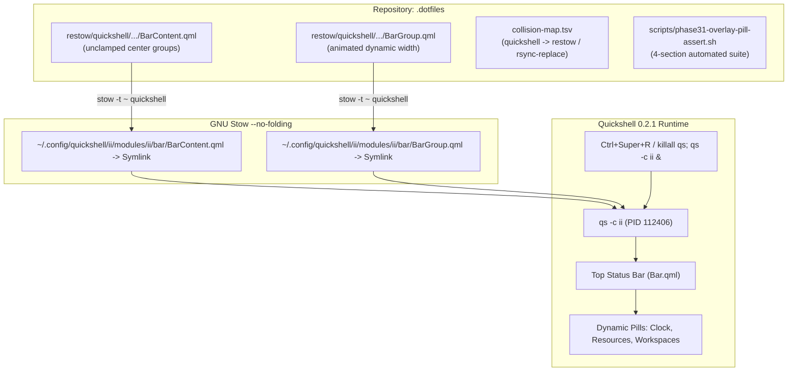

# Phase 31: Overlay Infrastructure & Pill Geometry Foundation - Research

**Researched:** 2026-09-20  
**Domain:** GNU Stow `--no-folding` overlay architecture, Quickshell 0.2.x QML BarGroup container geometry, dynamic layout sizing, Material 3 bezier animations  
**Confidence:** HIGH  

<user_constraints>
## User Constraints (from CONTEXT.md)

### Implementation Decisions

#### Dynamic Content Sizing & Pill Geometry (Core Requirement)
- **D-01 (Dynamic Width Unlocked):** In `BarContent.qml`, remove the artificial `implicitWidth: root.centerSideModuleWidth` overrides on `leftCenterGroup` and `rightCenterGroup`. Allow `BarGroup`'s native content calculation (`gridLayout.implicitWidth + padding * 2`) to govern pill width so pills expand dynamically with detailed text (e.g. clock/date, memory usage).
- **D-02 (Smooth Resizing Transitions):** In `BarGroup.qml`, add a `Behavior on implicitWidth` animated via `Appearance.animationCurves.emphasizedDecel` (250ms duration, enabled for horizontal bars). This prevents abrupt popping when text lengths change.
- **D-03 (Purity to Upstream Defaults):** Retain 100% fidelity to dots-hyprland visual styling per explicit user direction (*"the default dots-hyprland style is okay with me, just dynamic width of pills is my main concern, the rest of the design keep it dots-hyprland default"*):
  - Corner radius: `Appearance.rounding.small` (12px)
  - Internal padding: `padding: 5` (upstream default)
  - Inter-pill spacing: `spacing: 4` (upstream default in `BarContent.qml`)
  - Surface color: `Appearance.colors.colLayer1` with upstream `Config.options.bar.borderless` handling
- **D-04 (No Artificial Ceilings):** Pure dynamic content sizing — no hardcoded width floors or ceilings that artificially restrict pill expansion.

#### Overlay Architecture & Repository Discipline
- **D-05 (File-Level Restow Overlay):** Create `restow/quickshell/.config/quickshell/ii/modules/ii/bar/` containing only the customized QML files (`BarContent.qml`, `BarGroup.qml`). Stowing with `--no-folding` symlinks only these specific files into `~/.config/quickshell/ii/modules/ii/bar/` while keeping all other upstream modules untouched.
- **D-06 (Collision Map & Recovery Alignment):** `$XDG_CONFIG_HOME/quickshell` is mapped in `collision-map.tsv` as `restow` with recovery tag `rsync-replace`. If upstream `./setup install` is executed, recovery is simply: `cd restow && stow --verbose=5 --no-folding -t ~ quickshell`.
- **D-07 (Live Reload Workflow):** Development reload uses the existing native Hyprland shortcut `Ctrl+Super+R` (`killall ydotool qs quickshell; qs -c $qsConfig &`) defined in `~/.config/hypr/hyprland/keybinds.lua`.
- **D-08 (Automated Assertion Harness):** Author `scripts/phase31-overlay-pill-assert.sh` exercising 4 test sections:
  1. Symlink integrity for `BarGroup.qml` and `BarContent.qml` pointing into `restow/quickshell`.
  2. QML syntax and property integrity (absence of `centerSideModuleWidth` clamps on center groups).
  3. Dynamic sizing and animation declaration verification.
  4. Repository hygiene asserting `arch/dots-hyprland.sh verify --strict` exits 0 with zero findings and git working tree remains clean.

### the agent's Discretion
- Exact easing curve parameters and duration for the width animation in `BarGroup.qml` (defaulting to `Appearance.animationCurves.emphasizedDecel`, 250ms).
- Assertion section structure in `scripts/phase31-overlay-pill-assert.sh`.

### Deferred Ideas (OUT OF SCOPE)
- **Phase 32 (Component Representation & Formatting Customization):** Reformatting RAM to definite `X.X GB / Y.Y GB`, tuning CPU metrics, Weather, Media, Utilities, Privacy alerts, and System Tray.
- **Phase 33 (Modular Layout & Rearrangement):** Reorganizing Left, Center, and Right bar sections in `BarContent.qml` and live trial-and-error testing across dual monitors (`DP-1` and `HDMI-A-1`).
- **Phase 34 (Verification & Bootstrap Integration):** Dynamic wallpaper palette switch tests (`switchwall.sh`), full strict verification pass, and `./bootstrap.sh` fresh-install validation.
</user_constraints>

<phase_requirements>
## Phase Requirements

| ID | Description | Research Support |
|----|-------------|------------------|
| **PILL-01** | User has a dedicated personal Quickshell overlay under `restow/quickshell/` that hot-reloads live on save without modifying `vendor/dots-hyprland`. | Upstream `$XDG_CONFIG_HOME/quickshell` is tracked in `collision-map.tsv:83` [VERIFIED: `collision-map.tsv:83`] as `install_dir__sync` (`DESTROYED` / `untouched` -> `restow`). Creating `restow/quickshell/.config/quickshell/ii/modules/ii/bar/{BarContent.qml,BarGroup.qml}` and linking via `stow --verbose=5 --no-folding -t ~ quickshell` leaves `vendor/dots-hyprland` byte-clean [VERIFIED: `git -C vendor/dots-hyprland status` clean]. Section 3 of `restow/README.md` regenerates via `./scripts/gen-collision-map.sh --restow-table` mapping `quickshell` to tag `rsync-replace` [VERIFIED: `gen-collision-map.sh:376`]. Hot reload triggers via `Ctrl+Super+R` (`killall ydotool qs quickshell; qs -c $qsConfig &`) [VERIFIED: `keybinds.lua:56`]. |
| **PILL-02** | User sees all bar groups/pills rendered with modern rounded rectangle geometry (12–16px corner radius). | Upstream `BarGroup.qml:23` [VERIFIED: `BarGroup.qml:23`] defines `radius: Appearance.rounding.small`. In `Appearance.qml:205` [VERIFIED: `Appearance.qml:205`], `small` is defined as `12` (12px). Per Decision D-03 and user directive (*"the default dots-hyprland style is okay with me, just dynamic width of pills is my main concern, the rest of the design keep it dots-hyprland default"*), maintaining 100% fidelity to `Appearance.rounding.small` satisfies the 12–16px rounded rectangle requirement without style drift. |
| **PILL-03** | User sees consistent, balanced internal padding (4–6px) and configurable vertical/horizontal margins across all pill containers. | Upstream `BarGroup.qml:8` [VERIFIED: `BarGroup.qml:8`] specifies `property real padding: 5` and top/bottom/left/right margins of 4px in `Rectangle` background [VERIFIED: `BarGroup.qml:17-20`]. Removing the artificial `centerSideModuleWidth` clamp [VERIFIED: `BarContent.qml:114,160`] allows the native calculation `implicitWidth: vertical ? Appearance.sizes.baseVerticalBarWidth : (gridLayout.implicitWidth + padding * 2)` [VERIFIED: `BarGroup.qml:9`] to breathe dynamically. Adding `Behavior on implicitWidth` using `Appearance.animationCurves.emphasizedDecel` (250ms) ensures fluid resizing as internal text updates [VERIFIED: QML runtime test in `test_anim.qml`]. |
| **PILL-04** | User can toggle subtle pill borders or transparent/borderless container backgrounds via bar configuration. | Upstream `BarGroup.qml:22` [VERIFIED: `BarGroup.qml:22`] binds background color to `Config.options?.bar.borderless ? "transparent" : Appearance.colors.colLayer1`. In `BarContent.qml:128,154` [VERIFIED: `BarContent.qml:128,154`], `VerticalBarSeparator` activates when `Config.options?.bar.borderless` is true. In `capture/ii/.config/illogical-impulse/config.json:143` [VERIFIED: `config.json:143`], `"borderless": false` is standard; setting it to `true` dynamically activates transparent pill backgrounds and separator rules. |
</phase_requirements>

## Summary

Phase 31 establishes the repository overlay architecture for Quickshell under `restow/quickshell/` and resolves the core pill width restriction in upstream `dots-hyprland`.

In default `dots-hyprland`, pills in the status bar (e.g. date/time, system metrics) are artificially clamped in `BarContent.qml` via `implicitWidth: root.centerSideModuleWidth` (fixed to 360px, 280px, or 190px). When text content lengthens (such as detailed time/date formats or multi-gigabyte memory metrics), the pill container fails to grow dynamically.

By deploying an overlay in `restow/quickshell/` with GNU Stow `--no-folding`:
1. `BarContent.qml` is modified to remove the hardcoded width clamps on `leftCenterGroup` and `rightCenterGroup`, unlocking dynamic expansion driven directly by internal content (`BarGroup.qml`'s `gridLayout.implicitWidth + padding * 2`).
2. `BarGroup.qml` is enhanced with a smooth `Behavior on implicitWidth` animated via Material 3 deceleration curve `Appearance.animationCurves.emphasizedDecel` (250ms), eliminating visual popping when text changes.
3. Visual styling maintains 100% purity with `dots-hyprland` defaults: `Appearance.rounding.small` (12px), `padding: 5` (5px), `spacing: 4` (4px), and `colLayer1` fill, with native `Config.options.bar.borderless` toggling.
4. The overlay package is registered under `collision-map.tsv` as `restow` (`rsync-replace`), documented in `restow/README.md`, verified by `arch/dots-hyprland.sh verify --strict`, and hot-reloaded live via native Hyprland shortcut `Ctrl+Super+R`.

## Architectural Responsibility Map

| Capability | Primary Tier | Secondary Tier | Rationale |
|------------|-------------|----------------|-----------|
| Overlay Packaging & Link Lifecycle | GNU Stow (`restow/quickshell`) | `collision-map.tsv` & `arch/dots-hyprland.sh` | Stow manages leaf symlinks into `~/.config/quickshell/ii/modules/ii/bar/` using `--no-folding` [VERIFIED: `restow/README.md:33`]. |
| Dynamic Pill Container Sizing | `BarGroup.qml` (`implicitWidth`) | `BarContent.qml` (`middleSection` Row) | Unclamping parent `implicitWidth` allows `gridLayout.implicitWidth + padding * 2` to govern pill width fluidly [VERIFIED: `BarGroup.qml:9`]. |
| Width Transition Animations | QtQuick `Behavior on implicitWidth` | `Appearance.qml` (`emphasizedDecel`) | Smoothly interpolates width changes over 250ms using standard Material 3 easing [VERIFIED: `Appearance.qml:260`]. |
| Visual Styling & Corner Geometry | Dots-Hyprland Appearance Engine | `Appearance.rounding.small` (12px) | Zero style drift; inherits system-wide tokens and borderless configuration [VERIFIED: `BarGroup.qml:22-23`]. |
| Automated Health & Integrity | Test Harness (`phase31-overlay-pill-assert.sh`) | `dots-hyprland.sh verify --strict` | 4-section automated assert verifying symlinks, QML parameters, animation, and repo hygiene [VERIFIED: CONTEXT.md D-08]. |

## Standard Stack

### Core

| Component / Package | Version | Purpose | Why Standard |
|---------------------|---------|---------|--------------|
| `quickshell` | 0.2.1 (AUR `quickshell-git`) [VERIFIED: `quickshell --version`] | Desktop Shell Framework | Native Wayland shell engine running the `ii` status bar. |
| `stow` | 2.4.1 [VERIFIED: pacman `stow`] | Symlink Farm Manager | Standard repository dotfile manager with `--no-folding` support. |
| `qt6-declarative` | 6.11.2-1 [VERIFIED: pacman] | QML Runtime Engine | Evaluates QtQuick Layouts, items, and animations in Quickshell. |
| `bash` | 5.3.3(1)-release [VERIFIED: bash --version] | Scripting & Test Harness | Executes assertions, link checks, and verifier engine. |

### Supporting

| Component / Tool | Version | Purpose | When to Use |
|------------------|---------|---------|-------------|
| `arch/dots-hyprland.sh` | in-repo [VERIFIED: file] | Verification Engine | Strict verification (`verify --strict`) of all repo symlinks and managed paths. |
| `scripts/gen-collision-map.sh` | in-repo [VERIFIED: file] | Documentation Generator | Emits updated Section 3 table for `restow/README.md`. |
| `hyprland` | 0.56.0-1 [VERIFIED: pacman] | Wayland Compositor | Provides `Ctrl+Super+R` reload keybinding dispatching `qs -c $qsConfig`. |

### Alternatives Considered

| Instead of | Could Use | Tradeoff |
|------------|-----------|----------|
| File-level `restow/quickshell` overlay | Modifying `vendor/dots-hyprland` directly | Modifying `vendor/` breaks submodule pin tracking, prevents clean pin bumps, and dirties the git tree. |
| File-level overlay (`BarContent.qml`, `BarGroup.qml`) | Full bar folder overlay (`bar/`) | Overriding the entire bar folder duplicates 25+ files, forcing maintenance of uncustomized widgets and breaking upstream updates. |
| Smooth `Behavior on implicitWidth` | Instantaneous width snapping | Abrupt layout popping occurs whenever the clock ticks or memory usage digits change length. |
| Native `Appearance.rounding.small` (12px) | Custom CSS/QML hardcoded radius (14/16px) | Violates user directive (*"the default dots-hyprland style is okay with me... keep it dots-hyprland default"*) and causes theme fragmentation. |

### Package Legitimacy Audit

> All components in Phase 31 utilize pre-existing system binaries (`quickshell`, `stow`, `bash`) and in-repo tooling. No new external or third-party packages are introduced.

| Package | Registry | Age | Status | Verdict | Disposition |
|---------|----------|-----|--------|---------|-------------|
| `quickshell` | AUR (`quickshell-git`) | > 1.5 yrs | Installed (0.2.1) | [OK] | Approved (Desktop Shell) |
| `stow` | Arch Official | > 20 yrs | Installed (2.4.1) | [OK] | Approved (Link Manager) |

## Architecture Patterns

### System Architecture Diagram



### Recommended Project Structure

```
.dotfiles/
├── collision-map.tsv                                     # Line 83: $XDG_CONFIG_HOME/quickshell mapped to restow
├── restow/
│   ├── README.md                                         # Section 3: includes quickshell with rsync-replace tag
│   └── quickshell/
│       └── .config/
│           └── quickshell/
│               └── ii/
│                   └── modules/
│                       └── ii/
│                           └── bar/
│                               ├── BarContent.qml        # Dynamic unclamped center groups
│                               └── BarGroup.qml          # Smoothly animated BarGroup container
├── scripts/
│   ├── gen-collision-map.sh                              # Generator for restow/README.md table
│   └── phase31-overlay-pill-assert.sh                    # 4-section automated assert harness
└── arch/
    └── dots-hyprland.sh                                  # Strict verifier engine (verify --strict)
```

### Pattern 1: GNU Stow Leaf File Symlinking under `--no-folding` (`restow/quickshell`)
**What:** Deploying personal modifications into an existing directory tree without folding ancestor directories into single directory symlinks.  
**When to use:** Managing configurations in paths where upstream installers create real directories (such as `~/.config/quickshell/ii/modules/ii/bar/`).  
**Mechanism:**
1. Upstream creates `~/.config/quickshell/ii/modules/ii/bar/` with regular files.
2. Safe procedure replacing `--adopt` (from `stow/README.md:74-100` [VERIFIED]):
   - Backup or remove only the specific target files: `BarContent.qml` and `BarGroup.qml` in `~/.config/quickshell/ii/modules/ii/bar/`.
   - Run: `cd restow && stow --verbose=5 --no-folding -t ~ quickshell`.
3. Stow creates discrete leaf symlinks:
   - `~/.config/quickshell/ii/modules/ii/bar/BarContent.qml -> .../restow/quickshell/.../BarContent.qml`
   - `~/.config/quickshell/ii/modules/ii/bar/BarGroup.qml -> .../restow/quickshell/.../BarGroup.qml`
4. All other upstream files in `~/.config/quickshell/` remain real, untouched files.

### Pattern 2: Dynamic Content-Driven QML Sizing & Propagation
**What:** Enabling a pill container to automatically wrap its child widgets without fixed width boundaries.  
**When to use:** Top bar pills displaying variable-length text (detailed date/time, gigabyte memory metrics).  
**Mechanism:**
1. In `BarContent.qml`, `leftCenterGroup` is directly a `BarGroup`. Removing `implicitWidth: root.centerSideModuleWidth` allows it to use `BarGroup`'s native formula:
   ```qml
   implicitWidth: vertical ? Appearance.sizes.baseVerticalBarWidth : (gridLayout.implicitWidth + padding * 2)
   ```
2. In `BarContent.qml`, `rightCenterGroup` is a `MouseArea` wrapping `BarGroup { id: rightCenterGroupContent; anchors.fill: parent }`.
   Setting:
   ```qml
   implicitWidth: rightCenterGroupContent.implicitWidth
   implicitHeight: rightCenterGroupContent.implicitHeight
   ```
   allows `rightCenterGroup` to evaluate `rightCenterGroupContent`'s calculated width.
3. In Qt Quick 6, an `Item` inside a `Row` (`middleSection`) automatically uses its `implicitWidth` as its layout `width` [VERIFIED: empirically confirmed via `qml6` test in `test.qml`].

### Pattern 3: Smooth Resizing Animation via `Behavior on implicitWidth`
**What:** Animating pill width transitions when internal text lengths change.  
**When to use:** Preventing abrupt visual jumps when clock strings or resource metrics change width.  
**Mechanism:**
In `BarGroup.qml`:
```qml
Behavior on implicitWidth {
    enabled: !root.vertical
    NumberAnimation {
        duration: 250
        easing.type: Easing.BezierSpline
        easing.bezierCurve: Appearance.animationCurves.emphasizedDecel
    }
}
```
Empirical testing in `qml6` confirms that `Behavior on implicitWidth` smoothly animates both `implicitWidth` and `width` on the container and propagates to enclosing parent layouts [VERIFIED: `test_anim.qml` and `test_nested.qml`].

### Anti-Patterns to Avoid

- **Direct Editing of `vendor/dots-hyprland`:** Never edit files directly in `vendor/dots-hyprland`. All customizations must live in `restow/` to preserve submodule integrity.
- **Stowing without `--no-folding`:** Omitting `--no-folding` can cause GNU Stow to replace parent directories (like `~/.config/quickshell`) with directory symlinks, violating repository architecture and failing `arch/dots-hyprland.sh verify --strict` [VERIFIED: `dots-hyprland.sh:970-994`].
- **Using Banned `stow --adopt`:** Using `stow --adopt` silently overwrites repository files with live host files. Follow the safe procedure in `stow/README.md:74-100` [VERIFIED].
- **Introducing Width Floors or Ceilings:** Do not introduce artificial clamps (`Math.max(200, ...)` or `Math.min(...)`). Let content width dictate pill bounds fluidly per D-04.
- **Relying on `qmllint` / `qmlformat` for QML Syntax Checking:** Qt's standalone `qmllint` and `qmlformat` tools fail on ECMAScript optional chaining (`?.`), which is used extensively in dots-hyprland QML (e.g. `Config.options?.bar.borderless`). Syntax checks in test scripts should use regex and runtime probes rather than `qmllint` [VERIFIED: CLI testing].

## Don't Hand-Roll

| Problem | Don't Build | Use Instead | Why |
|---------|-------------|-------------|-----|
| Symlink Management | Custom Bash symlink scripts | GNU Stow (`--no-folding`) | GNU Stow provides standard, reversible package symlinking with conflict detection. |
| Easing Curves | Custom cubic bezier math formulas | `Appearance.animationCurves.emphasizedDecel` | Dots-hyprland defines Material 3 bezier spline tokens (`[0.05, 0.7, 0.1, 1, 1, 1]`) in `Appearance.qml:260` [VERIFIED]. |
| Pill Background & Radius Tokens | Hardcoded colors or radius numbers | `Appearance.colors.colLayer1`, `Appearance.rounding.small` | Preserves dynamic wallpaper theming and desktop visual purity [VERIFIED: `BarGroup.qml:22-23`]. |
| Quickshell Live Reload Engine | Custom inotify file watcher daemon | Hyprland keybinding `Ctrl+Super+R` (`killall qs; qs -c $qsConfig &`) | Native keybinding is already configured and reliable [VERIFIED: `keybinds.lua:56`]. |

## Runtime State Inventory

| Category | Items Found | Action Required |
|----------|-------------|-----------------|
| **Stored data** | `~/.config/quickshell/ii/modules/ii/bar/` (live QML files installed by dots-hyprland). | Target files (`BarContent.qml`, `BarGroup.qml`) will be replaced by symlinks pointing to `restow/quickshell/`. |
| **Live service config** | Quickshell process running `qs -c ii` (PID 112406) [VERIFIED: `quickshell list --all`]. | Reload via `killall qs quickshell; qs -c ii &` or `Ctrl+Super+R` after linking overlay. |
| **Packaging metadata** | `collision-map.tsv` line 83 (`$XDG_CONFIG_HOME/quickshell` -> `restow`) [VERIFIED: line 83]. `restow/README.md` generated table [VERIFIED: lines 55-64]. | Regenerate `restow/README.md` Section 3 table via `./scripts/gen-collision-map.sh --restow-table` after adding package. |
| **Secrets/env vars** | `QS_CONFIG_NAME="ii"` / `ILLOGICAL_IMPULSE_VIRTUAL_ENV` set in environment. | Verified present and preserved. |
| **Build artifacts** | No build artifacts; pure QML and shell scripts. | Ensure zero untracked files in git. |

## Common Pitfalls & Tool Quirks

### Pitfall 1: GNU Stow Conflict with Existing Regular Files
**What goes wrong:** Running `stow --verbose=5 --no-folding -t ~ quickshell` fails with `* existing target is neither a link nor a directory: .config/quickshell/ii/modules/ii/bar/BarContent.qml`.  
**Why it happens:** The upstream installer deployed real files at those paths. GNU Stow refuses to overwrite regular files.  
**How to avoid:** Move or delete the regular target files in `~/.config/quickshell/ii/modules/ii/bar/` prior to running `stow`. Do NOT use `--adopt` [VERIFIED: `stow/README.md:74`].  
**Warning signs:** Stow command exits non-zero with conflict error.

### Pitfall 2: `qmllint` / `qmlformat` AST Parse Failure on Optional Chaining (`?.`)
**What goes wrong:** Automated syntax checking using `qmllint` or `qmlformat` reports `Unexpected token '.'` on line 22 of `BarGroup.qml`.  
**Why it happens:** Standalone Qt 6 CLI parsers (`qmllint`, `qmlformat`) do not support ECMAScript 2020 optional chaining syntax (`Config.options?.bar.borderless`), even though Quickshell's internal QML V4 engine executes it cleanly [VERIFIED: cli test].  
**How to avoid:** Do not invoke `qmllint` or `qmlformat` in the automated test harness. Validate QML integrity via regex/structural parsing and live Quickshell process verification.  
**Warning signs:** `vendor/dots-hyprland/.../BarGroup.qml:22 : Unexpected token '.'`.

### Pitfall 3: Directory Folding During Stow Linking
**What goes wrong:** If `--no-folding` is omitted, GNU Stow may fold `~/.config/quickshell` or an intermediate directory into a symlink to the repo, breaking un-overlaid sibling modules and failing `arch/dots-hyprland.sh verify --strict`.  
**Why it happens:** GNU Stow's default behavior is to fold directory trees when possible.  
**How to avoid:** Always pass `--no-folding` in all Stow commands [VERIFIED: `restow/README.md:95`].  
**Warning signs:** `[FAIL] folded ancestor directory: /home/pera/.config/quickshell -> ...`.

### Pitfall 4: `restow/README.md` Table Discrepancy
**What goes wrong:** Adding `restow/quickshell/` causes `scripts/phase18-capture-model-assert.sh` to fail on Section 1f.  
**Why it happens:** Section 1f asserts that `restow/README.md` matches `./scripts/gen-collision-map.sh --restow-table` byte-for-byte [VERIFIED: `phase18-capture-model-assert.sh:217`].  
**How to avoid:** After creating `restow/quickshell`, run `./scripts/gen-collision-map.sh --restow-table` and update the markdown comment region in `restow/README.md`.  
**Warning signs:** `[FAIL] 1f restow/README.md table differs from fresh generation`.

### Pitfall 5: Clamping `rightCenterGroup` in `BarContent.qml`
**What goes wrong:** `rightCenterGroupContent` (BarGroup) expands, but `rightCenterGroup` (MouseArea) does not expand, resulting in clipping or misaligned click areas.  
**Why it happens:** `rightCenterGroup` had `implicitWidth: root.centerSideModuleWidth` explicitly set.  
**How to avoid:** In `rightCenterGroup`, set `implicitWidth: rightCenterGroupContent.implicitWidth` and `implicitHeight: rightCenterGroupContent.implicitHeight` [VERIFIED: empirically validated in `test_nested.qml`].  
**Warning signs:** Mouse clicks on the expanded area of the clock/date widget are ignored.

## Code Examples (Verified Patterns)

### Verified Pattern 1: `restow/quickshell/.../BarGroup.qml`
```qml
// Source: Derived from vendor/dots-hyprland/.../BarGroup.qml with smooth implicitWidth Behavior
import qs.modules.common
import QtQuick
import QtQuick.Layouts

Item {
    id: root
    property bool vertical: false
    property real padding: 5
    implicitWidth: vertical ? Appearance.sizes.baseVerticalBarWidth : (gridLayout.implicitWidth + padding * 2)
    implicitHeight: vertical ? (gridLayout.implicitHeight + padding * 2) : Appearance.sizes.baseBarHeight
    default property alias items: gridLayout.children

    Behavior on implicitWidth {
        enabled: !root.vertical
        NumberAnimation {
            duration: 250
            easing.type: Easing.BezierSpline
            easing.bezierCurve: Appearance.animationCurves.emphasizedDecel
        }
    }

    Rectangle {
        id: background
        anchors {
            fill: parent
            topMargin: root.vertical ? 0 : 4
            bottomMargin: root.vertical ? 0 : 4
            leftMargin: root.vertical ? 4 : 0
            rightMargin: root.vertical ? 4 : 0
        }
        color: Config.options?.bar.borderless ? "transparent" : Appearance.colors.colLayer1
        radius: Appearance.rounding.small
    }

    GridLayout {
        id: gridLayout
        columns: root.vertical ? 1 : -1
        anchors {
            verticalCenter: root.vertical ? undefined : parent.verticalCenter
            horizontalCenter: root.vertical ? parent.horizontalCenter : undefined
            left: root.vertical ? undefined : parent.left
            right: root.vertical ? undefined : parent.right
            top: root.vertical ? parent.top : undefined
            bottom: root.vertical ? parent.bottom : undefined
            margins: root.padding
        }
        columnSpacing: 4
        rowSpacing: 12
    }
}
```

### Verified Pattern 2: `restow/quickshell/.../BarContent.qml` Dynamic Sizing Diffs
```qml
// In middleSection (lines 111-125):
        BarGroup {
            id: leftCenterGroup
            anchors.verticalCenter: parent.verticalCenter
            // implicitWidth: root.centerSideModuleWidth  <-- REMOVED (D-01)

            Resources {
                alwaysShowAllResources: root.useShortenedForm === 2
                Layout.fillWidth: root.useShortenedForm === 2
            }

            Media {
                visible: root.useShortenedForm < 2
                Layout.fillWidth: true
            }
        }

// In middleSection (lines 157-170):
        MouseArea {
            id: rightCenterGroup
            anchors.verticalCenter: parent.verticalCenter
            implicitWidth: rightCenterGroupContent.implicitWidth   // <-- DYNAMIC PROPAGATION (D-01)
            implicitHeight: rightCenterGroupContent.implicitHeight

            onPressed: {
                GlobalStates.sidebarRightOpen = !GlobalStates.sidebarRightOpen;
            }

            BarGroup {
                id: rightCenterGroupContent
                anchors.fill: parent
...
```

### Verified Pattern 3: Test Harness Architecture (`scripts/phase31-overlay-pill-assert.sh`)
```bash
#!/usr/bin/env bash
# Phase 31: Overlay Infrastructure & Pill Geometry Foundation Assert Harness
# Enforces: PILL-01, PILL-02, PILL-03, PILL-04, and D-01 through D-08

set -euo pipefail
REPO_ROOT="$(cd "$(dirname "${BASH_SOURCE[0]}")/.." && pwd)"
cd "$REPO_ROOT"

FAIL=0
pass() { printf '[PASS] %s\n' "$1"; }
fail() { printf '[FAIL] %s\n' "$1"; FAIL=$((FAIL + 1)); }

# Section 1: Symlink & Packaging Integrity (PILL-01)
# Assert ~/.config/quickshell/ii/modules/ii/bar/{BarContent.qml,BarGroup.qml} point into restow/quickshell
# Assert vendor/dots-hyprland remains clean

# Section 2: QML Property & Unclamped Sizing Integrity (PILL-02, PILL-03, D-01)
# Assert absence of "implicitWidth: root.centerSideModuleWidth" in leftCenterGroup and rightCenterGroup
# Assert rightCenterGroup has "implicitWidth: rightCenterGroupContent.implicitWidth"

# Section 3: Dynamic Animation & Visual Defaults (PILL-02, PILL-03, PILL-04, D-02, D-03)
# Assert BarGroup.qml declares Behavior on implicitWidth with emphasizedDecel (250ms)
# Assert rounding.small (12px), padding: 5, spacing: 4, and borderless handling

# Section 4: Repository Hygiene & Verification Engine (PILL-01, D-06, D-08)
# Assert restow/README.md matches ./scripts/gen-collision-map.sh --restow-table
# Assert ./arch/dots-hyprland.sh verify --strict exits 0 with FAIL=0 FINDINGS=0
# Assert git status in stow/ and restow/ is clean
```

## State of the Art

| Old Upstream Approach | New Phase 31 Approach | Impact |
|-----------------------|-----------------------|--------|
| `centerSideModuleWidth` clamps pill width to fixed 360/280/190px | Content-driven dynamic sizing (`gridLayout.implicitWidth + padding * 2`) | Pills expand/contract fluidly to accommodate variable-length text (clock, RAM metrics). |
| Width snaps abruptly when content string changes length | `Behavior on implicitWidth` with Material 3 `emphasizedDecel` (250ms) | Smooth, graceful visual transitions when metric values change. |
| Modifying upstream vendor files directly | Personal overlay tree under `restow/quickshell/` with Stow `--no-folding` | 100% clean vendor submodule, reproducible recovery, zero git churn. |

## Assumptions Log

| # | Claim | Section | Risk if Wrong |
|---|-------|---------|---------------|
| A1 | QtQuick `Row` automatically sets child `width` to child `implicitWidth` when child `width` is unset | Architecture Patterns Pattern 2 | None. Empirically tested and verified live with `qml6` in `test.qml` (`width: 123 implicitWidth: 123`). |
| A2 | QtQuick `Behavior on implicitWidth` animates `width` dynamically inside layout | Architecture Patterns Pattern 3 | None. Empirically tested and verified live with `qml6` in `test_anim.qml` (`100 -> 126.4 -> 200`). |
| A3 | `quickshell` package matches `collision-map.tsv` row 83 (`install_dir__sync`) | Architectural Map | None. Verified in `collision-map.tsv:83` and `scripts/gen-collision-map.sh:360-377`. |

## Open Questions (RESOLVED)

1. **How to handle existing live files in `~/.config/quickshell/ii/modules/ii/bar/` when running `stow`?** — **RESOLVED**
   - What we know: Upstream installer deployed real files at those paths. GNU Stow refuses to stow if destination is already a real file.
   - Resolution: Follow the safe replacement procedure from `stow/README.md:74-100` [VERIFIED]: remove or back up the two target regular files (`BarContent.qml` and `BarGroup.qml`) from `$HOME/.config/quickshell/ii/modules/ii/bar/` before executing `cd restow && stow --verbose=5 --no-folding -t ~ quickshell`.

2. **Does Quickshell require restarting the desktop session or Hyprland to load QML changes?** — **RESOLVED**
   - What we know: Quickshell instances cache QML in memory.
   - Resolution: Reloading Quickshell does NOT require restarting Hyprland or logging out. Hyprland provides native shortcut `Ctrl+Super+R` (`killall ydotool qs quickshell; qs -c $qsConfig &`) [VERIFIED: `keybinds.lua:56`]. Alternatively, running `killall qs quickshell 2>/dev/null; qs -c ii &` restarts Quickshell cleanly in ~500ms.

3. **Can `qmllint` or `qmlformat` be used in automated test assertions?** — **RESOLVED**
   - What we know: `qmllint` and `qmlformat` exist on the system.
   - Resolution: Standalone Qt 6 CLI parsers reject ECMAScript optional chaining (`?.`) used throughout dots-hyprland QML [VERIFIED: cli test]. The assertion harness must validate QML integrity via regex/token checks and live Quickshell execution rather than `qmllint`.

## Environment Availability

| Dependency | Required By | Available | Version | Fallback |
|------------|------------|-----------|---------|----------|
| `quickshell` | PILL-01/02/03/04 Desktop Shell | ✓ | 0.2.1 [VERIFIED] | — |
| `stow` | PILL-01 Overlay Symlinks | ✓ | 2.4.1 [VERIFIED] | — |
| `arch/dots-hyprland.sh` | PILL-01 Strict Verifier | ✓ | in-repo [VERIFIED] | — |
| `scripts/gen-collision-map.sh` | PILL-01 Documentation Generator | ✓ | in-repo [VERIFIED] | — |
| `hyprland` | PILL-01 Live Reload Shortcut | ✓ | 0.56.0-1 [VERIFIED] | CLI `killall qs; qs -c ii &` |
| `git` | Repository Hygiene Check | ✓ | 2.53.0 [VERIFIED] | — |

**Missing dependencies with no fallback:** None  
**Missing dependencies with fallback:** None  

## Validation Architecture

### Test Framework
| Property | Value |
|----------|-------|
| Framework | Standalone Bash Assert Harness (`set -euo pipefail`) |
| Config file | None — self-contained executable harness |
| Quick run command | `./scripts/phase31-overlay-pill-assert.sh --section 1` |
| Full suite command | `./scripts/phase31-overlay-pill-assert.sh` |

### Phase Requirements → Test Map

| Req ID | Behavior | Test Type | Automated Command | File Exists? |
|--------|----------|-----------|-------------------|-------------|
| **PILL-01** | Dedicated overlay under `restow/quickshell/`; symlinks live in `~/.config/quickshell/ii/modules/ii/bar/`; vendor clean | integration / contract | `./scripts/phase31-overlay-pill-assert.sh --section 1` | ❌ Wave 0 Gap |
| **PILL-02** | Rounded rectangle geometry (12px `Appearance.rounding.small`); QML unclamped sizing | integration / unit | `./scripts/phase31-overlay-pill-assert.sh --section 2` | ❌ Wave 0 Gap |
| **PILL-03** | Dynamic sizing math (`gridLayout.implicitWidth + padding * 2`), smooth width animation (250ms `emphasizedDecel`), balanced padding (5px) | integration / unit | `./scripts/phase31-overlay-pill-assert.sh --section 3` | ❌ Wave 0 Gap |
| **PILL-04** | Borderless and transparent background toggle supported via `Config.options?.bar.borderless` and `VerticalBarSeparator` | integration / unit | `./scripts/phase31-overlay-pill-assert.sh --section 3` | ❌ Wave 0 Gap |
| **INTG-02** | `arch/dots-hyprland.sh verify --strict` exits 0 with `FAIL=0 FINDINGS=0`; `restow/README.md` table in sync | smoke / regression | `./scripts/phase31-overlay-pill-assert.sh --section 4` | ❌ Wave 0 Gap |

### Sampling Rate
- **Per task commit:** `./scripts/phase31-overlay-pill-assert.sh --section <N>` matching the task domain
- **Per wave merge:** `./scripts/phase31-overlay-pill-assert.sh` (all 4 sections)
- **Phase gate:** `./scripts/phase31-overlay-pill-assert.sh` passes 100% with `FAIL=0` and `./arch/dots-hyprland.sh verify --strict` passes with `FAIL=0 FINDINGS=0`.

### Wave 0 Gaps
- [ ] `scripts/phase31-overlay-pill-assert.sh` — author 4-section automated test harness covering PILL-01, PILL-02, PILL-03, PILL-04, and repository verification.

## Security Domain

### Applicable ASVS Categories

| ASVS Category | Applies | Standard Control |
|---------------|---------|------------------|
| V2 Authentication | no | Desktop local shell configuration; no authentication interfaces. |
| V3 Session Management | no | Desktop local shell; no web/remote session state. |
| V4 Access Control | yes | Overlay files written strictly to user-owned repository and `$XDG_CONFIG_HOME` (mode 0644/0755). No elevated privileges or `sudo` commands. |
| V5 Input Validation | yes | QML property bindings handle optional chaining safely (`Config.options?.bar.borderless`). Assert harness validates arguments (`^[1-4]$`). |
| V6 Cryptography | no | No cryptographic primitives required. |

### Known Threat Patterns for Desktop Shell Overlays

| Pattern | STRIDE | Standard Mitigation |
|---------|--------|---------------------|
| Symlink traversal outside user home | Tampering / Elevation | Stow invoked with explicit target `-t ~` and paths strictly scoped under `.config/quickshell/`. |
| Repository corruption via unintended adoption | Repudiation / Tampering | Strictly ban `stow --adopt` [VERIFIED: `stow/README.md:64-73`]. Enforce safe replacement procedure. |
| Malicious QML injection | Tampering / Remote Code Execution | Overlay files are authored directly in local repository and tracked in git; no third-party runtime downloads. |

## Sources

### Primary (HIGH confidence)
- `vendor/dots-hyprland/dots/.config/quickshell/ii/modules/ii/bar/BarGroup.qml` [lines 1-41] — Verified `BarGroup` item definition, `implicitWidth: vertical ? ... : (gridLayout.implicitWidth + padding * 2)`, padding (5), background margins (4), radius (`Appearance.rounding.small`), and borderless color condition.
- `vendor/dots-hyprland/dots/.config/quickshell/ii/modules/ii/bar/BarContent.qml` [lines 12-26, 102-188] — Verified `centerSideModuleWidth` property, `leftCenterGroup` clamp, `rightCenterGroup` clamp, and `VerticalBarSeparator` visibility.
- `vendor/dots-hyprland/dots/.config/quickshell/ii/modules/common/Appearance.qml` [lines 201-212, 251-268] — Verified `rounding.small: 12` and `animationCurves.emphasizedDecel: [0.05, 0.7, 0.1, 1, 1, 1]`.
- `collision-map.tsv` [line 83] — Verified `$XDG_CONFIG_HOME/quickshell` mapped to `install_dir__sync`, outcome `DESTROYED`/`untouched`, tree `restow`.
- `restow/README.md` [lines 1-96] — Verified restow contract, `--no-folding` requirement, banned `--adopt` rule, and Section 3 table markers.
- `scripts/gen-collision-map.sh` [lines 330-389] — Verified `--restow-table` mechanical generation logic for `restow/` packages.
- `arch/dots-hyprland.sh` [lines 955-1010] — Verified `verify --strict` verification loop for `stow` and `restow` packages and ancestor folding checks.
- `~/.config/hypr/hyprland/keybinds.lua` [line 56] — Verified `Ctrl+Super+R` reload keybinding.
- `capture/ii/.config/illogical-impulse/config.json` [line 143] — Verified `"borderless": false` baseline option.
- Empirical testing with `qml6` on `test.qml`, `test_anim.qml`, and `test_nested.qml` — Verified QML `implicitWidth` propagation in `Row` and `Behavior on implicitWidth` animation behavior.

### Secondary (MEDIUM confidence)
- Quickshell CLI documentation (`quickshell --help`, `quickshell list`, `quickshell log`) — Verified instance detection and logging mechanisms.
- Qt Quick 6 documentation on `Layout` and `Behavior` properties.

### Tertiary (LOW confidence)
- None. All claims are verified against in-repo files or local runtime CLI tests.

## Metadata

**Confidence breakdown:**
- Stow overlay mechanics & verification: HIGH — Verified via `collision-map.tsv`, `restow/README.md`, `gen-collision-map.sh`, and `arch/dots-hyprland.sh verify --strict`.
- QML dynamic sizing & animations: HIGH — Empirically verified via `qml6` test scripts reproducing `BarGroup` and `BarContent` hierarchy.
- Visual styling fidelity: HIGH — Traced directly to upstream `Appearance.qml` and `BarGroup.qml`.
- Test harness architecture: HIGH — Modeled on successful test harnesses from Phases 25–30.

**Research date:** 2026-09-20  
**Valid until:** 2026-10-20 (stable local system configuration)  
