# Phase 33: Modular Layout & Live Trial-and-Error Rearrangement - Pattern Map

**Phase:** 33  
**Domain:** Quickshell 0.2.x Modular Status Bar Architecture, Multi-Monitor Parity (`DP-1` & `HDMI-A-1`), QtQuick Layout Containers (`Row` vs `RowLayout`, Anchors, Spacers), Dynamic Pill Boundaries & Auto-Collapsing (`Loader`), Spacing Collision Defense, Nyquist Assertion Harness  
**Output Target:** `.planning/phases/33-modular-layout-live-trial-and-error-rearrangement/33-PATTERNS.md`  

---

## 1. File Inventory & Categorization

| Target File | Role | Closest Codebase Analog | Adaptation / Delta |
|---|---|---|---|
| `restow/quickshell/.config/quickshell/ii/modules/ii/bar/BarContent.qml` | Top-Level Bar Layout Component | `restow/.../bar/BarContent.qml` (Phase 32) & `vendor/.../bar/BarContent.qml` | Reorganize monolithic bar into 3 modular, swappable zones: **Left** (`LeftSidebarButton` bare -> `[ Resources ]` pill -> `[ UtilButtons ]` pill -> flexible spacer), **Center** (anchored to `horizontalCenter`: 3 standalone pills `[ Weather ]` -> `[ Workspaces ]` -> `[ Clock & Date ]`), and **Right** (leading flexible spacer -> `[ Media ]` pill -> `[ Updates ]` pill -> `[ Battery ]` pill -> `[ SysTray ]` pill -> `[ Status & RightSidebar ]`). Enforce Option 1 dynamic space defense. |
| `scripts/phase33-layout-assert.sh` | Automated Validation Harness | `scripts/phase32-component-formatting-assert.sh` & `scripts/phase31-overlay-pill-assert.sh` | 4-section bash assert script validating symlink integrity, AST component distribution and ordering, pill geometry and collision defense, and multi-monitor runtime parity across live reloads. |
| `restow/quickshell/.config/quickshell/ii/modules/ii/bar/BarGroup.qml` | Foundational Pill Container | `restow/.../bar/BarGroup.qml` (Phase 31) | Reference only (no edits required). Provides dynamic content-driven `implicitWidth`, `Behavior on implicitWidth` (`emphasizedDecel` 250ms), 12px rounding, and 5px internal padding. |
| `vendor/dots-hyprland/dots/.config/quickshell/ii/modules/ii/bar/Bar.qml` | Multi-Screen Bar Window Controller | `vendor/.../bar/Bar.qml` | Reference only (upstream immutable). Defines layer-shell panel, per-monitor `Variants` model iterating `Quickshell.screens`, hover detection, and IPC handlers. |

---

## 2. Component Pattern Mappings

### 2.1. `restow/quickshell/.../BarContent.qml` (Modular Bar Layout)

#### Role & Data Flow
`BarContent.qml` is the core structural coordinator for the status bar. It mounts within `PanelWindow` in `Bar.qml` and spans the full screen width (`anchors.fill: parent`).
Data flows from system services (`ResourceUsage`, `MprisController`, `Updates`, `Battery`, `Privacy`, `Audio`, `Network`, `BluetoothStatus`, `Hyprland`) into individual component widgets, which are encapsulated into isolated `BarGroup` pills or bare icon buttons.

#### Upstream vs. Target Architectural Model

Upstream `dots-hyprland` and Phase 32 bundled almost everything into the center or right sections, relying on inverted layout directions and artificial clamps:
- **Upstream (Legacy):**
  - Left: Bare `LeftSidebarButton` + `ActiveWindow` (removed in Phase 32).
  - Center: Giant monolithic `BarGroup` (`leftCenterGroup`) containing `Resources` and `Media`, clamped with `implicitWidth: root.centerSideModuleWidth`; `Workspaces` (`middleCenterGroup`); another giant `BarGroup` (`rightCenterGroup`) bundling `Clock`, `UtilButtons`, and `Battery`, clamped with `implicitWidth: root.centerSideModuleWidth`.
  - Right: Reversed with `layoutDirection: Qt.RightToLeft` bundling `SysTray`, `UpdatesButton`, and `WeatherBar` along with the status indicators.
- **Phase 33 Modular Target:**
  - **Left Section (`1, 4, 7`):** `LeftSidebarButton` (bare on edge) -> `[ Resources ]` (standalone pill) -> `[ UtilButtons ]` (standalone pill) -> Expanding Spacer.
  - **Center Section (`6, 2, 3`):** Anchored strictly to `anchors.horizontalCenter: parent.horizontalCenter`, containing 3 clean standalone pills: `[ Weather ]` -> `[ Workspaces ]` -> `[ Clock & Date ]`.
  - **Right Section (`5, 9, 8, 10, 11`):** Standard `Qt.LeftToRight` reading order with a leading expanding spacer pushing pills to the right edge: `[ Media ]` (auto-collapsing, 200px max) -> `[ Updates ]` (auto-collapsing) -> `[ Battery ]` (auto-hidden on desktop) -> `[ SysTray ]` (standalone) -> `[ Status & RightSidebar ]`.

#### Structural Architecture Diagram

```mermaid
flowchart TD
    subgraph BarWindow ["BarContent.qml (anchors.fill: parent)"]
        
        subgraph LeftMouseArea ["barLeftSideMouseArea\n(anchors.left: parent.left, anchors.right: middleSection.left)"]
            subgraph LeftLayout ["RowLayout (spacing: 4, Qt.LeftToRight)"]
                L1["[1] LeftSidebarButton\n(Bare RippleButton, screenRounding margin)"]
                L2["[4] BarGroup\nResources (CPU, RAM GB, dynamic Swap)"]
                L3["[7] BarGroup\nUtilButtons (Snip, Rec, Picker, Mic)"]
                L4["Flexible Spacer\n(Layout.fillWidth: true)"]
            end
        end

        subgraph CenterRow ["middleSection: Row\n(anchors.horizontalCenter: parent.horizontalCenter, spacing: 4)"]
            C1["[6] Loader -> BarGroup\nWeatherBar"]
            C2["[2] BarGroup\nWorkspaces (overview toggle on right-click)"]
            C3["[3] MouseArea -> BarGroup\nClockWidget (12h + seconds, date, spacer)"]
        end

        subgraph RightMouseArea ["barRightSideMouseArea\n(anchors.left: middleSection.right, anchors.right: parent.right)"]
            subgraph RightLayout ["RowLayout (spacing: 4, Qt.LeftToRight)"]
                R0["Flexible Spacer\n(Layout.fillWidth: true)"]
                R1["[5] Loader -> BarGroup\nMedia (idle-collapse, max 200px, elide)"]
                R2["[9] Loader -> BarGroup\nUpdatesButton (zero-collapse)"]
                R3["[8] Loader -> BarGroup\nBatteryIndicator (desktop-hidden)"]
                R4["[10] BarGroup\nSysTray (showSeparator: false)"]
                R5["[11] RippleButton (RightSidebarButton)\nStatus Indicators (Privacy, Audio, Kbd, Net, BT)"]
            end
        end

    end

    L1 --- L2 --- L3 --- L4
    C1 --- C2 --- C3
    R0 --- R1 --- R2 --- R3 --- R4 --- R5
```



---

### 2.2. Concrete Code Excerpts

#### Pattern 1: Left Section Container & Component Placement (D-01, D-03, D-05, D-08)

```qml
// restow/quickshell/.config/quickshell/ii/modules/ii/bar/BarContent.qml
    MouseArea {
        id: barLeftSideMouseArea
        anchors {
            top: parent.top
            bottom: parent.bottom
            left: parent.left
            right: middleSection.left
        }
        implicitHeight: Appearance.sizes.baseBarHeight

        onPressed: event => {
            if (event.button === Qt.LeftButton)
                GlobalStates.sidebarLeftOpen = !GlobalStates.sidebarLeftOpen;
        }

        RowLayout {
            id: leftSectionRowLayout
            anchors.fill: parent
            spacing: 4

            // [1] Bare LeftSidebarButton on the bar edge (no enclosing BarGroup pill)
            LeftSidebarButton {
                id: leftSidebarButton
                Layout.alignment: Qt.AlignVCenter
                Layout.leftMargin: Appearance.rounding.screenRounding
                colBackground: barLeftSideMouseArea.hovered ? Appearance.colors.colLayer1Hover : ColorUtils.transparentize(Appearance.colors.colLayer1Hover, 1)
            }

            // [4] Dedicated Resources Pill (CPU %, RAM GB, dynamic Swap)
            BarGroup {
                id: resourcesGroup
                Layout.alignment: Qt.AlignVCenter

                Resources {
                    alwaysShowAllResources: root.useShortenedForm === 2
                    Layout.fillWidth: root.useShortenedForm === 2
                }
            }

            // [7] Dedicated Utility Buttons Pill (Snip, Record, ColorPicker, Mic)
            BarGroup {
                id: utilButtonsGroup
                Layout.alignment: Qt.AlignVCenter
                visible: (Config.options.bar.verbose && root.useShortenedForm === 0)

                UtilButtons {
                    Layout.alignment: Qt.AlignVCenter
                }
            }

            // Flexible spacer absorbing remaining width between left pills and middleSection
            Item {
                Layout.fillWidth: true
                Layout.fillHeight: true
            }
        }
    }
```

#### Pattern 2: Center Section Container & Standalone Pills (D-01, D-02, D-05, D-07, D-13)

```qml
// restow/quickshell/.config/quickshell/ii/modules/ii/bar/BarContent.qml
    Row {
        id: middleSection
        anchors {
            top: parent.top
            bottom: parent.bottom
            horizontalCenter: parent.horizontalCenter // Strict geometric screen center (D-13)
        }
        spacing: 4

        // [6] Dedicated Weather Pill (Pill 1/3 in Center)
        Loader {
            id: weatherGroup
            anchors.verticalCenter: parent.verticalCenter
            active: Config.options.bar.weather.enable

            sourceComponent: BarGroup {
                WeatherBar {}
            }
        }

        // [2] Dedicated Workspaces Pill (Pill 2/3 in Center)
        BarGroup {
            id: middleCenterGroup
            anchors.verticalCenter: parent.verticalCenter
            padding: workspacesWidget.widgetPadding

            Workspaces {
                id: workspacesWidget
                Layout.fillHeight: true
                MouseArea {
                    anchors.fill: parent
                    acceptedButtons: Qt.RightButton
                    onPressed: event => {
                        if (event.button === Qt.RightButton) {
                            GlobalStates.overviewOpen = !GlobalStates.overviewOpen;
                        }
                    }
                }
            }
        }

        // [3] Dedicated Clock & Date Pill (Pill 3/3 in Center)
        MouseArea {
            id: rightCenterGroup
            anchors.verticalCenter: parent.verticalCenter
            implicitWidth: rightCenterGroupContent.implicitWidth
            implicitHeight: rightCenterGroupContent.implicitHeight

            onPressed: {
                GlobalStates.sidebarRightOpen = !GlobalStates.sidebarRightOpen;
            }

            BarGroup {
                id: rightCenterGroupContent
                anchors.fill: parent

                ClockWidget {
                    showDate: (Config.options.bar.verbose && root.useShortenedForm < 2)
                    Layout.alignment: Qt.AlignVCenter
                    Layout.fillWidth: true
                }
            }
        }
    }
```

#### Pattern 3: Right Section Container & Left-to-Right Edge Alignment (D-01, D-04, D-05, D-06, D-14)

```qml
// restow/quickshell/.config/quickshell/ii/modules/ii/bar/BarContent.qml
    MouseArea {
        id: barRightSideMouseArea
        anchors {
            top: parent.top
            bottom: parent.bottom
            left: middleSection.right
            right: parent.right
        }
        implicitHeight: Appearance.sizes.baseBarHeight

        onPressed: event => {
            if (event.button === Qt.LeftButton) {
                GlobalStates.sidebarRightOpen = !GlobalStates.sidebarRightOpen;
            }
        }

        RowLayout {
            id: rightSectionRowLayout
            anchors.fill: parent
            spacing: 4
            // Preserves standard Qt.LeftToRight reading order in QML source!

            // Flexible leading spacer pushes all declared pills to the right screen edge
            Item {
                Layout.fillWidth: true
                Layout.fillHeight: true
            }

            // [5] Standalone Media Pill (Auto-collapsing when idle, capped at 200px)
            Loader {
                id: mediaLoader
                Layout.alignment: Qt.AlignVCenter
                active: (root.useShortenedForm < 2) && (MprisController.activePlayer != null && (MprisController.activePlayer.trackTitle?.length > 0))
                visible: active

                sourceComponent: BarGroup {
                    Media {
                        visible: root.useShortenedForm < 2
                        Layout.fillWidth: true
                        Layout.maximumWidth: (root.useShortenedForm === 1) ? 140 : 200
                    }
                }
            }

            // [9] Standalone Updates Pill (Auto-collapsing when 0 pending updates)
            Loader {
                id: updatesLoader
                Layout.alignment: Qt.AlignVCenter
                active: Updates.available && Updates.count > 0
                visible: active

                sourceComponent: BarGroup {
                    UpdatesButton {}
                }
            }

            // [8] Standalone Battery Pill (Auto-hidden on desktop where Battery.available is false)
            Loader {
                id: batteryLoader
                Layout.alignment: Qt.AlignVCenter
                active: (root.useShortenedForm < 2 && Battery.available)
                visible: active

                sourceComponent: BarGroup {
                    BatteryIndicator {}
                }
            }

            // [10] Standalone SysTray Pill
            BarGroup {
                id: sysTrayGroup
                Layout.alignment: Qt.AlignVCenter
                visible: root.useShortenedForm === 0

                SysTray {
                    showSeparator: false
                    Layout.fillWidth: false
                    Layout.fillHeight: true
                    invertSide: Config?.options.bar.bottom
                }
            }

            // [11] Status Indicators & RightSidebar Button
            RippleButton {
                id: rightSidebarButton
                Layout.alignment: Qt.AlignRight | Qt.AlignVCenter
                Layout.rightMargin: Appearance.rounding.screenRounding
                Layout.fillWidth: false

                implicitWidth: indicatorsRowLayout.implicitWidth + 10 * 2
                implicitHeight: indicatorsRowLayout.implicitHeight + 5 * 2

                buttonRadius: Appearance.rounding.full
                colBackground: barRightSideMouseArea.hovered ? Appearance.colors.colLayer1Hover : ColorUtils.transparentize(Appearance.colors.colLayer1Hover, 1)
                colBackgroundHover: Appearance.colors.colLayer1Hover
                colRipple: Appearance.colors.colLayer1Active
                colBackgroundToggled: Appearance.colors.colSecondaryContainer
                colBackgroundToggledHover: Appearance.colors.colSecondaryContainerHover
                colRippleToggled: Appearance.colors.colSecondaryContainerActive
                toggled: GlobalStates.sidebarRightOpen
                property color colText: toggled ? Appearance.m3colors.m3onSecondaryContainer : Appearance.colors.colOnLayer0

                Behavior on colText {
                    animation: Appearance.animation.elementMoveFast.colorAnimation.createObject(this)
                }

                onPressed: {
                    GlobalStates.sidebarRightOpen = !GlobalStates.sidebarRightOpen;
                }

                RowLayout {
                    id: indicatorsRowLayout
                    anchors.centerIn: parent
                    property real realSpacing: 15
                    spacing: 0

                    // Privacy in-use alerts (COMP-08)
                    Revealer {
                        reveal: Privacy.micActive
                        Layout.fillHeight: true
                        Layout.rightMargin: reveal ? indicatorsRowLayout.realSpacing : 0
                        Behavior on Layout.rightMargin {
                            animation: Appearance.animation.elementMoveFast.numberAnimation.createObject(this)
                        }
                        RippleButton {
                            implicitWidth: 24
                            implicitHeight: 24
                            downAction: () => Quickshell.execDetached(["wpctl", "set-mute", "@DEFAULT_SOURCE@", "1"])
                            contentItem: MaterialSymbol {
                                anchors.centerIn: parent
                                text: "mic"
                                iconSize: Appearance.font.pixelSize.larger
                                color: "#FFA000"
                            }
                        }
                    }

                    Revealer {
                        reveal: Privacy.screenSharing
                        Layout.fillHeight: true
                        Layout.rightMargin: reveal ? indicatorsRowLayout.realSpacing : 0
                        Behavior on Layout.rightMargin {
                            animation: Appearance.animation.elementMoveFast.numberAnimation.createObject(this)
                        }
                        RippleButton {
                            implicitWidth: 24
                            implicitHeight: 24
                            downAction: () => Quickshell.execDetached([Directories.recordScriptPath])
                            contentItem: MaterialSymbol {
                                anchors.centerIn: parent
                                text: "screen_share"
                                iconSize: Appearance.font.pixelSize.larger
                                color: Appearance.colors.colError
                            }
                        }
                    }

                    // Standard status indicators (COMP-10)
                    Revealer {
                        reveal: Audio.sink?.audio?.muted ?? false
                        Layout.fillHeight: true
                        Layout.rightMargin: reveal ? indicatorsRowLayout.realSpacing : 0
                        Behavior on Layout.rightMargin {
                            animation: Appearance.animation.elementMoveFast.numberAnimation.createObject(this)
                        }
                        MaterialSymbol {
                            text: "volume_off"
                            iconSize: Appearance.font.pixelSize.larger
                            color: rightSidebarButton.colText
                        }
                    }
                    HyprlandXkbIndicator {
                        Layout.alignment: Qt.AlignVCenter
                        Layout.rightMargin: indicatorsRowLayout.realSpacing
                        color: rightSidebarButton.colText
                    }
                    Revealer {
                        reveal: Notifications.silent || Notifications.unread > 0
                        Layout.fillHeight: true
                        Layout.rightMargin: reveal ? indicatorsRowLayout.realSpacing : 0
                        implicitHeight: reveal ? notificationUnreadCount.implicitHeight : 0
                        implicitWidth: reveal ? notificationUnreadCount.implicitWidth : 0
                        Behavior on Layout.rightMargin {
                            animation: Appearance.animation.elementMoveFast.numberAnimation.createObject(this)
                        }
                        NotificationUnreadCount {
                            id: notificationUnreadCount
                        }
                    }
                    MaterialSymbol {
                        text: Network.materialSymbol
                        iconSize: Appearance.font.pixelSize.larger
                        color: rightSidebarButton.colText
                    }
                    MaterialSymbol {
                        Layout.leftMargin: indicatorsRowLayout.realSpacing
                        visible: BluetoothStatus.available
                        text: BluetoothStatus.connected ? "bluetooth_connected" : BluetoothStatus.enabled ? "bluetooth" : "bluetooth_disabled"
                        iconSize: Appearance.font.pixelSize.larger
                        color: rightSidebarButton.colText
                    }
                }
            }
        }
    }
```

---

## 3. Layout, Spacing & Container Patterns

### 3.1. Row vs. RowLayout Container Semantics

| Container Type | Where Used in BarContent | Sizing Mechanism | Spacing / Positioning Behavior | Why This Container Was Selected |
|---|---|---|---|---|
| **`Row`** | `middleSection` (Center) | Uses children's native `implicitWidth`. | Positions children sequentially along horizontal axis using `spacing: 4`. Supports anchoring to `parent.horizontalCenter`. | Essential for centering on physical monitor. `Row` automatically sizes to the sum of child pill widths (`Weather` + `Workspaces` + `Clock`) without requiring artificial width clamps or stretch factors. |
| **`RowLayout`** | `leftSectionRowLayout` (Left) | Uses QtQuick Layouts engine and attached `Layout.*` properties. | Distributes items using `spacing: 4` and allows expanding spacer items (`Layout.fillWidth: true`) to absorb variable space. | Left pills stay packed on the left edge while the trailing spacer expands to fill the distance up to `middleSection.left`. |
| **`RowLayout`** | `rightSectionRowLayout` (Right) | Uses QtQuick Layouts engine and attached `Layout.*` properties. | Standard `Qt.LeftToRight` reading order. Leading expanding spacer (`Layout.fillWidth: true`) absorbs variable space from `middleSection.right`. | Pushes all pills firmly to the right edge with 4px inter-pill spacing, keeping QML code declaration order identical to visual presentation. |

### 3.2. Sizing, Spacing & Geometry Rules

1. **Inter-Pill Spacing:** Exactly `spacing: 4` in all three sections (`Left`, `Center`, `Right`).
2. **Screen Margin:** Outer-most elements (`LeftSidebarButton` on left, `rightSidebarButton` on right) apply `Appearance.rounding.screenRounding` (23px) margins from the physical screen edges.
3. **Internal Pill Padding:** Enforced by `BarGroup.qml` (`padding: 5`). Workspaces pill uses `workspacesWidget.widgetPadding`.
4. **Dividers:** Clean gaps without vertical lines. `VerticalBarSeparator` components are removed from `middleSection` per D-02 and D-05.
5. **Dynamic Pill Wrapping:** Any pill that can become inactive (`Media`, `UpdatesButton`, `BatteryIndicator`, `WeatherBar`) MUST be contained inside a `Loader { active: condition; sourceComponent: BarGroup { ... } }`. Placing a `visible: false` item directly inside a `BarGroup` leaves an empty ghost pill background (10px padding + border).

---

## 4. Multi-Monitor Parity & Option 1 Collision Defense

### 4.1. Dual-Monitor Geometry Budget

On the user's dual monitor setup:
- **Monitor 1 (`DP-1`):** 3440x1440 (21:9 Ultrawide)
- **Monitor 2 (`HDMI-A-1`):** 1920x1080 (16:9 Standard Full HD)

Both displays exceed `barShortenScreenWidthThreshold` (1200px), meaning both operate with `useShortenedForm === 0` (full uncompromised form).

#### Mathematical Safety Buffer Calculation (1080p Worst-Case Scenario)

```
Monitor Width: 1920px
Center Midpoint: x = 960px
Available Half-Width (Center to Right edge): 960px

Center Section Width:
  Weather pill:   ~100px
  Workspaces:     ~160px
  Clock & Date:   ~190px
  Gaps (2 x 4px):    8px
  Total Center:   ~458px -> Half-Width = 229px

Right Section Max Width:
  Media (capped): ~200px
  Updates:         ~60px
  Battery:          0px (desktop)
  SysTray (5 items): ~110px
  Status Cluster:  ~140px
  Gaps (4 x 4px):   16px
  Right Margin:     23px
  Total Right:    ~549px

Remaining Buffer = Half Screen Width (960px) - Center Half-Width (229px) - Total Right Width (549px)
                 = 960 - 229 - 549 = 182px safety margin!
```

On `DP-1` (3440px), the safety buffer exceeds **940px**.  
Under Option 1:
- `middleSection` remains fixed to physical `horizontalCenter` (x = 960px on 1080p, x = 1720px on ultrawide).
- Flexible spacers expand/contract dynamically.
- `Media` text elides with `Text.ElideRight` at `Layout.maximumWidth: 200`, guaranteeing the right cluster never exceeds 550px.
- Collision is mathematically impossible without resorting to artificial clamps.

### 4.2. Workspaces Multi-Monitor Filtering
`Workspaces.qml` relies natively on `Hyprland.monitorFor(root.screen)`.  
- `DP-1` displays active workspaces 1..5.
- `HDMI-A-1` displays active workspaces 6..10.
- Layout modularity does not alter or re-filter workspace bindings; monitor filtering is handled transparently by upstream.

---

## 5. Assertion Harness Pattern (`scripts/phase33-layout-assert.sh`)

### 5.1. Script Architecture & CLI Contract

`scripts/phase33-layout-assert.sh` follows the exact architectural structure established in `scripts/phase32-component-formatting-assert.sh`:
- CLI flag `--section <1-4>` allows focused testing during development.
- Strict `set -euo pipefail`.
- Automated temporary file registration in `TMP_FILES` array and trapped cleanup on exit (`trap cleanup EXIT`).
- `porcelain_snapshot` comparisons before and after execution to guarantee tests never mutate the git working tree.
- Clear pass/fail/finding reporting with summary exit code (0 on success, 1 on hard failure).

### 5.2. Section-by-Section Assertion Specification

#### Section 1: Symlink & Packaging Integrity (LAYOUT-01)
- Verify `~/.config/quickshell/ii/modules/ii/bar/BarContent.qml` is a leaf symlink to `$REPO_ROOT/restow/quickshell/.config/quickshell/ii/modules/ii/bar/BarContent.qml`.
- Assert no ancestor directory (`~/.config`, `quickshell`, `ii`, `modules`, `bar`) is a folded directory symlink.
- Assert `BarGroup.qml` symlink remains intact and resolves to `restow/quickshell/...`.
- Assert `vendor/dots-hyprland` submodule remains 100% clean with zero git diff.

#### Section 2: Component AST & Section Distribution (LAYOUT-01, D-01..D-04)
- Left Section Verification:
  - Assert `LeftSidebarButton` appears before `resourcesGroup`.
  - Assert `resourcesGroup` appears before `utilButtonsGroup`.
  - Assert `LeftSidebarButton` has `colBackground` binding and `Layout.leftMargin`.
  - Assert `resourcesGroup` and `utilButtonsGroup` are wrapped in individual `BarGroup` items.
- Center Section Verification:
  - Assert `middleSection` declares `anchors.horizontalCenter: parent.horizontalCenter`.
  - Assert `WeatherBar` loader (`weatherGroup`) appears before `middleCenterGroup` (`Workspaces`).
  - Assert `middleCenterGroup` appears before `rightCenterGroup` (`ClockWidget`).
  - Assert absence of `VerticalBarSeparator` inside `middleSection`.
- Right Section Verification:
  - Assert standard reading order: `mediaLoader` -> `updatesLoader` -> `batteryLoader` -> `sysTrayGroup` -> `rightSidebarButton`.
  - Assert presence of leading flexible spacer item (`Layout.fillWidth: true`) before `mediaLoader`.
  - Assert `mediaLoader`, `updatesLoader`, and `batteryLoader` are wrapped in conditional `Loader` items.
  - Assert `SysTray` has `showSeparator: false`.

#### Section 3: Pill Geometry, Anchors & Space Defense (LAYOUT-01, LAYOUT-03, D-05..D-08, D-13, D-14)
- Assert `spacing: 4` on `leftSectionRowLayout`, `middleSection`, and `rightSectionRowLayout`.
- Assert `Layout.maximumWidth: (root.useShortenedForm === 1) ? 140 : 200` on `Media`.
- Assert `Media` retains `visible: root.useShortenedForm < 2`.
- Assert `ClockWidget` retains Phase 32 side-by-side format (`hh:mm:ss AP` + non-glyph spacer + date).
- Assert absence of `implicitWidth: root.centerSideModuleWidth` in `BarContent.qml`.
- Assert absence of `anchors` inside child elements of `RowLayout`.

#### Section 4: Dual-Monitor Runtime Parity & Verification Engine (LAYOUT-02, LAYOUT-03, INTG-02)
- Query `hyprctl monitors -j` to detect active outputs (`DP-1` and `HDMI-A-1`).
- Verify Quickshell daemon is running (`pgrep -f "qs -c ii"` or `pgrep -x quickshell`).
- Run `./scripts/phase32-component-formatting-assert.sh` to ensure zero regression of Phase 32 tokens.
- Run `./arch/dots-hyprland.sh verify --strict` to enforce 0-findings and zero working tree drift.

---

## 6. Anti-Patterns & Pitfalls to Avoid

| Anti-Pattern | Description / Bad Example | Correct Pattern | Consequence of Error |
|---|---|---|---|
| **Anchors inside `RowLayout`** | Putting `anchors.left: parent.left` on `LeftSidebarButton` inside `leftSectionRowLayout`. | Use `Layout.alignment: Qt.AlignVCenter` and `Layout.leftMargin: Appearance.rounding.screenRounding`. | QtQuick anchor loop warning; layout freezing; elements overlapping at origin (0,0). |
| **Empty Ghost Pills** | Placing an invisible component directly inside `BarGroup`: `BarGroup { Media { visible: false } }`. | Wrap the entire `BarGroup` in a `Loader`: `Loader { active: condition; sourceComponent: BarGroup { ... } }`. | `BarGroup` still renders 10px padding and border, showing an empty pill box on the bar when idle. |
| **Inverted Right Section Order** | Using `layoutDirection: Qt.RightToLeft` in `rightSectionRowLayout`. | Use standard `Qt.LeftToRight` and place an expanding spacer (`Item { Layout.fillWidth: true }`) as the *first* child. | Code order in QML is reversed from visual order, causing severe maintenance and test assertion bugs. |
| **Center Section Drift** | Anchoring `middleSection.left` to `barLeftSideMouseArea.right`. | Strictly anchor `middleSection` with `anchors.horizontalCenter: parent.horizontalCenter`. | Middle section wobbles and shifts horizontally whenever media starts playing or updates arrive. |
| **Hardcoded Width Clamping** | Re-introducing `implicitWidth: root.centerSideModuleWidth` on center or side groups. | Allow `implicitWidth` to be dynamically governed by content (`gridLayout.implicitWidth + padding * 2`). | Text truncation and clipped labels when formatting RAM in GB or dates in extended strings. |
| **Phase 32 Token Regressions** | Inadvertently removing `Privacy` revealers, `UpdatesButton` count check, or RAM GB formatting. | Preserve all Phase 32 imports, service bindings, and component properties intact. | `./scripts/phase32-component-formatting-assert.sh` fails. |
| **Direct Editing of Live Files** | Editing `~/.config/quickshell/ii/modules/ii/bar/BarContent.qml` directly. | Edit `restow/quickshell/.config/quickshell/ii/modules/ii/bar/BarContent.qml` in repo. | Edits are lost on `stow` runs or fail link verification in `./arch/dots-hyprland.sh verify --strict`. |

---

## 7. Verification Loop & Live Reload Workflow

During live trial-and-error visual testing:
1. Edit `restow/quickshell/.config/quickshell/ii/modules/ii/bar/BarContent.qml`.
2. Restow leaf symlinks if new files are created: `cd restow && stow --verbose=5 --no-folding -t ~ quickshell`.
3. Press `Ctrl+Super+R` (or execute `killall ydotool qs quickshell; qs -c ~/.config/quickshell/ii &`).
4. Visually inspect rendering on:
   - Primary `DP-1` (3440x1440 ultrawide): Check Left bare button alignment, Center 3 pills alignment, Right pill grouping, hover animations.
   - Secondary `HDMI-A-1` (1920x1080 standard): Check buffer space between center and right pills, media elision, workspace monitor separation.
5. Execute verification commands:
   ```bash
   ./scripts/phase33-layout-assert.sh
   ./scripts/phase32-component-formatting-assert.sh
   ./arch/dots-hyprland.sh verify --strict
   ```

---

*Phase: 33-modular-layout-live-trial-and-error-rearrangement*  
*Pattern Map generated: 2026-09-20*  
