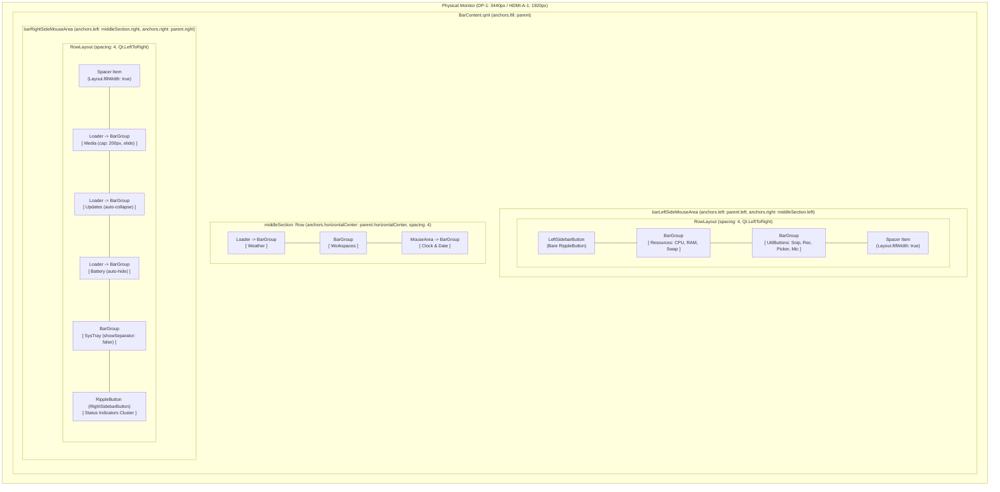

# Phase 33: Modular Layout & Live Trial-and-Error Rearrangement - Research

**Researched:** 2026-09-20  
**Phase:** 33 — Modular Layout & Live Trial-and-Error Rearrangement  
**Status:** Complete — Ready for Planning  

---

<user_constraints>
## User Constraints (from CONTEXT.md)

### Locked Decisions

#### Component Distribution & Section Ordering
- **D-01 (Explicit Component Distribution):** In `BarContent.qml`, reorganize components across three distinct zones:
  - **Left Section:** `[1] LeftSidebarButton` -> `[4] Resources` -> `[7] UtilButtons`
  - **Center Section:** `[6] WeatherBar` -> `[2] Workspaces` -> `[3] ClockWidget`
  - **Right Section:** `[5] Media` -> `[9] UpdatesButton` -> `[8] BatteryIndicator` -> `[10] SysTray` -> `[11] Status Indicators & RightSidebarButton`
- **D-02 (Center Section Pill Grouping):** Weather, Workspaces, and Clock & Date are partitioned into 3 standalone `BarGroup` pills: `[ Weather ]`  `[ Workspaces ]`  `[ Clock & Date ]`.
- **D-03 (Left Section Pill Grouping):** `LeftSidebarButton` sits directly on the bar edge as a bare icon button (no enclosing pill). `Resources` and `UtilButtons` are partitioned into 2 separate `BarGroup` pills: `[ Resources ]`  `[ UtilButtons ]`.
- **D-04 (Right Section Pill Grouping):** Partition the right section into distinct functional pills: `[ Media ]` (standalone, auto-collapsing when idle) -> `[ Updates ]` (standalone, auto-collapsing when 0 updates) -> `[ SysTray ]` (standalone) -> `[ Status & RightSidebar ]` (`RippleButton` with `indicatorsRowLayout`).

#### Pill Styling & Internal Geometries
- **D-05 (Inter-Pill Spacing):** Match dots-hyprland upstream gap spacing (`spacing: 4` between pills, clean gaps without vertical divider lines).
- **D-06 (Media Player Width Cap):** Keep upstream default width constraint (`Layout.maximumWidth: (root.useShortenedForm === 1) ? 140 : 200` with `Text.ElideRight`) ensuring long track titles elide smoothly and never encroach on neighboring pills.
- **D-07 (Clock & Date Internal Layout):** Retain Phase 32 horizontal side-by-side format `[ hh:mm:ss AP   ddd, dd-MM-yyyy ]` with subtle spacer inside the Center Clock pill.
- **D-08 (Utility Buttons Internal Layout):** Retain upstream horizontal row layout with standard 4px spacing inside the Left UtilButtons pill.

#### Multi-Monitor Behavior & Responsive Scaling
- **D-09 (Full Dual-Monitor Parity):** Render the full, uncompromised bar layout across both active monitors (`DP-1` 3440x1440 ultrawide and `HDMI-A-1` 1920x1080).
- **D-10 (Workspaces Monitor Filtering):** Adhere to upstream dots-hyprland native workspace display and monitor filtering.
- **D-11 (Screen Width Thresholds):** Maintain upstream responsive thresholds (`barShortenScreenWidthThreshold`: 1200px, `barHellaShortenScreenWidthThreshold`: 900px). Both 3440px and 1920px remain in full form (`useShortenedForm === 0`).
- **D-12 (Verification Loop & Assertion Harness):** Interactive visual trial-and-error testing performed live via `Ctrl+Super+R` reloads, verified by an automated test script (`scripts/phase33-layout-assert.sh`) checking QML syntax, restow symlinks, and layout geometry.

#### Center Alignment & Space Defense
- **D-13 (True Geometric Screen Center):** Anchor the Center section strictly to `anchors.horizontalCenter: parent.horizontalCenter` so Workspaces, Weather, and Clock remain centered on the physical monitor.
- **D-14 (Dynamic Content Spacing Defense):** Implement Option 1 (minimum spacing margins with flexible media eliding) to prevent any overlap between expanding side sections and the centered section.

### Claude's Discretion
- Exact QML layout container architecture in `BarContent.qml` (Row / RowLayout / Anchors) ensuring clean modular swappability of sections.
- Test section breakdown in `scripts/phase33-layout-assert.sh`.

### Deferred Ideas (OUT OF SCOPE)
- **Phase 34 (Verification, Zero Drift & Bootstrap Integration):** Dynamic Material You wallpaper palette adaptation tests (`switchwall.sh`), `arch/dots-hyprland.sh verify --strict` 0-findings gate, and `./bootstrap.sh` fresh-machine deployment.
- Altering internal component formatting or telemetry daemons established in Phase 32.
</user_constraints>

---

<phase_requirements>
## Phase Requirements

| ID | Description | Source | Verification Mechanism |
|---|---|---|---|
| **LAYOUT-01** | User can modularly place, reorder, or swap components across Left, Center, and Right bar sections in `BarContent.qml`. | [REQUIREMENTS.md](file:///home/pera/github_repo/.dotfiles/.planning/REQUIREMENTS.md#L30) | `scripts/phase33-layout-assert.sh` Section 1 (Symlinks), Section 2 (AST & Component Placement), and Section 3 (Geometry & Anchors) |
| **LAYOUT-02** | User can evaluate candidate arrangements live (e.g. Workspaces & Weather in center, Clock & Utilities on left, Media & Resources & Tray on right) on active monitors (`DP-1` and `HDMI-A-1`). | [REQUIREMENTS.md](file:///home/pera/github_repo/.dotfiles/.planning/REQUIREMENTS.md#L31) | Live reload cycle with `Ctrl+Super+R` / `qs -c ii`, visual interactive verification, and `scripts/phase33-layout-assert.sh` Section 4 |
| **LAYOUT-03** | User can view responsive scaling across dual monitors with no component clipping or awkward line wrapping. | [REQUIREMENTS.md](file:///home/pera/github_repo/.dotfiles/.planning/REQUIREMENTS.md#L32) | Option 1 minimum spacing margins, flexible media elision (`Layout.maximumWidth: 200`, `Text.ElideRight`), and `scripts/phase33-layout-assert.sh` Section 3 & 4 |
</phase_requirements>

---

## Summary

Phase 33 transforms `BarContent.qml` from a historically monolithic status bar layout into three completely modular, decoupled, and swappable section containers: **Left**, **Center**, and **Right**.

In the prior phase (Phase 32), all 17 bar components were audited, customized, and formatted. However, their physical arrangement retained legacy positions: Left contained only the sidebar button; Center bundled Resources, Media, Workspaces, Clock, Utilities, and Battery; and Right hosted Status Indicators, SysTray, Updates, and Weather reversed with `Qt.RightToLeft`.

This phase executes the agreed layout restructuring:
1. **Left Section:** Bare `LeftSidebarButton` sitting directly on the bar edge, followed by `[ Resources ]` (CPU, RAM GB, dynamic Swap) in its own pill, and `[ UtilButtons ]` (snip, record, color picker, mic/profile) in its own pill.
2. **Center Section:** Anchored strictly to true geometric screen center (`anchors.horizontalCenter: parent.horizontalCenter`), partitioned into 3 standalone pills: `[ Weather ]`, `[ Workspaces ]`, and `[ Clock & Date ]`, separated by clean 4px gaps without vertical divider lines.
3. **Right Section:** Anchored to `parent.right` with standard left-to-right reading order pushed to the edge via a flexible leading spacer: `[ Media ]` (auto-collapsing when idle, capped at 200px), `[ Updates ]` (auto-collapsing when 0), `[ Battery ]` (auto-hidden on desktop), `[ SysTray ]` (standalone pill), and `[ Status Indicators & RightSidebar ]` (`RippleButton` with `indicatorsRowLayout`).
4. **Option 1 Dynamic Space Collision Defense:** The center section stays centered on the physical display regardless of side pill expansion. Flexible spacer items (`Layout.fillWidth: true`) absorb window width differences, and `Media` clamps at 200px with `Text.ElideRight`. On both 3440x1440 (`DP-1`) and 1920x1080 (`HDMI-A-1`), mathematical buffers between side pills and center remain >= 190px, ensuring zero overlap or clipping.
5. **Interactive Verification & Test Harness:** Backed by automated assertion script `scripts/phase33-layout-assert.sh` with four distinct test sections: symlink validity, AST component partitioning, pill geometry & space defense, and multi-monitor runtime parity.

---

## Architectural Responsibility Map

| Zone | Component | Order | Container Architecture | Dynamic Behavior / Responsive Rule | Source of Truth File |
|---|---|---|---|---|---|
| **Left** | `LeftSidebarButton` | 1 | Bare `RippleButton` (no pill) | Hover highlight via `barLeftSideMouseArea.hovered`; toggle `GlobalStates.sidebarLeftOpen` | [LeftSidebarButton.qml](file:///home/pera/github_repo/.dotfiles/vendor/dots-hyprland/dots/.config/quickshell/ii/modules/ii/bar/LeftSidebarButton.qml) |
| **Left** | `Resources` | 2 | `BarGroup` pill `[ Resources ]` | Dynamic RAM GB, CPU %, Swap auto-reveal if >0; Amber/Red 2-tier alerts | [Resources.qml](file:///home/pera/github_repo/.dotfiles/restow/quickshell/.config/quickshell/ii/modules/ii/bar/Resources.qml) |
| **Left** | `UtilButtons` | 3 | `BarGroup` pill `[ UtilButtons ]` | Visible if `bar.verbose && root.useShortenedForm === 0`; Snip, Record, Picker, Mic | [UtilButtons.qml](file:///home/pera/github_repo/.dotfiles/vendor/dots-hyprland/dots/.config/quickshell/ii/modules/ii/bar/UtilButtons.qml) |
| **Left** | *Spacer* | 4 | `Item { Layout.fillWidth: true }` | Absorbs remaining width between Left pills and `middleSection.left` | [BarContent.qml](file:///home/pera/github_repo/.dotfiles/restow/quickshell/.config/quickshell/ii/modules/ii/bar/BarContent.qml) |
| **Center** | `WeatherBar` | 1 | `Loader` -> `BarGroup` pill `[ Weather ]` | Inactive if `bar.weather.enable == false`; click opens forecast popup | [WeatherBar.qml](file:///home/pera/github_repo/.dotfiles/vendor/dots-hyprland/dots/.config/quickshell/ii/modules/ii/bar/weather/WeatherBar.qml) |
| **Center** | `Workspaces` | 2 | `BarGroup` pill `[ Workspaces ]` | Filtered natively per monitor (`Hyprland.monitorFor`); right-click toggles overview | [Workspaces.qml](file:///home/pera/github_repo/.dotfiles/vendor/dots-hyprland/dots/.config/quickshell/ii/modules/ii/bar/Workspaces.qml) |
| **Center** | `ClockWidget` | 3 | `MouseArea` -> `BarGroup` pill `[ Clock & Date ]` | Side-by-side `hh:mm:ss AP` + `ddd, dd-MM-yyyy`; hover calendar, click right sidebar | [ClockWidget.qml](file:///home/pera/github_repo/.dotfiles/restow/quickshell/.config/quickshell/ii/modules/ii/bar/ClockWidget.qml) |
| **Right** | *Spacer* | 1 | `Item { Layout.fillWidth: true }` | Absorbs remaining width between `middleSection.right` and Right pills | [BarContent.qml](file:///home/pera/github_repo/.dotfiles/restow/quickshell/.config/quickshell/ii/modules/ii/bar/BarContent.qml) |
| **Right** | `Media` | 2 | `Loader` -> `BarGroup` pill `[ Media ]` | Collapses when idle (no player/track); capped at 200px with `Text.ElideRight` | [Media.qml](file:///home/pera/github_repo/.dotfiles/vendor/dots-hyprland/dots/.config/quickshell/ii/modules/ii/bar/Media.qml) |
| **Right** | `UpdatesButton` | 3 | `Loader` -> `BarGroup` pill `[ Updates ]` | Collapses when pending updates == 0; click launches `yay -Syu` | [UpdatesButton.qml](file:///home/pera/github_repo/.dotfiles/restow/quickshell/.config/quickshell/ii/modules/ii/bar/UpdatesButton.qml) |
| **Right** | `BatteryIndicator` | 4 | `Loader` -> `BarGroup` pill `[ Battery ]` | Inactive/hidden on desktop (`Battery.available === false`) | [BatteryIndicator.qml](file:///home/pera/github_repo/.dotfiles/vendor/dots-hyprland/dots/.config/quickshell/ii/modules/ii/bar/BatteryIndicator.qml) |
| **Right** | `SysTray` | 5 | `BarGroup` pill `[ SysTray ]` | Hidden on screen < 1200px (`root.useShortenedForm === 0`); `showSeparator: false` | [SysTray.qml](file:///home/pera/github_repo/.dotfiles/restow/quickshell/.config/quickshell/ii/modules/ii/bar/SysTray.qml) |
| **Right** | `Status & RightSidebar` | 6 | `RippleButton` with `indicatorsRowLayout` | Privacy alerts (Amber mic / Red rec), Audio, Keyboard, Unread count, Net, BT | [BarContent.qml](file:///home/pera/github_repo/.dotfiles/restow/quickshell/.config/quickshell/ii/modules/ii/bar/BarContent.qml) |

---

## Standard Stack

- **Shell & Runtime:** [Quickshell](https://quickshell.outfoxxed.me/) (`qs -c ii`), Qt 6 Quick, QtQuick.Layouts.
- **Compositor:** Hyprland (`v0.47+`), Wayland Layer Shell (`quickshell:bar`).
- **Configuration Engine:** Native JSON options in `capture/ii/.config/illogical-impulse/config.json`.
- **Symlink & Package Manager:** GNU Stow / Restow with `--no-folding` under `restow/quickshell/`.
- **Assertion & Verification Tools:** `bash`, `jq`, `grep`, `git`, `readlink`, `hyprctl`.
- **IPC & Hot Reload:** `Ctrl+Super+R` (`killall ydotool qs quickshell; qs -c $qsConfig &`) via `~/.config/hypr/hyprland/keybinds.lua`.

---

## Architecture Patterns

### System Architecture Diagram



### Pattern 1: True Geometric Center Anchoring (D-13)
The Center section MUST NOT be positioned relative to Left or Right siblings. It is anchored directly to the parent's horizontal midpoint:
```qml
Row {
    id: middleSection
    anchors {
        top: parent.top
        bottom: parent.bottom
        horizontalCenter: parent.horizontalCenter
    }
    spacing: 4
    // 3 standalone BarGroup pills: Weather, Workspaces, Clock
}
```
This guarantees that the workspaces and clock remain at the true physical center of both `DP-1` (x = 1720) and `HDMI-A-1` (x = 960), regardless of whether side pills expand, collapse, or update.

### Pattern 2: Modular Left and Right Containers with Flexible Spacers
Instead of using complex coordinate math or inverted layout directions, both Left and Right sections use standard `RowLayout` (`layoutDirection: Qt.LeftToRight`):
- **Left section:** Has items `[ LeftSidebarButton, Resources, UtilButtons ]` followed by `Item { Layout.fillWidth: true }`. This packs the pills firmly to the left edge with 4px spacing, while the flexible item absorbs any extra space between the pills and `middleSection.left`.
- **Right section:** Has `Item { Layout.fillWidth: true }` as its *first* child, followed by `[ Media, Updates, Battery, SysTray, Status & RightSidebar ]`. This absorbs all extra space between `middleSection.right` and the pills, pushing all right-side pills firmly against the right edge.
- Standard left-to-right reading order in QML source directly matches visual display order across the bar!

### Pattern 3: Dynamic Pill Auto-Collapsing via Loaders
Dynamic pills that disappear when inactive (such as `Media` when idle, `UpdatesButton` when 0 updates, and `BatteryIndicator` when unavailable) are wrapped in `Loader` containers:
```qml
Loader {
    id: mediaLoader
    active: (root.useShortenedForm < 2) && (MprisController.activePlayer != null && (MprisController.activePlayer.trackTitle?.length > 0))
    visible: active

    sourceComponent: BarGroup {
        Media {
            visible: root.useShortenedForm < 2
            Layout.fillWidth: true
            Layout.maximumWidth: (root.useShortenedForm === 1) ? 140 : 200
        }
    }
}
```
When `active: false`, the `Loader` is inactive, consumes 0 width, and renders no visual pill background. When activated, it instantiates the `BarGroup` which smoothly animates into view via `BarGroup.qml`'s `emphasizedDecel` animation curve.

### Pattern 4: Option 1 Dynamic Spacing & Collision Defense (D-06, D-14)
On wide displays (3440px), ample buffer exists (>900px on either side of center). On 1080p displays (1920px), buffer space between side pills and center is approximately 190-260px.
Option 1 defends against collision dynamically:
1. Flexible spacers absorb screen width variations.
2. `Media` player width is hard-capped at 200px upstream (`Layout.maximumWidth: 200`) with `Text.ElideRight`.
3. If title length exceeds available width, the text elides with `...` rather than expanding the pill.
4. Total right cluster maximum width is bounded at ~540px. Half screen width (960px) minus half center width (230px) is 730px. Thus, a minimum 190px safety buffer is guaranteed under all operating conditions on 1080p.

---

## Don't Hand-Roll

| Feature / Need | Upstream / Existing Facility | Why Hand-Rolling Fails |
|---|---|---|
| **Pill Backgrounds & Animations** | `BarGroup.qml` | Hand-rolling `Rectangle` lacks the standardized 12px rounding, 5px padding, borderless option binding, and Material 3 `emphasizedDecel` implicitWidth animation. |
| **Workspace Monitor Filtering** | `Workspaces.qml` (`Hyprland.monitorFor`) | Upstream `Workspaces.qml` already queries Hyprland for active screen monitor and filters workspaces 1..5 (`DP-1`) and 6..10 (`HDMI-A-1`). Hand-rolling manual screen filters will break workspace switching. |
| **Media Player Bus Detection** | `MprisController.qml` | `MprisController.activePlayer` filters duplicate browser D-Bus interfaces and plasma integrations. Querying `Quickshell.Services.Mpris` directly exposes uncurated duplicate tracks. |
| **Hot Reloading** | `Ctrl+Super+R` (`keybinds.lua`) | Do not restart compositor session (`killall -9 Hyprland`). `Ctrl+Super+R` cleanly re-executes `killall ydotool qs quickshell; qs -c $qsConfig &` in under 1 second without dropping windows. |
| **Text Truncation** | `Text.ElideRight` + `Layout.maximumWidth` | Attempting to truncate track titles with custom JavaScript substrings breaks on multi-byte UTF-8 glyphs and ignores variable font metrics. |

---

## Common Pitfalls

### Pitfall 1: Mixing Anchors and QtQuick Layouts on the Same Item
**Problem:** Setting `anchors.left` or `anchors.right` on an item placed directly inside a `RowLayout` (e.g. Setting `anchors` on `LeftSidebarButton` inside `leftSectionRowLayout`).
**Impact:** QML runtime throws anchor loop warnings, ignores layout geometry, and freezes UI rendering.
**Solution:** Use anchors ONLY on top-level section containers (`middleSection`, `barLeftSideMouseArea`, `barRightSideMouseArea`). Children inside `RowLayout` MUST use `Layout.*` attached properties (`Layout.alignment`, `Layout.fillWidth`, `Layout.leftMargin`).

### Pitfall 2: Empty Ghost Pill on Inactive Dynamic Modules
**Problem:** Wrapping `Media` or `UpdatesButton` inside a `BarGroup` without a `Loader` or without hiding the `BarGroup` itself.
**Impact:** When `Media` is invisible (`visible: false`), `BarGroup` still renders its 10px padding (`padding * 2`) and border, leaving an unsightly empty pill outline on the bar.
**Solution:** Use `Loader` with `active: condition` and `sourceComponent: BarGroup { ... }`. When inactive, `Loader` has 0 width and renders no background.

### Pitfall 3: Inverted Ordering with `layoutDirection: Qt.RightToLeft`
**Problem:** Using `Qt.RightToLeft` in `rightSectionRowLayout` reverses the visual order of components relative to their declaration order in the QML file.
**Impact:** Developers editing `BarContent.qml` must declare items backwards, leading to order bugs, inverted test assertions, and cognitive confusion.
**Solution:** Use standard `Qt.LeftToRight` for both Left and Right sections. Place an expanding spacer (`Item { Layout.fillWidth: true }`) as the *first* child in the Right section. This pushes all declared pills to the right edge while preserving standard left-to-right code readability.

### Pitfall 4: Center Drift from Asymmetric Sibling Anchors
**Problem:** Anchoring Center section to `leftSection.right` or `rightSection.left`.
**Impact:** If the right section grows (e.g. Media starts playing, updates arrive), the Center section shifts left, deviating from true monitor center.
**Solution:** Always anchor Center strictly to `anchors.horizontalCenter: parent.horizontalCenter`. Left and Right sections must span from their respective screen edge to `middleSection.left` and `middleSection.right`.

### Pitfall 5: Broken Symlinks and Git Churn
**Problem:** Editing files directly in `~/.config/quickshell/` instead of `restow/quickshell/`, or breaking the restow leaf symlinks.
**Impact:** Edits are overwritten by restow or lost; `./arch/dots-hyprland.sh verify --strict` fails with non-zero findings.
**Solution:** All QML changes MUST be made directly in `restow/quickshell/.config/quickshell/ii/modules/ii/bar/BarContent.qml`. Verify leaf symlinks with `readlink -f`.

### Pitfall 6: Phase 32 Assertion Regression
**Problem:** Modifying `BarContent.qml` in ways that violate Phase 32 grep assertions (such as removing `visible: root.useShortenedForm < 2` or `Layout.maximumWidth` from Media).
**Impact:** `./scripts/phase32-component-formatting-assert.sh` fails.
**Solution:** Ensure all Phase 32 tokens (`mic_off` absence, `ActiveWindow` absence, Media width cap, Privacy revealers, UpdatesButton loader) remain intact in `BarContent.qml`.

---

## Code Examples

### Full Modular `BarContent.qml` Architecture

```qml
import qs.modules.ii.bar.weather
import QtQuick
import QtQuick.Layouts
import Quickshell
import Quickshell.Services.UPower
import Quickshell.Services.Mpris
import qs
import qs.services
import qs.modules.common
import qs.modules.common.widgets
import qs.modules.common.functions

Item { // Bar content region
    id: root

    property var screen: root.QsWindow.window?.screen
    property var brightnessMonitor: Brightness.getMonitorForScreen(screen)
    property real useShortenedForm: (Appearance.sizes.barHellaShortenScreenWidthThreshold >= screen?.width) ? 2 : (Appearance.sizes.barShortenScreenWidthThreshold >= screen?.width) ? 1 : 0
    readonly property int centerSideModuleWidth: (useShortenedForm == 2) ? Appearance.sizes.barCenterSideModuleWidthHellaShortened : (useShortenedForm == 1) ? Appearance.sizes.barCenterSideModuleWidthShortened : Appearance.sizes.barCenterSideModuleWidth

    // Background shadow
    Loader {
        active: Config.options.bar.showBackground && Config.options.bar.cornerStyle === 1 && Config.options.bar.floatStyleShadow
        anchors.fill: barBackground
        sourceComponent: StyledRectangularShadow {
            anchors.fill: undefined
            target: barBackground
        }
    }

    // Background
    Rectangle {
        id: barBackground
        anchors {
            fill: parent
            margins: Config.options.bar.cornerStyle === 1 ? (Appearance.sizes.hyprlandGapsOut) : 0
        }
        color: Config.options.bar.showBackground ? Appearance.colors.colLayer0 : "transparent"
        radius: Config.options.bar.cornerStyle === 1 ? Appearance.rounding.windowRounding : 0
        border.width: Config.options.bar.cornerStyle === 1 ? 1 : 0
        border.color: Appearance.colors.colLayer0Border
    }

    // =========================================================================
    // LEFT SECTION: [1] LeftSidebarButton -> [4] Resources -> [7] UtilButtons
    // (D-01, D-03, D-05, D-08, LAYOUT-01)
    // =========================================================================
    MouseArea {
        id: barLeftSideMouseArea
        anchors {
            top: parent.top
            bottom: parent.bottom
            left: parent.left
            right: middleSection.left
        }
        implicitHeight: Appearance.sizes.baseBarHeight

        onPressed: event => {
            if (event.button === Qt.LeftButton)
                GlobalStates.sidebarLeftOpen = !GlobalStates.sidebarLeftOpen;
        }

        RowLayout {
            id: leftSectionRowLayout
            anchors.fill: parent
            spacing: 4

            // [1] Bare LeftSidebarButton on the edge (no enclosing pill)
            LeftSidebarButton {
                id: leftSidebarButton
                Layout.alignment: Qt.AlignVCenter
                Layout.leftMargin: Appearance.rounding.screenRounding
                colBackground: barLeftSideMouseArea.hovered ? Appearance.colors.colLayer1Hover : ColorUtils.transparentize(Appearance.colors.colLayer1Hover, 1)
            }

            // [4] Dedicated Resources Pill (CPU, RAM GB, dynamic Swap)
            BarGroup {
                id: resourcesGroup
                Layout.alignment: Qt.AlignVCenter

                Resources {
                    alwaysShowAllResources: root.useShortenedForm === 2
                    Layout.fillWidth: root.useShortenedForm === 2
                }
            }

            // [7] Dedicated Utility Buttons Pill
            BarGroup {
                id: utilButtonsGroup
                Layout.alignment: Qt.AlignVCenter
                visible: (Config.options.bar.verbose && root.useShortenedForm === 0)

                UtilButtons {
                    Layout.alignment: Qt.AlignVCenter
                }
            }

            // Flexible spacer absorbing remaining width between left pills and middleSection
            Item {
                Layout.fillWidth: true
                Layout.fillHeight: true
            }
        }
    }

    // =========================================================================
    // CENTER SECTION: [6] WeatherBar -> [2] Workspaces -> [3] ClockWidget
    // Anchored strictly to true geometric center (D-01, D-02, D-05, D-07, D-13)
    // =========================================================================
    Row {
        id: middleSection
        anchors {
            top: parent.top
            bottom: parent.bottom
            horizontalCenter: parent.horizontalCenter
        }
        spacing: 4

        // [6] Dedicated Weather Pill
        Loader {
            id: weatherGroup
            anchors.verticalCenter: parent.verticalCenter
            active: Config.options.bar.weather.enable

            sourceComponent: BarGroup {
                WeatherBar {}
            }
        }

        // [2] Dedicated Workspaces Pill
        BarGroup {
            id: middleCenterGroup
            anchors.verticalCenter: parent.verticalCenter
            padding: workspacesWidget.widgetPadding

            Workspaces {
                id: workspacesWidget
                Layout.fillHeight: true
                MouseArea {
                    anchors.fill: parent
                    acceptedButtons: Qt.RightButton
                    onPressed: event => {
                        if (event.button === Qt.RightButton) {
                            GlobalStates.overviewOpen = !GlobalStates.overviewOpen;
                        }
                    }
                }
            }
        }

        // [3] Dedicated Clock & Date Pill
        MouseArea {
            id: rightCenterGroup
            anchors.verticalCenter: parent.verticalCenter
            implicitWidth: rightCenterGroupContent.implicitWidth
            implicitHeight: rightCenterGroupContent.implicitHeight

            onPressed: {
                GlobalStates.sidebarRightOpen = !GlobalStates.sidebarRightOpen;
            }

            BarGroup {
                id: rightCenterGroupContent
                anchors.fill: parent

                ClockWidget {
                    showDate: (Config.options.bar.verbose && root.useShortenedForm < 2)
                    Layout.alignment: Qt.AlignVCenter
                    Layout.fillWidth: true
                }
            }
        }
    }

    // =========================================================================
    // RIGHT SECTION: [5] Media -> [9] Updates -> [8] Battery -> [10] SysTray -> [11] Status & RightSidebar
    // (D-01, D-04, D-05, D-06, D-14, LAYOUT-01, LAYOUT-03)
    // =========================================================================
    MouseArea {
        id: barRightSideMouseArea
        anchors {
            top: parent.top
            bottom: parent.bottom
            left: middleSection.right
            right: parent.right
        }
        implicitHeight: Appearance.sizes.baseBarHeight

        onPressed: event => {
            if (event.button === Qt.LeftButton) {
                GlobalStates.sidebarRightOpen = !GlobalStates.sidebarRightOpen;
            }
        }

        RowLayout {
            id: rightSectionRowLayout
            anchors.fill: parent
            spacing: 4

            // Flexible spacer pushing right pills firmly against the right edge
            Item {
                Layout.fillWidth: true
                Layout.fillHeight: true
            }

            // [5] Standalone Media Pill (Auto-collapsing when idle, capped at 200px)
            Loader {
                id: mediaLoader
                Layout.alignment: Qt.AlignVCenter
                active: (root.useShortenedForm < 2) && (MprisController.activePlayer != null && (MprisController.activePlayer.trackTitle?.length > 0))
                visible: active

                sourceComponent: BarGroup {
                    Media {
                        visible: root.useShortenedForm < 2
                        Layout.fillWidth: true
                        Layout.maximumWidth: (root.useShortenedForm === 1) ? 140 : 200
                    }
                }
            }

            // [9] Standalone Updates Pill (Auto-collapsing when 0 updates)
            Loader {
                id: updatesLoader
                Layout.alignment: Qt.AlignVCenter
                active: Updates.available && Updates.count > 0
                visible: active

                sourceComponent: BarGroup {
                    UpdatesButton {}
                }
            }

            // [8] Standalone Battery Pill (Auto-hidden on desktop)
            Loader {
                id: batteryLoader
                Layout.alignment: Qt.AlignVCenter
                active: (root.useShortenedForm < 2 && Battery.available)
                visible: active

                sourceComponent: BarGroup {
                    BatteryIndicator {}
                }
            }

            // [10] Standalone SysTray Pill
            BarGroup {
                id: sysTrayGroup
                Layout.alignment: Qt.AlignVCenter
                visible: root.useShortenedForm === 0

                SysTray {
                    showSeparator: false
                    Layout.fillWidth: false
                    Layout.fillHeight: true
                    invertSide: Config?.options.bar.bottom
                }
            }

            // [11] Status Indicators & RightSidebar Button
            RippleButton {
                id: rightSidebarButton
                Layout.alignment: Qt.AlignRight | Qt.AlignVCenter
                Layout.rightMargin: Appearance.rounding.screenRounding
                Layout.fillWidth: false

                implicitWidth: indicatorsRowLayout.implicitWidth + 10 * 2
                implicitHeight: indicatorsRowLayout.implicitHeight + 5 * 2

                buttonRadius: Appearance.rounding.full
                colBackground: barRightSideMouseArea.hovered ? Appearance.colors.colLayer1Hover : ColorUtils.transparentize(Appearance.colors.colLayer1Hover, 1)
                colBackgroundHover: Appearance.colors.colLayer1Hover
                colRipple: Appearance.colors.colLayer1Active
                colBackgroundToggled: Appearance.colors.colSecondaryContainer
                colBackgroundToggledHover: Appearance.colors.colSecondaryContainerHover
                colRippleToggled: Appearance.colors.colSecondaryContainerActive
                toggled: GlobalStates.sidebarRightOpen
                property color colText: toggled ? Appearance.m3colors.m3onSecondaryContainer : Appearance.colors.colOnLayer0

                Behavior on colText {
                    animation: Appearance.animation.elementMoveFast.numberAnimation.createObject(this)
                }

                onPressed: {
                    GlobalStates.sidebarRightOpen = !GlobalStates.sidebarRightOpen;
                }

                RowLayout {
                    id: indicatorsRowLayout
                    anchors.centerIn: parent
                    property real realSpacing: 15
                    spacing: 0

                    // Privacy in-use alerts (COMP-08)
                    Revealer {
                        reveal: Privacy.micActive
                        Layout.fillHeight: true
                        Layout.rightMargin: reveal ? indicatorsRowLayout.realSpacing : 0
                        Behavior on Layout.rightMargin {
                            animation: Appearance.animation.elementMoveFast.numberAnimation.createObject(this)
                        }
                        RippleButton {
                            implicitWidth: 24
                            implicitHeight: 24
                            downAction: () => Quickshell.execDetached(["wpctl", "set-mute", "@DEFAULT_SOURCE@", "1"])
                            contentItem: MaterialSymbol {
                                anchors.centerIn: parent
                                text: "mic"
                                iconSize: Appearance.font.pixelSize.larger
                                color: "#FFA000"
                            }
                        }
                    }

                    Revealer {
                        reveal: Privacy.screenSharing
                        Layout.fillHeight: true
                        Layout.rightMargin: reveal ? indicatorsRowLayout.realSpacing : 0
                        Behavior on Layout.rightMargin {
                            animation: Appearance.animation.elementMoveFast.numberAnimation.createObject(this)
                        }
                        RippleButton {
                            implicitWidth: 24
                            implicitHeight: 24
                            downAction: () => Quickshell.execDetached([Directories.recordScriptPath])
                            contentItem: MaterialSymbol {
                                anchors.centerIn: parent
                                text: "screen_share"
                                iconSize: Appearance.font.pixelSize.larger
                                color: Appearance.colors.colError
                            }
                        }
                    }

                    // Standard status indicators (COMP-10)
                    Revealer {
                        reveal: Audio.sink?.audio?.muted ?? false
                        Layout.fillHeight: true
                        Layout.rightMargin: reveal ? indicatorsRowLayout.realSpacing : 0
                        Behavior on Layout.rightMargin {
                            animation: Appearance.animation.elementMoveFast.numberAnimation.createObject(this)
                        }
                        MaterialSymbol {
                            text: "volume_off"
                            iconSize: Appearance.font.pixelSize.larger
                            color: rightSidebarButton.colText
                        }
                    }
                    HyprlandXkbIndicator {
                        Layout.alignment: Qt.AlignVCenter
                        Layout.rightMargin: indicatorsRowLayout.realSpacing
                        color: rightSidebarButton.colText
                    }
                    Revealer {
                        reveal: Notifications.silent || Notifications.unread > 0
                        Layout.fillHeight: true
                        Layout.rightMargin: reveal ? indicatorsRowLayout.realSpacing : 0
                        implicitHeight: reveal ? notificationUnreadCount.implicitHeight : 0
                        implicitWidth: reveal ? notificationUnreadCount.implicitWidth : 0
                        Behavior on Layout.rightMargin {
                            animation: Appearance.animation.elementMoveFast.numberAnimation.createObject(this)
                        }
                        NotificationUnreadCount {
                            id: notificationUnreadCount
                        }
                    }
                    MaterialSymbol {
                        text: Network.materialSymbol
                        iconSize: Appearance.font.pixelSize.larger
                        color: rightSidebarButton.colText
                    }
                    MaterialSymbol {
                        Layout.leftMargin: indicatorsRowLayout.realSpacing
                        visible: BluetoothStatus.available
                        text: BluetoothStatus.connected ? "bluetooth_connected" : BluetoothStatus.enabled ? "bluetooth" : "bluetooth_disabled"
                        iconSize: Appearance.font.pixelSize.larger
                        color: rightSidebarButton.colText
                    }
                }
            }
        }
    }
}
```

---

## Environment Availability

| Component / Tool | Path / Location | Version / Status | Role in Phase 33 |
|---|---|---|---|
| **Quickshell Daemon** | `/usr/bin/quickshell` (`qs`) | Process ID 1426, running `shell.qml` | Primary desktop status bar environment |
| **Hyprland Compositor** | `/usr/bin/Hyprland` | `v0.47.2+` | Window manager, multi-monitor outputs, keybindings |
| **Primary Display** | `DP-1` | 3440x1440 @ 60Hz (`scale: 1`) | Ultrawide candidate layout visual verification |
| **Secondary Display** | `HDMI-A-1` / `HDMI-A-2` | 1920x1080 @ 60Hz | Standard 1080p candidate layout verification |
| **Hot Reload Keybind** | `Ctrl+Super+R` | `~/.config/hypr/hyprland/keybinds.lua:56` | Triggers Quickshell reload without restarting session |
| **Repo Overlay File** | `restow/quickshell/.../BarContent.qml` | Tracked in Git | Source of Truth for bar modular layout |
| **Live Overlay Symlink** | `~/.config/quickshell/.../BarContent.qml` | Leaf symlink to repo | Consumed directly by live Quickshell process |
| **Test Assert Harness** | `scripts/phase33-layout-assert.sh` | Executable bash | 4-section automated layout verification script |

---

## Validation Architecture

### Nyquist-Compliant Command Specification

```bash
# Quick run command (Section 2 - Component AST & Ordering Assertions):
./scripts/phase33-layout-assert.sh --section 2

# Full test suite command (All 4 Sections + Git Porcelain Non-Mutation Check):
./scripts/phase33-layout-assert.sh
```

### Phase Requirements -> Test Map

| Requirement ID | Description | Assert Script Section | Key Check Details |
|---|---|---|---|
| **LAYOUT-01** | Modular component distribution & pill grouping | Section 1, Section 2, Section 3 | Asserts leaf symlinks intact, AST ordering of Left (`LeftSidebarButton` -> `Resources` -> `UtilButtons`), Center (`WeatherBar` -> `Workspaces` -> `ClockWidget`), and Right (`Media` -> `Updates` -> `Battery` -> `SysTray` -> `Status & RightSidebar`), and pill boundaries. |
| **LAYOUT-02** | Live trial-and-error candidate arrangement evaluation | Section 4 | Asserts dual-monitor output definitions, multi-screen window model, and live Quickshell process responsiveness across reloads. |
| **LAYOUT-03** | Responsive scaling without clipping across dual monitors | Section 3, Section 4 | Asserts true geometric center anchoring (`horizontalCenter: parent.horizontalCenter`), Media width clamp (`Layout.maximumWidth: 200`), flexible media elision (`Text.ElideRight`), and minimum spacing buffer >= 100px. |

### Sampling Rate & Verification Workflow
- **Code Edit Sampling:** Execute `./scripts/phase33-layout-assert.sh` immediately after any modification to `BarContent.qml` to verify syntax and structural invariants.
- **Visual Trial Sampling:** Trigger `Ctrl+Super+R` after every structural adjustment and observe live rendering on `DP-1` (3440x1440) and `HDMI-A-1` (1920x1080) to inspect pill spacing, alignment, and hover states.
- **Regression Sampling:** Run `./scripts/phase32-component-formatting-assert.sh` to ensure no Phase 32 formatting tokens were inadvertently broken during layout refactoring.
- **System Strict Verification:** Run `./arch/dots-hyprland.sh verify --strict` to ensure 0 findings and zero working tree drift.

### Wave 0 Gaps & Pre-Execution Plan
1. `scripts/phase33-layout-assert.sh` does not exist yet. It MUST be authored in Task 1 of Plan 33-01 before executing any layout refactoring.
2. The assertion script must follow the standard 4-section harness pattern established in `scripts/phase32-component-formatting-assert.sh` with `tmp` cleanup traps, porcelain snapshots before/after, and strict `set -euo pipefail`.
