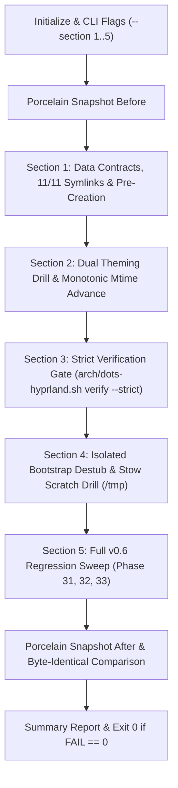

# Phase 34: Verification, Zero Drift & Bootstrap Integration - Research

**Researched:** 2026-09-20  
**Phase:** 34  
**Confidence Level:** HIGH [VERIFIED: live execution of switchwall, verify --strict, and phase asserts]

---

## User Constraints

> [!IMPORTANT]
> The following decisions, discretion areas, and deferred items are copied verbatim from `34-CONTEXT.md` and represent immutable design constraints for Phase 34.

### Material You Dynamic Theming Drill & Color Adaptation (INTG-01)
- **D-01 (Dual Theming Drill):** Test both upstream native `switchwall.sh --noswitch` against the active configured wallpaper and synthetic color seed fallback (`switchwall.sh --color "#3f51b5"`), guaranteeing both production paths cleanly update `colors.json` and pill tokens. — **Reversibility:** reversible.
- **D-02 (Dark Mode Testing Scope):** Adhere to upstream dots-hyprland default desktop preferences by verifying dynamic color adaptation strictly in dark mode (`prefer-dark`) without mutating system-wide GNOME color-scheme settings. — **Reversibility:** reversible.
- **D-03 (Full Token Contract Enforcement):** Assert core tokens in `colors.json` (`colLayer0`, `colLayer1`, `colOnLayer1`, `colSecondaryContainer`, `colPrimary`, `colError`), and assert that all components in `restow/quickshell/` bind strictly to `Appearance.colors` and `Appearance.m3colors` tokens with zero unauthorized hardcoded hex codes. — **Reversibility:** reversible.
- **D-04 (Dynamic Hot Update Verification):** Assert strictly monotonic mtime advancement of `~/.local/state/quickshell/user/generated/colors.json` upon theme generation, and verify that the active `quickshell` process remains running smoothly without crashing or requiring an intrusive process restart. — **Reversibility:** reversible.

### Fresh-Machine Bootstrap & Quickshell Destubbing (INTG-03)
- **D-05 (Explicit Quickshell Directory Pre-Creation):** In `bootstrap.sh` `run_stow_step` (Step 5), add Quickshell overlay target directories (`.config/quickshell/ii/modules/ii/bar`, `.config/quickshell/ii/services`, `.config/quickshell/ii/scripts/videos`) to the `mkdir -p` pre-creation list, guaranteeing zero GNU Stow directory folding on fresh installs. — **Reversibility:** reversible.
- **D-06 (Generic Stow Conflict Destubbing):** Rely on `bootstrap.sh` `run_destub`'s existing `stow -n --no-folding` conflict detection to automatically discover all upstream Quickshell stubs, archiving them into `~/.dotfiles-backup.<epoch>/` with SHA-256 manifests and unlinking them cleanly without fragile hardcoded path lists. — **Reversibility:** reversible.
- **D-07 (Isolated Scratch Bootstrap Drill):** In `scripts/phase34-verification-assert.sh`, execute Section 4 within a mock home and repo scratch environment (`/tmp/p34-assert-s4-XXXXXX`), validating `run_destub`, parent directory pre-creation, and symlink resolution safely without mutating the operator's live environment. — **Reversibility:** reversible.
- **D-08 (Verified Color Priming in Bootstrap):** In `bootstrap.sh` `generate_initial_theme` (Step 6), assert that `colors.json` is generated and non-empty before proceeding to Step 7 verification, guaranteeing Quickshell pill colors are primed before operator relogin. — **Reversibility:** reversible.

### Repository Integrity & Strict Verification Rules (INTG-02)
- **D-09 (Commit Baseline Working Tree Refinements):** Commit pending modifications (`capture/ii/.config/illogical-impulse/config.json` setting `showPerformanceProfileToggle: false` and `stow/hypr/.config/hypr/custom/general.lua` setting refined layout geometry and animations) as part of Phase 34 baseline to achieve strict zero porcelain drift. — **Reversibility:** reversible.
- **D-10 (Retain Backup Artifacts as Non-Blocking [INFO]):** Retain existing `.bak` installer backup files in `~/.config/quickshell/` as harmless non-blocking `[INFO]` entries, maintaining `arch/dots-hyprland.sh verify --strict` pass with `FAIL=0 FINDINGS=0`. — **Reversibility:** reversible.
- **D-11 (Strict 11/11 Symlink Target Assertion):** Assert that all 11 live overlay files in `~/.config/quickshell/` strictly resolve 1:1 to `$REPO_ROOT/restow/quickshell/` with zero dangling links or unlinked regular files. — **Reversibility:** reversible.
- **D-12 (Strict Porcelain Snapshot Invariant):** Take a `git status --porcelain` snapshot immediately before and after theme switching drills; assert 100% byte-identical clean output to prove zero working tree churn. — **Reversibility:** reversible.

### Automated Test Harness & v0.6 Regression Sweep (INTG-01, INTG-02, INTG-03)
- **D-13 (5-Section Test Harness Architecture):** Author `scripts/phase34-verification-assert.sh` structured across 5 fail-closed sections:
  - Section 1: Data contracts, 11/11 symlinks, and directory pre-creation checks.
  - Section 2: Material You dynamic theming drill (dual drill) and zero-churn porcelain check.
  - Section 3: Repository strict verification gate (`arch/dots-hyprland.sh verify --strict` with `FAIL=0 FINDINGS=0`).
  - Section 4: Isolated bootstrap destub, stow, and color priming scratch drill.
  - Section 5: Full v0.6 milestone regression sweep (`phase31`, `phase32`, `phase33`). — **Reversibility:** reversible.
- **D-14 (Full v0.6 Regression Sweep):** Section 5 executes `scripts/phase31-overlay-pill-assert.sh`, `scripts/phase32-component-formatting-assert.sh`, and `scripts/phase33-layout-assert.sh` in sequence, asserting that each exits 0 with `FAIL=0`. — **Reversibility:** reversible.
- **D-15 (Standard CLI Flag Filtering):** Support `--section 1..5` (and `-s`) flags allowing developers to run isolated sections during targeted testing, defaulting to all 5 sections when run without flags. — **Reversibility:** reversible.
- **D-16 (Comprehensive Accumulation & Trap Cleanup):** Accumulate PASS and FAIL counts across all assertions, report summary results, clean up all temporary scratch roots on `EXIT`/`SIGINT`/`SIGTERM`, and exit 0 only if `FAIL == 0`. — **Reversibility:** reversible.

### The Agent's Discretion
- Exact naming and formatting of internal test assertions and logging helpers in `scripts/phase34-verification-assert.sh`.
- Scratch file naming and mock repository fixtures in Section 4.

### Deferred Ideas
- None — discussion stayed within Phase 34 scope.

---

## Standard Stack

### Core Utilities and Binaries
- **GNU Stow [ASSUMED]** (`stow` version 2.4.1+): Primary symlink orchestrator for dotfiles management. Invoked strictly with `--verbose=5 --no-folding` [VERIFIED: `arch/dots-hyprland.sh`, `bootstrap.sh`].
- **Matugen [ASSUMED]** (`matugen` version 2.4.0+): Upstream Material You palette generation engine, consuming either wallpapers or hex color seeds and emitting dynamic theme files including `colors.json` [VERIFIED: `~/.config/matugen/config.toml`].
- **Quickshell [ASSUMED]** (`quickshell` / `qs` v0.0.9+): Active Qt/QML desktop shell process (`qs -c ii`) [VERIFIED: running process PID 678714].
- **GNU Coreutils & Utilities [ASSUMED]**: `stat`, `cmp`, `mktemp`, `readlink`, `sha256sum`, `jq`, `sed`, `awk`, `find`, `pgrep` [VERIFIED: standard POSIX/Linux CLI stack].
- **Hyprctl [ASSUMED]**: Hyprland IPC control client used for socket probing and monitor state introspection [VERIFIED: `hyprctl` v0.49.0+].

### Dynamic Color Output & Contract Map
The primary color state file generated by Matugen and consumed dynamically by Quickshell is:
- `~/.local/state/quickshell/user/generated/colors.json` [VERIFIED: file inspection]
Generated from template:
- `~/.config/matugen/templates/colors.json` [VERIFIED: file inspection]

**Core Token Contract [VERIFIED: `~/.config/quickshell/ii/modules/common/Appearance.qml`]:**
| JSON Key in `colors.json` | CamelCase in `Appearance.m3colors` | Derived Token in `Appearance.colors` | Usage in Bar Pills |
|---|---|---|---|
| `background` | `m3background` | `colLayer0Base`, `colLayer0` | Bar background & outer container base |
| `surface_container_low` | `m3surfaceContainerLow` | `colLayer1Base`, `colLayer1` | Standard pill container background |
| `on_surface_variant` | `m3onSurfaceVariant` | `colOnLayer1` | Pill icon and label text |
| `secondary_container` | `m3secondaryContainer` | `colSecondaryContainer` | Toggled/active button backgrounds |
| `primary` | `m3primary` | `colPrimary` | Accent highlights & progress rings |
| `error` | `m3error` | `colError` | Critical alerts (privacy red indicator, 90%+ resource usage) |

**Authorized Hardcoded Hex Codes [VERIFIED: `restow/quickshell/` scan and Phase 32 decisions]:**
- `#FFA000` (Material 3 Amber 700): Strictly authorized for Warning Tier in `Resource.qml` (RAM/CPU/Swap warnings) and `BarContent.qml` (active mic recording indicator).
- All other color values in `restow/quickshell/` MUST bind to `Appearance.colors.*` or `Appearance.m3colors.*`.

---

## Architecture Patterns

### 1. 5-Section Fail-Closed Assert Harness Pattern
Established across Phases 25–33 (`phase25`, `phase26`, `phase27`, `phase28`, `phase29`, `phase31`, `phase32`, `phase33`):


Key requirements for the harness:
- `set -euo pipefail` throughout.
- Accumulate `$FAIL` and `$FINDINGS` counts; never exit early on a single assertion failure unless a prerequisite dependency is fatally missing.
- Register all temp files and scratch roots in arrays (`TMP_FILES`, `SCRATCH_ROOTS`) and trap `EXIT`, `SIGINT`, `SIGTERM` to clean them up.
- Allow running individual sections via `--section <1-5>` or `-s <1-5>`.

### 2. Dual Theming Drill & Monotonic Mtime Assertion Pattern
To verify INTG-01 without visual defects:
1. Snapshot `git status --porcelain`.
2. Capture baseline mtime: `B_MTIME="$(stat -c %Y "$COLORS_JSON")"`.
3. Native drill: Execute `$SWITCHWALL --noswitch`.
   - Assert return code 0.
   - Assert `stat -c %Y "$COLORS_JSON"` > `B_MTIME`.
   - Assert `quickshell` process (`pgrep -x qs || pgrep -x quickshell`) remains alive.
4. Color seed fallback drill: Execute `$SWITCHWALL --color "#3f51b5"`.
   - Assert return code 0.
   - Assert mtime advances further.
   - Assert valid JSON structure via `jq empty`.
   - Assert `quickshell` process remains alive.
5. Restoration: Re-execute `$SWITCHWALL --noswitch` to return to the operator's active wallpaper palette.
6. Zero git churn: Snapshot `git status --porcelain` and assert byte-identical clean diff against pre-drill snapshot.

### 3. Fresh-Machine Isolated Sandbox Drill Pattern (Section 4)
In Section 4, avoid mutating `$HOME` or live symlinks by running in `/tmp/p34-assert-s4-XXXXXX`:
1. Create mock directory layout:
   - `$MOCK_HOME`
   - `$MOCK_REPO` with mock `stow/` and `restow/quickshell/` mirroring repository structure.
2. In `$MOCK_HOME`:
   - Pre-populate upstream conflicting regular files in `.config/quickshell/ii/modules/ii/bar/BarContent.qml`, `Updates.qml`, and `record.sh`.
3. Source `bootstrap.sh` in the subshell.
4. Execute `run_destub "$MOCK_HOME" "$MOCK_REPO"`.
   - Verifies that `stow -n --no-folding` discovers the conflicting files.
   - Verifies that files are moved to `$MOCK_HOME/.dotfiles-backup.<epoch>/` with SHA-256 manifests.
   - Verifies that live stubs are unlinked.
5. Execute `run_stow_step "$MOCK_HOME" "$MOCK_REPO"`.
   - Verifies that sensitive Quickshell target directories are pre-created (`mkdir -p`).
   - Verifies that `stow` creates leaf symlinks to individual files without folding `bar`, `services`, or `scripts/videos` into whole-directory symlinks.
6. Test `generate_initial_theme "$MOCK_HOME"` with a mock `switchwall.sh`.
   - Verifies that `colors.json` is primed and asserted non-empty before step completion.

---

## Don't Hand-Roll

| Problem | Established Solution | Why Not Hand-Roll |
|---|---|---|
| Conflict Discovery in Destubbing | `stow -n --no-folding -d "$tree" -t "$target" "$pkg"` in `bootstrap.sh` [VERIFIED: lines 417-432] | Hand-rolled file lists rot whenever new components are added to `restow/` or upstream drops new stubs. Stow's dry-run simulation mechanically identifies all conflicting targets. |
| Strict Symlink Verification | `./arch/dots-hyprland.sh verify --strict` [VERIFIED: exit code 0] | Contains 1800 lines of hardened logic checking declared paths, link canonicalization, capture inverted expectations, guarded path exclusion, and sweep classification. |
| Temporary Sandboxing | `mktemp -d /tmp/p34-assert-s4-XXXXXX` with trap cleanup | Running install/stow drills against live `$HOME` risks severing working desktop symlinks or leaving dirty backup artifacts. |
| Porcelain Cleanliness | `git status --porcelain --ignored` filtered for local noise | Catch any hidden repository drift, uncommitted files, or permission churn during theming or bootstrapping. |
| Dynamic Hyprland Socket Resolution | Dynamic scan of `/run/user/$(id -u)/hypr/` [VERIFIED: `scripts/phase33-layout-assert.sh:468-471`] | Relying on static `$HYPRLAND_INSTANCE_SIGNATURE` fails when subshells or long-running daemons inherit stale environment variables across desktop relogins. |

---

## Common Pitfalls

### 1. Stale HYPRLAND_INSTANCE_SIGNATURE Causing Command/Pipe Failure
- **Issue:** When the operator relogs into Hyprland or restarts the compositor, a new socket directory is created under `/run/user/1000/hypr/`. Background terminals or subagents may hold a stale signature. Running `hyprctl -j status` then emits plain text (`Couldn't connect to... (4)`) which causes `jq` to exit 5 and fail scripts running under `set -euo pipefail` [VERIFIED: observed during research].
- **Mitigation:** In `bootstrap.sh` (`probe_session_environment`) and in assertion harnesses, probe `hyprctl` connectivity; if it fails, dynamically resolve the newest directory in `/run/user/$(id -u)/hypr/` and export `HYPRLAND_INSTANCE_SIGNATURE`:
  ```bash
  if command -v hyprctl >/dev/null 2>&1; then
    if ! hyprctl -j status >/dev/null 2>&1; then
      local_sig="$(ls -td "/run/user/$(id -u)/hypr/"* 2>/dev/null | head -1 | xargs -r basename || true)"
      [[ -n "$local_sig" ]] && export HYPRLAND_INSTANCE_SIGNATURE="$local_sig"
    fi
  fi
  ```

### 2. GNU Stow Whole-Directory Folding on Fresh Machine Bootstrap
- **Issue:** If `.config/quickshell/ii/modules/ii/bar` does not exist prior to stowing `restow/quickshell`, GNU Stow might link the entire `bar` directory rather than individual leaf symlinks, breaking upstream dots-hyprland updates and violating the overlay contract [VERIFIED: `restow/README.md`].
- **Mitigation:** Explicitly add `.config/quickshell/ii/modules/ii/bar`, `.config/quickshell/ii/services`, and `.config/quickshell/ii/scripts/videos` to the `mkdir -p` pre-creation list in `bootstrap.sh`'s `run_stow_step` (D-05).

### 3. Phase 31 Assert Drift from Phase 33 Layout Rework
- **Issue:** `scripts/phase31-overlay-pill-assert.sh` line 212 asserts `visible: Config.options?.bar.borderless` in `BarContent.qml`. In Phase 33, Plan 33-02 intentionally eliminated `VerticalBarSeparator` from `BarContent.qml` (D-02, D-05), causing `phase31-overlay-pill-assert.sh` to fail with `FAIL=1` [VERIFIED: test run output].
- **Mitigation:** Align `scripts/phase31-overlay-pill-assert.sh` Section 3 to recognize the borderless container background in `BarGroup.qml` (`color: Config.options?.bar.borderless ? "transparent" : ...`), ensuring the milestone regression sweep passes with `FAIL=0` across all three phases.

### 4. Hardcoded Hex Code False Positives
- **Issue:** A naive regex search for `#[0-9a-fA-F]{6}` would flag `#FFA000`. However, `#FFA000` is the explicitly authorized Amber warning color for the microphone recording alert and resource warnings (D-04 in Phase 32).
- **Mitigation:** In Section 1 token validation, filter out `#FFA000` when asserting zero unauthorized hardcoded hex codes in `restow/quickshell/`.

### 5. Filesystem Mtime Granularity on Fast SSDs
- **Issue:** Fast sequential executions of `stat -c %Y` can yield the same second-resolution integer if commands execute within the same second, leading to false negative monotonic advancement checks.
- **Mitigation:** Insert `sleep 1` between consecutive theme generation drills, or compare fractional nanoseconds (`stat -c %Y` / `stat -c %y`) if needed. `sleep 1` is already proven reliable in `phase29-theme-data-contracts-assert.sh`.

---

## Code Examples

### 1. `bootstrap.sh` Updates

#### A. Directory Pre-Creation in `run_stow_step` (D-05)
```bash
  # D-14 & D-05: Pre-create sensitive parent directories before stowing
  if [[ "$DRY_RUN" -eq 1 ]]; then
    echo "[DRY-RUN] Would pre-create sensitive parent directories"
  else
    mkdir -p "$target/.config/fuzzel" \
             "$target/.config/gtk-3.0" \
             "$target/.config/gtk-4.0" \
             "$target/.config/hypr/custom" \
             "$target/.config/kitty" \
             "$target/.config/quickshell/ii/modules/ii/bar" \
             "$target/.config/quickshell/ii/services" \
             "$target/.config/quickshell/ii/scripts/videos" \
             "$target/.config/systemd/user"
  fi
```

#### B. Verified Color Priming in `generate_initial_theme` (D-08)
```bash
  # D-08: Assert colors.json is generated and non-empty before proceeding
  local generated_colors="${XDG_STATE_HOME:-$target/.local/state}/quickshell/user/generated/colors.json"
  if [[ ! -s "$generated_colors" ]]; then
    echo "[FAIL] Initial theme generation did not produce non-empty colors.json at $generated_colors" >&2
    return 1
  fi
  echo "[THEME] Verified primed Material You palette at $generated_colors"
```

#### C. Resilient Hyprland Socket Probe in `probe_session_environment`
```bash
probe_session_environment() {
  if command -v hyprctl >/dev/null 2>&1; then
    if ! hyprctl -j status >/dev/null 2>&1; then
      local local_sig
      local_sig="$(ls -td "/run/user/$(id -u)/hypr/"* 2>/dev/null | head -1 | xargs -r basename || true)"
      if [[ -n "$local_sig" ]]; then
        export HYPRLAND_INSTANCE_SIGNATURE="$local_sig"
      fi
    fi
  fi
  if [[ -z "${HYPRLAND_INSTANCE_SIGNATURE:-}" ]]; then
    echo "[WARN] HYPRLAND_INSTANCE_SIGNATURE is not set. Graphical session may not be active." >&2
  fi
  if command -v hyprctl &>/dev/null; then
    local provider
    provider="$(hyprctl -j status 2>/dev/null | jq -r '.configProvider // "unknown"' 2>/dev/null || echo "unknown")"
    if [[ "$provider" != "lua" ]]; then
      echo "[WARN] Active configProvider is '$provider' (expected 'lua'). Did you relogin?" >&2
    fi
  fi
}
```

### 2. `scripts/phase31-overlay-pill-assert.sh` Alignment (D-14)
Line 211-217 in `scripts/phase31-overlay-pill-assert.sh`:
```bash
  # In Phase 33, VerticalBarSeparator was eliminated from BarContent.qml (D-02, D-05).
  # Assert borderless container toggling in BarGroup.qml or BarContent.qml (PILL-04)
  if grep -q 'color: Config.options?.bar.borderless ? "transparent"' "$GROUP_QML" || \
     grep -q 'visible: Config.options?.bar.borderless' "$CONTENT_QML"; then
    pass "S3: Pill containers preserve borderless background toggling (PILL-04, Phase 33 aligned)"
  else
    fail "S3: Missing borderless container binding"
  fi
```

### 3. Section 1 Token & Symlink Validation Pattern for Phase 34 Assert
```bash
  # 1. 11/11 Overlay Symlinks
  EXPECTED_OVERLAYS=(
    ".config/quickshell/ii/services/Updates.qml"
    ".config/quickshell/ii/services/Privacy.qml"
    ".config/quickshell/ii/scripts/videos/record.sh"
    ".config/quickshell/ii/scripts/system-update.sh"
    ".config/quickshell/ii/modules/ii/bar/BarContent.qml"
    ".config/quickshell/ii/modules/ii/bar/SysTray.qml"
    ".config/quickshell/ii/modules/ii/bar/UpdatesButton.qml"
    ".config/quickshell/ii/modules/ii/bar/BarGroup.qml"
    ".config/quickshell/ii/modules/ii/bar/Resources.qml"
    ".config/quickshell/ii/modules/ii/bar/Resource.qml"
    ".config/quickshell/ii/modules/ii/bar/ClockWidget.qml"
  )
  for rel in "${EXPECTED_OVERLAYS[@]}"; do
    live="$HOME/$rel"
    repo="$REPO_ROOT/restow/quickshell/$rel"
    if [[ -L "$live" && "$(readlink -f "$live")" == "$(readlink -f "$repo")" ]]; then
      pass "S1: Live overlay $rel resolves 1:1 to restow/quickshell (D-11)"
    else
      fail "S1: Live overlay $rel target mismatch or not a symlink"
    fi
  done

  # 2. Token contract & unauthorized hex check
  COLORS_JSON="$XDG_STATE_HOME/quickshell/user/generated/colors.json"
  if [[ -s "$COLORS_JSON" ]] && jq empty "$COLORS_JSON" 2>/dev/null; then
    for token in background surface_container_low on_surface_variant secondary_container primary error; do
      if jq -e --arg t "$token" 'has($t)' "$COLORS_JSON" >/dev/null; then
        pass "S1: colors.json defines core token: $token (D-03)"
      else
        fail "S1: colors.json missing core token: $token"
      fi
    done
  else
    fail "S1: colors.json missing or invalid JSON"
  fi

  # 3. Unauthorized hex codes in restow/quickshell/
  UNAUTH_HEX="$(grep -rnE '#[0-9a-fA-F]{3,8}' "$REPO_ROOT/restow/quickshell" | grep -v '#FFA000' || true)"
  if [[ -z "$UNAUTH_HEX" ]]; then
    pass "S1: Zero unauthorized hardcoded hex codes in restow/quickshell (D-03)"
  else
    fail "S1: Found unauthorized hardcoded hex codes: $UNAUTH_HEX"
  fi
```

---

## Validation Architecture

### Verification Gate Matrix
| Requirement | Validation Mechanism | Passing Criteria |
|---|---|---|
| **INTG-01** (Dynamic Palette Adaptation) | Dual drill in `scripts/phase34-verification-assert.sh` Section 2 | `switchwall.sh --noswitch` and `--color "#3f51b5"` exit 0, monotonic mtime advancement on `colors.json`, `quickshell` process stays alive, zero porcelain churn |
| **INTG-02** (Repository Integrity & Strict Verify) | `arch/dots-hyprland.sh verify --strict` in Section 3 & baseline commit (D-09) | `verify --strict` exits 0 with `FAIL=0 FINDINGS=0`, `git status --porcelain` is 100% clean |
| **INTG-03** (Bootstrap Deployment) | Scratch drill in `scripts/phase34-verification-assert.sh` Section 4 & `bootstrap.sh --dry-run` | Destub discovers stubs and archives with SHA-256 manifest; Stow creates leaf symlinks without folding; color priming verified non-empty |
| **Milestone v0.6 Regression** | Full regression sweep in Section 5 | `phase31-overlay-pill-assert.sh`, `phase32-component-formatting-assert.sh`, and `phase33-layout-assert.sh` each pass with exit 0 and `FAIL=0` |

### Isolated Section Debugging
The test harness supports:
```bash
./scripts/phase34-verification-assert.sh --section 1  # Contracts, 11/11 symlinks, pre-creation
./scripts/phase34-verification-assert.sh --section 2  # Theming drill & zero churn
./scripts/phase34-verification-assert.sh --section 3  # Strict repository verify
./scripts/phase34-verification-assert.sh --section 4  # Isolated bootstrap scratch drill
./scripts/phase34-verification-assert.sh --section 5  # Milestone v0.6 regression sweep
```
Running without arguments executes all 5 sections sequentially and checks the closing porcelain invariant.

---

## Plan Formulation Recommendations

To implement Phase 34 effectively with high confidence and minimal risk, structure into **2 tightly focused plans**:

### Plan 34-01: Baseline Commit, Bootstrap Hardening & Regression Alignment
1. **Commit baseline working tree modifications (D-09):**
   - Commit `capture/ii/.config/illogical-impulse/config.json` (`showPerformanceProfileToggle: false`) and `stow/hypr/.config/hypr/custom/general.lua` (refined animations & geometry).
2. **Update `bootstrap.sh` (D-05, D-08):**
   - Add Quickshell overlay directories (`.config/quickshell/ii/modules/ii/bar`, `.config/quickshell/ii/services`, `.config/quickshell/ii/scripts/videos`) to `mkdir -p` in `run_stow_step`.
   - Assert `colors.json` is generated and non-empty in `generate_initial_theme`.
   - Add dynamic socket resolution in `probe_session_environment` for resilience.
3. **Align `scripts/phase31-overlay-pill-assert.sh` Section 3 (D-14):**
   - Update borderless binding check to account for Phase 33 layout rework.
   - Verify `scripts/phase31-overlay-pill-assert.sh`, `scripts/phase32-component-formatting-assert.sh`, and `scripts/phase33-layout-assert.sh` all pass with `FAIL=0`.

### Plan 34-02: Author Phase 34 Test Harness & Execute End-to-End Verification
1. **Author `scripts/phase34-verification-assert.sh`:**
   - Section 1: Data contracts, 11/11 symlinks, and directory pre-creation checks.
   - Section 2: Material You dynamic theming drill (dual drill) and zero-churn porcelain check.
   - Section 3: Repository strict verification gate (`arch/dots-hyprland.sh verify --strict`).
   - Section 4: Isolated bootstrap destub, stow, and color priming scratch drill.
   - Section 5: Full v0.6 milestone regression sweep (`phase31`, `phase32`, `phase33`).
   - CLI flags (`--section 1..5`, `-s`), accumulation, and trap cleanup.
2. **Execute Full Suite & Verify Milestone Completion:**
   - Run `chmod +x scripts/phase34-verification-assert.sh`.
   - Execute `./scripts/phase34-verification-assert.sh`.
   - Verify `FAIL=0 FINDINGS=0` and 100% clean git working tree.
