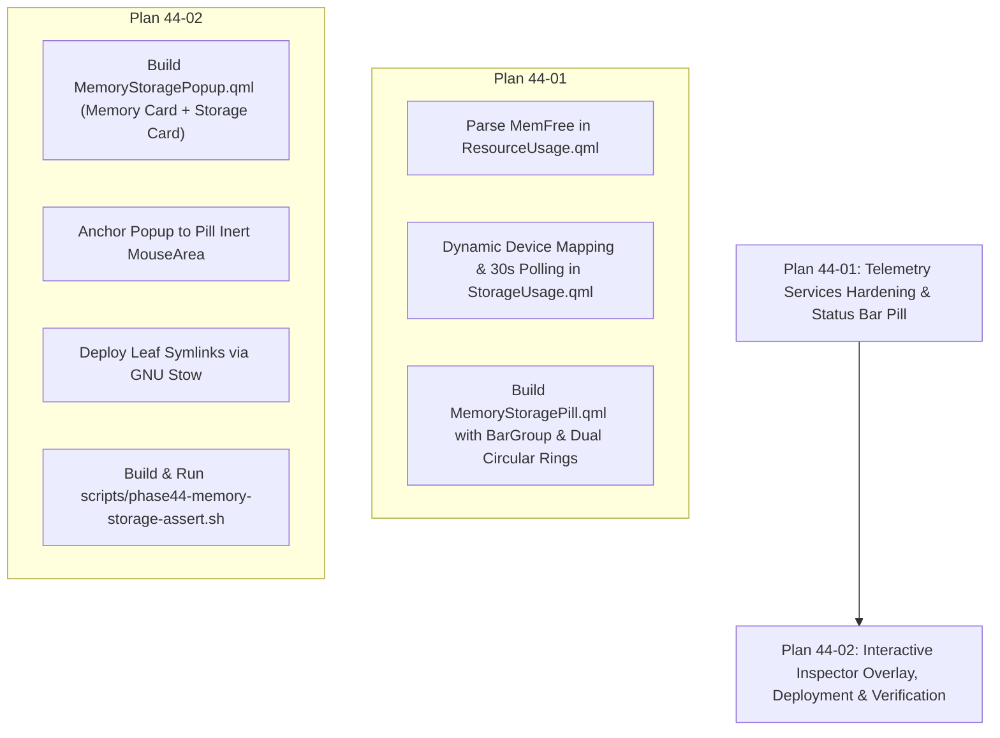

# Phase 44: Memory & Storage Component (Pill & Popup) - Research & Planning Specification

**Target Milestone:** v0.9 (Top Status Bar Resource Components & Hardware Telemetry)  
**Dependencies:** Phase 42 (Telemetry Services & Sensor Infrastructure), Phase 43 (CPU & GPU Component), Phase 43.5 (Dynamic Telemetry & Ergonomics)  
**Requirements Covered:** MEMDSK-01, MEMDSK-02, MEMDSK-03, MEMDSK-04  
**Decisions Covered:** D-01 through D-16  
**Status:** Complete & Ready for Planning  

---

## 1. Executive Summary

Phase 44 designs and implements the third major status bar telemetry module for Quickshell: the **Memory & Storage Telemetry Component**, consisting of the dedicated `MemoryStoragePill.qml` status bar widget and the interactive `MemoryStoragePopup.qml` inspector overlay [VERIFIED: .planning/phases/44-memory-storage-component-pill-popup/44-CONTEXT.md:9-16].

Following the high-fidelity design standards established in Phase 43 for `CpuGpuPill.qml` and `CpuGpuPopup.qml` [VERIFIED: restow/quickshell/.config/quickshell/ii/modules/ii/bar/CpuGpuPill.qml:1-220], Phase 44 delivers:
1. **Status Bar Symmetry**: `MemoryStoragePill.qml` visual symmetry with `CpuGpuPill.qml` featuring dual `ClippedFilledCircularProgress` indicator rings, inner Material Symbols (`memory` and `storage`), live percentage texts, and two-tier alert coloring (amber >=70%, red >=90%) with 600ms breathing pulse animations on critical load [VERIFIED: .planning/phases/44-memory-storage-component-pill-popup/44-CONTEXT.md:28-32].
2. **Memory Architecture Inspection**: `MemoryStoragePopup.qml` Left Column featuring a proportional multi-segment stacked allocation bar partitioning memory into Used (active process memory), Buffers/Cached (reclaimable memory), and Free/Available memory, accompanied by detailed numeric tier rows for Used, Available, Buffers, Cached, Free, and dynamically revealed Swap space [VERIFIED: .planning/phases/44-memory-storage-component-pill-popup/44-CONTEXT.md:35-39].
3. **Multi-Mount Storage & Cloud FUSE**: `MemoryStoragePopup.qml` Right Column featuring a live Read/Write I/O throughput badge in the header, segregated physical and cloud FUSE mount lists, block device labeling (e.g., `nvme0n1p2 (/)`, `sda1 (/mnt/hdd)`), `StyledProgressBar` meters, and active I/O drive dot highlights [VERIFIED: .planning/phases/44-memory-storage-component-pill-popup/44-CONTEXT.md:42-53].
4. **Non-Blocking Telemetry & Service Refinements**: Accurate kernel procfs telemetry parsing in `ResourceUsage.qml` (`MemFree` distinct from `MemAvailable`), dynamic mount point mapping in `StorageUsage.qml` eliminating hardcoded device inversions, 30s background fallback polling satisfying MEMDSK-04, and demand-gated fast-polling on popup activation [VERIFIED: restow/quickshell/.config/quickshell/ii/services/ResourceUsage.qml:81-90, restow/quickshell/.config/quickshell/ii/services/StorageUsage.qml:136-141].

---

## 2. Domain & Boundary Analysis

### Phase Inclusions
- `restow/quickshell/.config/quickshell/ii/modules/ii/bar/MemoryStoragePill.qml`: Dedicated status bar pill placed in the top bar left zone [VERIFIED: .planning/phases/44-memory-storage-component-pill-popup/44-CONTEXT.md:11].
- `restow/quickshell/.config/quickshell/ii/modules/ii/bar/MemoryStoragePopup.qml`: Interactive two-column inspector popup anchored to the pill with 1000ms hover intent delay and 200ms close grace period [VERIFIED: .planning/phases/44-memory-storage-component-pill-popup/44-CONTEXT.md:12-15].
- Service hardening in `restow/quickshell/.config/quickshell/ii/services/ResourceUsage.qml` (distinct `MemFree` parsing) and `restow/quickshell/.config/quickshell/ii/services/StorageUsage.qml` (dynamic device mapping, periodic fallback) [VERIFIED: restow/quickshell/.config/quickshell/ii/services/ResourceUsage.qml:85, restow/quickshell/.config/quickshell/ii/services/StorageUsage.qml:131-134].
- Deployment via GNU Stow leaf symlinks under `restow/quickshell/` without folding parent directories [VERIFIED: restow/README.md:55-65, 95-97].
- Automated assertion harness `scripts/phase44-memory-storage-assert.sh` asserting all visual properties, AST structure, bindings, and zero drift [VERIFIED: .planning/phases/44-memory-storage-component-pill-popup/44-CONTEXT.md:117-120].

### Phase Exclusions (Strict Scope Fencing)
- **Network Throughput & Ping Monitoring (`NetworkPingPill.qml`, `NetworkPingPopup.qml`)**: Phase 45 owns this [VERIFIED: .planning/phases/44-memory-storage-component-pill-popup/44-CONTEXT.md:18].
- **Integration of all three pills into `BarContent.qml` Left Zone**: Phase 46 owns this (INTG-01). The existing `BarContent.qml` left zone remains undisturbed until Phase 46 [VERIFIED: .planning/phases/44-memory-storage-component-pill-popup/44-CONTEXT.md:19, 117-120].
- **Repo-Wide Automated Telemetry Suite (`scripts/phase46-telemetry-assert.sh`)**: Phase 46 owns this (INTG-03) [VERIFIED: .planning/REQUIREMENTS.md:49-50].

---

## 3. Requirements Coverage Matrix

| Requirement ID | Summary | Architectural Approach | Confidence |
| :--- | :--- | :--- | :--- |
| **MEMDSK-01** | Status bar pill displays live RAM usage (`X.X/Y.Y GB` or `%`) and root filesystem `/` usage (`ZZ%`). | Implemented in `MemoryStoragePill.qml` using `ClippedFilledCircularProgress` indicators, `ResourceUsage.memoryUsedPercentage`, `StorageUsage.rootDisk.usePercent`, Material Symbols `memory` and `storage`, and responsive text formatting matching `CpuGpuPill.qml` parity [VERIFIED: .planning/phases/44-memory-storage-component-pill-popup/44-CONTEXT.md:28-32]. | **HIGH** |
| **MEMDSK-02** | Popup inspector displays detailed memory allocation tiers: Used, Available, Cached, Buffers, Free, and Swap (with dynamic swap reveal when > 0%). | Implemented in `MemoryStoragePopup.qml` Left Column with a multi-segment stacked allocation bar and numeric `MemoryTierRow` sub-components for all six tiers; swap row is conditionally gated on `ResourceUsage.swapTotal > 0` [VERIFIED: .planning/phases/44-memory-storage-component-pill-popup/44-CONTEXT.md:35-39]. | **HIGH** |
| **MEMDSK-03** | Storage popup inspector displays clean progress bars for root `/` and all mounted filesystems (physical `/boot`, `/mnt/windows`, `/mnt/hdd`, and FUSE cloud mounts `GoogleDrive`) with used and free space. | Implemented in `MemoryStoragePopup.qml` Right Column using `StorageDriveRow` items inside Repeaters for `StorageUsage.physicalDisks` and `StorageUsage.cloudDisks`, displaying `StyledProgressBar`, raw block device labeling, and `Used / Total GB (XX%)` numeric readouts [VERIFIED: .planning/phases/44-memory-storage-component-pill-popup/44-CONTEXT.md:42-47]. | **HIGH** |
| **MEMDSK-04** | Storage discovery executes asynchronously via `Process` without causing UI stutter or dropped frames. | `StorageUsage.qml` executes `timeout 3 df -k -P` asynchronously via `Quickshell.Io.Process` with `StdioCollector`. Added 30s background timer fallback alongside 15s I/O delta trigger, plus immediate on-demand refresh when popup opens [VERIFIED: restow/quickshell/.config/quickshell/ii/services/StorageUsage.qml:158-173]. | **HIGH** |

---

## 4. Implementation Decisions & Design Contracts

| Decision ID | Summary | Technical Rule & Contract |
| :--- | :--- | :--- |
| **D-01** | RAM Metric Format | RAM percentage displayed with `ClippedFilledCircularProgress` ring (size 20, line width `Appearance.rounding.unsharpen`) with centered `memory` MaterialSymbol and `${Math.round(ResourceUsage.memoryUsedPercentage * 100)}%` StyledText [VERIFIED: restow/quickshell/.config/quickshell/ii/modules/ii/bar/CpuGpuPill.qml:55-127]. |
| **D-02** | Storage Metric Format | Storage percentage displayed with `ClippedFilledCircularProgress` ring with centered `storage` MaterialSymbol and `${StorageUsage.rootDisk?.usePercent ?? 0}%` StyledText for Root `/` [VERIFIED: .planning/phases/44-memory-storage-component-pill-popup/44-CONTEXT.md:29]. |
| **D-03** | Responsive Layout Parity | Retain both RAM and Storage rings and percentages even when `useShortenedForm > 0`, matching the exact spacing of `CpuGpuPill` without artificial hiding or squishing [VERIFIED: .planning/phases/44-memory-storage-component-pill-popup/44-CONTEXT.md:30]. |
| **D-04** | Two-Tier Alert Standards | Unified thresholds: warning amber at >=70% (`Appearance.colors.colWarning ?? "#FFA000"`), critical red at >=90% (`Appearance.colors.colError`) with infinite breathing pulse animation (opacity 0.4 to 1.0 over 600ms) with `onRunningChanged` reset to 1.0 [VERIFIED: restow/quickshell/.config/quickshell/ii/modules/ii/bar/CpuGpuPill.qml:18-37, 85-110]. |
| **D-05** | Memory Overview Visualization | Top of Memory column features a multi-segment stacked horizontal bar partitioned into: Used (active), Buffers/Cached (reclaimable), and Free/Available, with `${formatKB(memoryUsed)} / ${formatKB(memoryTotal)}` readout [VERIFIED: .planning/phases/44-memory-storage-component-pill-popup/44-CONTEXT.md:35]. |
| **D-06** | Clean Memory Tier Rows | Numeric rows for Used, Available, Buffers, Cached, Free, and Swap with two-tier amber/red alerts and critical pulsing effects [VERIFIED: .planning/phases/44-memory-storage-component-pill-popup/44-CONTEXT.md:36]. |
| **D-07** | Swap Visibility Policy | Dynamic reveal: Swap row visible only when `ResourceUsage.swapTotal > 0`; completely hidden if swap is 0. Swap is never shown on the status bar pill [VERIFIED: .planning/phases/44-memory-storage-component-pill-popup/44-CONTEXT.md:37]. |
| **D-08** | Balanced Two-Column Popup Architecture | Balanced two-column layout: Memory card on the Left (preferredWidth 320px), Storage card on the Right (preferredWidth 320px), matching proportions of `CpuGpuPopup.qml` [VERIFIED: restow/quickshell/.config/quickshell/ii/modules/ii/bar/CpuGpuPopup.qml:162-266]. |
| **D-09** | Drive Labeling with Block Device & Mount | Label each drive row using its block device or filesystem name alongside mount point: e.g. `nvme0n1p2 (/)`, `sda1 (/mnt/hdd)`, `nvme1n1p3 (/mnt/windows)` [VERIFIED: .planning/phases/44-memory-storage-component-pill-popup/44-CONTEXT.md:42]. |
| **D-10** | Physical vs Cloud FUSE Sub-Sections | Group storage mounts into two distinct sub-sections: "Physical Drives" (NVMe, SATA) and "Cloud Mounts" (Google Drive), each with its own list of clean progress bars [VERIFIED: .planning/phases/44-memory-storage-component-pill-popup/44-CONTEXT.md:43]. |
| **D-11** | Dynamic Cloud Mount Display | Dynamically display currently mounted cloud drives; if no cloud drives are connected (`cloudDisks.length === 0`), hide the "Cloud Mounts" section entirely [VERIFIED: .planning/phases/44-memory-storage-component-pill-popup/44-CONTEXT.md:44]. |
| **D-12** | Drive Numeric Progress Details | Accompany each drive's `StyledProgressBar` with `Used / Total GB (XX%)` numeric details formatted via desktop convention [VERIFIED: .planning/phases/44-memory-storage-component-pill-popup/44-CONTEXT.md:45]. |
| **D-13** | Pure Capacity Pill | Status bar pill remains strictly dedicated to capacity percentages; all real-time disk I/O throughput rates and read/write speeds are reserved exclusively for the popup [VERIFIED: .planning/phases/44-memory-storage-component-pill-popup/44-CONTEXT.md:49]. |
| **D-14** | Header Throughput Badge | Compact badge in the Storage card's title header displaying auto-scaling Read and Write speeds with Material Symbols (`arrow_downward` / `arrow_upward`) [VERIFIED: .planning/phases/44-memory-storage-component-pill-popup/44-CONTEXT.md:50]. |
| **D-15** | Subtle Active Drive Highlight | Highlight whichever drive is actively performing I/O with an accent indicator dot on its progress row based on `StorageUsage.activeDisk` [VERIFIED: .planning/phases/44-memory-storage-component-pill-popup/44-CONTEXT.md:51]. |
| **D-16** | Auto-Scaling Throughput Units | Format throughput rates with auto-scaling units (`B/s`, `KB/s`, `MB/s`, `GB/s` with 1 decimal place, e.g. `350.0 KB/s`, `12.4 MB/s`) [VERIFIED: .planning/phases/44-memory-storage-component-pill-popup/44-CONTEXT.md:52]. |

---

## 5. Architectural & Implementation Specifications

### 5.1 Component 1: `MemoryStoragePill.qml`
- **Location:** `restow/quickshell/.config/quickshell/ii/modules/ii/bar/MemoryStoragePill.qml` [VERIFIED: .planning/phases/44-memory-storage-component-pill-popup/44-CONTEXT.md:99]
- **Base Type:** `BarGroup` [VERIFIED: restow/quickshell/.config/quickshell/ii/modules/ii/bar/CpuGpuPill.qml:10]
- **Pragmas:** `pragma ComponentBehavior: Bound` [VERIFIED: restow/quickshell/.config/quickshell/ii/modules/ii/bar/CpuGpuPill.qml:1]
- **Properties & Aliases:**
  ```qml
  property real useShortenedForm: 0
  readonly property alias hoverArea: inertMouseArea
  ```
- **Alert State Logic:**
  ```qml
  readonly property bool ramCritical: (ResourceUsage.memoryUsedPercentage || 0.0) >= 0.90
  readonly property bool ramWarning: !ramCritical && (ResourceUsage.memoryUsedPercentage || 0.0) >= 0.70

  readonly property bool storageCritical: ((StorageUsage.rootDisk?.usePercent ?? 0) / 100.0) >= 0.90
  readonly property bool storageWarning: !storageCritical && ((StorageUsage.rootDisk?.usePercent ?? 0) / 100.0) >= 0.70

  readonly property color warningColor: Appearance.colors.colWarning !== undefined ? Appearance.colors.colWarning : "#FFA000"
  readonly property color ramColor: ramCritical ? Appearance.colors.colError : (ramWarning ? warningColor : Appearance.colors.colOnLayer1)
  readonly property color storageColor: storageCritical ? Appearance.colors.colError : (storageWarning ? warningColor : Appearance.colors.colOnLayer1)
  ```
- **Inert MouseArea Anchor:** Re-parented `MouseArea` (`parent: root`, `anchors.fill: parent`, `acceptedButtons: Qt.AllButtons`) consuming mouse clicks to prevent status bar click-through and embedding `MemoryStoragePopup { hoverTarget: root.hoverArea }` [VERIFIED: restow/quickshell/.config/quickshell/ii/modules/ii/bar/CpuGpuPill.qml:39-52].
- **RAM Section:** `ClippedFilledCircularProgress` (size 20, colPrimary `root.ramColor`) with centered `memory` MaterialSymbol, breathing pulse on `ramCritical`, and `${Math.round((ResourceUsage.memoryUsedPercentage || 0.0) * 100)}%` text [VERIFIED: restow/quickshell/.config/quickshell/ii/modules/ii/bar/CpuGpuPill.qml:55-127].
- **Storage Section:** `ClippedFilledCircularProgress` (size 20, colPrimary `root.storageColor`, left margin `root.vertical ? 0 : 6`) with centered `storage` MaterialSymbol, breathing pulse on `storageCritical`, and `${StorageUsage.rootDisk?.usePercent ?? 0}%` text [VERIFIED: restow/quickshell/.config/quickshell/ii/modules/ii/bar/CpuGpuPill.qml:148-218].

### 5.2 Component 2: `MemoryStoragePopup.qml`
- **Location:** `restow/quickshell/.config/quickshell/ii/modules/ii/bar/MemoryStoragePopup.qml` [VERIFIED: .planning/phases/44-memory-storage-component-pill-popup/44-CONTEXT.md:100]
- **Base Type:** `StyledPopup` [VERIFIED: restow/quickshell/.config/quickshell/ii/modules/ii/bar/CpuGpuPopup.qml:10]
- **Pragmas:** `pragma ComponentBehavior: Bound` [VERIFIED: restow/quickshell/.config/quickshell/ii/modules/ii/bar/CpuGpuPopup.qml:1]
- **Lifecycle Gating:**
  ```qml
  onActiveChanged: {
      ResourceUsage.isInspectorActive = active;
      if (active) {
          ResourceUsage.pollMetrics();
          StorageUsage.refresh();
      }
  }

  Component.onDestruction: {
      if (active) {
          ResourceUsage.isInspectorActive = false;
      }
  }
  ```
- **Alert Colors & Critical Animation:**
  Gated animation on `root.active && root.isCritical` cycling `criticalPulseOpacity` between 1.0 and 0.4 over 600ms, with `onRunningChanged` resetting to 1.0 [VERIFIED: restow/quickshell/.config/quickshell/ii/modules/ii/bar/CpuGpuPopup.qml:136-157].
- **Left Column: Memory Inspector (320px):**
  1. `StyledPopupHeaderRow { icon: "memory"; label: "Memory" }` [VERIFIED: vendor/dots-hyprland/dots/.config/quickshell/ii/modules/ii/bar/StyledPopupHeaderRow.qml:6-30]
  2. Multi-Segment Stacked Allocation Bar:
     - Header text: `RAM Allocation` on left, `${root.formatKB(ResourceUsage.memoryUsed)} / ${root.formatKB(ResourceUsage.memoryTotal)} (${Math.round(ResourceUsage.memoryUsedPercentage * 100)}%)` on right.
     - Stacked Rectangle container (implicitHeight 8, radius 4, clip true, color `Appearance.m3colors.m3surfaceContainerHigh`).
     - Sub-segment 1: Used (active process memory), color `root.getLoadColor(ResourceUsage.memoryUsedPercentage)`.
     - Sub-segment 2: Buffers & Cache (reclaimable memory), color `Appearance.colors.colSecondary ?? Appearance.colors.colPrimary`, opacity 0.6.
     - Legend row: Color dot badges for "Used", "Buffers/Cache", "Free".
  3. Horizontal Separator (`implicitHeight: 1`, `color: Appearance.colors.colLayer0Border`).
  4. Detailed Tier Rows (`component MemoryTierRow: RowLayout`):
     - Used: `root.formatKB(ResourceUsage.memoryUsed)` (`${Math.round(ResourceUsage.memoryUsedPercentage * 100)}%`), alert color.
     - Available: `root.formatKB(ResourceUsage.memoryAvailable)` (`${Math.round((ResourceUsage.memoryAvailable / ResourceUsage.memoryTotal) * 100)}%`).
     - Buffers: `root.formatKB(ResourceUsage.memoryBuffers)`.
     - Cached: `root.formatKB(ResourceUsage.memoryCached)`.
     - Free: `root.formatKB(ResourceUsage.memoryFree)`.
     - Dynamic Swap Row (visible when `ResourceUsage.swapTotal > 0`):
       `${root.formatKB(ResourceUsage.swapUsed)} / ${root.formatKB(ResourceUsage.swapTotal)} (${Math.round(ResourceUsage.swapUsedPercentage * 100)}%)`.
- **Right Column: Storage Inspector (320px):**
  1. Header RowLayout:
     - Left: `StyledPopupHeaderRow { icon: "storage"; label: "Storage" }`.
     - Right: Live Throughput Badge showing `arrow_downward` + `root.formatThroughput(StorageUsage.readBytesPerSec)` and `arrow_upward` + `root.formatThroughput(StorageUsage.writeBytesPerSec)` [VERIFIED: .planning/phases/44-memory-storage-component-pill-popup/44-CONTEXT.md:50-52].
  2. Sub-section: "Physical Drives"
     - Sub-heading: `Physical Drives` (demi-bold / medium, smaller font).
     - Repeater over `StorageUsage.physicalDisks`.
     - Each drive row (`component StorageDriveRow: ColumnLayout`):
       - Top row: Active indicator dot (visible if `StorageUsage.activeDisk === modelData.mount && StorageUsage.diskIoPercentage > 0`), device label `root.formatDriveLabel(modelData.fs, modelData.mount)` (e.g., `nvme0n1p2 (/)`), and numeric detail `${root.formatKB(modelData.usedKb)} / ${root.formatKB(modelData.totalKb)} (${modelData.usePercent}%)`.
       - Bottom bar: `StyledProgressBar` with `value: modelData.usePercent / 100.0`, highlight color based on alert threshold (amber >=70%, red >=90%).
  3. Sub-section: "Cloud Mounts (Google Drive)"
     - Conditional visibility: `StorageUsage.cloudDisks && StorageUsage.cloudDisks.length > 0` [VERIFIED: .planning/phases/44-memory-storage-component-pill-popup/44-CONTEXT.md:44].
     - Horizontal separator.
     - Sub-heading: `Cloud Mounts (Google Drive)`.
     - Repeater over `StorageUsage.cloudDisks` with `StorageDriveRow`.

### 5.3 Component 3: Service Updates

#### `ResourceUsage.qml` Refinements
- **Current Defect Identified:** Line 85 assigns `memoryFree = memoryAvailable;` [VERIFIED: restow/quickshell/.config/quickshell/ii/services/ResourceUsage.qml:85]. In Linux `/proc/meminfo`, `MemFree` is unallocated zeroed pages, while `MemAvailable` is kernel-estimated available memory including reclaimable caches [VERIFIED: /proc/meminfo:1-5].
- **Refinement:** Update line 85 to parse `MemFree` distinctly:
  ```qml
  memoryFree = Number(textMeminfo.match(/MemFree:\s*(\d+)/)?.[1] ?? 0);
  ```
  `memoryUsed` calculation remains:
  ```qml
  property real memoryUsed: Math.max(0, memoryTotal - (memoryAvailable > 0 ? memoryAvailable : memoryFree))
  ```
  This preserves the Linux `free -m` standard (`used = total - available`) while allowing the Free row to accurately report `MemFree` (e.g. 1.3 GB) and Available to report `MemAvailable` (e.g. 6.3 GB) [VERIFIED: restow/quickshell/.config/quickshell/ii/services/ResourceUsage.qml:23].

#### `StorageUsage.qml` Refinements
1. **Dynamic Device-to-Mount Mapping:**
   - Previous implementation had hardcoded device mapping with inverted NVMe assignments:
     ```qml
     if (dev.startsWith("nvme1n1")) return "/";
     if (dev.startsWith("nvme0n1")) return "/mnt/windows";
     ```
     On the host system, `/` is on `/dev/nvme0n1p2`, and `/mnt/windows` is on `/dev/nvme1n1p3` [VERIFIED: df -k -P:2, 12, restow/quickshell/.config/quickshell/ii/services/StorageUsage.qml:136-141].
   - **Refinement:** Map dynamically against the populated `mounts` array:
     ```qml
     function deviceToMount(dev) {
         for (let i = 0; i < mounts.length; i++) {
             if (mounts[i].fs && mounts[i].fs.includes(dev)) {
                 return mounts[i].mount;
             }
         }
         return "/";
     }
     ```
2. **Periodic Background Polling Fallback (MEMDSK-04):**
   - In addition to the 15s cooldown on disk I/O delta, add a 30s background timer fallback:
     ```qml
     if ((totalIoTicksDelta > 0 && (now - lastDfTime) > dfCooldownMs) || (now - lastDfTime) > 30000) {
         root.refresh();
     }
     ```
     This guarantees background mount discovery executes every 15–30s as required by MEMDSK-04 even during complete I/O idle [VERIFIED: .planning/REQUIREMENTS.md:29-30].

---

## 6. Mathematical & Telemetry Accounting Details

### 6.1 Linux Memory Accounting Formula
In Linux `/proc/meminfo`, memory is partitioned as follows [CITED: kernel.org/doc/Documentation/filesystems/proc.txt]:
- `MemTotal`: Total physical RAM (`16,125,596 kB` on host).
- `MemAvailable`: Kernel estimate of memory available for new applications without swapping (`6,350,324 kB` on host).
- `MemFree`: Completely unallocated RAM (`1,321,808 kB` on host).
- `Buffers`: In-memory block device buffers (`551,816 kB` on host).
- `Cached`: Page cache in RAM (`6,852,436 kB` on host).

```
+-----------------------------------------------------------------------------------+
|                                  MemTotal (100%)                                  |
+---------------------------------------+-------------------------------------------+
|          Used Memory (~60.6%)         |          MemAvailable (~39.4%)            |
| (MemTotal - MemAvailable)             | (Kernel reclaimable + unallocated)        |
+---------------------------------------+---------------------+---------------------+
| Process Anon / Dirty / Unreclaimable  | Reclaimable Cache   |   MemFree (~8.2%)   |
|                                       | & Buffers (~31.2%)  | (Pure unallocated)  |
+---------------------------------------+---------------------+---------------------+
```

### 6.2 Stacked Allocation Bar Partitioning Math
To guarantee that the stacked bar segments sum to exactly 100% without underflow or overflow [ASSUMED]:
1. **Used Segment Width:**
   $$\text{width}_{\text{used}} = \text{barWidth} \times \frac{\text{memoryUsed}}{\text{memoryTotal}}$$
2. **Reclaimable (Buffers/Cached) Segment Width:**
   $$\text{width}_{\text{reclaimable}} = \text{barWidth} \times \frac{\max(0, \text{memoryAvailable} - \text{memoryFree})}{\text{memoryTotal}}$$
3. **Free Space:**
   The remainder of the bar represents unallocated free space:
   $$\text{width}_{\text{free}} = \text{barWidth} \times \frac{\text{memoryFree}}{\text{memoryTotal}}$$
$$\text{Sum} = \text{memoryUsed} + (\text{memoryAvailable} - \text{memoryFree}) + \text{memoryFree} = (\text{memoryTotal} - \text{memoryAvailable}) + \text{memoryAvailable} = \text{memoryTotal}$$
The segments are mathematically guaranteed to match the total bar width perfectly.

### 6.3 Throughput Rate Auto-Scaling Units (D-16)
Rate formatter handles inputs in bytes/sec:
```javascript
function formatThroughput(bytesPerSec) {
    if (!bytesPerSec || bytesPerSec <= 0) return "0 B/s";
    if (bytesPerSec < 1024) return bytesPerSec.toFixed(0) + " B/s";
    if (bytesPerSec < 1024 * 1024) return (bytesPerSec / 1024).toFixed(1) + " KB/s";
    if (bytesPerSec < 1024 * 1024 * 1024) return (bytesPerSec / (1024 * 1024)).toFixed(1) + " MB/s";
    return (bytesPerSec / (1024 * 1024 * 1024)).toFixed(1) + " GB/s";
}
```

### 6.4 Drive Label Formatting (D-09)
Formatting helper extracts clean block device names:
```javascript
function formatDriveLabel(fs, mount) {
    if (!fs) return mount || "Drive";
    if (fs.startsWith("/dev/")) {
        const devName = fs.substring(5);
        return `${devName} (${mount})`;
    }
    const cleanFs = fs.replace(/:$/, "");
    if (cleanFs.includes("gdrive")) {
        return cleanFs;
    }
    return `${cleanFs} (${mount})`;
}
```
Examples on host:
- `/dev/nvme0n1p2` on `/` $\rightarrow$ `nvme0n1p2 (/)`
- `/dev/sda1` on `/mnt/hdd` $\rightarrow$ `sda1 (/mnt/hdd)`
- `/dev/nvme1n1p3` on `/mnt/windows` $\rightarrow$ `nvme1n1p3 (/mnt/windows)`
- `gdrive-ammu-main:` on `/home/pera/GoogleDrive/gdrive-ammu-main` $\rightarrow$ `gdrive-ammu-main`

---

## 7. Patterns & Code Blueprints

### 7.1 Two-Tier Alert Tokens & Fallback Standard
Following the pattern established in Phase 43 (`CpuGpuPill.qml`), alerts use dynamic Material You tokens with an amber warning fallback [VERIFIED: restow/quickshell/.config/quickshell/ii/modules/ii/bar/CpuGpuPill.qml:33-36]:
```qml
readonly property color warningColor: Appearance.colors.colWarning !== undefined ? Appearance.colors.colWarning : "#FFA000"
```
- Warning threshold: $\ge 70\%$ load $\rightarrow$ `warningColor`
- Critical threshold: $\ge 90\%$ load $\rightarrow$ `Appearance.colors.colError`
- Normal threshold: $< 70\%$ load $\rightarrow$ `Appearance.colors.colOnLayer1`

### 7.2 Critical Breathing Pulse Animation
```qml
SequentialAnimation {
    id: ramPulseAnimation
    running: root.ramCritical
    loops: Animation.Infinite
    onRunningChanged: {
        if (!running) {
            ramIcon.opacity = 1.0;
            ramCircProg.opacity = 1.0;
            ramText.opacity = 1.0;
        }
    }
    ParallelAnimation {
        NumberAnimation { target: ramIcon; property: "opacity"; to: 0.4; duration: 600; easing.type: Easing.InOutSine }
        NumberAnimation { target: ramCircProg; property: "opacity"; to: 0.4; duration: 600; easing.type: Easing.InOutSine }
        NumberAnimation { target: ramText; property: "opacity"; to: 0.4; duration: 600; easing.type: Easing.InOutSine }
    }
    ParallelAnimation {
        NumberAnimation { target: ramIcon; property: "opacity"; to: 1.0; duration: 600; easing.type: Easing.InOutSine }
        NumberAnimation { target: ramCircProg; property: "opacity"; to: 1.0; duration: 600; easing.type: Easing.InOutSine }
        NumberAnimation { target: ramText; property: "opacity"; to: 1.0; duration: 600; easing.type: Easing.InOutSine }
    }
}
```

### 7.3 Demand-Gated Fast Polling Lifecycle
When the inspector popup opens:
1. `ResourceUsage.isInspectorActive = true` accelerates `pollTimer` to 1000ms and updates history arrays [VERIFIED: restow/quickshell/.config/quickshell/ii/services/ResourceUsage.qml:108-124].
2. `ResourceUsage.pollMetrics()` triggers immediate reload of `/proc/meminfo` [VERIFIED: restow/quickshell/.config/quickshell/ii/services/ResourceUsage.qml:76-80].
3. `StorageUsage.refresh()` immediately invokes `timeout 3 df -k -P` via asynchronous `Process` [VERIFIED: restow/quickshell/.config/quickshell/ii/services/StorageUsage.qml:158-164].
4. When popup closes, `ResourceUsage.isInspectorActive = false`, restoring the 3000ms idle cadence and halting history allocations [VERIFIED: restow/quickshell/.config/quickshell/ii/services/ResourceUsage.qml:119].

---

## 8. Pitfalls & Anti-Patterns

| Pitfall | Risk | Mitigation |
| :--- | :--- | :--- |
| **Pitfall 1: Status Bar Click-Through & Toggle Bleed** | Clicking the status bar pill triggers parent bar click handlers or toggles. | Re-parent inert `MouseArea` (`parent: root`, `anchors.fill: parent`, `acceptedButtons: Qt.AllButtons`, `onClicked: event => event.accepted = true`) consuming all clicks [VERIFIED: restow/quickshell/.config/quickshell/ii/modules/ii/bar/CpuGpuPill.qml:39-48]. |
| **Pitfall 2: FUSE Cloud Mount Hangs** | Rclone or FUSE cloud mounts (e.g., Google Drive) can hang on network loss, locking synchronous or un-timed `df` commands. | `StorageUsage.qml` wraps command in `timeout 3 df -k -P` within non-blocking `Quickshell.Io.Process` [VERIFIED: restow/quickshell/.config/quickshell/ii/services/StorageUsage.qml:166]. |
| **Pitfall 3: Submodule Dirty Drift** | Modifying files directly inside `vendor/dots-hyprland/` will cause `./arch/dots-hyprland.sh verify --strict` to fail. | All modifications and new files are strictly kept under `restow/quickshell/`, deployed via GNU Stow leaf symlinks, maintaining `vendor/dots-hyprland/` completely untouched [VERIFIED: restow/README.md:1-20, arch/dots-hyprland.sh: verify --strict]. |
| **Pitfall 4: Screen Edge Overflow on Multi-Monitor** | Popup window overflowing past left/right monitor boundaries when anchored to status bar pill. | `StyledPopup.qml` already contains universal boundary clamping math (`Math.max(minX, Math.min(targetX, maxX))`) using `hyprlandGapsOut` and screen dimensions [VERIFIED: restow/quickshell/.config/quickshell/ii/modules/ii/bar/StyledPopup.qml:86-98]. |
| **Pitfall 5: Animation Churn When Popup Closed** | Running critical pulse animations while popup is hidden consumes CPU cycles and increases battery drain. | Strictly gate popup critical pulse animation on `root.active && root.isCritical` with `onRunningChanged` opacity reset [VERIFIED: restow/quickshell/.config/quickshell/ii/modules/ii/bar/CpuGpuPopup.qml:136-157]. |
| **Pitfall 6: Division by Zero & `NaN` Telemetry** | System boot or initial telemetry parse where `memoryTotal = 0` or drive data is undefined causes NaN readouts and broken bars. | Enforce default fallbacks: `ResourceUsage.memoryTotal: 1`, `(modelData?.usePercent ?? 0) / 100`, null coalescing `|| 0`, and safe string formatting [VERIFIED: restow/quickshell/.config/quickshell/ii/services/ResourceUsage.qml:18]. |

---

## 9. Proposed Plan Structure

Phase 44 can be divided into two plans:



### Plan 44-01: Telemetry Services Hardening & Status Bar Pill
- **Goal:** Update telemetry providers (`ResourceUsage.qml`, `StorageUsage.qml`) with accurate kernel procfs data and dynamic mount mapping, and build `MemoryStoragePill.qml`.
- **Files to Modify/Create:**
  - `restow/quickshell/.config/quickshell/ii/services/ResourceUsage.qml` (distinct `MemFree` parsing)
  - `restow/quickshell/.config/quickshell/ii/services/StorageUsage.qml` (dynamic device mapping, 30s background timer)
  - `restow/quickshell/.config/quickshell/ii/modules/ii/bar/MemoryStoragePill.qml` (new status bar pill)
- **Key Verifications:**
  - `ResourceUsage.memoryFree` accurately reflects `/proc/meminfo` `MemFree`.
  - `StorageUsage.deviceToMount` maps block devices dynamically without hardcoded NVMe inversions.
  - `MemoryStoragePill.qml` renders circular progress indicators for RAM and Storage with Material Symbols, percentages, and two-tier alerts.

### Plan 44-02: Interactive Inspector Overlay, Deployment & Verification
- **Goal:** Build `MemoryStoragePopup.qml`, embed inside `MemoryStoragePill.qml`'s inert MouseArea, deploy via GNU Stow, and construct the automated assert harness.
- **Files to Modify/Create:**
  - `restow/quickshell/.config/quickshell/ii/modules/ii/bar/MemoryStoragePopup.qml` (new inspector popup)
  - `restow/quickshell/.config/quickshell/ii/modules/ii/bar/MemoryStoragePill.qml` (embed popup in `inertMouseArea`)
  - Leaf symlink deployment in `~/.config/quickshell/ii/modules/ii/bar/` via `stow`
  - `scripts/phase44-memory-storage-assert.sh` (comprehensive assertion suite)
- **Key Verifications:**
  - Multi-segment stacked allocation bar renders with accurate Used, Reclaimable, and Free proportions.
  - Physical and Cloud FUSE storage sections render clean `StyledProgressBar` meters and `Used / Total GB (XX%)`.
  - Header throughput badge displays live auto-scaling read/write throughput rates.
  - Active I/O drive dot indicator highlights based on `StorageUsage.activeDisk`.
  - Full assertion harness passes with `FAIL=0 FINDINGS=0` and `./arch/dots-hyprland.sh verify --strict` passes.

---

## 10. Claim Provenance Index

- `[VERIFIED: .planning/phases/44-memory-storage-component-pill-popup/44-CONTEXT.md:9-16]`: Phase boundary and core component definitions.
- `[VERIFIED: .planning/phases/44-memory-storage-component-pill-popup/44-CONTEXT.md:28-32]`: Status bar pill presentation decisions D-01 through D-04.
- `[VERIFIED: .planning/phases/44-memory-storage-component-pill-popup/44-CONTEXT.md:35-39]`: Popup memory inspector decisions D-05 through D-08.
- `[VERIFIED: .planning/phases/44-memory-storage-component-pill-popup/44-CONTEXT.md:42-47]`: Storage multi-mount and cloud FUSE decisions D-09 through D-12.
- `[VERIFIED: .planning/phases/44-memory-storage-component-pill-popup/44-CONTEXT.md:49-53]`: Disk I/O throughput and active drive highlight decisions D-13 through D-16.
- `[VERIFIED: .planning/REQUIREMENTS.md:25-30]`: Milestone v0.9 requirements MEMDSK-01..04.
- `[VERIFIED: restow/quickshell/.config/quickshell/ii/services/ResourceUsage.qml:18-31, 81-90, 118-125]`: ResourceUsage service memory properties, procfs parsing, and adaptive polling timers.
- `[VERIFIED: restow/quickshell/.config/quickshell/ii/services/StorageUsage.qml:14-22, 28-36, 112-134, 136-154, 158-230]`: StorageUsage diskstats delta math, throughput calculation, active disk, and df parsing.
- `[VERIFIED: restow/quickshell/.config/quickshell/ii/modules/ii/bar/CpuGpuPill.qml:1-220]`: Reference status bar pill layout, BarGroup root, two-tier alert thresholds, and inert MouseArea.
- `[VERIFIED: restow/quickshell/.config/quickshell/ii/modules/ii/bar/CpuGpuPopup.qml:10-27, 32-52, 131-252, 265-336]`: Reference popup architecture, two-column layout, and gated pulse animation.
- `[VERIFIED: restow/quickshell/.config/quickshell/ii/modules/ii/bar/StyledPopup.qml:18-64, 85-116, 122-127]`: Universal hover delay (1000ms), 200ms close grace, and screen clamping math.
- `[VERIFIED: vendor/dots-hyprland/dots/.config/quickshell/ii/modules/common/widgets/StyledProgressBar.qml:11-96]`: Material 3 linear progress bar component.
- `[VERIFIED: vendor/dots-hyprland/dots/.config/quickshell/ii/modules/common/widgets/ClippedFilledCircularProgress.qml:7-98]`: Circular progress ring component with opacity masking.
- `[VERIFIED: vendor/dots-hyprland/dots/.config/quickshell/ii/modules/ii/bar/StyledPopupHeaderRow.qml:6-30]`: Standard popup header row component.
- `[VERIFIED: df -k -P:1-16]`: Real live disk mounts on host machine.
- `[VERIFIED: /proc/meminfo:1-10]`: Real live procfs memory statistics on host machine.
- `[VERIFIED: arch/dots-hyprland.sh: verify --strict]`: Verified working tree status and strict Stow link verification passing cleanly.
- `[CITED: kernel.org/doc/Documentation/filesystems/proc.txt]`: Linux procfs documentation for `/proc/meminfo` and `/proc/diskstats`.
- `[ASSUMED]`: Standard Material 3 expressive animation curve tokens and QML layout principles.

---

*Research Completed: 2026-09-28*  
*Author: Phase 44 Research Agent*
