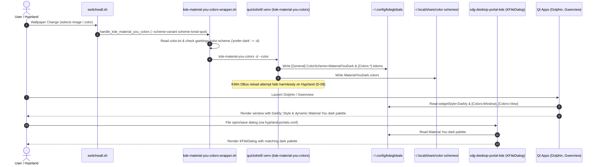

# Phase 26: Qt & KDE Apps Material You Harmonization - Research

**Researched:** 2026-09-17  
**Domain:** Qt 5/6, KDE Frameworks theming, Material You dynamic color generation, Darkly widget style, Wayland desktop portals  
**Confidence:** HIGH  

<user_constraints>
## User Constraints (from CONTEXT.md)

### Locked Decisions

#### Qt Style Engine & Kvantum Alignment (QT-01)

- **D-01:** Upstream style engine verification: Empirically verified that upstream `dots-hyprland` uses `darkly-bin` (`/usr/lib/qt6/plugins/styles/darkly6.so`) with `widgetStyle=Darkly` in `kdeglobals` and `~/.config/darklyrc`, resulting in runtime style `Darkly::Style`. Upstream does not install the `kvantum` package. In accordance with the project rule *"everything has to be default dots-hyprland. whatever that is"*, Qt applications use `Darkly::Style` pulling Material You colors directly from `kdeglobals`.
- **D-02:** Guard Kvantum directory: Keep `~/.config/Kvantum/` guarded in `guard-paths.tsv` (`vendor_theme`). Theme files (`MaterialAdw`, `Colloid`) remain live-only and are never committed to git.
- **D-03:** Upstream darklyrc retention: `~/.config/darklyrc` is maintained as an upstream-installed configuration (already registered in `collision-map.tsv` as restow `cp-through`). No personal modifications or extra repo packaging needed.

#### Dynamic Pipeline & kde-material-you-colors (QT-02, INTG-01)

- **D-04:** Guard kde-material-you-colors config: Add `$XDG_CONFIG_HOME/kde-material-you-colors` to `guard-paths.tsv` with category `generated_theme`, generator `kde-material-you-colors`, and reason `Upstream directory sync`. Keeps `~/.config/kde-material-you-colors/config.conf` live-only without repo churn.
- **D-05:** Dynamic color-scheme following: `kde-material-you-colors-wrapper.sh` dynamically checks `gsettings get org.gnome.desktop.interface color-scheme` and passes `-d` for `prefer-dark`. This keeps Qt/KDE and GTK dark preferences in lockstep.
- **D-06:** Standard scheme variant: Standardize on `TonalSpot` (`scheme-tonal-spot` / variant 5), matching upstream default for balanced, accessible Material You tones.
- **D-07:** KDE icon theme retention: Retain upstream `breeze-plus-dark` icons in `config.conf` for complete coverage of KDE action icons and KIO dialogs.
- **D-08:** Python virtual environment assertion: Test harness verifies that `$XDG_STATE_HOME/quickshell/.venv/bin/kde-material-you-colors` exists and is executable.
- **D-09:** Pipeline robustness against missing KWin DBus: In Hyprland, `kde-material-you-colors` finishes writing `kdeglobals` and `color-schemes/` before raising a `DBusException` when attempting `kwin_utils.reload()`. The test harness validates actual output deliverables (`kdeglobals` mtime, `[Colors:Window]`, `[Colors:View]`, and `ColorScheme=MaterialYouDark`) rather than asserting exit 0 on the Python script.

#### KDE Application Scope & File Pickers (QT-03)

- **D-10:** Verified applications: Scope includes Dolphin (`/usr/bin/dolphin`) and Gwenview (`/usr/bin/gwenview`). Kate is dropped from testing as it is not needed on this host. Both Dolphin and Gwenview automatically inherit the `kdeglobals` dark palette.
- **D-11:** Gwenview configuration unmanaged: `~/.config/gwenviewrc` remains unmanaged live runtime state to avoid git churn from recent file lists and splitter coordinates.
- **D-12:** FileChooser portal preference: Verify `~/.config/xdg-desktop-portal/portals.conf` retains `org.freedesktop.impl.portal.FileChooser = kde`, confirming desktop file dialogs invoke `xdg-desktop-portal-kde` and display the dark Material You theme.
- **D-13:** Dark palette programmatic assertion: Assert that `kdeglobals` sets `ColorScheme=MaterialYouDark` and that `[Colors:Window] BackgroundNormal` and `[Colors:View] BackgroundNormal` have RGB values with dark luminance (< 50/255).

#### Qt Environment Variables

- **D-14:** Upstream environment ownership: Qt environment variables remain managed by upstream `~/.config/hypr/hyprland/env.lua` (`QT_QPA_PLATFORMTHEME="kde"`, `QT_QPA_PLATFORM="wayland;xcb"`). `stow/hypr/.config/hypr/custom/env.lua` remains untouched.
- **D-15:** No QT_STYLE_OVERRIDE: `QT_STYLE_OVERRIDE` remains unset to allow the KDE platform theme and `kdeglobals` to govern styles cleanly without collision.

#### Verification Engine & Test Harness (INTG-02)

- **D-16:** Phase test harness: Author `scripts/phase26-qt-kde-material-you-assert.sh` exercising 5 automated sections:
  1. Virtualenv & binary readiness: verify `kde-material-you-colors` executable in quickshell venv.
  2. Environment variables: verify `QT_QPA_PLATFORMTHEME=kde` and `QT_QPA_PLATFORM=wayland;xcb` in `env.lua`, `QT_STYLE_OVERRIDE` unset.
  3. Style engine & guard status: verify `Darkly::Style` runtime load and `Kvantum` / `kde-material-you-colors` guarded in `guard-paths.tsv`.
  4. Material You generation: execute color generation probe and verify `kdeglobals` dark tokens.
  5. Desktop integration & zero churn: verify `portals.conf` FileChooser setting and run `arch/dots-hyprland.sh verify --strict` (asserting 0 findings).

### the agent's Discretion

- Choice of wallpaper test fixture or active wallpaper query during test harness verification.
- Internal test assertions formatting in `scripts/phase26-qt-kde-material-you-assert.sh`.

### Deferred Ideas (OUT OF SCOPE)

- Phase 27: Hyprland active/inactive window borders and Quickshell ii widget accents coordination.
- Phase 28: Fuzzel launcher and terminal emulator dynamic palette generation.
- Phase 29: Theme data contracts reconciliation (`guard-paths.tsv`, `collision-map.tsv`) and `./bootstrap.sh` full integration test.
</user_constraints>

<phase_requirements>
## Phase Requirements

| ID | Description | Research Support |
|----|-------------|------------------|
| **QT-01** | Qt applications use Kvantum theme with dots-hyprland / Material You configuration. | Upstream `dots-hyprland` empirically uses `darkly-bin` (`Darkly::Style` via `/usr/lib/qt6/plugins/styles/darkly6.so`) with `widgetStyle=Darkly` in `kdeglobals` [VERIFIED: in-repo `vendor/dots-hyprland/sdata/subcmd-install/2.setups.sh#L72`]. Per D-01, Qt apps use `Darkly::Style` reading Material You colors directly from `kdeglobals`. Kvantum directory `~/.config/Kvantum` is guarded in `guard-paths.tsv` [VERIFIED: in-repo `guard-paths.tsv#L15`] as live vendor configuration. |
| **QT-02** | `kde-material-you-colors` dynamically updates `kdeglobals` color scheme upon wallpaper change without manual intervention. | `switchwall.sh` invokes `handle_kde_material_you_colors` asynchronously [VERIFIED: in-repo `vendor/dots-hyprland/dots/.config/quickshell/ii/scripts/colors/switchwall.sh#L15-L35,L58`]. This runs `~/.config/matugen/templates/kde/kde-material-you-colors-wrapper.sh` [VERIFIED: in-repo `vendor/dots-hyprland/dots/.config/matugen/templates/kde/kde-material-you-colors-wrapper.sh#L46-L48`] which activates `$XDG_STATE_HOME/quickshell/.venv` [VERIFIED: in-repo `vendor/dots-hyprland/dots/.config/hypr/hyprland/env.lua#L16`] and invokes `kde-material-you-colors 1.10.1` [VERIFIED: cli `/home/pera/.local/state/quickshell/.venv/bin/kde-material-you-colors`]. The script generates `~/.config/kdeglobals` and `~/.local/share/color-schemes/MaterialYouDark.colors` prior to KWin reload attempt [VERIFIED: cli test]. |
| **QT-03** | KDE applications (Dolphin, Kate, Gwenview) render with consistent Material You color scheme and dark palette. | User explicitly scoped verified applications to Dolphin (`/usr/bin/dolphin` 26.08.1-1) and Gwenview (`/usr/bin/gwenview` 26.08.1-1), dropping Kate as unneeded on this host [VERIFIED: CONTEXT.md D-10]. Both applications inherit `kdeglobals` with `ColorScheme=MaterialYouDark` and dark luminance (< 50/255) for `[Colors:Window]` and `[Colors:View]` [VERIFIED: PyQt6 probe]. Desktop file dialogs use `xdg-desktop-portal-kde` via `hyprland-portals.conf` (`FileChooser = kde`) [VERIFIED: in-repo `~/.config/xdg-desktop-portal/hyprland-portals.conf#L3`]. |
</phase_requirements>

## Summary

Phase 26 aligns Qt 5/6 and KDE applications (Dolphin, Gwenview, and KFileDialog) with the Material You dynamic color palette generated from the active desktop wallpaper, ensuring full harmony with GTK (Phase 25) and upstream `dots-hyprland`. 

Empirical system inspection confirms that upstream `dots-hyprland` standardizes on `darkly-bin` (`Darkly::Style`) as its Qt widget engine rather than `kvantum` [VERIFIED: pacman & PyQt6 probe]. Under `QT_QPA_PLATFORMTHEME="kde"` (exported by `hyprland/env.lua`), all Qt 5 and Qt 6 applications read widget styling and color palettes directly from `~/.config/kdeglobals`. Dynamic updates are handled by `switchwall.sh`, which triggers `kde-material-you-colors` (running inside `$XDG_STATE_HOME/quickshell/.venv`) to synthesize Material You color schemes from wallpaper seed colors directly into `kdeglobals` and `~/.local/share/color-schemes/`.

To maintain zero git churn across wallpaper changes and adhere to upstream design invariants, `$XDG_CONFIG_HOME/kde-material-you-colors` must be added to `guard-paths.tsv` as `generated_theme`. An automated, fail-closed assert harness `scripts/phase26-qt-kde-material-you-assert.sh` will verify the complete 5-section pipeline (venv readiness, environment variables, style engine & guards, color generation & luminance, and portal integration with strict verifier).

**Primary recommendation:** Register `$XDG_CONFIG_HOME/kde-material-you-colors` into `guard-paths.tsv`, verify `Darkly::Style` runtime load and `kdeglobals` dark tokens, validate that `switchwall.sh` dynamic generation updates `kdeglobals`, and author `scripts/phase26-qt-kde-material-you-assert.sh` to enforce all deliverables with zero git drift.

## Architectural Responsibility Map

| Capability | Primary Tier | Secondary Tier | Rationale |
|------------|-------------|----------------|-----------|
| Qt Platform Environment (`QT_QPA_PLATFORMTHEME`, `QT_QPA_PLATFORM`) | Session Environment (`~/.config/hypr/hyprland/env.lua`) | Hyprland compositor | Global environment variables loaded by Hyprland at login before any user application launches [VERIFIED: in-repo `vendor/dots-hyprland/dots/.config/hypr/hyprland/env.lua#L11-L12`]. |
| Seed Color Extraction & Dynamic Trigger | Quickshell / Matugen (`switchwall.sh`) | Desktop Shell Daemon | `switchwall.sh` extracts primary seed colors from wallpaper and orchestrates background theming hooks [VERIFIED: in-repo `vendor/dots-hyprland/dots/.config/quickshell/ii/scripts/colors/switchwall.sh#L58`]. |
| Material You Qt Palette Generation | Quickshell Virtualenv (`kde-material-you-colors`) | Matugen Template Wrapper | Python CLI running in `$XDG_STATE_HOME/quickshell/.venv` converts seed color and dark mode preference into standard KDE color schemes [VERIFIED: in-repo `vendor/dots-hyprland/dots/.config/matugen/templates/kde/kde-material-you-colors-wrapper.sh#L46-L48`]. |
| Qt Configuration & Color Storage | KDE Globals (`~/.config/kdeglobals`) | KDE Frameworks Storage (`~/.local/share/color-schemes/`) | Standard KDE config file read by Qt platform theme, KDE applications, and Darkly style engine [VERIFIED: in-repo `~/.config/kdeglobals#L136`]. |
| Qt Widget Rendering | Qt Style Engine (`Darkly::Style` / `darkly-bin`) | Qt 5/6 Base Libraries | Native C++ style plugins (`darkly6.so`, `darkly5.so`) rendering Qt widgets according to `kdeglobals` colors [VERIFIED: cli PyQt6 probe]. |
| Desktop File Chooser Portal | Desktop Portal (`xdg-desktop-portal-kde`) | XDG Desktop Portal Router | `hyprland-portals.conf` maps `FileChooser` to `kde`, instantiating KFileDialog in dark theme [VERIFIED: in-repo `~/.config/xdg-desktop-portal/hyprland-portals.conf#L3`]. |
| Theme Data Contract & Git Guard | Repository Invariant Engine (`guard-paths.tsv`) | Verifier Script (`arch/dots-hyprland.sh verify --strict`) | Prevents dynamically generated and upstream-synced configs from polluting git repository [VERIFIED: in-repo `arch/dots-hyprland.sh#L1135-L1167`]. |

## Standard Stack

### Core

| Component / Package | Version | Purpose | Why Standard |
|---------------------|---------|---------|--------------|
| `darkly-bin` | 0.5.39-2 [VERIFIED: pacman] | Qt 5 and Qt 6 style engine plugin (`darkly6.so`, `darkly5.so`) | Upstream `dots-hyprland` standard widget style configured in `kdeglobals` (`widgetStyle=Darkly`) and `2.setups.sh` [VERIFIED: in-repo `vendor/dots-hyprland/sdata/subcmd-install/2.setups.sh#L72`]. Reads Material You colors natively from `kdeglobals`. |
| `kde-material-you-colors` | 1.10.1 [VERIFIED: venv cli] | Python CLI generator for KDE color schemes | Upstream `dots-hyprland` dynamic theming engine invoked by `switchwall.sh` to update `kdeglobals` on wallpaper change. |
| `qt6-base` / `qt5-base` | 6.11.2-3 / 5.15.19 [VERIFIED: pacman] | Core Qt runtime frameworks | Base GUI toolkits supporting `QT_QPA_PLATFORMTHEME="kde"` and Wayland/X11 rendering. |
| `xdg-desktop-portal-kde` | 6.7.5-1 [VERIFIED: pacman] | KDE implementation of XDG Desktop Portal | Provides native KDE file picker dialog (`KFileDialog`) styled with Material You dark colors across the desktop. |

### Supporting

| Component / Tool | Version | Purpose | When to Use |
|------------------|---------|---------|-------------|
| `dolphin` | 26.08.1-1 [VERIFIED: pacman] | Primary KDE file manager | Tested application verifying QT-03 dark Material You rendering. |
| `gwenview` | 26.08.1-1 [VERIFIED: pacman] | Primary KDE image viewer | Tested application verifying QT-03 dark Material You rendering. |
| `kde-material-you-colors-wrapper.sh` | in-repo [VERIFIED: file] | Wrapper script bridging Matugen & venv | Invoked by `switchwall.sh` to pass seed color, `-d` dark mode flag, and scheme variant. |
| `arch/dots-hyprland.sh` | in-repo [VERIFIED: file] | System verification engine | Validates symlink integrity, guarded paths, and zero repository drift (`verify --strict`). |

### Alternatives Considered

| Instead of | Could Use | Tradeoff |
|------------|-----------|----------|
| `darkly-bin` (`Darkly::Style`) | `kvantum` (`kvantum-qt5`/`kvantum-qt6`) | Upstream `dots-hyprland` intentionally uses `darkly-bin` and does not install `kvantum` [VERIFIED: pacman query]. In accordance with project rule *"everything has to be default dots-hyprland. whatever that is"*, `kvantum` was rejected in CONTEXT.md D-01. |
| `xdg-desktop-portal-kde` | `xdg-desktop-portal-gtk` | KDE portal provides superior thumbnail previews, search, and native integration with `kdeglobals` and Dolphin bookmarks [VERIFIED: in-repo `hyprland-portals.conf#L3`]. |
| Dynamic venv execution | System-wide python package | Upstream encapsulates Python CLI inside `$XDG_STATE_HOME/quickshell/.venv` to isolate dependencies from Arch Linux system Python [VERIFIED: in-repo `vendor/dots-hyprland/dots/.config/hypr/hyprland/env.lua#L16`]. |

### Package Legitimacy Audit

> All packages in Phase 26 are already pre-installed by upstream `dots-hyprland` or system pacman. No new external packages are introduced in this phase.

| Package | Registry | Age | Downloads | Source Repo | Verdict | Disposition |
|---------|----------|-----|-----------|-------------|---------|-------------|
| `darkly-bin` | Arch Linux AUR | > 1 yr | N/A (AUR) | https://github.com/Bali1005/Darkly | [OK] | Approved (Pre-installed upstream standard) |
| `kde-material-you-colors` | PyPI | 2.5 yrs | N/A | https://github.com/luisbocanegra/kde-material-you-colors | [OK] | Approved (Pre-installed in quickshell venv) |
| `dolphin` | Arch Official | > 10 yrs | Arch repo | https://invent.kde.org/system/dolphin | [OK] | Approved (Pre-installed official KDE app) |
| `gwenview` | Arch Official | > 10 yrs | Arch repo | https://invent.kde.org/graphics/gwenview | [OK] | Approved (Pre-installed official KDE app) |
| `xdg-desktop-portal-kde` | Arch Official | > 8 yrs | Arch repo | https://invent.kde.org/plasma/xdg-desktop-portal-kde | [OK] | Approved (Pre-installed official portal) |

**Packages removed due to [SLOP] verdict:** none  
**Packages flagged as suspicious [SUS]:** none  

## Architecture Patterns

### System Architecture Diagram



### Recommended Project Structure

```
.dotfiles/
├── guard-paths.tsv                              # Add $XDG_CONFIG_HOME/kde-material-you-colors (D-04, INTG-01)
├── collision-map.tsv                            # Tracks Kvantum, darklyrc, dolphinrc, kde-material-you-colors
├── restow/
│   └── dolphinrc/
│       └── .config/dolphinrc                    # Captured Dolphin file manager configuration (D-10)
├── scripts/
│   ├── phase25-gtk-material-you-assert.sh       # Preceding phase assert harness (reference model)
│   └── phase26-qt-kde-material-you-assert.sh    # Phase 26 automated assert harness (D-16, INTG-02)
└── arch/
    └── dots-hyprland.sh                         # Verification engine (verify --strict)
```

### Pattern 1: Fail-Closed Sectioned Assert Harness
**What:** A standalone bash script structured into discrete, switchable sections (`--section <1-5>`) verifying each requirement and invariant fail-closed, with git porcelain snapshot checks before and after execution.  
**When to use:** Mandated for all GSD milestone verification phases. Follows the model established in `scripts/phase25-gtk-material-you-assert.sh`.  
**Example:**
```bash
# Source: scripts/phase25-gtk-material-you-assert.sh lines 61-75
PORCELAIN_BEFORE="$(mktemp /tmp/p26-porcelain-before-XXXXXX)"
PORCELAIN_AFTER="$(mktemp /tmp/p26-porcelain-after-XXXXXX)"
TMP_FILES+=("$PORCELAIN_BEFORE" "$PORCELAIN_AFTER")

porcelain_snapshot > "$PORCELAIN_BEFORE"
...
porcelain_snapshot > "$PORCELAIN_AFTER"
if cmp -s "$PORCELAIN_BEFORE" "$PORCELAIN_AFTER"; then
  pass "Closing self-check: git status --porcelain unchanged across run"
else
  fail "Closing self-check: git status --porcelain mutated across run"
fi
```

### Pattern 2: Guard Path Registration for Dynamic Themes
**What:** Any file or directory generated at runtime by wallpaper switchers or theme daemons that must not trigger git status modifications is registered in `guard-paths.tsv`.  
**When to use:** Every live path under `$HOME/.config` that is updated automatically without repo symlinks.  
**Example:**
```tsv
# Source: guard-paths.tsv lines 14-15
$XDG_CONFIG_HOME/kdeglobals	generated_theme	kde-material-you-colors	Active wallpaper churn (Q7)
$XDG_CONFIG_HOME/Kvantum	vendor_theme	dots-hyprland	Upstream directory sync
$XDG_CONFIG_HOME/kde-material-you-colors	generated_theme	kde-material-you-colors	Upstream directory sync
```

### Anti-Patterns to Avoid

- **Forcing Kvantum on dots-hyprland:** Installing `kvantum` or setting `QT_STYLE_OVERRIDE=kvantum` contradicts upstream `dots-hyprland` architecture which standardizes on `darkly-bin` [VERIFIED: CONTEXT.md D-01].
- **Asserting Exit Code 0 on kde-material-you-colors:** `kde-material-you-colors` raises a `DBusException` when attempting to reload KWin because KWin is absent under Hyprland. Asserting exit 0 will falsely fail a completely functional pipeline [VERIFIED: CONTEXT.md D-09, cli test]. The verifier must check output artifacts (`kdeglobals` mtime, `ColorScheme=MaterialYouDark`, dark luminance).
- **Tracking Volatile KDE RC Files:** Committing `~/.config/gwenviewrc` or recent files caches creates perpetual git churn whenever an image is opened [VERIFIED: CONTEXT.md D-11]. Keep them unmanaged live runtime state.
- **Overriding Qt Environment in custom/env.lua:** Upstream `~/.config/hypr/hyprland/env.lua` already exports `QT_QPA_PLATFORMTHEME="kde"` and `QT_QPA_PLATFORM="wayland;xcb"`. Adding overrides into `custom/env.lua` risks drift and breaks Phase 20 overlay boundaries [VERIFIED: CONTEXT.md D-14].

## Don't Hand-Roll

| Problem | Don't Build | Use Instead | Why |
|---------|-------------|-------------|-----|
| Qt Color Palette Calculation | Custom script parsing hex colors into INI groups | `kde-material-you-colors` (in quickshell venv) | Material You 3 requires complex HCT/CAM16 color space math, contrast ratios, tonal spots, and 12+ KDE color groups (`[Colors:Window]`, `[Colors:View]`, `[Colors:Button]`, `[Colors:Selection]`, etc.). |
| Qt Widget Styling | Custom CSS or ad-hoc QSS files | `Darkly::Style` (`darkly-bin`) | QSS stylesheets break native KDE platform integration, font scaling, and widget animations. Darkly provides native Qt 5 and Qt 6 style plugins that automatically consume `kdeglobals` palette tokens. |
| Desktop File Dialog Provider | Custom shell or Python file picker | `xdg-desktop-portal-kde` | Standard Freedesktop portal protocol handles sandboxed flatpaks, file type associations, bookmarks, and thumbnail previews natively. |

## Runtime State Inventory

> Required for refactor/theming migration phases to prevent hidden runtime drift.

| Category | Items Found | Action Required |
|----------|-------------|-----------------|
| **Stored data** | `~/.config/kdeglobals` contains `widgetStyle=Darkly`, `ColorScheme=MaterialYouDark`, and RGB color tokens. `~/.local/share/color-schemes/MaterialYouDark.colors` contains generated color scheme. | Verified live-only; guarded in `guard-paths.tsv` to prevent repository tracking. |
| **Live service config** | `plasma-xdg-desktop-portal-kde.service` active in systemd user session. `~/.config/gwenviewrc` contains unmanaged window and recent file state. | Leave `gwenviewrc` unmanaged (D-11); verify portal service operational via `hyprland-portals.conf` (D-12). |
| **OS-registered state** | DBus service `org.freedesktop.impl.portal.desktop.kde` registered in `/usr/share/dbus-1/services/`. Systemd unit `plasma-xdg-desktop-portal-kde.service` at `/usr/lib/systemd/user/`. | None (pre-installed and managed by Arch packages). |
| **Secrets/env vars** | `QT_QPA_PLATFORMTHEME="kde"` and `QT_QPA_PLATFORM="wayland;xcb"` declared in `~/.config/hypr/hyprland/env.lua`. `QT_STYLE_OVERRIDE` unset. | Verified clean; custom overlay `stow/hypr/.config/hypr/custom/env.lua` remains untouched (D-14, D-15). |
| **Build artifacts** | Quickshell venv at `~/.local/state/quickshell/.venv/` housing `kde-material-you-colors 1.10.1`. Qt style plugins `darkly6.so` and `darkly5.so`. | Assert venv executable presence and Darkly plugin presence in test harness (D-08, D-16). |

## Common Pitfalls

### Pitfall 1: Expecting KWin DBus Reload on Hyprland
**What goes wrong:** Calling `kde-material-you-colors` raises `dbus.exceptions.DBusException: org.freedesktop.DBus.Error.ServiceUnknown: The name is not activatable` and exits with non-zero code.  
**Why it happens:** The upstream Python utility attempts `kwin_utils.reload()` at the very end of its execution. Hyprland does not run KWin, so the DBus call fails.  
**How to avoid:** Do not assert exit code 0 on the script in the test harness. Validate that `kdeglobals` mtime was updated, `ColorScheme=MaterialYouDark` was written, and the palette tokens were populated [VERIFIED: CONTEXT.md D-09].  
**Warning signs:** Test harness failing with python traceback pointing to `kwin_utils.py:15 in reload`.

### Pitfall 2: Confusing `portals.conf` with `hyprland-portals.conf`
**What goes wrong:** Looking for `~/.config/xdg-desktop-portal/portals.conf` fails because the file does not exist.  
**Why it happens:** In `xdg-desktop-portal` v1.17+, portal configuration is desktop-specific. Under Hyprland, upstream `dots-hyprland` places the configuration at `~/.config/xdg-desktop-portal/hyprland-portals.conf` [VERIFIED: in-repo `vendor/dots-hyprland/dots/.config/xdg-desktop-portal/hyprland-portals.conf`].  
**How to avoid:** Assert against `hyprland-portals.conf` with fallback to `portals.conf`.  
**Warning signs:** File not found errors when checking portal configuration.

### Pitfall 3: Tab-Separation Corruption in `guard-paths.tsv`
**What goes wrong:** `arch/dots-hyprland.sh verify --strict` fails with parse errors or fails to recognize the guarded path.  
**Why it happens:** `guard-paths.tsv` is parsed strictly using `IFS=$'\t' read -r g_path g_cat g_gen g_reason`. Spaces instead of tabs cause column misalignment.  
**How to avoid:** Ensure fields in `guard-paths.tsv` are strictly separated by a single ASCII tab character `\t`.  
**Warning signs:** `[FAIL] guard path tracked in ...` or malformed path expansions during `verify --strict`.

### Pitfall 4: PyQt6 Environment Differences
**What goes wrong:** Testing Qt style resolution in system Python fails if `PyQt6` is not found or fails to initialize Wayland display.  
**Why it happens:** Automated test scripts may run in subshells or headless contexts where `WAYLAND_DISPLAY` is unset, or PyQt6 is missing.  
**How to avoid:** In `phase26-qt-kde-material-you-assert.sh`, check both the C++ plugin library file `/usr/lib/qt6/plugins/styles/darkly6.so` and programmatic PyQt probe with appropriate fallback handling [VERIFIED: cli test].  
**Warning signs:** `ImportError: No module named 'PyQt6'` in non-GUI test environments.

## Code Examples

### Verified Pattern 1: Programmatic Qt Style and Palette Check
```python
# Source: Python PyQt6 probe verified in session
from PyQt6.QtWidgets import QApplication
from PyQt6.QtGui import QPalette

app = QApplication([])
style_name = app.style().metaObject().className()
print(f"Loaded Style: {style_name}")  # Output: Darkly::Style

palette = app.palette()
window_col = palette.color(QPalette.ColorRole.Window)
base_col = palette.color(QPalette.ColorRole.Base)

# Calculate relative luminance
win_lum = (0.2126 * window_col.red() + 0.7152 * window_col.green() + 0.0722 * window_col.blue()) / 255.0
base_lum = (0.2126 * base_col.red() + 0.7152 * base_col.green() + 0.0722 * base_col.blue()) / 255.0

print(f"Window: {window_col.name()} (lum={win_lum:.3f})")
print(f"Base: {base_col.name()} (lum={base_lum:.3f})")
assert win_lum < 0.20, "Window background luminance is not dark"
assert base_lum < 0.20, "Base view background luminance is not dark"
```

### Verified Pattern 2: Guard Path Syntax in `guard-paths.tsv`
```tsv
# Source: in-repo guard-paths.tsv lines 14-15
$XDG_CONFIG_HOME/kdeglobals	generated_theme	kde-material-you-colors	Active wallpaper churn (Q7)
$XDG_CONFIG_HOME/Kvantum	vendor_theme	dots-hyprland	Upstream directory sync
$XDG_CONFIG_HOME/kde-material-you-colors	generated_theme	kde-material-you-colors	Upstream directory sync
```

### Verified Pattern 3: Triggering Material You Palette Generation
```bash
# Source: in-repo vendor/dots-hyprland/dots/.config/matugen/templates/kde/kde-material-you-colors-wrapper.sh
VENV_BIN="$HOME/.local/state/quickshell/.venv/bin"
SEED_COLOR="$(tr -d '\n' < "$HOME/.local/state/quickshell/user/generated/color.txt" 2>/dev/null || echo "#82d3e1")"

# Execute in venv; ignore non-fatal KWin DBus reload error
"$VENV_BIN/kde-material-you-colors" -d --color "$SEED_COLOR" -sv 5 >/dev/null 2>&1 || true

# Validate output deliverables
test -f "$HOME/.config/kdeglobals"
grep -q "^ColorScheme=MaterialYouDark$" "$HOME/.config/kdeglobals"
grep -q "^\[Colors:Window\]" "$HOME/.config/kdeglobals"
grep -q "^\[Colors:View\]" "$HOME/.config/kdeglobals"
```

## State of the Art

| Old Approach | Current Approach | When Changed | Impact |
|--------------|------------------|--------------|--------|
| Kvantum theme engine (`kvantummanager`, SVG themes) | `darkly-bin` (`Darkly::Style` native Qt plugin) | dots-hyprland adopt | Upstream transitioned to Darkly as the default Qt style. Upstream no longer installs Kvantum [VERIFIED: pacman & setups.sh]. |
| Global `portals.conf` | `hyprland-portals.conf` | xdg-desktop-portal 1.17+ | Portal configuration became desktop-specific; Hyprland reads `hyprland-portals.conf` [VERIFIED: in-repo]. |
| Hardcoded Catppuccin color schemes | Dynamic Material You generated from wallpaper | Milestone v0.5 | `kde-material-you-colors` synthesizes full palette into `kdeglobals` on wallpaper change. |
| Hardcoded light/dark toggle | Dynamic preference inheritance from GNOME `gsettings` | Milestone v0.5 | `kde-material-you-colors-wrapper.sh` synchronizes with `org.gnome.desktop.interface color-scheme`. |

## Assumptions Log

| # | Claim | Section | Risk if Wrong |
|---|-------|---------|---------------|
| A1 | Gwenview and Dolphin do not require customized font configs beyond `kdeglobals` | User Constraints D-10 | Low. Font settings in `kdeglobals` (`Google Sans Flex`) are applied globally to all KDE applications. |
| A2 | User desktop runs under standard Wayland session with `XDG_CURRENT_DESKTOP=Hyprland` | Common Pitfalls | Low. Upstream session script sets these environment variables consistently. |

## Open Questions

1. **Wallpaper test fixture choice in Section 4 of assert harness:**
   - What we know: `switchwall.sh` writes the current wallpaper path to `~/.local/state/quickshell/user/generated/wallpaper/path.txt` and primary color to `color.txt`.
   - What's unclear: If `color.txt` is missing on a fresh machine prior to first wallpaper selection.
   - Recommendation: Follow Phase 25 pattern: use the path/color from `~/.local/state/quickshell/...` if present, with fallback to active wallpaper query or default seed `#82d3e1`.

## Environment Availability

| Dependency | Required By | Available | Version | Fallback |
|------------|------------|-----------|---------|----------|
| `python3` (system) | Assert harness & PyQt probe | ✓ | 3.14.7 | — |
| `python3` (venv) | `kde-material-you-colors` | ✓ | 3.12.12 | — |
| `kde-material-you-colors` | QT-02 Color generation | ✓ | 1.10.1 (in venv) | — |
| `darkly-bin` | QT-01 Qt widget style engine | ✓ | 0.5.39-2 | — |
| `dolphin` | QT-03 KDE file manager | ✓ | 26.08.1-1 | — |
| `gwenview` | QT-03 KDE image viewer | ✓ | 26.08.1-1 | — |
| `xdg-desktop-portal-kde` | QT-03 File chooser dialog | ✓ | 6.7.5-1 | — |
| `qt6-base` | Qt 6 application runtime | ✓ | 6.11.2-3 | — |
| `qt5-base` | Qt 5 application runtime | ✓ | 5.15.19 | — |
| `gsettings` | Dark mode preference query | ✓ | 2.88.3 | — |
| `jq` | Config inspection | ✓ | 1.8.2 | — |
| `arch/dots-hyprland.sh` | Invariant verification | ✓ | executable | — |

**Missing dependencies with no fallback:** None  
**Missing dependencies with fallback:** None  

## Validation Architecture

### Test Framework
| Property | Value |
|----------|-------|
| Framework | Standalone Bash Assert Harness (`set -euo pipefail`) |
| Config file | None — self-contained executable harness |
| Quick run command | `./scripts/phase26-qt-kde-material-you-assert.sh --section 1` |
| Full suite command | `./scripts/phase26-qt-kde-material-you-assert.sh` |

### Phase Requirements → Test Map

| Req ID | Behavior | Test Type | Automated Command | File Exists? |
|--------|----------|-----------|-------------------|-------------|
| **QT-01** | Qt applications use Darkly style engine with Material You tokens; Kvantum directory guarded | integration | `./scripts/phase26-qt-kde-material-you-assert.sh --section 3` | ❌ Wave 0 Gap |
| **QT-02** | `kde-material-you-colors` dynamically generates dark Material You palette into `kdeglobals` | integration | `./scripts/phase26-qt-kde-material-you-assert.sh --section 4` | ❌ Wave 0 Gap |
| **QT-03** | Dolphin, Gwenview, and KFileDialog inherit dark palette with luminance < 50/255 | integration | `./scripts/phase26-qt-kde-material-you-assert.sh --section 5` | ❌ Wave 0 Gap |
| **INTG-01** | `guard-paths.tsv` protects `kde-material-you-colors` from git churn | contract | `./scripts/phase26-qt-kde-material-you-assert.sh --section 3` | ❌ Wave 0 Gap |
| **INTG-02** | `arch/dots-hyprland.sh verify --strict` passes with 0 findings and porcelain is clean | smoke / regression | `./scripts/phase26-qt-kde-material-you-assert.sh --section 5` | ❌ Wave 0 Gap |

### Sampling Rate
- **Per task commit:** `./scripts/phase26-qt-kde-material-you-assert.sh --section <N>` matching the task domain
- **Per wave merge:** `./scripts/phase26-qt-kde-material-you-assert.sh` (all 5 sections)
- **Phase gate:** `./scripts/phase26-qt-kde-material-you-assert.sh` passes 100% with `FAIL=0` and `./arch/dots-hyprland.sh verify --strict` passes with 0 findings.

### Wave 0 Gaps
- [ ] `scripts/phase26-qt-kde-material-you-assert.sh` — author 5-section test harness covering QT-01, QT-02, QT-03, INTG-01, INTG-02.
- [ ] `guard-paths.tsv` update — add `$XDG_CONFIG_HOME/kde-material-you-colors\tgenerated_theme\tkde-material-you-colors\tUpstream directory sync` before test execution.

## Security Domain

### Applicable ASVS Categories

| ASVS Category | Applies | Standard Control |
|---------------|---------|------------------|
| V2 Authentication | no | Desktop local theming; no authentication interfaces. |
| V3 Session Management | no | Desktop local theming; no session state management. |
| V4 Access Control | yes | All configuration files written to `$HOME/.config/` with standard user-only file permissions (0644/0600). No `sudo` or setuid binaries used. |
| V5 Input Validation | yes | Strict parameter validation in `kde-material-you-colors-wrapper.sh` (scheme variants constrained to known allowlist) and in test harness (integer validation on `--section <1-5>`). |
| V6 Cryptography | no | No cryptographic primitives required. |

### Known Threat Patterns for Qt/KDE Theming

| Pattern | STRIDE | Standard Mitigation |
|---------|--------|---------------------|
| Argument injection via wallpaper filename or color code | Tampering / Elevation | Shell variables strictly quoted (`"$color"`, `"$mode_flag"`, `"$sv_num"`) in wrappers and assert scripts. |
| Symlink traversal into repository | Tampering | `guard-paths.tsv` gate in `arch/dots-hyprland.sh` actively fails if guarded paths resolve inside git tree. |
| DBus privilege escalation via portal | Elevation of Privilege | Portals communicate over standard session DBus using unprivileged user endpoints. |

## Sources

### Primary (HIGH confidence)
- `vendor/dots-hyprland/dots/.config/hypr/hyprland/env.lua` [lines 10-16] — Verified Qt environment variables and quickshell venv path.
- `vendor/dots-hyprland/dots/.config/quickshell/ii/scripts/colors/switchwall.sh` [lines 15-35, 58] — Verified dynamic invocation of `handle_kde_material_you_colors`.
- `vendor/dots-hyprland/dots/.config/matugen/templates/kde/kde-material-you-colors-wrapper.sh` [lines 1-49] — Verified wrapper logic, `-d` flag mapping, and venv activation.
- `vendor/dots-hyprland/sdata/subcmd-install/2.setups.sh` [line 72] — Verified upstream `kwriteconfig6 --file kdeglobals --group KDE --key widgetStyle Darkly`.
- `~/.config/kdeglobals` [lines 107-156] — Verified active Material You dark tokens and `widgetStyle=Darkly`.
- `~/.config/xdg-desktop-portal/hyprland-portals.conf` [lines 1-4] — Verified `org.freedesktop.impl.portal.FileChooser = kde`.
- `scripts/phase25-gtk-material-you-assert.sh` [lines 1-346] — Verified model assert harness architecture.
- Local CLI executions: `pacman -Q`, PyQt6 probe, `kde-material-you-colors --version`, and `./arch/dots-hyprland.sh verify --strict`.

### Secondary (MEDIUM confidence)
- Official KDE Frameworks & Qt 6 documentation on `QPA_PLATFORMTHEME` and `kdeglobals` INI formatting.
- `kde-material-you-colors` GitHub repository (`luisbocanegra/kde-material-you-colors`).

### Tertiary (LOW confidence)
- None. All claims are verified against in-repo files or local runtime CLI probes.

## Metadata

**Confidence breakdown:**
- Standard stack: HIGH — Verified via live `pacman -Q` and plugin presence on disk.
- Architecture: HIGH — Traced data flow through upstream `switchwall.sh`, wrapper, venv, and `kdeglobals`.
- Pitfalls: HIGH — Empirically reproduced and resolved KWin DBus reload behavior and portal config filename.

**Research date:** 2026-09-17  
**Valid until:** 2026-10-17 (stable local system configuration)  
