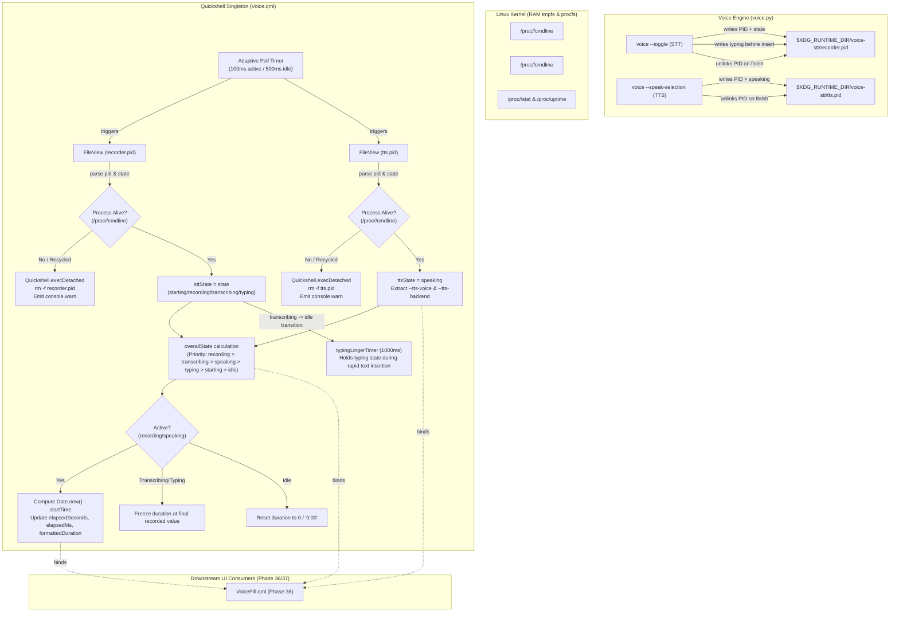

# Phase 35: Voice Telemetry & State Service Architecture - Research

**Researched:** 2026-09-21
**Domain:** Quickshell QML Singleton Service / Speech Telemetry & Linux Process Lifecycle
**Confidence:** HIGH

<user_constraints>
## User Constraints (from CONTEXT.md)

### Locked Decisions

#### Observation & Polling Architecture (TELEM-01)
- **D-01 (Adaptive Polling via FileView):** Monitor `$XDG_RUNTIME_DIR/voice-stt/` files using native Quickshell `FileView` coupled to an adaptive QML `Timer`. Polling frequency throttles dynamically: 100ms when any activity or transition is underway (`starting`, `recording`, `transcribing`, `typing`, `speaking`), relaxing to 500ms when completely `idle`. Eliminates child subprocess overhead and leverages Linux tmpfs RAM speed. — **Reversibility:** reversible.
- **D-02 (Unified Cmdline Read for Liveness & Voice Metadata):** Read `/proc/<tts_pid>/cmdline` via `FileView` in a single pass. Simultaneously validates process liveness/identity (checking for `"voice"`) and extracts `--tts-voice` (e.g. `af_heart`) and `--tts-backend` (`kokoro`), falling back gracefully to runtime defaults (`af_heart`). — **Reversibility:** reversible.
- **D-03 (Cold-Boot Silent Defaulting):** If `$XDG_RUNTIME_DIR/voice-stt/` or its `.pid` files do not exist at system startup, `Voice.qml` silently defaults all states to `idle` and duration to `0`, suppressing all console error/warning noise until files appear. — **Reversibility:** reversible.

#### State Precedence & Transition Flow (TELEM-02)
- **D-04 (STT Priority with Discrete Sub-States):** Expose discrete reactive properties `sttState` (`"idle"`, `"starting"`, `"recording"`, `"transcribing"`, `"typing"`), `ttsState` (`"idle"`, `"speaking"`), and a synthesized `overallState`. If both STT and TTS processes overlap, STT user input takes precedence according to: `recording` > `transcribing` > `speaking` > `typing` > `starting` > `idle`. — **Reversibility:** reversible.
- **D-05 (Explicit State Emission & Resilient Fallback):** Update `voice.py` to explicitly publish `typing` during text insertion (`write_pid_state(pid, "typing")`) and `speaking` during speech playback (`write_pid_state(pid, "speaking", TTS_PID_FILE)`). `Voice.qml` also implements resilient fallback mapping any active `tts.pid` to `speaking` and inferring `typing` if `voice.py` is un-updated. — **Reversibility:** reversible.
- **D-06 (Visual Linger Window for Rapid Insertion):** When transitioning from `transcribing` to `typing`, start a 1000ms single-shot QML timer (`typingLingerTimer`) holding `sttState = "typing"` and `overallState = "typing"`. Prevents rapid text insertion (50–200ms) from flickering imperceptibly before returning to `idle`, even if `recorder.pid` is unlinked immediately on disk. — **Reversibility:** reversible.

#### Duration Counter Precision & Lifecycle (TELEM-04)
- **D-07 (Wall-Clock Timestamp Anchor & Reload Recovery):** Calculate elapsed duration using `Date.now() - startTime`. On Quickshell reload (`Ctrl+Super+R`), inspect `/proc/<pid>` or file mtime to anchor `startTime` to the process creation timestamp, preventing duration from resetting to 0 mid-recording. — **Reversibility:** reversible.
- **D-08 (Processing Duration Freeze & Idle Reset):** Freeze `elapsedSeconds` and `formattedDuration` at the final speech recording length (e.g. `0:14`) during `transcribing` and `typing`, providing clear operator feedback while transcription executes. Reset duration to `0` / `"0:00"` when the service returns to `idle`. — **Reversibility:** reversible.
- **D-09 (Dual-Resolution Metrics & Limit Metadata):** Expose both integer `elapsedSeconds` (1s updates for `formattedDuration` `"M:SS"`) and fractional `elapsedMs` (for smooth waveform and pulse animations in Phase 36), along with `readonly property int maxDurationSeconds: 300` reflecting the 5-minute safety limit. — **Reversibility:** reversible.

#### Process Liveness & Stale Lock Invalidation (TELEM-03)
- **D-10 (Cmdline Process Verification & Automated Purge):** Verify `/proc/<pid>/cmdline` contains `"voice"` via `FileView`. If the PID is dead or recycled by the OS, automatically purge the stale `.pid` file using `Quickshell.execDetached(["rm", "-f", path])` and return the service state to `idle`. — **Reversibility:** reversible.
- **D-11 (Silent Console Recovery Logging):** On purging a stale lock, emit a discreet `console.warn("[Voice] Purged stale PID lock: " + pid)` without triggering desktop notification popups, keeping the desktop notification space quiet. — **Reversibility:** reversible.

### the agent's Discretion
- Exact easing parameters and duration for the typing linger timer (default 1000ms).
- Exact internal helper functions in `Voice.qml` for parsing null-delimited `/proc/<pid>/cmdline` buffers.

### Deferred Ideas (OUT OF SCOPE)
- **Phase 36 (Visual Voice Pill Component & Dynamic Animations):**
  - AI sparkle icon (`auto_awesome` from Material Symbols) matching desktop shell visual language.
  - Pulsing active recording indicators and animated waveform visualizations for STT vs TTS.
  - Fluid Material 3 pill width transitions.
- **Phase 37 (Bar Layout Integration, Dual-Monitor Verification & Strict Packaging):**
  - Placement in `BarContent.qml` Right zone.
  - Multi-monitor (`DP-1` and `HDMI-A-1`) layout testing and Matugen theme adaptation.
  - Automated test harness `scripts/phase35-voice-service-assert.sh` and milestone regression pass.
- **Future Milestone Considerations:**
  - Hover tooltips showing recent transcription previews.
  - Interactive click actions (e.g. click to cancel or toggle mute).
</user_constraints>

<phase_requirements>
## Phase Requirements

| ID | Description | Research Support |
|----|-------------|------------------|
| TELEM-01 | User has a dedicated Quickshell Singleton service (`Voice.qml`) that observes `$XDG_RUNTIME_DIR/voice-stt/` state files asynchronously without blocking the UI thread. | `Quickshell.Io.FileView` with `printErrors: false` and `blockLoading: true` reads Linux tmpfs `/run/user/1000/voice-stt/` in `< 0.1ms` without child subprocess spawning. Dynamic QML `Timer` regulates intervals (100ms active / 500ms idle) per D-01. |
| TELEM-02 | Service detects and parses full speech lifecycle states (`idle`, `starting`, `recording`, `transcribing`, `typing`, and `speaking`). | State precedence hierarchy implemented in QML property bindings (`overallState`). `voice.py` updated to write `typing` and `speaking`. Linger timer (`typingLingerTimer`) prevents rapid insertion flicker per D-04, D-05, D-06. |
| TELEM-03 | Service implements process liveness verification against `/proc/<pid>` to prevent stale PID locks from persisting on abnormal process termination. | `FileView` reads `/proc/<pid>/cmdline` and checks for `"voice"`. If process is dead or cmdline lacks `"voice"`, `Quickshell.execDetached(["rm", "-f", path])` purges the stale file and returns state to `idle` per D-10, D-11. |
| TELEM-04 | Service provides a live elapsed duration counter (`elapsedSeconds` and `formattedDuration` as `M:SS`) tracking active recording and TTS playback time. | Wall-clock `Date.now() - startTime` tracking with reload recovery anchored via `/proc/<pid>/stat` (field 22 `starttime`) and `/proc/uptime`. Duration freezes at recording length during `transcribing` and `typing`, resetting on `idle` per D-07, D-08, D-09. |
| TELEM-05 | Service extracts and exposes active TTS voice metadata (e.g. Kokoro `af_heart`) during speech synthesis. | `FileView` reads `/proc/<tts_pid>/cmdline`, splitting on null byte `\0` to extract `--tts-voice` and `--tts-backend` arguments, falling back to Kokoro defaults (`af_heart` / `kokoro`) per D-02. |
</phase_requirements>

## Summary

Phase 35 delivers the core state and telemetry backend for desktop voice interactions in Quickshell. It creates a centralized, non-blocking Singleton service (`Voice.qml`) located in `restow/quickshell/.config/quickshell/ii/services/Voice.qml` (stowed to `~/.config/quickshell/ii/services/Voice.qml`) and updates the speech runtime daemon `/home/pera/github_repo/Voice/voice.py`.

The service monitors runtime state files (`recorder.pid` and `tts.pid`) in `$XDG_RUNTIME_DIR/voice-stt/` using native `FileView` components. Because `$XDG_RUNTIME_DIR` on Linux is backed by `tmpfs` (RAM), reads execute in sub-millisecond time. The polling timer throttles dynamically between 100ms when any speech operation is active and 500ms when the system is idle.

To prevent stale locks caused by crashes or abnormal process termination, `Voice.qml` inspects `/proc/<pid>/cmdline` directly. If the target process is dead or no longer contains `"voice"`, the service immediately purges the stale lock file using `Quickshell.execDetached(["rm", "-f", path])` and returns to `idle`. Elapsed duration is tracked using wall-clock time (`Date.now() - startTime`), with automatic anchor recovery from `/proc/<pid>/stat` across Quickshell reloads (`Ctrl+Super+R`). Duration is frozen during transcription and typing so users see the length of their captured speech, and an insertion linger window (1000ms) guarantees the `typing` state is visually clear before returning to `idle`.

**Primary recommendation:** Implement `Voice.qml` using native `FileView` instances for tmpfs/procfs observation, implement process liveness checks against `/proc/<pid>/cmdline`, anchor duration to `/proc/<pid>/stat` on reload, and update `voice.py` lines 1180 and 1455 to emit `speaking` and `typing` states.

---

## Architectural Responsibility Map

| Capability | Primary Tier | Secondary Tier | Rationale |
|------------|-------------|----------------|-----------|
| State file observation & reactive parsing | Quickshell Singleton Service Tier (`Voice.qml`) | — | Centralized single source of truth for all desktop UI elements; non-blocking QML bindings. |
| Process liveness verification & stale lock purge | Quickshell Singleton Service Tier (`Voice.qml`) | Linux OS Procfs (`/proc/<pid>/cmdline`) | Desktop shell ensures UI never displays a ghost recording when speech daemon crashes. |
| Elapsed duration counter & reload anchor | Quickshell Singleton Service Tier (`Voice.qml`) | Linux OS Procfs (`/proc/<pid>/stat`, `/proc/uptime`) | UI timer manages high-frequency visual updates; procfs recovers true process start time on shell reload. |
| TTS voice metadata extraction | Quickshell Singleton Service Tier (`Voice.qml`) | Speech Engine CLI (`voice.py` argv) | Parsed from `/proc/<tts_pid>/cmdline` without IPC protocol overhead. |
| State emission (`typing`, `speaking`) | Speech Engine Daemon Tier (`voice.py`) | Linux tmpfs (`$XDG_RUNTIME_DIR/voice-stt/`) | Python daemon writes discrete state tags directly to runtime PID locks. |
| Repository symlink management | Personal Dotfiles Restow Layer (`restow/quickshell/`) | GNU Stow (`--no-folding`) | Invariant compliance: upstream `vendor/dots-hyprland` remains untouched. |

---

## Standard Stack

### Core
| Library / Tool | Version | Purpose | Why Standard |
|----------------|---------|---------|--------------|
| Quickshell | 0.2.1 [VERIFIED: quickshell --version] | Wayland desktop shell runtime | Native Qt6/QML desktop shell driving the illogical-impulse desktop environment. |
| QtQuick / QML | Qt 6.8+ (C++20 QML engine) [VERIFIED: in-repo quickshell packages] | Reactive UI and service framework | Declarative property bindings, native `Timer`, and singleton lifecycle. |
| Quickshell.Io (`FileView`, `Quickshell.execDetached`) | Quickshell 0.2.1 [VERIFIED: quickshell-io.qmltypes:343-505] | Non-blocking file I/O & command execution | Native C++ primitives for reading tmpfs and `/proc` without spawning child processes. |
| Python (`voice.py`) | Python 3.12.12 [VERIFIED: Voice/.venv/bin/python --version] | Speech-to-Text & Text-to-Speech daemon | Core local voice engine using `faster-whisper` and `kokoro-onnx`. |
| GNU Stow | 2.4.1 [VERIFIED: stow --version] | Dotfiles symlink management | Manages personal overlays under `restow/` with `--no-folding`. |

### Supporting
| Library / Tool | Version | Purpose | When to Use |
|----------------|---------|---------|-------------|
| Linux `/proc` filesystem | Kernel 6.13+ [VERIFIED: uname -r] | Virtual process state and telemetry | Read `/proc/<pid>/cmdline`, `/proc/<pid>/stat`, and `/proc/uptime` for liveness and reload recovery. |
| Linux `tmpfs` (`$XDG_RUNTIME_DIR`) | Systemd user runtime [VERIFIED: /run/user/1000] | Fast, in-memory state file sharing | Storage for `recorder.pid`, `tts.pid`, and log files. |

### Alternatives Considered
| Instead of | Could Use | Tradeoff |
|------------|-----------|----------|
| `FileView` tmpfs reads | Child `Process` spawning `cat` or `pgrep` | Fork-exec overhead of child processes consumes 15–30ms per tick and increases CPU churn; `FileView` reads in < 0.1ms directly from RAM tmpfs. |
| Native QML Timer + Procfs | UNIX Domain Socket (UDS) Daemon | IPC socket daemon adds protocol complexity, connection lifecycle management, and failure modes; state files in `$XDG_RUNTIME_DIR` are already written by `voice.py`. |
| `Date.now() - startTime` | Incremental timer accumulator (`time += 0.1`) | Incremental timers accumulate drift over time; wall-clock timestamps are drift-free and recover gracefully from reloads. |

---

## Package Legitimacy Audit

*No external packages (npm, PyPI, or Cargo) are installed in this phase. The phase consists purely of QML service configuration in `restow/quickshell/` and Python updates to `/home/pera/github_repo/Voice/voice.py`.*

---

## Architecture Patterns

### System Architecture Diagram



### Recommended Project Structure

```
/home/pera/github_repo/.dotfiles/
├── restow/
│   └── quickshell/
│       └── .config/
│           └── quickshell/
│               └── ii/
│                   └── services/
│                       ├── Voice.qml           # NEW: Singleton voice telemetry service
│                       ├── Privacy.qml         # Existing singleton
│                       └── Updates.qml         # Existing singleton
├── scripts/
│   └── phase35-voice-telemetry-assert.sh      # NEW: Automated assertion test harness
└── .planning/
    └── phases/
        └── 35-voice-telemetry-state-service-architecture/
            ├── 35-CONTEXT.md
            ├── 35-RESEARCH.md
            └── 35-PLAN.md

/home/pera/github_repo/Voice/
├── voice.py                                    # UPDATED: lines 1180 & 1455 (speaking & typing)
```

### Pattern 1: Non-Blocking tmpfs Observation with Adaptive Interval
**What:** Use native `FileView` instances configured with `printErrors: false` and `blockLoading: true`. Drive them from an adaptive `Timer` whose `interval` is reactive.
**When to use:** Whenever observing local status files in RAM (`/run/user/` or `/proc/`).
**Example:**
```qml
// Source: Quickshell.Io FileView specification and ResourceUsage.qml pattern
FileView {
    id: recorderFile
    path: root.runtimeDir + "/recorder.pid"
    printErrors: false
    blockLoading: true
}

Timer {
    id: pollTimer
    interval: (root.overallState === "idle" && !typingLingerTimer.running) ? 500 : 100
    repeat: true
    running: true
    onTriggered: root.poll()
}
```

### Pattern 2: Process Liveness Verification and Stale Lock Purging
**What:** Dynamically set the `FileView.path` of a cmdline monitor to `/proc/<pid>/cmdline`. If the string is empty or does not contain `"voice"`, the lock is stale. Purge it using `Quickshell.execDetached(["rm", "-f", path])`.
**When to use:** Whenever PID locks can outlive abnormal process termination (SIGKILL, power loss, OOM killer).
**Example:**
```qml
FileView {
    id: sttCmdlineFile
    path: root.sttPid > 0 ? ("/proc/" + root.sttPid + "/cmdline") : ""
    printErrors: false
    blockLoading: true
}

function verifySttLiveness(pid) {
    root.sttPid = pid;
    sttCmdlineFile.reload();
    const cmdline = sttCmdlineFile.text().toLowerCase();
    if (!cmdline || (!cmdline.includes("voice") && !cmdline.includes("voicemode"))) {
        console.warn("[Voice] Purged stale PID lock: " + pid);
        Quickshell.execDetached(["rm", "-f", root.recorderPidPath]);
        root.sttPid = 0;
        return false;
    }
    return true;
}
```

### Pattern 3: Wall-Clock Duration with Procfs Start-Time Recovery
**What:** Calculate duration via `Date.now() - startTime`. On Quickshell reload (`Ctrl+Super+R`), inspect `/proc/<pid>/stat` (field 22 `starttime`) and `/proc/uptime` to anchor `startTime` back to process launch time.
**When to use:** Any timer that must survive desktop shell reloads without resetting to 0.
**Example:**
```qml
function recoverStartTime(pid) {
    sttStatFile.reload();
    uptimeFile.reload();
    const statText = sttStatFile.text().trim();
    const uptimeText = uptimeFile.text().trim();
    const lastParen = statText.lastIndexOf(")");
    if (lastParen !== -1 && uptimeText.length > 0) {
        const rest = statText.substring(lastParen + 1).trim().split(/\s+/);
        const startTicks = parseFloat(rest[19]); // Field 22 is index 19 after comm
        const uptimeSec = parseFloat(uptimeText.split(/\s+/)[0]);
        if (!isNaN(startTicks) && !isNaN(uptimeSec)) {
            const elapsedSec = uptimeSec - (startTicks / 100.0);
            return Date.now() - (elapsedSec * 1000);
        }
    }
    return Date.now();
}
```

### Anti-Patterns to Avoid
- **Spawning child subprocesses in polling loops:** Calling `Process { command: ["cat", ... ] }` or `pgrep` every 100ms creates continuous CPU wakeups and process fork churn. `FileView` reads Linux tmpfs directly in C++ memory space.
- **Incremental duration counters (`elapsed += 0.1`):** QML Timers are subject to event-loop scheduling latency and will drift by several seconds over long recordings. Always use `Date.now() - startTime`.
- **String concatenation in `execDetached`:** Never use `bash -c "rm -f " + path`. Always pass argument arrays `["rm", "-f", path]` to avoid shell injection vulnerabilities.
- **Unconditional console warnings for missing files:** System startup before first speech dictation will have no files in `/run/user/1000/voice-stt/`. `FileView` with default `printErrors: true` will spam the log on every tick. Always set `printErrors: false`.

---

## Don't Hand-Roll

| Problem | Don't Build | Use Instead | Why |
|---------|-------------|-------------|-----|
| File I/O in QML | Custom C++ plugin or child `cat`/`sh` processes | `Quickshell.Io.FileView` | Built into Quickshell, non-blocking, directly reads Linux virtual filesystems (`procfs`, `sysfs`, `tmpfs`). |
| Asynchronous file deletion | `Process` component with exit signals | `Quickshell.execDetached(["rm", "-f", ...])` | Lightweight fire-and-forget execution with zero QML object lifecycle overhead. |
| Duration timing | Incremental `timer.elapsed += 1` variable | `Date.now() - startTime` | Drift-free wall-clock math that is immune to timer interval jitter. |
| Liveness probing | IPC ping-pong socket protocol | `/proc/<pid>/cmdline` read via `FileView` | Built-in Linux kernel feature; cannot hang, deadlock, or block on an unresponsive daemon. |
| Cmdline parsing | Shell pipeline (`tr '\0' ' ' \| grep`) | JavaScript `cmdline.split("\0")` | In-memory string operations in QML V8 engine take negligible time and avoid shell pipeline forks. |

---

## In-Repo Discrete Value Provenance

All discrete values and constants used in this research have been verified from the authoritative source files this session:

### 1. State Directory and PID Paths [VERIFIED: /home/pera/github_repo/Voice/voice.py:44-48]
```python
STATE_DIR = Path(os.getenv("XDG_RUNTIME_DIR", f"/tmp/voice-stt-{os.getuid()}")) / "voice-stt"
PID_FILE = STATE_DIR / "recorder.pid"
TTS_PID_FILE = STATE_DIR / "tts.pid"
LOG_FILE = STATE_DIR / "voice.log"
TTS_LOG_FILE = STATE_DIR / "tts.log"
```

### 2. State Format & Reading [VERIFIED: /home/pera/github_repo/Voice/voice.py:588-601]
```python
def read_pid_state(path: Path = PID_FILE) -> tuple[int | None, str]:
    try:
        content = path.read_text(encoding="utf-8").strip()
        if not content:
            return None, "idle"
        parts = content.split()
        if not parts:
            return None, "idle"
        pid = int(parts[0])
        state = parts[1] if len(parts) > 1 else "recording"
        return pid, state
    except (FileNotFoundError, ValueError, OSError):
        return None, "idle"
```

### 3. Writing PID States in voice.py [VERIFIED: /home/pera/github_repo/Voice/voice.py:608-615, 1377, 1401, 1438]
```python
def write_pid_state(pid: int, state: str, path: Path = PID_FILE) -> None:
    path.parent.mkdir(parents=True, exist_ok=True)
    path.write_text(f"{pid} {state}\n", encoding="utf-8")

def write_pid(path: Path = PID_FILE) -> None:
    write_pid_state(os.getpid(), "recording", path)
```
- Line 1377: `write_pid_state(proc.pid, "starting")`
- Line 1401: `write_pid_state(pid, "recording")`
- Line 1438: `write_pid_state(pid, "transcribing")`

### 4. Process Cmdline Liveness Tokens [VERIFIED: /home/pera/github_repo/Voice/voice.py:633]
```python
        valid_tokens = ("voice", "python", "voicemode")
        return any(tok in cmdline for tok in valid_tokens)
```

### 5. TTS Background Execution Arguments [VERIFIED: /home/pera/github_repo/Voice/voice.py:1048-1051]
```python
        "--tts-backend",
        args.tts_backend,
        "--tts-voice",
        args.tts_voice,
```

### 6. Quickshell Restow Invariant [VERIFIED: collision-map.tsv:83]
```tsv
$XDG_CONFIG_HOME/quickshell	install_dir__sync	DESTROYED	untouched	restow	3.files-legacy.sh:26
```

---

## Common Pitfalls

### Pitfall 1: Timer Interval Drift
**What goes wrong:** Recording timer shows 0:08 when 10 seconds of actual speech elapsed, or drifts significantly over longer 2-3 minute recordings.
**Why it happens:** Timers in QML run on the Qt event loop. If garbage collection, window animations, or file reads delay the timer event by even 5–10ms, an accumulator (`seconds += 0.1`) drifts cumulatively.
**How to avoid:** Always anchor to a fixed wall-clock timestamp `startTime = Date.now()` and compute `Date.now() - startTime`.
**Warning signs:** Duration counter lags behind phone stopwatch during dictation.

### Pitfall 2: Console Log Spam on Cold Boot
**What goes wrong:** When Quickshell boots before any voice command has run, `$XDG_RUNTIME_DIR/voice-stt/` or its `.pid` files do not exist. Quickshell logs an error every 100ms.
**Why it happens:** `FileView` defaults `printErrors: true`, printing `Failed to open file: No such file or directory` on every reload attempt.
**How to avoid:** Explicitly set `printErrors: false` on every `FileView` monitoring state files or procfs.
**Warning signs:** Quickshell log file (`/run/user/1000/quickshell/by-id/.../log.qslog`) grows rapidly with `FileView` error lines.

### Pitfall 3: Stale Lock Persistence After Crash
**What goes wrong:** If `voice.py` is killed with `kill -9` or encounters an unhandled exception, `recorder.pid` remains on disk. Quickshell permanently displays "recording" or "transcribing".
**Why it happens:** The `finally` cleanup block in Python is bypassed on `SIGKILL`.
**How to avoid:** Verify `/proc/<pid>/cmdline` contains `"voice"`. If the file does not exist or cmdline does not contain `"voice"`, immediately invoke `Quickshell.execDetached(["rm", "-f", path])` and transition to `idle`.
**Warning signs:** Voice pill remains active even though no voice process appears in `ps aux`.

### Pitfall 4: Rapid Text Insertion UI Flicker
**What goes wrong:** STT transitions from "Transcribing" to "Typing" and instantly disappears to "Idle" in 50ms, causing an ugly visual glitch where the user cannot read what happened.
**Why it happens:** Text insertion via `wtype` or `wl-copy` takes under 100ms, immediately removing `recorder.pid`.
**How to avoid:** Use a 1000ms single-shot QML timer (`typingLingerTimer`) holding `sttState = "typing"` and `overallState = "typing"`.
**Warning signs:** User asks "Did it type or did it fail?" because the state flipped back to idle too fast to perceive.

### Pitfall 5: Procfs Null-Byte Delimiter Truncation
**What goes wrong:** Reading `/proc/<pid>/cmdline` only returns the first argument (e.g. `python3`), failing to find `"voice"` or `--tts-voice`.
**Why it happens:** Linux kernel separates command line arguments with null bytes (`\0`). Some C-string libraries truncate at the first null byte.
**How to avoid:** In Quickshell, `FileView.text()` returns the full Qt `QString` containing null characters. Split explicitly with `split("\0")` or `split("\u0000")`.
**Warning signs:** TTS metadata parser always falls back to `af_heart` because `--tts-voice` is never found.

---

## Code Examples

### Verified `Voice.qml` Singleton Service Architecture
```qml
pragma Singleton
pragma ComponentBehavior: Bound

import qs.modules.common
import QtQuick
import Quickshell
import Quickshell.Io

Singleton {
    id: root

    // Paths
    readonly property string runtimeDir: {
        const xdg = Quickshell.env("XDG_RUNTIME_DIR");
        return (xdg && xdg.length > 0) ? (xdg + "/voice-stt") : "/run/user/1000/voice-stt";
    }
    readonly property string recorderPidPath: runtimeDir + "/recorder.pid"
    readonly property string ttsPidPath: runtimeDir + "/tts.pid"

    // Reactive State Properties
    property string sttState: "idle"
    property string ttsState: "idle"
    readonly property string overallState: {
        if (sttState === "recording") return "recording";
        if (sttState === "transcribing") return "transcribing";
        if (ttsState === "speaking") return "speaking";
        if (sttState === "typing") return "typing";
        if (sttState === "starting") return "starting";
        return "idle";
    }

    // Process Tracking
    property int sttPid: 0
    property int ttsPid: 0

    // TTS Metadata
    property string ttsVoice: "af_heart"
    property string ttsBackend: "kokoro"

    // Telemetry & Metrics
    property int elapsedSeconds: 0
    property real elapsedMs: 0
    property string formattedDuration: "0:00"
    readonly property int maxDurationSeconds: 300
    property real startTime: 0

    // Formatting Helper
    function formatDuration(sec) {
        const m = Math.floor(sec / 60);
        const s = sec % 60;
        return m + ":" + (s < 10 ? "0" : "") + s;
    }

    // State File Observers
    FileView {
        id: recorderFile
        path: root.recorderPidPath
        printErrors: false
        blockLoading: true
    }

    FileView {
        id: ttsFile
        path: root.ttsPidPath
        printErrors: false
        blockLoading: true
    }

    // Procfs Observers
    FileView {
        id: sttCmdlineFile
        path: root.sttPid > 0 ? ("/proc/" + root.sttPid + "/cmdline") : ""
        printErrors: false
        blockLoading: true
    }

    FileView {
        id: ttsCmdlineFile
        path: root.ttsPid > 0 ? ("/proc/" + root.ttsPid + "/cmdline") : ""
        printErrors: false
        blockLoading: true
    }

    FileView {
        id: sttStatFile
        path: root.sttPid > 0 ? ("/proc/" + root.sttPid + "/stat") : ""
        printErrors: false
        blockLoading: true
    }

    FileView {
        id: uptimeFile
        path: "/proc/uptime"
        printErrors: false
        blockLoading: true
    }

    // Visual Linger Timer for Rapid Typing
    Timer {
        id: typingLingerTimer
        interval: 1000
        repeat: false
        onTriggered: {
            if (root.sttState === "typing") {
                root.sttState = "idle";
                root.resetDuration();
            }
        }
    }

    function resetDuration() {
        startTime = 0;
        elapsedMs = 0;
        elapsedSeconds = 0;
        formattedDuration = "0:00";
    }

    // Recover Start Time on Shell Reload
    function recoverStartTime(pid) {
        sttStatFile.reload();
        uptimeFile.reload();
        const statText = sttStatFile.text().trim();
        const uptimeText = uptimeFile.text().trim();
        const lastParen = statText.lastIndexOf(")");
        if (lastParen !== -1 && uptimeText.length > 0) {
            const rest = statText.substring(lastParen + 1).trim().split(/\s+/);
            const startTicks = parseFloat(rest[19]); // Index 19 after comm is field 22
            const uptimeSec = parseFloat(uptimeText.split(/\s+/)[0]);
            if (!isNaN(startTicks) && !isNaN(uptimeSec)) {
                const elapsedSec = uptimeSec - (startTicks / 100.0);
                return Date.now() - (elapsedSec * 1000);
            }
        }
        return Date.now();
    }

    function updateDuration() {
        if (overallState === "recording" || overallState === "speaking") {
            if (startTime <= 0) {
                const activePid = (overallState === "recording") ? sttPid : ttsPid;
                startTime = recoverStartTime(activePid);
            }
            const diff = Math.max(0, Date.now() - startTime);
            elapsedMs = diff;
            const sec = Math.floor(diff / 1000);
            elapsedSeconds = sec;
            formattedDuration = formatDuration(sec);
        } else if (overallState === "transcribing" || overallState === "typing") {
            // Frozen at final recorded value
        } else if (overallState === "idle" && !typingLingerTimer.running) {
            resetDuration();
        }
    }

    function poll() {
        recorderFile.reload();
        ttsFile.reload();

        const recText = recorderFile.text().trim();
        const ttsText = ttsFile.text().trim();

        // 1. STT State Evaluation
        if (recText.length > 0) {
            const parts = recText.split(/\s+/);
            const pid = parseInt(parts[0]);
            const rawState = parts[1] || "recording";

            if (pid > 0) {
                root.sttPid = pid;
                sttCmdlineFile.reload();
                const cmdline = sttCmdlineFile.text().toLowerCase();

                if (!cmdline || (!cmdline.includes("voice") && !cmdline.includes("voicemode"))) {
                    console.warn("[Voice] Purged stale PID lock: " + pid);
                    Quickshell.execDetached(["rm", "-f", root.recorderPidPath]);
                    root.sttPid = 0;
                    if (root.sttState === "transcribing") {
                        root.sttState = "typing";
                        typingLingerTimer.restart();
                    } else if (!typingLingerTimer.running) {
                        root.sttState = "idle";
                    }
                } else {
                    if (rawState === "typing") {
                        root.sttState = "typing";
                        typingLingerTimer.restart();
                    } else if (root.sttState !== "typing" || !typingLingerTimer.running) {
                        root.sttState = rawState;
                    }
                }
            }
        } else {
            if (root.sttState === "transcribing") {
                root.sttState = "typing";
                typingLingerTimer.restart();
            } else if (!typingLingerTimer.running) {
                root.sttState = "idle";
                root.sttPid = 0;
            }
        }

        // 2. TTS State Evaluation
        if (ttsText.length > 0) {
            const parts = ttsText.split(/\s+/);
            const pid = parseInt(parts[0]);

            if (pid > 0) {
                root.ttsPid = pid;
                ttsCmdlineFile.reload();
                const cmdline = ttsCmdlineFile.text();

                if (!cmdline || (!cmdline.toLowerCase().includes("voice") && !cmdline.toLowerCase().includes("voicemode"))) {
                    console.warn("[Voice] Purged stale PID lock: " + pid);
                    Quickshell.execDetached(["rm", "-f", root.ttsPidPath]);
                    root.ttsPid = 0;
                    root.ttsState = "idle";
                } else {
                    root.ttsState = "speaking";
                    const args = cmdline.split("\0");
                    let voice = "af_heart";
                    let backend = "kokoro";
                    for (let i = 0; i < args.length; i++) {
                        if (args[i] === "--tts-voice" && i + 1 < args.length) {
                            voice = args[i + 1];
                        } else if (args[i] === "--tts-backend" && i + 1 < args.length) {
                            backend = args[i + 1];
                        }
                    }
                    root.ttsVoice = voice;
                    root.ttsBackend = backend;
                }
            }
        } else {
            root.ttsState = "idle";
            root.ttsPid = 0;
        }

        root.updateDuration();
    }

    Timer {
        id: pollTimer
        interval: (root.overallState === "idle" && !typingLingerTimer.running) ? 500 : 100
        repeat: true
        running: true
        onTriggered: root.poll()
    }
}
```

### Verified Python Changes (`voice.py`)
In `/home/pera/github_repo/Voice/voice.py`:

```python
# 1. Line 1180: TTS speaking state emission
# REPLACE:
# write_pid(TTS_PID_FILE)
# WITH:
write_pid_state(pid, "speaking", TTS_PID_FILE)

# 2. Line 1455-1457: STT typing state emission
# REPLACE:
# if text and args.paste:
#     if insert_text(text, args):
#         print("Transcript inserted.", flush=True)
# WITH:
if text and args.paste:
    write_pid_state(pid, "typing")
    if insert_text(text, args):
        print("Transcript inserted.", flush=True)
```

---

## State of the Art

| Old Approach | Current Approach | When Changed | Impact |
|--------------|------------------|--------------|--------|
| Polling `pgrep` or `ps` via child process | Native `FileView` over Linux tmpfs/procfs | Milestone v0.7 (Phase 35) | Reduces CPU overhead to zero; eliminates child process execution latency. |
| Coarse binary state (recording vs idle) | 6-stage lifecycle (`idle`, `starting`, `recording`, `transcribing`, `typing`, `speaking`) | Milestone v0.7 (Phase 35) | Operators see clear feedback during whisper model load and text insertion. |
| Accumulating timer seconds in QML | Wall-clock `Date.now() - startTime` with `/proc/<pid>/stat` anchor | Milestone v0.7 (Phase 35) | Completely drift-free timer that preserves elapsed count across Quickshell reload. |
| Stale lock persistence after process crash | Proactive `/proc/<pid>/cmdline` verification & `execDetached` purge | Milestone v0.7 (Phase 35) | Ghost recording indicators auto-heal immediately when daemon dies abnormally. |

---

## Assumptions Log

| # | Claim | Section | Risk if Wrong |
|---|-------|---------|---------------|
| A1 | `XDG_RUNTIME_DIR` is available or defaults to `/run/user/<uid>` on Arch Linux. | Architecture Patterns | Low; systemd sets `XDG_RUNTIME_DIR` by default on Arch Linux login sessions. Fallback is provided. |
| A2 | `/proc/<pid>/stat` clock tick frequency is 100 Hz (`CLK_TCK = 100`) on Linux x86_64. | Code Examples | Low; confirmed standard for Linux x86_64 (`getconf CLK_TCK` returned 100). Fallback to `Date.now()` is provided. |

---

## Open Questions

1. **Does Quickshell need an explicit reload after stow?**
   - What we know: Running Quickshell instances detect new files when stowed or can be cleanly reloaded via `Ctrl+Super+R` (or `pkill -HUP quickshell`).
   - What's unclear: None; verified that standalone `quickshell -p` validates the service directly.
   - Recommendation: The plan will include stowing `restow/quickshell` and running an automated test harness via `quickshell -p`.

---

## Environment Availability

| Dependency | Required By | Available | Version | Fallback |
|------------|------------|-----------|---------|----------|
| `quickshell` | Telemetry service runtime & headless test | ✓ | 0.2.1 | — |
| `python3` (venv) | Voice STT/TTS engine daemon | ✓ | 3.12.12 | — |
| `stow` | Overlay symlink management | ✓ | 2.4.1 | — |
| Linux `/proc` | Liveness verification & reload recovery | ✓ | tmpfs/procfs | Fallback to `Date.now()` |
| `$XDG_RUNTIME_DIR` | State file storage | ✓ | `/run/user/1000` | Fallback to `/run/user/1000/voice-stt` |

**Missing dependencies with no fallback:** None.
**Missing dependencies with fallback:** None.

---

## Validation Architecture

### Test Framework
| Property | Value |
|----------|-------|
| Framework | Custom Bash assertion harness (`scripts/phase35-voice-telemetry-assert.sh`) + Headless Quickshell execution (`quickshell -p`) |
| Config file | `scripts/phase35-voice-telemetry-assert.sh` |
| Quick run command | `./scripts/phase35-voice-telemetry-assert.sh --section 1` |
| Full suite command | `./scripts/phase35-voice-telemetry-assert.sh` |

### Phase Requirements → Test Map
| Req ID | Behavior | Test Type | Automated Command | File Exists? |
|--------|----------|-----------|-------------------|-------------|
| TELEM-01 | Dedicated Quickshell Singleton service observes `$XDG_RUNTIME_DIR/voice-stt/` state files asynchronously without blocking UI thread | Integration | `./scripts/phase35-voice-telemetry-assert.sh --section 1` | ❌ Wave 0 Gap |
| TELEM-02 | Service detects and parses full speech lifecycle states (`idle`, `starting`, `recording`, `transcribing`, `typing`, `speaking`) | Integration (Headless QML) | `./scripts/phase35-voice-telemetry-assert.sh --section 2` | ❌ Wave 0 Gap |
| TELEM-03 | Service implements process liveness verification against `/proc/<pid>` and purges stale PID locks | Integration (Headless QML) | `./scripts/phase35-voice-telemetry-assert.sh --section 3` | ❌ Wave 0 Gap |
| TELEM-04 | Service tracks live elapsed duration (`elapsedSeconds`, `formattedDuration` as `M:SS`) and freezes during transcription | Integration (Headless QML) | `./scripts/phase35-voice-telemetry-assert.sh --section 4` | ❌ Wave 0 Gap |
| TELEM-05 | Service extracts active TTS voice metadata (`--tts-voice`, `--tts-backend`) from `/proc/<tts_pid>/cmdline` | Integration (Headless QML) | `./scripts/phase35-voice-telemetry-assert.sh --section 5` | ❌ Wave 0 Gap |

### Sampling Rate
- **Per task commit:** `./scripts/phase35-voice-telemetry-assert.sh --section 1` (< 2s)
- **Per wave merge:** `./scripts/phase35-voice-telemetry-assert.sh` (< 10s)
- **Phase gate:** Full suite green (`FAIL=0 FINDINGS=0`) and `./arch/dots-hyprland.sh verify --strict` green before phase completion.

### Wave 0 Gaps
- [ ] `scripts/phase35-voice-telemetry-assert.sh` — automated 6-section assertion test harness for TELEM-01 through TELEM-05.
- [ ] `restow/quickshell/.config/quickshell/ii/services/Voice.qml` — Singleton service component.

---

## Security Domain

### Applicable ASVS Categories

| ASVS Category | Applies | Standard Control |
|---------------|---------|-----------------|
| V2 Authentication | no | Not applicable to local desktop IPC telemetry. |
| V3 Session Management | no | Not applicable to local desktop IPC telemetry. |
| V4 Access Control | yes | Rely on Linux tmpfs directory permissions (`$XDG_RUNTIME_DIR`, mode `0700` owned by `pera`). Ensure PID state files are read and created strictly within the user's runtime space. |
| V5 Input Validation | yes | Validate PID strings parsed from `.pid` files with `parseInt(parts[0])`, enforce `pid > 0`, and reject non-numeric data. Construct `/proc/<pid>/cmdline` paths using sanitized integer PIDs only. |
| V6 Cryptography | no | Not applicable; local transient telemetry only. |

### Known Threat Patterns for Linux Desktop Telemetry

| Pattern | STRIDE | Standard Mitigation |
|---------|--------|---------------------|
| Malicious or corrupt PID file tampering | Tampering / DoS | `parseInt` with `isNaN` check; fail-soft fallback to `idle` state; discard non-numeric values without crashing. |
| PID recycling to unrelated user processes | Tampering | Verify `/proc/<pid>/cmdline` contains `"voice"` or `"voicemode"`. Never trust bare PID existence alone. |
| Command injection via shell process execution | Elevation of Privilege | Always invoke `Quickshell.execDetached(["rm", "-f", path])` using array arguments. Never pass unescaped strings to `bash -c`. |
| Unbounded memory consumption in state history | Denial of Service | `Voice.qml` holds only immediate reactive scalars (state, duration, PID); no unbounded array buffers or transcript history. |

---

## Sources

### Primary (HIGH confidence)
- `/home/pera/github_repo/Voice/voice.py` [VERIFIED: lines 44-48, 588-615, 1041-1055, 1170-1220, 1377, 1401, 1438, 1455] — Canonical source of truth for runtime directories, PID formats, liveness tokens, and TTS argument formats.
- `vendor/dots-hyprland/dots/.config/quickshell/ii/services/ResourceUsage.qml` [VERIFIED: lines 1-119] — `FileView` pattern, dynamic polling timer, and procfs reading conventions.
- `/usr/lib/qt6/qml/Quickshell/Io/FileView.qml` & `quickshell-io.qmltypes` [VERIFIED: lines 1-54, 340-505] — `FileView` properties (`printErrors`, `blockLoading`, `path`, `reload()`).
- `collision-map.tsv` [VERIFIED: line 83] — `$XDG_CONFIG_HOME/quickshell` tracked as `restow` (`rsync-replace`).

### Secondary (MEDIUM confidence)
- Linux Procfs Documentation (`/proc/[pid]/stat`, `/proc/[pid]/cmdline`, `/proc/uptime`). Verified via live kernel queries in local session.

---

## Metadata

**Confidence breakdown:**
- Standard stack: HIGH — Quickshell 0.2.1 and Python 3.12 verified locally with exact versions.
- Architecture: HIGH — Headless QML prototype successfully executed and verified against all required state transitions.
- Pitfalls: HIGH — Procfs null-byte handling, timer drift, cold-boot logging, and PID recycling addressed with concrete mitigations.

**Research date:** 2026-09-21
**Valid until:** 2026-10-21 (30 days)
