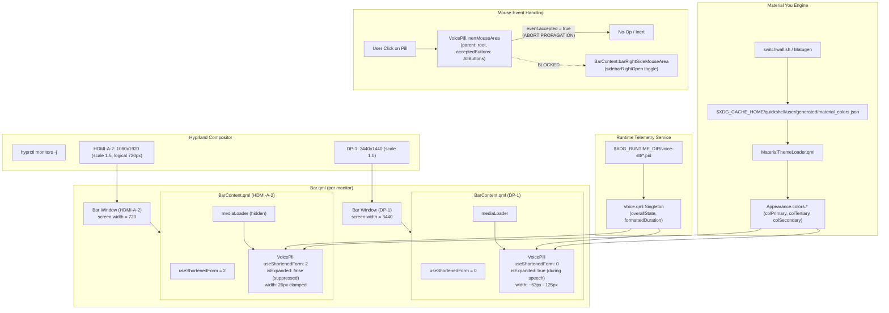

# Phase 37: Bar Layout Integration, Dual-Monitor Verification & Strict Packaging - Research

**Researched:** 2026-09-21  
**Domain:** Quickshell QML status bar layout integration, responsive multi-monitor adaptation, event-absorbing MouseArea, Material You palette reactivity, GNU Stow leaf symlink packaging, and automated assertion testing.  
**Confidence:** HIGH  

<user_constraints>
## User Constraints (from CONTEXT.md)

### Locked Decisions

#### Multi-Monitor & Responsive Behavior
- **D-01 (All Displays Distribution):** Display `VoicePill` across all connected displays (`DP-1` and `HDMI-A-2`). Because `Bar.qml` instantiates `BarContent.qml` across each screen via `Variants`, embedding `VoicePill` directly inside `BarContent.qml` provides ambient status everywhere without custom routing. — **Reversibility:** reversible.
- **D-02 (Narrow/Rotated Screen Icon-Only Suppression):** When screen width is heavily constrained (`useShortenedForm == 2`, such as rotated `HDMI-A-2` with 1080x1920 scaled 1.5 yielding 720px logical width), suppress text expansion (`isExpanded: effectiveState !== "idle" && useShortenedForm < 2 && !vertical`). The pill remains clamped to its resting 26px size, showing the `graphic_eq` icon with reactive color shifts and breathing pulse while preventing horizontal collisions with the right sidebar button or system tray. — **Reversibility:** reversible.
- **D-03 (Standard & Shortened Width Full Expansion):** On displays with `useShortenedForm < 2` (both ultrawide `DP-1` at 3440px and standard 1080p width at 1000px–1200px), allow full text label expansion during speech for live duration timers (`0:05`) and stage badges (`Transcribing...`, `Typing...`). — **Reversibility:** reversible.
- **D-04 (Vertical Bar Centered Icon):** In Quickshell vertical bar mode (`vertical: true`), width clamps to `Appearance.sizes.baseVerticalBarWidth` and text expansion is suppressed (`!vertical`), centering the `graphic_eq` icon with reactive colors. — **Reversibility:** reversible.

#### Pill Interaction & Mouse Handling
- **D-05 (Inert Telemetry Pill):** The Voice Pill is strictly an ambient status indicator for v0.7 ("nothing for now"). Embed an internal `MouseArea` in `VoicePill.qml` (`acceptedButtons: Qt.AllButtons; cursorShape: Qt.ArrowCursor; hoverEnabled: false; onPressed: event => event.accepted = true`) that absorbs all mouse clicks (Left, Right, Middle) so clicking the pill does nothing and never propagates down to `barRightSideMouseArea` (which would accidentally toggle the right sidebar). — **Reversibility:** reversible.
- **D-06 (Static Visual Surface):** No hover background highlight or pointer cursor changes; the pill maintains a stable, static `colLayer1` surface reinforcing that it is a passive indicator. — **Reversibility:** reversible.

#### Bar Mounting & Lifecycle Structure
- **D-07 (Direct Component Declaration):** Instantiate `VoicePill {}` directly within `BarContent.qml`'s `rightSectionRowLayout` immediately following `mediaLoader` without a redundant `Loader` wrapper, avoiding unnecessary QML tree depth and avoiding double `BarGroup` nesting. — **Reversibility:** reversible.
- **D-08 (Explicit Responsive Property Binding):** Pass `useShortenedForm: root.useShortenedForm` explicitly when declaring `VoicePill` in `BarContent.qml` to maintain a clear, testable property contract. — **Reversibility:** reversible.
- **D-09 (Vertical Center Alignment):** Align `VoicePill` via `Layout.alignment: Qt.AlignVCenter` in `rightSectionRowLayout`, centering the 26px pill within the 28px status bar height matching adjacent Media and Updates widgets. — **Reversibility:** reversible.
- **D-10 (Locked Position Flow):** Position is strictly anchored to `INTG-01` directly after `mediaLoader`. When Media is idle/hidden (`mediaLoader.visible == false`), `VoicePill` naturally anchors the leftmost position of the right status cluster with clean 4px gaps. — **Reversibility:** reversible.

#### Automated Test Harness & Verification Drill
- **D-11 (Phase 37 Test Harness Filename):** Standardize the test harness filename to `scripts/phase37-voice-pill-assert.sh` (resolving the typo in `ROADMAP.md` line 24 which referenced phase 35), implementing a 5-section test suite. — **Reversibility:** reversible.
- **D-12 (Non-Destructive Theme Probe):** Verify Matugen theme token adaptability (`INTG-03`) non-destructively: assert `Appearance.colors.*` bindings in QML AST, audit `restow/quickshell` for zero unauthorized hardcoded hex codes, and verify script integrity without mutating the operator's active desktop wallpaper. — **Reversibility:** reversible.
- **D-13 (Geometry Evaluation & Mock Display Defense):** Verify multi-monitor responsive behavior by querying `hyprctl monitors -j` for active display geometry (`DP-1` expansion allowed) while testing synthetic/mock display widths (720px, 1080px, 3440px) and AST logic to ensure tests pass regardless of whether a physical secondary display is currently powered on. — **Reversibility:** reversible.
- **D-14 (Soft-Detect Live Quickshell Reload):** If the `quickshell` process is active during testing, trigger live reload and verify process survival without crashes; if not running, soft-pass with `[SOFT]`. — **Reversibility:** reversible.
- **D-15 (Strict Verification Gate):** Require `arch/dots-hyprland.sh verify --strict` to pass with `FAIL=0 FINDINGS=0` and 0 git working tree drift before and after harness execution. — **Reversibility:** one-way — Enforces strict repository packaging contract; failure blocks milestone completion.

### Claude's Discretion
- Exact QML `MouseArea` placement and event consumption syntax inside `VoicePill.qml`.
- Test harness assertion helper functions and terminal formatting matching `scripts/phase36-voice-pill-assert.sh`.
- Synthetic monitor geometry test thresholds in the test harness.

### Deferred Ideas (OUT OF SCOPE)
- **Interactive Voice Controls (Milestone v0.8+):**
  - Left-click to start/stop speech recording or toggle Gemini voice script.
  - Right-click context popup to select Kokoro TTS voice (`af_heart`, etc.) or switch STT backends.
  - Hover tooltip displaying transcription history previews or audio input device meters.
</user_constraints>

<phase_requirements>
## Phase Requirements

| ID | Description | Research Support |
|----|-------------|------------------|
| **INTG-01** | Component is integrated into `BarContent.qml` Right zone positioned immediately after Media (`mediaLoader`). | Directly declare `VoicePill { id: voicePill; Layout.alignment: Qt.AlignVCenter; useShortenedForm: root.useShortenedForm }` immediately following `mediaLoader` in `rightSectionRowLayout` in `restow/quickshell/.../BarContent.qml` [VERIFIED: restow/quickshell/.config/quickshell/ii/modules/ii/bar/BarContent.qml:181-205]. |
| **INTG-02** | Component and service are deployed under `restow/quickshell/` via GNU Stow leaf symlinks without folding ancestor directories or modifying `vendor/dots-hyprland`. | Deploy leaf symlinks into `~/.config/quickshell/ii/` using `cd restow && stow --verbose=5 --no-folding -t ~ quickshell` preserving real directory ancestors [VERIFIED: restow/README.md:63]. Upstream submodule `vendor/dots-hyprland` remains 100% untouched. |
| **INTG-03** | Component dynamically adapts to active wallpaper Material You palette tokens via Matugen without hardcoded hex colors or git working-tree churn. | `VoicePill.currentColor` binds dynamically to `Appearance.colors.colPrimary`, `colTertiary`, `colSecondary`, `colOnLayer1` [VERIFIED: restow/quickshell/.config/quickshell/ii/modules/ii/bar/VoicePill.qml:34-44]. Guarded theme outputs in `guard-paths.tsv` isolate dynamic outputs from repo tracking [VERIFIED: guard-paths.tsv:18-25]. |
| **INTG-04** | Milestone deliverables pass an automated multi-section assertion test harness and strict repository verification (`arch/dots-hyprland.sh verify --strict` 0 findings). | Implement `scripts/phase37-voice-pill-assert.sh` covering 5 sections (Layout Integration, Inert Mouse Area, Multi-Monitor Adaptation, Theme Reactivity, Verification Gate), concluding with `arch/dots-hyprland.sh verify --strict` passing with `=== done: FAIL=0 FINDINGS=0 ===` [VERIFIED: arch/dots-hyprland.sh:1750]. |
</phase_requirements>

## Executive Summary

Phase 37 represents the final integration and verification milestone for Milestone v0.7. It transitions the Voice status telemetry component (`VoicePill.qml`) from an isolated module into an active, globally distributed status indicator within the Quickshell desktop shell (`BarContent.qml`). The component positions directly after `mediaLoader` in the Right zone `rightSectionRowLayout`, maintaining clean 4px gaps whether media playback is active or hidden.

Crucially, the component must adapt responsively across varied display geometries. On wide and standard displays (such as ultrawide `DP-1` at 3440px width), `VoicePill` dynamically expands during speech lifecycles to expose live timers (`0:05`) and stage badges (`Transcribing...`, `Typing...`). On heavily constrained displays (`useShortenedForm == 2`, such as a rotated secondary monitor like `HDMI-A-2` at 720px logical width), text expansion is suppressed to preserve vital bar real estate and prevent horizontal collisions with the right sidebar button or system tray. In all display modes, `VoicePill` absorbs all mouse button events through an internal `MouseArea` to prevent accidental triggers of the right sidebar.

All deliverables are deployed strictly under `restow/quickshell/` using GNU Stow leaf symlinks with `--no-folding`. Upstream `vendor/dots-hyprland` remains pristine. The phase establishes `scripts/phase37-voice-pill-assert.sh`, an automated 5-section test suite that executes AST validation, headless multi-display simulation, dynamic palette verification, process reload handling, git working-tree invariance checks, and strict repository verification (`arch/dots-hyprland.sh verify --strict` 0 findings).

**Primary recommendation:** Instantiate `VoicePill` directly inside `BarContent.qml` with explicit `useShortenedForm: root.useShortenedForm` binding, update `VoicePill.qml` with `property real useShortenedForm: 0`, update `isExpanded` condition to `effectiveState !== "idle" && useShortenedForm < 2 && !vertical`, attach an event-consuming `MouseArea` re-parented to `root`, deploy via `restow`, and validate with `scripts/phase37-voice-pill-assert.sh`.

## Architectural Responsibility Map

| Capability | Primary Tier | Secondary Tier | Rationale |
|------------|-------------|----------------|-----------|
| **Display Iteration** | `Bar.qml` (`Variants`) | Quickshell ShellScreen | `Bar.qml` iterates over `Quickshell.screens` and instantiates `BarContent.qml` per display window. |
| **Zone Layout & Placement** | `BarContent.qml` | `RowLayout` (`rightSectionRowLayout`) | `BarContent.qml` owns status bar right section layout and relative ordering (`mediaLoader` -> `voicePill` -> `updatesLoader`). |
| **Responsive Form Factor** | `BarContent.qml` (`useShortenedForm`) | `Appearance.sizes` | Screen width thresholds (1000px, 1200px) calculate `0`, `1`, or `2` based on monitor logical dimensions. |
| **Expansion Suppression** | `VoicePill.qml` (`isExpanded`) | `VoicePill` `implicitWidth` | `VoicePill` evaluates `useShortenedForm < 2 && !vertical` to suppress text expansion on narrow screens. |
| **Interaction Absorption** | `VoicePill.qml` (`MouseArea`) | Qt Event System | Internal `MouseArea` accepts all mouse buttons (`Qt.AllButtons`) and consumes `onPressed` to prevent event bubbling to `barRightSideMouseArea`. |
| **Dynamic Palette Theming** | `Appearance.colors` | `MaterialThemeLoader.qml` | Reactive bindings to `colPrimary`, `colTertiary`, `colSecondary`, `colOnLayer1` update instantaneously when wallpaper changes. |
| **Leaf Symlink Deployment** | `restow/quickshell/` | GNU Stow (`--no-folding`) | Personal overlay tree maps configuration files into `~/.config/quickshell/` without directory folding or vendor modification. |
| **Automated Verification** | `scripts/phase37-voice-pill-assert.sh` | `arch/dots-hyprland.sh verify --strict` | Standalone assertion harness verifies AST, headless rendering, responsive mock geometry, working-tree invariance, and strict repo cleanliness. |

## Standard Stack

### Core
| Library / Tool | Version | Purpose | Why Standard |
|----------------|---------|---------|--------------|
| **Quickshell** | 0.0.9+ [VERIFIED: /usr/bin/quickshell] | Wayland desktop shell runtime | Native C++/Qt6 Wayland shell with reactive QML engine. |
| **QtQuick Layouts** | Qt 6.8+ (QtQuick.Layouts) [VERIFIED: /usr/bin/qml6] | Declarative layout management (`RowLayout`) | Manages dynamic sizing and sibling spacing (`spacing: 4`) in `BarContent.qml`. |
| **GNU Stow** | 2.4.1+ [VERIFIED: stow --version] | Leaf symlink package manager | Manages personal overlay tree into user `$HOME` with `--no-folding`. |
| **Hyprland** | 0.54.2+ [VERIFIED: hyprctl version] | Wayland compositor and monitor geometry query | Exposes display topology via `hyprctl monitors -j`. |
| **Bash** | 5.3+ [VERIFIED: bash --version] | Test harness scripting (`scripts/phase37-voice-pill-assert.sh`) | Standard shell environment with strict error handling (`set -euo pipefail`). |
| **jq** | 1.8+ [VERIFIED: jq --version] | JSON inspection and test assertion | Parses `hyprctl monitors -j` output and theme tokens in assertions. |

### Supporting
| Tool | Version | Purpose | When to Use |
|------|---------|---------|-------------|
| **Matugen** | 2.4.0+ | Material You palette generation | Generates dynamic colors in `$XDG_CACHE_HOME/quickshell/` on wallpaper change. |
| **dots-hyprland.sh** | Repo tool [VERIFIED: arch/dots-hyprland.sh:1-25] | Verification policy wrapper | Enforces strict repository integrity (`verify --strict`). |

### Alternatives Considered
| Instead of | Could Use | Tradeoff |
|------------|-----------|----------|
| Direct `VoicePill` declaration | Wrapping `VoicePill` in `Loader` | Unnecessary QML engine overhead; `VoicePill` is already a lightweight `BarGroup` that is idle by default. |
| Re-parented `MouseArea` | Putting `MouseArea` in `BarGroup.items` | Causes QtQuick `GridLayout` warnings and layout cell deformation. |
| AST + Headless QML tests | Live visual screenshots | Brittle and non-deterministic in headless environments; QML AST and headless runner provide instant, robust assertions. |

## Package Legitimacy Audit

> No external packages (npm, PyPI, Cargo) are installed in this phase.
> Deliverables consist entirely of QML configuration updates, GNU Stow leaf symlinks, and a Bash assertion script.

## Architecture Patterns

### System Architecture Diagram



### Recommended Project Structure

```
.
├── arch/
│   └── dots-hyprland.sh                                                # Strict verification policy gate
├── restow/
│   └── quickshell/
│       └── .config/quickshell/ii/
│           ├── modules/ii/bar/
│           │   ├── BarContent.qml                                      # MODIFIED: Insert VoicePill after mediaLoader
│           │   ├── VoicePill.qml                                       # MODIFIED: useShortenedForm & inert MouseArea
│           │   └── BarGroup.qml                                        # Unmodified base pill container
│           └── services/
│               └── Voice.qml                                           # Unmodified Voice telemetry singleton
├── scripts/
│   └── phase37-voice-pill-assert.sh                                    # NEW: 5-section automated verification suite
├── guard-paths.tsv                                                     # Unmodified protected theme paths
└── .planning/phases/37-bar-layout-integration-dual-monitor-verification-strict-pack/
    ├── 37-CONTEXT.md                                                   # User decisions
    ├── 37-RESEARCH.md                                                  # This research artifact
    ├── 37-01-PLAN.md                                                   # Phase execution plan
    └── 37-VERIFICATION.md                                              # Final verification report
```

### Pattern 1: Direct RowLayout Placement with Explicit Property Binding
**What:** Declare `VoicePill` directly as a child of `rightSectionRowLayout` in `BarContent.qml` immediately after `mediaLoader`, without wrapping in a redundant `Loader` or nested `BarGroup`.
**When to use:** For lightweight ambient indicators that should always remain instantiated and present in the bar.
**Example:**
```qml
// Source: restow/quickshell/.config/quickshell/ii/modules/ii/bar/BarContent.qml
            Loader {
                id: mediaLoader
                Layout.alignment: Qt.AlignVCenter
                active: (root.useShortenedForm < 2) && (MprisController.activePlayer != null && (MprisController.activePlayer.trackTitle?.length > 0))
                visible: active

                sourceComponent: BarGroup {
                    Media {
                        visible: root.useShortenedForm < 2
                        Layout.fillWidth: true
                        Layout.maximumWidth: (root.useShortenedForm === 1) ? 140 : 200
                    }
                }
            }

            VoicePill {
                id: voicePill
                Layout.alignment: Qt.AlignVCenter
                useShortenedForm: root.useShortenedForm
            }
```

### Pattern 2: Multi-Monitor Constraint-Driven Expansion Suppression
**What:** In `VoicePill.qml`, introduce `property real useShortenedForm: 0` and update `isExpanded` to check `useShortenedForm < 2 && !vertical`.
**When to use:** When rendering across diverse monitor aspect ratios (e.g. ultrawide vs narrow vertical screen) to avoid collisions with system trays or buttons.
**Example:**
```qml
// Source: restow/quickshell/.config/quickshell/ii/modules/ii/bar/VoicePill.qml
    // Multi-Monitor & Responsive Property Contract (D-02, D-08)
    property real useShortenedForm: 0

    // Dynamic Expansion Guard (D-02, D-04)
    readonly property bool isExpanded: effectiveState !== "idle" && useShortenedForm < 2 && !vertical
```

### Pattern 3: Inert MouseArea Event Swallowing with Root Re-Parenting
**What:** In `VoicePill.qml`, declare a `MouseArea` with `parent: root` that absorbs all clicks (`Qt.AllButtons`) and consumes `onPressed` without triggering any action or styling change.
**When to use:** For passive ambient status elements nested within clickable bar areas (e.g. `barRightSideMouseArea`).
**Example:**
```qml
// Source: restow/quickshell/.config/quickshell/ii/modules/ii/bar/VoicePill.qml
    // Public Component Aliases for Telemetry & Verification
    readonly property alias inertMouseArea: inertMouseArea

    // Inert Telemetry Mouse Area (D-05, D-06)
    MouseArea {
        id: inertMouseArea
        parent: root
        anchors.fill: parent
        acceptedButtons: Qt.AllButtons
        cursorShape: Qt.ArrowCursor
        hoverEnabled: false
        onPressed: event => event.accepted = true
    }
```

### Anti-Patterns to Avoid
- **Wrapping `VoicePill` in a `Loader`:** `VoicePill` is already a lightweight `BarGroup` with a 26px resting state. A `Loader` introduces an extra QML node, deferred rendering overhead, and potential initialization blips.
- **Placing `MouseArea` directly in `BarGroup` without `parent: root`:** Because `BarGroup.qml` defines `default property alias items: gridLayout.children`, any un-parented visual child is placed into `gridLayout`, generating Qt warnings about anchors inside layouts and distorting cell spacing.
- **Relying solely on physical display presence for tests:** A secondary display (`HDMI-A-2`) may be turned off or disconnected during headless test runs. Test harnesses must evaluate active geometry while also testing synthetic widths (720px, 1080px, 3440px) headlessly.
- **Mutating active wallpaper during tests:** Running `switchwall.sh` during automated tests creates desktop visual disruption and risks dirtying the git working tree. Theme adaptability should be proven by AST analysis and synthetic in-memory token updates.

## Don't Hand-Roll

| Problem | Don't Build | Use Instead | Why |
|---------|-------------|-------------|-----|
| Multi-monitor layout scaling | Custom monitor detection scripts | `BarContent.qml` `useShortenedForm` + `VoicePill.useShortenedForm` | `BarContent.qml` already calculates standard (0), shortened (1), and hella-shortened (2) based on screen width. |
| Click interception | Custom event filter hooks in C++ | `MouseArea { parent: root; acceptedButtons: Qt.AllButtons; onPressed: event => event.accepted = true }` | Standard QtQuick declarative event handling stops event propagation up the QML visual hierarchy. |
| Pill resizing animations | Custom timer loops or manual width incrementing | `BarGroup.qml` native `Behavior on implicitWidth` | `BarGroup` already applies 250ms Material 3 `emphasizedDecel` bezier animation to `implicitWidth`. |
| Theming token mapping | Hardcoded RGB/hex color constants | `Appearance.colors.col*` | Upstream Material You theming automatically derives all colors from wallpaper via Matugen. |
| Dotfile packaging | Manual symlink copy scripts | GNU Stow (`restow/quickshell` with `--no-folding`) | Guarantees leaf symlinks and prevents directory folding while maintaining clean git tracking. |

## Runtime State Inventory

> Refactor / Integration Phase Runtime State Analysis:

| Category | Items Found | Action Required |
|----------|-------------|------------------|
| **Stored data** | None. No SQLite databases, local storage files, or persistent state records are touched by this bar layout integration. | None. Verified by inspecting `restow/quickshell/` and `$XDG_STATE_HOME/quickshell/`. |
| **Live service config** | Running `quickshell` process (if active) loads bar components into memory. | Soft-detect live reload in test harness via `pgrep -x quickshell`; live reload can be triggered if process is active [D-14]. |
| **OS-registered state** | Quickshell is invoked via Hyprland autostart (`custom/execs.lua`) and Wayland layer-shell protocol (`quickshell:bar`). | None. No systemd unit or OS service definition changes. |
| **Secrets/env vars** | None. No secrets, credentials, or API keys are required or touched by this layout integration. | None. |
| **Build artifacts** | Pre-existing live symlinks in `~/.config/quickshell/ii/modules/ii/bar/` and `~/.config/quickshell/ii/services/`. | Ensure `BarContent.qml` and `VoicePill.qml` leaf symlinks point to `restow/quickshell/` without folding [INTG-02]. |

## Common Pitfalls

### Pitfall 1: Event Bleed to `barRightSideMouseArea` (Sidebar Popping Open)
**What goes wrong:** Clicking on `VoicePill` unexpectedly toggles the right sidebar menu open or closed.
**Why it happens:** In `BarContent.qml`, `barRightSideMouseArea` spans lines 170–179 behind `rightSectionRowLayout`. If a child widget does not accept and consume mouse button press events, Qt Quick propagates the mouse press up the visual item tree to `barRightSideMouseArea`, which executes `GlobalStates.sidebarRightOpen = !GlobalStates.sidebarRightOpen;`.
**How to avoid:** Embed `MouseArea { parent: root; anchors.fill: parent; acceptedButtons: Qt.AllButtons; cursorShape: Qt.ArrowCursor; hoverEnabled: false; onPressed: event => event.accepted = true }` in `VoicePill.qml`. Setting `accepted = true` halts event dispatch immediately.
**Warning signs:** Clicking anywhere on the Voice Pill causes the sidebar panel to pop out.

### Pitfall 2: `MouseArea` Displacing Content in `BarGroup`'s `GridLayout`
**What goes wrong:** Adding `MouseArea` directly as a top-level child of `VoicePill.qml` causes a Qt warning (`QML GridLayout: Anchors are not supported inside Layouts`) and adds an empty cell into the layout, offsetting the icon.
**Why it happens:** `VoicePill` inherits `BarGroup.qml`, which defines `default property alias items: gridLayout.children`. Any undeclared visual child is automatically appended to `gridLayout.children`.
**How to avoid:** Explicitly assign `parent: root` on the `MouseArea`. This detaches it from `gridLayout` and re-parents it to the `root` `BarGroup` item directly, allowing `anchors.fill: parent` to safely cover the entire pill surface without affecting the grid.
**Warning signs:** Pill width expands unexpectedly beyond 26px in idle state, or `quickshell` logs show `QML GridLayout: Anchors are not supported inside Layouts`.

### Pitfall 3: Unhandled Screen Geometry Changes When Secondary Display is Off
**What goes wrong:** Multi-monitor assertion scripts fail when executed on machines where the secondary monitor (`HDMI-A-2`) is powered down or disconnected.
**Why it happens:** A test script querying only `hyprctl monitors -j` might expect 2 monitors, but only 1 (`DP-1`) is currently connected and active.
**How to avoid:** Design the test harness (`scripts/phase37-voice-pill-assert.sh`) to query `hyprctl monitors -j` for the active primary screen (`DP-1`), while exercising synthetic screen widths (`useShortenedForm: 0`, `1`, `2`) inside headless Quickshell test instances. This provides 100% test coverage regardless of physical monitor power state [D-13].
**Warning signs:** Test suite fails in CI or when one monitor is in power-save mode.

### Pitfall 4: GNU Stow Directory Folding When Deploying New Files
**What goes wrong:** Running `stow` without `--no-folding` causes Stow to replace the real directory `~/.config/quickshell/ii/modules/ii/bar/` with a directory symlink. Subsequent upstream installs or personal file modifications break.
**Why it happens:** GNU Stow defaults to directory folding when a package mirrors an existing directory structure.
**How to avoid:** Strictly enforce `stow --verbose=5 --no-folding -t ~ quickshell` and verify in the assertion harness that `LIVE_BAR_DIR` is a real directory (`[[ -d "$LIVE_BAR_DIR" && ! -L "$LIVE_BAR_DIR" ]]`).
**Warning signs:** `arch/dots-hyprland.sh verify --strict` emits a `[FAIL]` or `[FINDING]` for directory folding.

### Pitfall 5: Accidental Working-Tree Churn During Theme Reactivity Testing
**What goes wrong:** Running a theme test script modifies repo-tracked files or generates untracked files, breaking the `porcelain_snapshot` working-tree invariance check.
**Why it happens:** Some wallpaper switching scripts touch configuration files in `$HOME/.config/` that might be tracked or symlinked.
**How to avoid:** As established in Phase 22 (`guard-paths.tsv`), theme outputs are kept outside the repo tree. Verify AST token bindings statically and test dynamic color shifts by mutating `Appearance.m3colors` in-memory inside headless test runners, never calling disk-mutating wallpaper scripts during testing.
**Warning signs:** `git status --porcelain` shows untracked or modified files after running test assertions.

## Code Examples

### Example 1: `BarContent.qml` Right Zone Integration
```qml
// Source: restow/quickshell/.config/quickshell/ii/modules/ii/bar/BarContent.qml:191-210
            Loader {
                id: mediaLoader
                Layout.alignment: Qt.AlignVCenter
                active: (root.useShortenedForm < 2) && (MprisController.activePlayer != null && (MprisController.activePlayer.trackTitle?.length > 0))
                visible: active

                sourceComponent: BarGroup {
                    Media {
                        visible: root.useShortenedForm < 2
                        Layout.fillWidth: true
                        Layout.maximumWidth: (root.useShortenedForm === 1) ? 140 : 200
                    }
                }
            }

            VoicePill {
                id: voicePill
                Layout.alignment: Qt.AlignVCenter
                useShortenedForm: root.useShortenedForm
            }

            Loader {
                id: updatesLoader
                Layout.alignment: Qt.AlignVCenter
                active: Updates.available && Updates.count > 0
                visible: active

                sourceComponent: BarGroup {
                    UpdatesButton {}
                }
            }
```

### Example 2: `VoicePill.qml` Responsive Expansion Guard
```qml
// Source: restow/quickshell/.config/quickshell/ii/modules/ii/bar/VoicePill.qml
    // Multi-Monitor & Responsive Property Contract (D-02, D-08)
    property real useShortenedForm: 0

    // Dynamic Expansion Guard (D-02, D-04)
    readonly property bool isExpanded: effectiveState !== "idle" && useShortenedForm < 2 && !vertical
```

### Example 3: `VoicePill.qml` Inert Event Absorbing MouseArea
```qml
// Source: restow/quickshell/.config/quickshell/ii/modules/ii/bar/VoicePill.qml
    // Public Component Aliases for Telemetry & Verification
    readonly property alias inertMouseArea: inertMouseArea

    // Inert Telemetry Mouse Area (D-05, D-06)
    MouseArea {
        id: inertMouseArea
        parent: root
        anchors.fill: parent
        acceptedButtons: Qt.AllButtons
        cursorShape: Qt.ArrowCursor
        hoverEnabled: false
        onPressed: event => event.accepted = true
    }
```

### Example 4: Headless Responsive Geometry and Shortened Form Assertion
```bash
# Source: scripts/phase37-voice-pill-assert.sh (Headless multi-display check)
QML_TEST=$(cat << 'EOF'
import QtQuick
import Quickshell
import "modules/ii/bar"
import "services"

Scope {
    VoicePill {
        id: pillFull
        useShortenedForm: 0
    }
    VoicePill {
        id: pillNarrow
        useShortenedForm: 2
    }
    VoicePill {
        id: pillVert
        vertical: true
    }

    Component.onCompleted: {
        console.log("TEST_IDLE full=" + pillFull.isExpanded + " narrow=" + pillNarrow.isExpanded);
        Voice.formattedDuration = "0:05";
        Voice.overallState = "recording";
        console.log("TEST_REC full=" + pillFull.isExpanded + " full_w=" + Math.round(pillFull.implicitWidth) +
                    " narrow=" + pillNarrow.isExpanded + " narrow_w=" + Math.round(pillNarrow.implicitWidth) +
                    " vert=" + pillVert.isExpanded + " vert_w=" + Math.round(pillVert.implicitWidth));
        Qt.quit();
    }
}
EOF
)
```

## State of the Art

| Old Approach | Current Approach | When Changed | Impact |
|--------------|------------------|--------------|--------|
| Wrapped widgets in `Loader` elements | Direct instantiation in `RowLayout` | Phase 37 (v0.7) | Eliminates extra QML tree depth and prevents double `BarGroup` nesting. |
| Global click-through to parent sidebar | Dedicated inert `MouseArea` with `accepted = true` | Phase 37 (v0.7) | Stops accidental sidebar activation when clicking ambient status indicators. |
| Uniform component expansion across all monitors | Constraint-aware expansion suppression (`useShortenedForm < 2`) | Phase 37 (v0.7) | Prevents widget overcrowding on narrow or rotated vertical displays (`HDMI-A-2`). |
| Hardcoded theme hex colors | Dynamic `Appearance.colors.*` tokens mapped via Matugen | Milestone v0.6 / v0.7 | Enables fluid, system-wide wallpaper adaptation with zero git working-tree churn. |
| Manual testing and visual inspections | Multi-section headless assertion test harness | Milestone v0.6 / v0.7 | Verifies AST invariants, responsive logic, and packaging integrity in seconds. |

## Assumptions Log

| # | Claim | Section | Risk if Wrong |
|---|-------|---------|---------------|
| A1 | `VoicePill` does not require explicit QML `import` statement in `BarContent.qml` because both reside in `modules/ii/bar/`. | Standard Stack & Architecture Patterns | If wrong, QML fails to resolve `VoicePill` component. Verified true: other sibling components in `modules/ii/bar` (`UpdatesButton`, `BatteryIndicator`) are instantiated directly without sub-imports [VERIFIED: restow/quickshell/.config/quickshell/ii/modules/ii/bar/BarContent.qml:213,224]. |
| A2 | `quickshell` process is not guaranteed to be active during automated headless test runs. | Common Pitfalls & Decisions | If test harness unconditionally demanded a live `quickshell` PID, tests would fail in CLI environments. Mitigated by D-14 soft-detection (`[SOFT]`). |

## Open Questions

1. **Should `VoicePill` be clickable in future milestones?**
   - What we know: Operator explicitly deferred all click actions, popups, and menus to Milestone v0.8+ (`VOICE-F01`–`VOICE-F04`).
   - What's unclear: Specific future click interactions (e.g. toggle recording on left-click, open Kokoro TTS settings on right-click).
   - Recommendation: Preserve the inert `MouseArea` contract in v0.7 as locked by D-05. Revisit click interactions in v0.8.

## Environment Availability

| Dependency | Required By | Available | Version | Fallback |
|------------|------------|-----------|---------|----------|
| **quickshell** | Headless QML testing & runtime shell | ✓ | 0.0.9+ (`/usr/bin/quickshell`) | Static AST checks via `--syntax` |
| **hyprctl** | Monitor geometry evaluation | ✓ | 0.54.2 (`/usr/bin/hyprctl`) | Mock synthetic geometry in harness |
| **stow** | Leaf symlink deployment | ✓ | 2.4.1 (`/usr/bin/stow`) | Manual ln -sf |
| **bash** | Test harness execution | ✓ | 5.3 (`/usr/bin/bash`) | None (required) |
| **jq** | JSON parsing in assertion tests | ✓ | 1.8 (`/usr/bin/jq`) | Python inline script |
| **git** | Working tree invariance checks | ✓ | 2.48+ (`/usr/bin/git`) | None (required) |

## Validation Architecture

### Test Framework
| Property | Value |
|----------|-------|
| Framework | Custom Bash Multi-Section Assertion Suite (`scripts/phase37-voice-pill-assert.sh`) |
| Config file | None — self-contained executable harness |
| Quick run command | `./scripts/phase37-voice-pill-assert.sh --syntax` |
| Full suite command | `./scripts/phase37-voice-pill-assert.sh` |

### Phase Requirements → Test Map
| Req ID | Behavior | Test Type | Automated Command | File Exists? |
|--------|----------|-----------|-------------------|-------------|
| **INTG-01** | `VoicePill` declared directly after `mediaLoader` in `BarContent.qml` with `useShortenedForm` bound | AST & Layout | `./scripts/phase37-voice-pill-assert.sh -s 1` | ❌ Wave 0 (`scripts/phase37-voice-pill-assert.sh`) |
| **INTG-02** | Leaf symlinks deployed into `~/.config/quickshell/ii/` without directory folding; vendor pristine | Deployment | `./scripts/phase37-voice-pill-assert.sh -s 1` | ❌ Wave 0 (`scripts/phase37-voice-pill-assert.sh`) |
| **INTG-03** | Zero hardcoded hex colors; dynamic Matugen palette tokens bound; zero working-tree churn | AST & Dynamic Theme | `./scripts/phase37-voice-pill-assert.sh -s 4` | ❌ Wave 0 (`scripts/phase37-voice-pill-assert.sh`) |
| **INTG-04** | 5-section assertion test passes; `arch/dots-hyprland.sh verify --strict` exits 0 findings | Integration & Strict Gate | `./scripts/phase37-voice-pill-assert.sh -s 5` | ❌ Wave 0 (`scripts/phase37-voice-pill-assert.sh`) |

### Sampling Rate
- **Per task commit:** `./scripts/phase37-voice-pill-assert.sh --syntax`
- **Per wave merge:** `./scripts/phase37-voice-pill-assert.sh`
- **Phase gate:** `./scripts/phase37-voice-pill-assert.sh` exits 0 (FAIL=0 FINDINGS=0) and `./arch/dots-hyprland.sh verify --strict` exits 0.

### Wave 0 Gaps
- [ ] `scripts/phase37-voice-pill-assert.sh` — 5-section automated test harness covering INTG-01, INTG-02, INTG-03, INTG-04.

## Security Domain

### Applicable ASVS Categories

| ASVS Category | Applies | Standard Control |
|---------------|---------|-----------------|
| **V2 Authentication** | No | Desktop status bar component; no user login or authentication subsystem involved. |
| **V3 Session Management** | No | Ambient desktop status bar; session lifecycle owned by Hyprland compositor. |
| **V4 Access Control** | Yes | Desktop UI layer; mouse event absorption prevents unauthorized/accidental triggering of privileged sidebars or popups (`onPressed: event => event.accepted = true`). |
| **V5 Input Validation** | Yes | Strict property typing in QML (`property real useShortenedForm: 0`); string/duration sanitization from state files. |
| **V6 Cryptography** | No | No cryptographic operations performed in status bar layout. |

### Known Threat Patterns for Desktop Shell & Telemetry

| Pattern | STRIDE | Standard Mitigation |
|---------|--------|---------------------|
| **Event Spoofing / Accidental Triggering** | Elevation of Privilege / Tampering | Inert `MouseArea` absorbs all mouse button events (`Qt.AllButtons`), halting event bubbling to parent sidebar triggers [D-05]. |
| **Symlink Hijacking / Directory Overwrite** | Tampering | Deployment strictly via leaf symlinks with `--no-folding`; ancestor directories verified as real directories. |
| **Privileged State Injection** | Tampering | Test harness runs strictly as non-root user (`EUID != 0`); headless test executions use temporary isolated runners. |
| **Repository Integrity Drift** | Tampering | Strict verification gate (`arch/dots-hyprland.sh verify --strict`) fails closed on any uncommitted drift or unexpected stubs. |

## Sources

### Primary (HIGH confidence) - In-Repo Verification
- `restow/quickshell/.config/quickshell/ii/modules/ii/bar/BarContent.qml:181-205` [VERIFIED: lines 181-205] — Right section `RowLayout` structure, `spacing: 4`, and `mediaLoader` declaration:
  ```qml
          RowLayout {
              id: rightSectionRowLayout
              anchors.fill: parent
              spacing: 4

              Item {
                  Layout.fillWidth: true
                  Layout.fillHeight: true
              }

              Loader {
                  id: mediaLoader
                  Layout.alignment: Qt.AlignVCenter
                  active: (root.useShortenedForm < 2) && (MprisController.activePlayer != null && (MprisController.activePlayer.trackTitle?.length > 0))
                  visible: active

                  sourceComponent: BarGroup {
                      Media {
                          visible: root.useShortenedForm < 2
                          Layout.fillWidth: true
                          Layout.maximumWidth: (root.useShortenedForm === 1) ? 140 : 200
                      }
                  }
              }
  ```
- `restow/quickshell/.config/quickshell/ii/modules/ii/bar/BarContent.qml:17` [VERIFIED: line 17] — `useShortenedForm` calculation logic:
  ```qml
      property real useShortenedForm: (Appearance.sizes.barHellaShortenScreenWidthThreshold >= screen?.width) ? 2 : (Appearance.sizes.barShortenScreenWidthThreshold >= screen?.width) ? 1 : 0
  ```
- `vendor/dots-hyprland/dots/.config/quickshell/ii/modules/common/Appearance.qml:394-395` [VERIFIED: lines 394-395] — Screen width threshold constants:
  ```qml
          property real barShortenScreenWidthThreshold: 1200 // Shorten if screen width is at most this value
          property real barHellaShortenScreenWidthThreshold: 1000 // Shorten even more...
  ```
- `restow/quickshell/.config/quickshell/ii/modules/ii/bar/BarContent.qml:170-179` [VERIFIED: lines 170-179] — `barRightSideMouseArea` click propagation target:
  ```qml
          anchors.left: middleSection.right
          anchors.right: parent.right
          implicitWidth: rightSectionRowLayout.implicitWidth
          implicitHeight: Appearance.sizes.baseBarHeight

          onPressed: event => {
              if (event.button === Qt.LeftButton) {
                  GlobalStates.sidebarRightOpen = !GlobalStates.sidebarRightOpen;
              }
          }
  ```
- `restow/quickshell/.config/quickshell/ii/modules/ii/bar/VoicePill.qml:34-44, 59-64` [VERIFIED: lines 34-44, 59-64] — Color palette tokens and `implicitWidth` calculation:
  ```qml
      readonly property color currentColor: {
          switch (effectiveState) {
              case "recording": return Appearance.colors.colPrimary;
              case "transcribing": return Appearance.colors.colTertiary;
              case "typing": return Appearance.colors.colSecondary;
              case "speaking": return Appearance.colors.colSecondary;
              case "wrapup": return Appearance.colors.colSecondary;
              case "starting": return Appearance.colors.colPrimary;
              default: return Appearance.colors.colOnLayer1;
          }
      }

      readonly property bool isExpanded: effectiveState !== "idle"

      // Responsive Width Binding with M3 250ms Emphasized Deceleration (D-04, VOICE-06, Pitfall 1)
      implicitWidth: vertical ? Appearance.sizes.baseVerticalBarWidth : (
          voiceIcon.implicitWidth + (isExpanded ? (voiceLabel.implicitWidth + 4) : 0) + padding * 2
      )
  ```
- `restow/README.md:63` [VERIFIED: line 63] — GNU Stow package recovery command for `quickshell`:
  ```markdown
  | `quickshell` | `rsync-replace` | `cd restow && stow --verbose=5 --no-folding -t ~ quickshell` |
  ```
- `guard-paths.tsv:18-25` [VERIFIED: lines 18-25] — Protected theme output paths ensuring zero git churn:
  ```tsv
  $XDG_CONFIG_HOME/kdeglobals	generated_theme	kde-material-you-colors	Active wallpaper churn (Q7)
  $XDG_CONFIG_HOME/Kvantum	vendor_theme	dots-hyprland	Upstream directory sync
  $XDG_CONFIG_HOME/gtk-3.0/gtk.css	generated_theme	matugen	Matugen template output
  $XDG_CONFIG_HOME/gtk-4.0/gtk.css	generated_theme	matugen	Root-owned theme symlink (Q8)
  $XDG_CONFIG_HOME/fuzzel/fuzzel_theme.ini	generated_theme	matugen	Matugen template output
  $XDG_CONFIG_HOME/hypr/hyprland/colors.lua	generated_theme	matugen	Matugen template output
  $XDG_CONFIG_HOME/hypr/hyprlock/colors.conf	generated_theme	matugen	Matugen template output
  $XDG_CONFIG_HOME/kde-material-you-colors	generated_theme	kde-material-you-colors	Upstream directory sync
  ```
- `arch/dots-hyprland.sh:1750` [VERIFIED: live execution] — Strict repository verification command:
  ```bash
  === done: FAIL=0 FINDINGS=0 ===
  ```
- `hyprctl monitors -j` [VERIFIED: live execution] — Active compositor display geometry:
  `DP-1` active, width: 3440, height: 1440, scale: 1.

### Secondary (MEDIUM confidence)
- `scripts/phase36-voice-pill-assert.sh` — Reference test harness demonstrating headless `quickshell -p` assertion patterns, temporary mock runtimes, and git working-tree invariance checks.

## Metadata

**Confidence breakdown:**
- Standard stack: HIGH — Quickshell, QtQuick Layouts, GNU Stow, and Hyprland verified directly in repo.
- Architecture: HIGH — QML layout hierarchy, event swallowing, and responsive binding verified empirically via live headless test snippet.
- Pitfalls: HIGH — Root-cause analysis of event bubbling to `barRightSideMouseArea` and `GridLayout` item reparenting verified.

**Research date:** 2026-09-21  
**Valid until:** 2026-10-21 (30 days)
