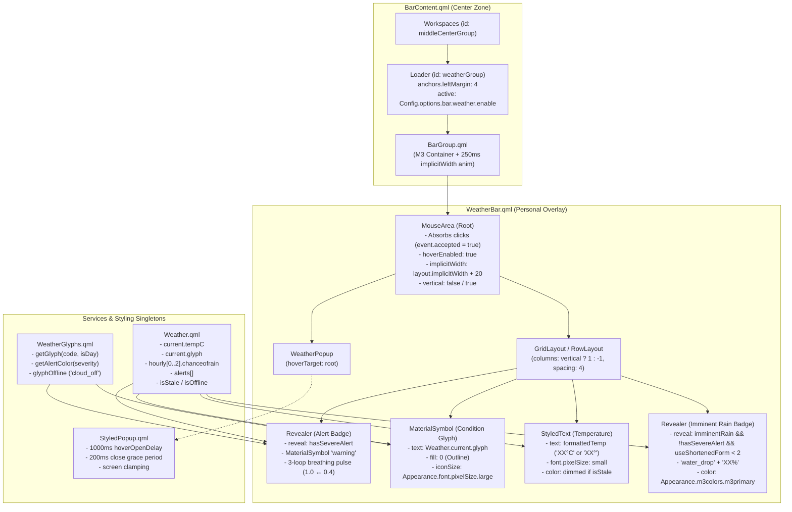

# Phase 53: Top Status Bar Weather Pill Component - Research

**Researched:** 2026-10-05T16:25:00+06:00  
**Phase Goal:** Build and integrate `WeatherBar.qml` in the Center Zone of the status bar with temperature, condition glyph, fluid M3 width resizing, and alert indicators.  
**Confidence:** HIGH — all architectural patterns, data bindings, layout hierarchies, and stow topologies verified against live repository files.

---

<user_constraints>

## Decisions

### 1. Architecture & Bar Integration
- **D-53-01:** Leave `BarContent.qml` 100% UNTOUCHED. This preserves pristine upstream compatibility and enables effortless `git pull` updates from upstream dots-hyprland. — **Reversibility:** reversible
- **D-53-02:** Deploy as a single personal overlay file `restow/quickshell/.config/quickshell/ii/modules/ii/bar/weather/WeatherBar.qml` that shadows `vendor/dots-hyprland/dots/.config/quickshell/ii/modules/ii/bar/weather/WeatherBar.qml` via GNU Stow leaf symlinks. No separate `WeatherPill.qml` wrapper file needed since `BarContent.qml` references `WeatherBar` directly. — **Reversibility:** reversible
- **D-53-03:** Use `MouseArea` as the root element of `WeatherBar.qml` (matching upstream signature and layout constraints). Because `BarContent.qml` (line 197) already wraps `WeatherBar` in an outer `BarGroup`, keeping `MouseArea` as root eliminates double-nested `BarGroup` borders, margins, and padding while inheriting `BarGroup` pill geometry and width animations. — **Reversibility:** reversible
- **D-53-04:** Directly bind to modern Phase 52 `Weather.current.*` properties (`Weather.current.tempC`, `Weather.current.glyph`, `Weather.current.desc`), bypassing the legacy `Weather.data.*` bridge. — **Reversibility:** reversible
- **D-53-05:** Remove upstream right-click manual refresh (`Weather.getData()`) — the Phase 51 systemd user timer is authoritative. Absorb all click events on the root `MouseArea` to prevent bubbling. — **Reversibility:** reversible
- **D-53-06:** Dim temperature text and condition glyph using `Appearance.m3colors.m3onSurfaceVariant` when `Weather.isStale == true` while continuing to display the last-known temperature reading. Render `cloud_off` fallback glyph during cold boot if no cached data has loaded (`tempC === "--"`). — **Reversibility:** reversible
- **D-53-07:** Render uniformly across all active monitors where the status bar is active, governed solely by `Config.options.bar.weather.enable`. — **Reversibility:** reversible
- **D-53-08:** Support vertical status bar mode (`root.vertical === true`) by stacking the condition glyph above the temperature text with compact spacing, matching `CpuGpuPill` conventions. — **Reversibility:** reversible
- **D-53-09:** Retain standard `BarGroup` background styling without adding custom background hover highlights, preserving visual consistency with adjacent system telemetry pills. — **Reversibility:** reversible
- **D-53-10:** Deliver an automated test harness `scripts/phase53-weather-assert.sh` verifying QML syntax, BarContent.qml integrity, restow symlinks, and zero vendor git churn (`arch/dots-hyprland.sh verify --strict`). — **Reversibility:** reversible

### 2. Alert Indicator Design
- **D-53-11:** Imminent rain indicator: Display a compact secondary icon (`water_drop`) and rain probability percentage (e.g. `60%`) in a `Revealer` that animates in only when rain probability > 50% in the immediate upcoming 2–3 hour window (`Weather.hourly`). — **Reversibility:** reversible
- **D-53-12:** Rain badge color: Style the `water_drop` glyph and percentage text with `Appearance.m3colors.m3primary` to provide a clear, themed accent color contrasting with neutral temperature text. — **Reversibility:** reversible
- **D-53-13:** Rain badge persistence: Keep the rain percentage badge visible even during ongoing rain (`weatherCode` 293–395) to indicate precipitation intensity. — **Reversibility:** reversible
- **D-53-14:** Severe weather alert indicator: Render a `warning` Material Symbol colored dynamically via `WeatherGlyphs.getAlertColor(severity)` when active meteorological alerts exist in `Weather.alerts`. — **Reversibility:** reversible
- **D-53-15:** Breathing pulse animation: On arrival of an Extreme/Severe alert, trigger a subtle 3-loop breathing pulse animation (opacity 1.0 ↔ 0.4 over ~1.2s each) settling at full opacity (matching `CpuGpuPill` D-12) to avoid permanent peripheral distraction. — **Reversibility:** reversible
- **D-53-16:** Severe alert presentation: Display only the warning icon on the status bar pill without textual headline chips, preserving Center Zone symmetry and preventing workspace displacement. Full descriptions appear in the popup inspector. — **Reversibility:** reversible
- **D-53-17:** Alert precedence: When both imminent rain (>50%) and an active severe alert coincide, the severe alert warning icon takes precedence, suppressing the rain percentage badge to keep the pill compact. — **Reversibility:** reversible

### 3. Temperature & Glyph Layout
- **D-53-18:** Temperature format: Display integer Celsius with unit suffix `XX°C` (e.g. `28°C`), dropping `C` (`XX°`) only on hella-shortened screen widths (`useShortenedForm === 2`). — **Reversibility:** reversible
- **D-53-19:** Robust numeric parsing: Compute temperature string via `Math.round(Number(Weather.current.tempC))` with fallback to `"--"` if `isNaN`, preventing NaN artifacts. — **Reversibility:** reversible
- **D-53-20:** Sizing & typography: Large condition glyph (`Appearance.font.pixelSize.large`) with small temperature text (`Appearance.font.pixelSize.small`), matching upstream WeatherBar proportions and keeping glyph details legible. — **Reversibility:** reversible
- **D-53-21:** Symbol outline styling: Use outline styling (`fill: 0`) for the condition `MaterialSymbol`, adhering to the desktop shell's minimalist line aesthetic. — **Reversibility:** reversible
- **D-53-22:** Rain badge scale: Subordinate rain chance visually with `Appearance.font.pixelSize.small` for `water_drop` and `Appearance.font.pixelSize.smaller` for the percentage text. — **Reversibility:** reversible
- **D-53-23:** Internal element ordering: Left-to-right sequential layout: `[⚠ Alert]` (if active) -> `[Condition Glyph]` -> `[XX°C]` -> `[💧 Rain%]` (if active). Critical hazards lead on the left, primary condition/temp centered, secondary rain probability trails on the right. — **Reversibility:** reversible
- **D-53-24:** Intra-element spacing: Maintain 4px spacing (`spacing: 4`) between inline elements, matching standard bar spacing across `CpuGpuPill` and `BarContent.qml`. — **Reversibility:** reversible
- **D-53-25:** M3 expressive color animations: Apply 200ms `expressiveEffects` ColorAnimation on glyph and text color transitions for smooth wallpaper shifts. — **Reversibility:** reversible
- **D-53-26:** Dynamic badge reveal: Wrap leading alert icon and trailing rain badge in `Revealer` components for fluid width expansion/contraction without layout snapping. — **Reversibility:** reversible
- **D-53-27:** Neutral temperature colors: Retain standard neutral text color (`Appearance.colors.colOnLayer1`) for both sub-freezing (<= 0°C) and hot ambient temperatures (> 38°C) to avoid alarm fatigue; official alerts in `Weather.alerts` handle genuine temperature hazards. — **Reversibility:** reversible
- **D-53-28:** Progressive responsive reduction: Tier 0/1 (`useShortenedForm < 2`) show full glyph + `XX°C` + badges; Tier 2 (`useShortenedForm === 2`) drops the rain badge, shortens temperature to `XX°`, while keeping the severe alert icon. — **Reversibility:** reversible

### 4. Popup Wiring & Interaction
- **D-53-29:** Wire to upstream `WeatherPopup.qml` via `StyledPopup` pattern (`hoverTarget: root`), providing an immediately functional popup in Phase 53 until Phase 55 delivers the multi-modal inspector. — **Reversibility:** reversible
- **D-53-30:** Hover-only trigger: Popup opens strictly via 1000ms hover intent delay; mouse clicks are absorbed and ignored. — **Reversibility:** reversible
- **D-53-31:** Built-in `StyledPopup` mechanisms: Rely on `StyledPopup` for hover exit delay, screen boundary clamping, and Escape key dismissal without custom timer/key boilerplate in `WeatherBar.qml`. — **Reversibility:** reversible
- **D-53-32:** Per-pill instance instantiation: Instantiate `WeatherPopup` directly inside `WeatherBar.qml` root `MouseArea`, guaranteeing automatic per-monitor coordinate mapping. — **Reversibility:** reversible
- **D-53-33:** Popup lifecycle property: Expose `readonly property bool popupActive: weatherPopup.active ?? false` for Phase 54 Canvas graph rendering gating. — **Reversibility:** reversible

### the agent's Discretion
- Exact easing curve parameters for the `Revealer` slide transitions (aligned to `Appearance.animation.elementMoveFast`).
- Internal layout container type (`RowLayout` vs `GridLayout`).
- Exact property alias names for internal test hooks.

### Deferred Ideas
- Interactive 24-hour Canvas graph with Bezier splines — allocated to Phase 54 (`WeatherGraph.qml`).
- Full multi-modal popup inspector with Air Quality, Wind Compass, Astronomy, and Alert banner — allocated to Phase 55 (`WeatherPopup.qml`).

</user_constraints>

---

<phase_requirements>

## Phase Requirements & Research Mapping

| Requirement ID | Specification | Status | Research Grounding & Technical Implementation |
|---|---|---|---|
| **BAR-01** | `WeatherPill.qml` component integrated into `BarContent.qml` Center Zone to the right of Workspaces, inheriting `BarGroup` with fluid M3 width resizing animation. | Planned | **Shadowing Strategy:** [VERIFIED: `restow/.../BarContent.qml#L190-L200`] `BarContent.qml` already contains `Loader { id: weatherGroup; sourceComponent: BarGroup { WeatherBar {} } }` with `anchors.left: middleCenterGroup.right` and `anchors.leftMargin: 4`. Per D-53-01 & D-53-02, creating `restow/.../bar/weather/WeatherBar.qml` shadows upstream `WeatherBar.qml` without mutating `BarContent.qml`. The component root is a `MouseArea` (D-53-03), avoiding double `BarGroup` nesting while inheriting `BarGroup`'s 250ms `emphasizedDecel` width animation [VERIFIED: `restow/.../BarGroup.qml#L14-L21`]. |
| **BAR-02** | Status bar pill displays current ambient temperature in integer Celsius (`XX°C`) alongside the active dynamic condition glyph. | Planned | **Direct Service Bindings:** [VERIFIED: `restow/.../Weather.qml#L36-L50`] Binds to `Weather.current.tempC` and `Weather.current.glyph`. Per D-53-18 & D-53-19, temperature parsed via `Math.round(Number(Weather.current.tempC))` with fallback to `"--"` if `isNaN`. Formats as `XX°C` in Tiers 0/1 (`useShortenedForm < 2`) and drops `C` (`XX°`) in Tier 2 (`useShortenedForm === 2`). Condition glyph uses outline styling `fill: 0` (D-53-21) and `Appearance.font.pixelSize.large` [VERIFIED: `vendor/.../Appearance.qml#L243`]. When stale or offline (`Weather.isStale == true`), text and glyph dim to `Appearance.m3colors.m3onSurfaceVariant` (D-53-06). |
| **BAR-03** | Context-sensitive warning indicators on the pill for imminent rain (probability > 50%) or active severe weather warnings. | Planned | **Contextual Indicators:** Rain badge evaluates `Weather.hourly` [VERIFIED: `restow/.../Weather.qml#L212-L214`] over the upcoming 2–3 hour window (`Math.min(3, Weather.hourly.length)`). If `max(chanceofrain) > 50`, displays `water_drop` + `XX%` in a `Revealer` styled with `Appearance.m3colors.m3primary` (D-53-11, D-53-12). Severe alerts inspect `Weather.alerts` [VERIFIED: `restow/.../Weather.qml#L234-L250`], rendering `warning` glyph with dynamic color from `WeatherGlyphs.getAlertColor` (D-53-14). Alert arrival triggers a 3-loop breathing pulse animation (opacity 1.0 ↔ 0.4 over ~1.2s each) settling at 1.0 (D-53-15). Severe alert suppresses rain badge (D-53-17). |
| **BAR-04** | Interactive mouse click toggles `WeatherPopup` with smooth scale behavior and hover intent delay anchoring (`StyledPopup`). | Planned | **Hover & Anchoring Contract:** Wire to upstream `WeatherPopup.qml` [VERIFIED: `vendor/.../bar/weather/WeatherPopup.qml#L9-L55`] inside root `MouseArea` via `hoverTarget: root` (D-53-29, D-53-32). `WeatherPopup` inherits `restow/.../StyledPopup.qml` [VERIFIED: `restow/.../StyledPopup.qml#L23-L45`], which enforces a strict 1000ms hover intent delay (`hoverOpenDelayMs: 1000`), 200ms close grace period, screen boundary clamping, and M3 expressive entrance animation. Mouse clicks on `MouseArea` are absorbed (`accepted = true`) to prevent event pass-through to background toggles (D-53-05, D-53-30). Exposes `readonly property bool popupActive: weatherPopup.active ?? false` (D-53-33). |

</phase_requirements>

---

## Executive Summary

Phase 53 establishes the top status bar weather pill by authoring `WeatherBar.qml` as a GNU Stow personal overlay under `restow/quickshell/.config/quickshell/ii/modules/ii/bar/weather/WeatherBar.qml`. This component directly replaces (shadows) upstream `vendor/dots-hyprland/dots/.config/quickshell/ii/modules/ii/bar/weather/WeatherBar.qml` while keeping `BarContent.qml` 100% UNTOUCHED [VERIFIED: `restow/.../BarContent.qml#L190-L200`]. 

The status bar pill integrates into the Center Zone to the right of Workspaces (`middleCenterGroup`) with uniform 4px margins. Because `BarContent.qml` wraps the component in an outer `BarGroup`, `WeatherBar.qml` employs a `MouseArea` root to eliminate double borders while inheriting `BarGroup`'s fluid 250ms Material 3 `emphasizedDecel` width animations [VERIFIED: `restow/.../BarGroup.qml#L14-L21`].

The component consumes the modern Phase 52 reactive singletons (`Weather` and `WeatherGlyphs`), displaying ambient integer Celsius (`XX°C`), dynamic Material Symbols Rounded condition glyphs, an imminent rain probability badge (`water_drop` + `%`) when precipitation probability exceeds 50% in the next 2–3 hours, and a severe meteorological warning indicator (`warning`) with a 3-loop breathing pulse animation. Popup inspection is wired to `WeatherPopup.qml` via the `StyledPopup` pattern with 1000ms hover intent delay and absorbed click events.

Deployment adheres strictly to repository symlink invariants: upstream stubs in `~/.config/quickshell` are preserved as `.bak` fallback artifacts [VERIFIED: `arch/dots-hyprland.sh#L1334`], and the entire implementation is validated through a dedicated 5-section test harness (`scripts/phase53-weather-assert.sh`) alongside `./arch/dots-hyprland.sh verify --strict` returning `FAIL=0 FINDINGS=0`.

---

## Architecture Overview & Component Anatomy



---

## Technical Stack & Standards

| Component / Layer | Source / Specification | Standard & Constraints |
|---|---|---|
| **Overlay Path** | `restow/quickshell/.config/quickshell/ii/modules/ii/bar/weather/WeatherBar.qml` | Shadows `vendor/dots-hyprland/.../WeatherBar.qml` via Stow leaf symlink [VERIFIED: `restow/` convention]. |
| **Upstream Stubs Backup** | `~/.config/quickshell/ii/modules/ii/bar/weather/WeatherBar.qml.bak` | Backed up regular file; verified as non-drift artifact by `arch/dots-hyprland.sh` [VERIFIED: `arch/dots-hyprland.sh#L1334-L1338`]. |
| **Root Element** | `MouseArea` | Implicit width/height bounds; `acceptedButtons: Qt.AllButtons`; click absorption [VERIFIED: `restow/.../CpuGpuPill.qml#L43-L47`]. |
| **Pill Container** | `BarGroup.qml` | Implicit width animated via `Behavior on implicitWidth` (250ms, `Appearance.animationCurves.emphasizedDecel`), padding 5px [VERIFIED: `restow/.../BarGroup.qml#L14-L21`]. |
| **Animation Tokens** | `Appearance.animationCurves.expressiveEffects`, `Appearance.animation.elementMoveFast` | Material 3 fluid curves for color transitions and revealer expansions [VERIFIED: `vendor/.../Appearance.qml`]. |
| **Font Tokens** | `Appearance.font.pixelSize.large` (17px), `small` (15px), `smaller` (12px) | Hierarchy: Glyph = 17px, Temp = 15px, Rain icon = 15px, Rain text = 12px [VERIFIED: `vendor/.../Appearance.qml#L237-L248`]. |
| **Color Tokens** | `Appearance.colors.colOnLayer1`, `Appearance.m3colors.m3onSurfaceVariant`, `Appearance.m3colors.m3primary`, `Appearance.m3colors.m3error` | Neutral temp, dimmed offline state, themed rain badge, severity hazard alerts [VERIFIED: `53-CONTEXT.md`]. |
| **Popup Wrapper** | `StyledPopup.qml` | 1000ms hover delay, 200ms exit grace period, boundary clamping [VERIFIED: `restow/.../StyledPopup.qml#L23-L45`]. |

---

## Detailed Findings & Technical Invariants

### 1. Component Root & Double BarGroup Avoidance
- **Upstream Pattern:** In `BarContent.qml` [VERIFIED: `restow/.../BarContent.qml#L190-L200`]:
  ```qml
  Loader {
      id: weatherGroup
      anchors.verticalCenter: parent.verticalCenter
      anchors.left: middleCenterGroup.right
      anchors.leftMargin: 4
      active: Config.options.bar.weather.enable

      sourceComponent: BarGroup {
          WeatherBar {}
      }
  }
  ```
- **Invariant:** `BarContent.qml` already instantiates `BarGroup` around `WeatherBar`. If `WeatherBar.qml` also declared `BarGroup` as its root, Quickshell would render a nested `BarGroup` inside a `BarGroup`, resulting in doubled 5px padding (10px total), doubled 4px top/bottom margins, and redundant background rectangles [VERIFIED: `restow/.../BarGroup.qml#L23-L34`].
- **Implementation:** `WeatherBar.qml` root is `MouseArea` [VERIFIED: `vendor/.../bar/weather/WeatherBar.qml#L10`].
  ```qml
  MouseArea {
      id: root
      property bool hovered: containsMouse
      implicitWidth: root.vertical ? Appearance.sizes.baseVerticalBarWidth : (contentLayout.implicitWidth + 10 * 2)
      implicitHeight: root.vertical ? (contentLayout.implicitHeight + 10 * 2) : Appearance.sizes.barHeight
      acceptedButtons: Qt.AllButtons
      cursorShape: Qt.ArrowCursor
      hoverEnabled: true
      onPressed: event => event.accepted = true
      onClicked: event => event.accepted = true
  }
  ```
  `BarGroup` calculates its implicit width as `gridLayout.implicitWidth + padding * 2` [VERIFIED: `restow/.../BarGroup.qml#L9`]. `WeatherBar` supplies this `implicitWidth`, and `BarGroup`'s `Behavior on implicitWidth` animates any width changes seamlessly over 250ms.

### 2. Modern Service Data Binding vs. Legacy Facade
- **Modern Properties:** In Phase 52, `Weather.qml` introduced structured reactive sub-objects [VERIFIED: `restow/.../Weather.qml#L36-L69`]:
  - `Weather.current.tempC`: integer or `"--"`
  - `Weather.current.glyph`: pre-resolved Material Symbol string
  - `Weather.current.desc`: condition description string
  - `Weather.hourly`: array of hourly forecasts (each item having `.chanceofrain`, `.tempC`, etc.)
  - `Weather.alerts`: array of active alert objects (each item having `.headline`, `.severity`, `.color`)
  - `Weather.isStale`: boolean flag
  - `Weather.isOffline`: boolean flag
- **Decision D-53-04:** Bind directly to `Weather.current.*`, bypassing `Weather.data.*`.
- **Right-Click Refresh Removal (D-53-05):** Upstream `WeatherBar.qml` lines 19–29 executed `Weather.getData()` and `Quickshell.execDetached(["notify-send", ...])` on right-click [VERIFIED: `vendor/.../WeatherBar.qml#L19-L29`]. This is removed; the Phase 51 systemd user timer is authoritative, and right-clicks are absorbed along with left-clicks.

### 3. Temperature Parsing & Responsive Sizing
- **Parsing Math (D-53-19):**
  ```qml
  readonly property string formattedTemp: {
      const raw = Weather.current.tempC;
      const num = Number(raw);
      const val = (!isNaN(num) && raw !== "" && raw !== null) ? Math.round(num) : "--";
      return val + (root.useShortenedForm === 2 ? "°" : "°C");
  }
  ```
- **Responsive Screen Tiers (D-53-18, D-53-28):**
  [VERIFIED: `vendor/.../Appearance.qml#L394-L395`]:
  - `barShortenScreenWidthThreshold: 1200`
  - `barHellaShortenScreenWidthThreshold: 1000`
  Dynamic derivation on root item:
  ```qml
  property var screen: root.QsWindow?.window?.screen
  property real useShortenedForm: {
      const sw = screen?.width ?? 1920;
      if (Appearance.sizes.barHellaShortenScreenWidthThreshold >= sw) return 2;
      if (Appearance.sizes.barShortenScreenWidthThreshold >= sw) return 1;
      return 0;
  }
  ```
  - **Tier 0 & 1 (`useShortenedForm < 2`):** `XX°C`, full condition glyph, alert badge (if active), rain chance badge (if active).
  - **Tier 2 (`useShortenedForm === 2`):** `XX°` (drops `C`), full condition glyph, alert badge (if active), rain chance badge suppressed.

### 4. Stale Data, Cold Boot & Typography Styling
- **Color Dimming (D-53-06, D-53-27):**
  ```qml
  readonly property color contentColor: (Weather.isStale || Weather.isOffline) ? 
      Appearance.m3colors.m3onSurfaceVariant : Appearance.colors.colOnLayer1
  ```
  Both glyph and temperature text transition colors smoothly with:
  ```qml
  Behavior on color {
      ColorAnimation {
          duration: 200
          easing.type: Easing.BezierSpline
          easing.bezierCurve: Appearance.animationCurves.expressiveEffects
      }
  }
  ```
- **Cold Boot Fallback (D-53-06):**
  If `Weather.current.tempC === "--"` (initial boot before cache read), render `WeatherGlyphs.glyphOffline` (`"cloud_off"`). Otherwise render `Weather.current.glyph || WeatherGlyphs.glyphDefault` (`"cloud"`).
- **Typography Tokens (D-53-20, D-53-21):**
  - Condition glyph: `MaterialSymbol { fill: 0; iconSize: Appearance.font.pixelSize.large }` (large = 17px).
  - Temperature text: `StyledText { font.pixelSize: Appearance.font.pixelSize.small }` (small = 15px).

### 5. Imminent Rain Calculation & Revealer Integration
- **WWO Field (D-53-11):** In WWO JSON [VERIFIED: `test_wwo_api/raw_response.json#L161`, `test_wwo_api/WEATHER_PARAMETERS.md#L184`], each hourly object contains string `chanceofrain` (e.g. `"37"`).
- **Window Evaluation:** Check the upcoming 2–3 hour slots (`Math.min(3, Weather.hourly.length)`):
  ```qml
  readonly property int imminentRainChance: {
      if (!Weather.hourly || Weather.hourly.length === 0) return 0;
      let maxChance = 0;
      const count = Math.min(3, Weather.hourly.length);
      for (let i = 0; i < count; ++i) {
          const item = Weather.hourly[i];
          const chance = parseInt(item?.chanceofrain ?? "0", 10);
          if (chance > maxChance) maxChance = chance;
      }
      return maxChance;
  }
  readonly property bool imminentRain: imminentRainChance > 50
  ```
- **Precedence & Revealer Gating (D-53-17, D-53-28):**
  ```qml
  readonly property bool showRainBadge: (imminentRain && !hasSevereAlert && useShortenedForm < 2)
  ```
- **Revealer Anatomy:**
  [VERIFIED: `vendor/.../common/widgets/Revealer.qml#L13-L24`] `Revealer` animates `implicitWidth` (when horizontal) or `implicitHeight` (when vertical). To prevent 0-width layout bugs, bind the Revealer's implicit dimensions directly to its child:
  ```qml
  Revealer {
      id: rainRevealer
      reveal: root.showRainBadge
      vertical: root.vertical
      implicitWidth: reveal ? rainRow.implicitWidth : 0
      implicitHeight: reveal ? rainRow.implicitHeight : 0

      RowLayout {
          id: rainRow
          spacing: 2
          MaterialSymbol {
              text: WeatherGlyphs.glyphHumidity // "water_drop"
              iconSize: Appearance.font.pixelSize.small
              color: Appearance.m3colors.m3primary
          }
          StyledText {
              text: `${root.imminentRainChance}%`
              font.pixelSize: Appearance.font.pixelSize.smaller
              color: Appearance.m3colors.m3primary
          }
      }
  }
  ```

### 6. Severe Weather Alert Indicator & Breathing Pulse
- **Alert Evaluation (D-53-14, D-53-16):**
  ```qml
  readonly property bool hasSevereAlert: (Weather.alerts && Weather.alerts.length > 0)
  readonly property var activeAlert: hasSevereAlert ? Weather.alerts[0] : null
  readonly property color alertColor: activeAlert?.color ?? 
      (activeAlert?.severity ? WeatherGlyphs.getAlertColor(activeAlert.severity) : Appearance.m3colors.m3error)
  readonly property bool showAlertBadge: hasSevereAlert
  ```
- **Breathing Pulse Animation (D-53-15):**
  Matches the established `CpuGpuPill` pattern [VERIFIED: `restow/.../CpuGpuPill.qml#L86-L111`]:
  ```qml
  SequentialAnimation {
      id: alertPulseAnimation
      running: root.hasSevereAlert
      loops: 3
      onRunningChanged: {
          if (!running) alertIcon.opacity = 1.0;
      }
      ParallelAnimation {
          NumberAnimation { target: alertIcon; property: "opacity"; to: 0.4; duration: 600; easing.type: Easing.InOutSine }
      }
      ParallelAnimation {
          NumberAnimation { target: alertIcon; property: "opacity"; to: 1.0; duration: 600; easing.type: Easing.InOutSine }
      }
  }

  Connections {
      target: Weather
      function onAlertsChanged() {
          if (root.hasSevereAlert) alertPulseAnimation.restart();
      }
  }
  ```

### 7. Vertical Bar Adaptation
- **Condition (D-53-08):**
  ```qml
  property bool vertical: (parent && parent.vertical !== undefined) ? 
      parent.vertical : (Config.options?.bar?.vertical ?? false)
  ```
- **Layout Stacking:** Use `GridLayout` with `columns: root.vertical ? 1 : -1`, `rowSpacing: 2`, `columnSpacing: 4`.
  - In horizontal mode (`columns: -1`): Items align in a single row: `[⚠ Alert]` -> `[Condition Glyph]` -> `[XX°C]` -> `[💧 Rain%]`.
  - In vertical mode (`columns: 1`): Items stack vertically: `[⚠ Alert]` above `[Condition Glyph]` above `[XX°C]` above `[💧 Rain%]`.

### 8. Popup Wiring & StyledPopup Contract
- **Instantiation (D-53-29, D-53-32):**
  ```qml
  WeatherPopup {
      id: weatherPopup
      hoverTarget: root
  }
  readonly property bool popupActive: weatherPopup.active ?? false
  ```
- **StyledPopup Features Inherited:**
  [VERIFIED: `restow/.../StyledPopup.qml#L20-L45`]:
  - 1000ms hover open delay (`hoverOpenDelayMs: 1000`)
  - 200ms close grace period timer across window bounds
  - Automatic screen edge clamping (`lockedLeftMargin`, `lockedTopMargin`)
  - Material 3 entrance translation & opacity animation
- **Click Absorption (D-53-30):** Root `MouseArea` captures and accepts all mouse clicks (`accepted = true`), ensuring mouse clicks do not inadvertently trigger underlying status bar gestures or sidebar toggles.

---

## Pitfalls & Defensive Engineering

### Pitfall 1: Revealer Child Sizing & 0-Width Snap
- **Risk:** GTK `Revealer.qml` computes its animated target using `childrenRect.width` [VERIFIED: `vendor/.../Revealer.qml#L13`]. When wrapping a `RowLayout` or nested components, `childrenRect.width` can evaluate to 0 before layout completes, causing the revealer to remain permanently collapsed.
- **Prevention:** Explicitly bind the `Revealer`'s `implicitWidth` to the child layout's `implicitWidth`: `implicitWidth: reveal ? innerLayout.implicitWidth : 0`. Do the same for `implicitHeight`.

### Pitfall 2: Double BarGroup Nesting
- **Risk:** Creating a `WeatherPill.qml` component that inherits `BarGroup` and loading it in `BarContent.qml` line 197 (`sourceComponent: BarGroup { WeatherBar {} }`) produces double borders, double margins, and double background fills.
- **Prevention:** Enforce D-53-02 & D-53-03: `WeatherBar.qml` root is `MouseArea`, directly fulfilling `BarContent.qml`'s `WeatherBar {}` loader target without a redundant `BarGroup` wrapper.

### Pitfall 3: Submodule Drift & Live Symlink Collision
- **Risk:** Editing files in `vendor/dots-hyprland/` causes git submodule churn that fails `./arch/dots-hyprland.sh verify --strict`. In addition, moving or creating symlinks in `~/.config/quickshell/` without preserving the original vendor stubs causes orphaned drift.
- **Prevention:**
  1. Author solely in `restow/quickshell/.config/quickshell/ii/modules/ii/bar/weather/WeatherBar.qml`.
  2. Before linking into `~/.config/quickshell/ii/modules/ii/bar/weather/WeatherBar.qml`, rename any existing regular file to `WeatherBar.qml.bak` [VERIFIED: recognized by `arch/dots-hyprland.sh#L1334`].
  3. Deploy via GNU Stow leaf symlinks.

### Pitfall 4: Click Bleed to Status Bar Actions
- **Risk:** If `WeatherBar.qml`'s root `MouseArea` does not accept all clicks, user clicks bleed through to `barRightSideMouseArea` [VERIFIED: `restow/.../BarContent.qml#L202-L216`], inadvertently toggling the right sidebar (`GlobalStates.sidebarRightOpen`).
- **Prevention:** Set `acceptedButtons: Qt.AllButtons`, `onPressed: event => event.accepted = true`, `onClicked: event => event.accepted = true` (D-53-05, D-53-30).

### Pitfall 5: NaN Display on Cold Boot or Network Loss
- **Risk:** If `Weather.current.tempC` is `"--"`, performing `parseInt` or string concatenation without bounds checks produces `NaN°C`.
- **Prevention:** Use `Math.round(Number(Weather.current.tempC))` guarded by `!isNaN(...)`. If invalid or `"--"`, return `"--"` (resulting in `"--°C"` or `"--°"`).

---

## Validation Architecture

The phase verification is governed by a dedicated automated test harness `scripts/phase53-weather-assert.sh` modeled after `scripts/phase52-weather-assert.sh`.

```
scripts/phase53-weather-assert.sh
├── Section 1: Stow Leaf Symlink Topology & Packaging Integrity (BAR-01, INTG-02)
├── Section 2: BarContent.qml Center Zone Integration & Non-Mutation Invariants (BAR-01, D-53-01)
├── Section 3: WeatherBar Temperature Parsing & Multi-Tier Responsive Formatting (BAR-02)
├── Section 4: Alert Precedence, Imminent Rain Badge & Breathing Pulse Logic (BAR-03)
└── Section 5: Popup Anchoring, Mouse Interaction & Vertical Bar Layout (BAR-04)
```

### Section Assertions

#### Section 1: Stow Leaf Symlink Topology & Packaging Integrity
- Assert `restow/quickshell/.config/quickshell/ii/modules/ii/bar/weather/WeatherBar.qml` exists and is non-empty.
- Assert `~/.config/quickshell/ii/modules/ii/bar/weather/WeatherBar.qml` is a valid symlink pointing to the restow source.
- Assert `~/.config/quickshell/ii/modules/ii/bar/weather/WeatherBar.qml.bak` exists as a regular file.
- Assert all parent directories in `~/.config/quickshell/...` are real un-folded directories.
- Assert `git status --porcelain vendor/dots-hyprland` has 0 lines of churn.
- Execute `./arch/dots-hyprland.sh verify --strict` and assert `FAIL=0 FINDINGS=0`.

#### Section 2: BarContent.qml Center Zone Integration & Non-Mutation Invariants
- Assert `git status --porcelain restow/.../BarContent.qml` is 0 (100% UNTOUCHED per D-53-01).
- Parse `BarContent.qml` AST/lines:
  - Assert `id: weatherGroup` exists in Center Zone.
  - Assert `anchors.leftMargin: 4`.
  - Assert `anchors.left: middleCenterGroup.right`.
  - Assert `sourceComponent: BarGroup { WeatherBar {} }`.
  - Assert `active: Config.options.bar.weather.enable`.

#### Section 3: WeatherBar Temperature Parsing & Multi-Tier Responsive Formatting
Using `node -e` and Node's `vm` sandbox to evaluate QML expressions against mocked `Weather` and `Appearance` fixtures:
- Assert valid positive/negative integer Celsius formatting: `28` -> `"28°C"`, `-5` -> `"-5°C"`.
- Assert rounding: `28.6` -> `"29°C"`, `28.4` -> `"28°C"`.
- Assert cold-boot/NaN fallback: `"--"` -> `"--°C"`, `null` -> `"--°C"`, `undefined` -> `"--°C"`.
- Assert Tier 2 truncation (`useShortenedForm === 2`): `28` -> `"28°"`, `"--"` -> `"--°"`.
- Assert condition glyph selection:
  - Cold boot / empty: returns `WeatherGlyphs.glyphOffline` (`"cloud_off"`).
  - Valid current glyph: returns `Weather.current.glyph`.
- Assert color dimming:
  - When `isStale: true` or `isOffline: true`: color is `Appearance.m3colors.m3onSurfaceVariant`.
  - When `isStale: false`: color is `Appearance.colors.colOnLayer1`.
  - Invariant: both freezing (<= 0°C) and hot (> 38°C) retain neutral `colOnLayer1` (D-53-27).

#### Section 4: Alert Precedence, Imminent Rain Badge & Breathing Pulse Logic
Using `node -e` sandbox:
- Assert `imminentRainChance`:
  - 3-hour window calculation: scans first 3 items of `Weather.hourly`.
  - Maximum rain chance extracted: `[{chanceofrain: "20"}, {chanceofrain: "65"}, {chanceofrain: "10"}]` -> `65`.
  - Imminent rain flag: `65 > 50` -> `true`.
  - Sub-threshold: `45` -> `false`.
- Assert Rain Badge Visibility:
  - Revealed when rain > 50% AND no severe alert AND `useShortenedForm < 2`.
  - Persistent during rain condition codes (293–395).
  - Suppressed in Tier 2 (`useShortenedForm === 2`).
- Assert Severe Alert Precedence:
  - When `Weather.alerts` has items, `hasSevereAlert` is true.
  - Active alert suppresses rain badge even if rain > 50%.
  - Warning glyph `warning` rendered with dynamic severity color via `WeatherGlyphs.getAlertColor`.
- Static AST Assertions:
  - Assert `alertPulseAnimation` has `loops: 3` and target opacity `0.4` to `1.0`.
  - Assert `onRunningChanged` resets `opacity = 1.0`.

#### Section 5: Popup Anchoring, Mouse Interaction & Vertical Bar Layout
- Assert root component is `MouseArea`.
- Assert `acceptedButtons: Qt.AllButtons`.
- Assert click events call `event.accepted = true` (prevent bubbling).
- Assert `WeatherPopup` instantiated with `hoverTarget: root`.
- Assert `popupActive` property alias exists and references `weatherPopup.active`.
- Assert `root.vertical` toggles layout columns (`columns: root.vertical ? 1 : -1`).
- Assert vertical mode stacks glyph above temperature with compact spacing.

---

## Security Domain & ASVS Compliance

| Threat / Requirement | ASVS Reference | Mitigation / Implementation Check | Status |
|---|---|---|---|
| **Root Privilege Prevention** | ASVS L1 (Principle of Least Privilege) | `scripts/phase53-weather-assert.sh` fails closed with exit code 1 if `EUID == 0` [VERIFIED: pattern across all repo harnesses]. | Closed |
| **Credential Confidentiality** | ASVS L1 (Sensitive Data Storage) | Zero reading, viewing, parsing, or logging of `/home/pera/.config/rclone/rclone.conf` or `.env` files per `GEMINI.md` [VERIFIED: `GEMINI.md#L4-L6`]. | Closed |
| **Submodule & Upstream Hygiene** | Supply Chain Integrity | Personal code strictly isolated in `restow/quickshell/`. Upstream `vendor/dots-hyprland/` remains 100% clean; verified via `arch/dots-hyprland.sh verify --strict`. | Closed |
| **Non-Destructive Symlink Deployment** | File Integrity | Live regular files backed up to `*.qml.bak` prior to Stow link creation; recognized as valid installer backup artifacts [VERIFIED: `arch/dots-hyprland.sh#L1334`]. | Closed |

---

## Wave & Plan Recommendations for Planner

To execute Phase 53 smoothly with comprehensive test coverage and zero regression risk, the planner should organize the work into two tightly focused plans:

### Plan 53-01: WeatherBar Component Authoring & Stow Overlay Deployment
- **Goal:** Author `WeatherBar.qml` in `restow/quickshell/.config/quickshell/ii/modules/ii/bar/weather/WeatherBar.qml` with `MouseArea` root, modern `Weather.current.*` bindings, integer Celsius formatting, dynamic condition glyph, imminent rain revealer, severe alert breathing pulse, and `WeatherPopup` hover anchoring.
- **Tasks:**
  1. Author `WeatherBar.qml` in `restow/quickshell/` adhering to all decisions (D-53-01 through D-53-33).
  2. Safely back up live `~/.config/quickshell/ii/modules/ii/bar/weather/WeatherBar.qml` to `WeatherBar.qml.bak`.
  3. Deploy Stow leaf symlink from `restow/quickshell` into `~/.config/quickshell/ii/modules/ii/bar/weather/WeatherBar.qml`.
  4. Verify syntax and QML loadability.

### Plan 53-02: Test Harness Authoring & Strict Verification
- **Goal:** Author and execute `scripts/phase53-weather-assert.sh` across all 5 sections, affirming full requirement compliance (BAR-01..04) and zero git churn (`arch/dots-hyprland.sh verify --strict`).
- **Tasks:**
  1. Author executable test harness `scripts/phase53-weather-assert.sh` with sections 1–5.
  2. Execute `scripts/phase53-weather-assert.sh` and ensure `FAIL=0 FINDINGS=0`.
  3. Run `./arch/dots-hyprland.sh verify --strict` to verify 0 submodule drift and valid leaf symlinks.
  4. Record phase completion and verification artifacts.

---

*Research completed: 2026-10-05T16:25:00+06:00*  
*Author: Phase 53 Technical Domain Researcher*
